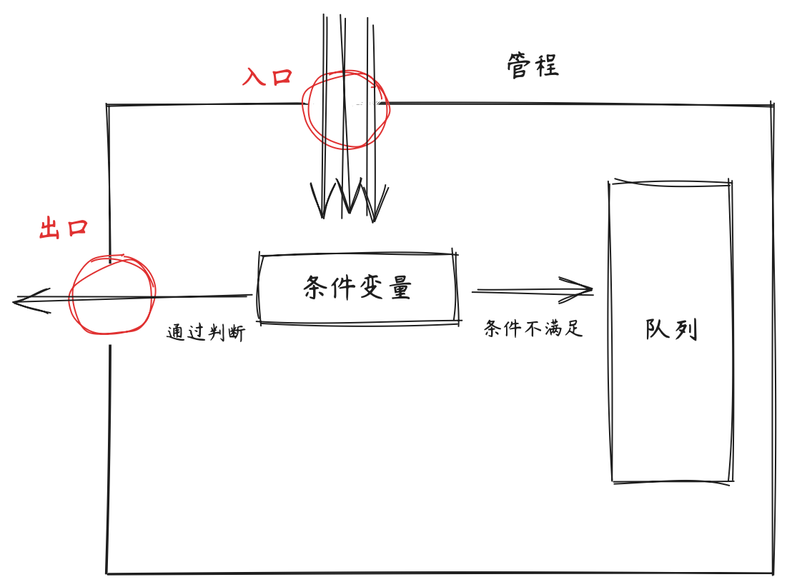
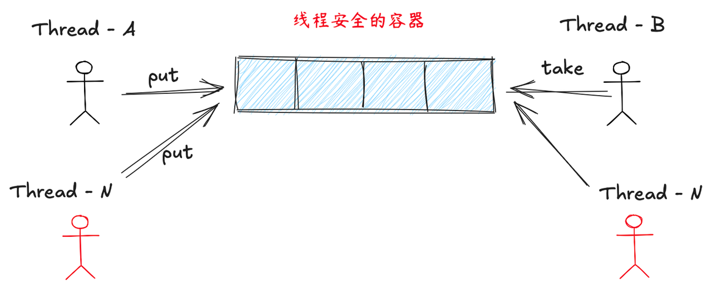
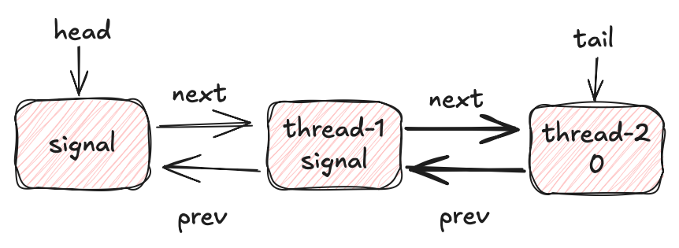
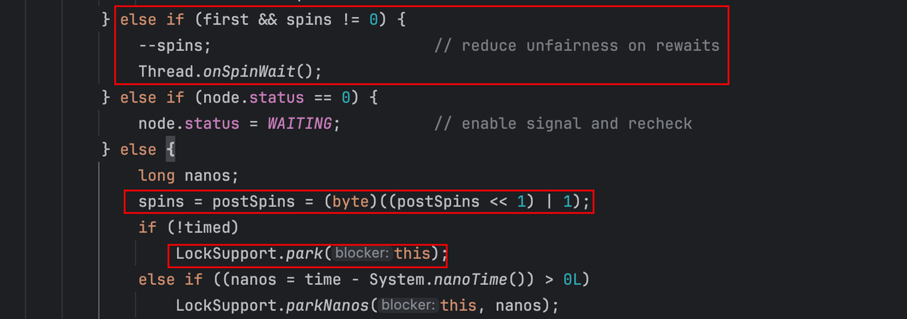
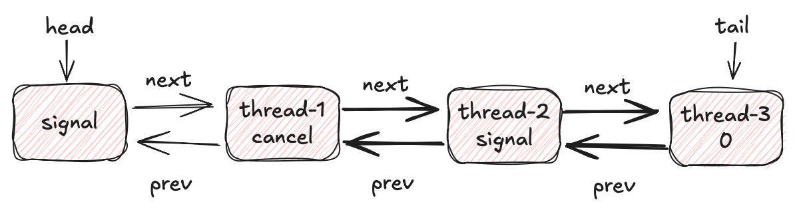
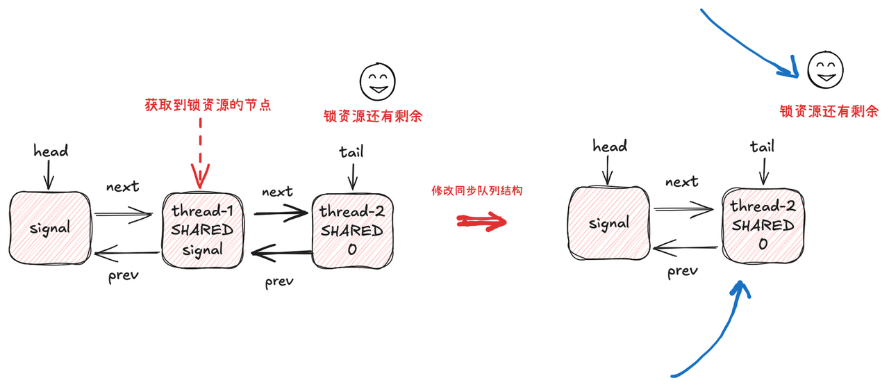

## 1.继承体系


AQS继承体系

对于面向对象编程来说：通常会将某一种功能(通常是公共的)单独抽出来封装成一个类

也即将问题转化为需要使用哪一个对象来解决这个问题

前面也讲过管程的概念,而高级语言所封装的锁对象就是管程的一种具体实现。这里再回顾一下管程的工作原理：



管程

1.多个线程想要操作管程所保护的临界区,那么就需要通过「**条件判断」,**&#x901A;过判断的线程，则顺利的进入到临界区,相反，不通过的线程则需要进入到队列中等待

总结一下：这里有两个步骤 1.条件判断,通过的进入到临界区 2.没通过的则进入到队列中

由于不同的场景所使用的锁不同,所以相应的条件判断也会不同「比如：独占锁只允许一个线程通过，读写锁，信号量等等,他们的判断条件都有所不同」。

但是只要是判断失败后,线程都是要进入到队列中进行等待的

也即进入到队列中等待的这一步骤,不同的锁实现并没有差异,所以就可以将这个入队的功能单独抽出一个类来实现 -- **AbstractQueuedSynchronizer**

```plain&#x20;text
// 用于实现入队功能
public class AbstractQueuedSynchronizer {

}
```

在doug lea的论文中也提到了，对于队列，采用无锁队列是没异议的,所以在这里并不会采用java基本库中已有的基本队列 但是在并发库下面有对应的无锁队列(synchronizedQueue....)，能否直接使用呢？答案是不能的 因为现有的无锁队列将节点封装在内部,无法感知到节点的详细信息 而锁的操作是需要依赖线程节点的信息的:比如节点对于的线程(thread)，节点所处的状态「比如：线程在释放锁的时候,需要判断处于队列中的首节点的线程是否处于阻塞状态,如果是,才会选择唤醒」 所以这里还需要有另外一个类：Node类「并且在AQS中手动实现节点入队的无锁化(cas)」

```plain&#x20;text
// 用于实现入队功能
public class AbstractQueuedSynchronizer {
    // 用于实现队列的节点,不能使用已有的无锁队列
    static class Node{
        
    }
}
```

这里存在两个待学习的点： 1.为什么需要内部类？ 2.为什么内部类没有用staic修饰时,编译器会爆出一个warn?

除了入队这一个功能是所有管程(锁)的公共功能外,还有另外一个功能 - 重入

基本上所有的锁都是支持重入的,因为无法预料开发者在进入到临界区后会执行什么样的代码，如果开发者在临界区中再次调用的lock.lock()「这里的lock泛指锁对象」，如果不支持重入,那么就会因为锁已经被当前线程获取了而导致获取不到锁。从而发生死锁现象

所以对于这一种公共的功能来说，可以抽出来单独形成一个类 - **AbstractOwnableSynchronizer**

重入的一种简单实现就是保存当前获取锁的线程thread,然后在所有线程尝试获取锁时,判断一下thread == Thread.CurrentThread()即可

```plain&#x20;text
public class AbstractOwnableSynchronizer {

}
```

这里又可以涉及到另外一个问题：组合还是继承？ -- 在这里是使用继承而不是组合

```plain&#x20;text
public class AbstractQueuedSynchronizer  extends AbstractOwnableSynchronizer{
    static class Node{
     // todo
    }
    // todo
}
```

## 字段分析

AbstractOwnableSynchronizer

```plain&#x20;text
// 该类的作用是用于支持锁的可重入,所以需要保存获取锁的线程，以及获取和设置线程的方法
public class AbstractOwnableSynchronizer {
    //保存获取锁的线程变量,在某个线程获取锁成功后,会调用下面的setxxx()方法来设置
    private final Thread exclusiveOwnerThread; 
    public void setExclusiveOwnerThread(Thread thread){
        this.exclusiveOwnerThread = thread;
    }
    public final Thread getExclusiveOwnerThread(){
        return this.exclusiveOwnerThread;
    }
}
```

AbstractQueuedSynchronizer

1.具有管理队列的属性 -- head和tail 2.同步资源 -- state

Node

1.保存当前即将阻塞的线程对象 2.保存当前节点所处的状态

```plain&#x20;text
//该类的作用是用来处理入队和出队的,也即是用来管理队列的,所以需要有一个队列,
//因为前面说过不能使用现有的队列,所以在这里保存的应该是节点信息「使用head和tail就能管理整个队列」
public class AbstractQueuedSynchronizer  extends AbstractOwnableSynchronizer{
    private volatile Node head;
    private volatile Node tail;
    private volatile int state;
    
    //该类的作用是用来保存一些状态信息的,比如对应的线程对象 以及当前节点所处的状态
    static class Node{
        // 1.代表节点以什么样的类型等待 - 共享状态 或 独占状态
        static final Node SHARED = new Node();
        static final Node EXCLUSIVE = null;

        // 2.节点只能处于下面几种状态 - 默认是0 代表是初始化
        static final int CANCELLED =  1;  //代表当前节点所对应的线程取消等待
        static final int SIGNAL    = -1;  //代表当前节点存在需要被唤醒的后续节点
        static final int CONDITION = -2;  //代表当前节点在条件队列中等待
        static final int PROPAGATE = -3;  //在共享模式下,下一次获取应该无条件传播

        // 3.运行时变量「动态设置」
        volatile int waitStatus;
        volatile Node prev;
        volatile Node next;
        volatile Thread thread; // 用户保存获取锁失败的线程对象
        //4. 用于条件队列
        Node nextWaiter;
      
    }
}
```

## 条件队列

在上面的介绍中AQS中已经出现了一个队列了,它的作用是用来保存因为获取锁失败的线程节点。但是考虑以下情景：生产者和消费者

1.多个生产者和消费者想要操作线程安全的容器「生产者想put，消费者想take」- 最终的结果就是只能由一个对象成功,要么是生产者,要么是消费者 2.假设容器满了,但是生产者-A获取到了容器的访问权限，但是它发现容器满了,自己put不了,应该怎么办？ 3.一种很简单的实现方式是：生产者-A直接释放锁 , 这样做可以但是不合理，因为线程的调度和抢锁是不可预估的,当生产者-A释放锁后，下一个获取锁的线程可能还是生产者-A，那么这些动作岂不是在浪费时间？所以条件变量的作用就出来了：当某个线程获取锁后「***这个前提很重要***」,发现后续操作的条件不满足了,那么&#x4F1A;***释放锁***&#x5E76;且在条件队列中等待,直到条件满足了&#x20;



生产者消费者模型图

条件变量对应的数据结构

```plain&#x20;text
public class ConditionObject implements Condition{
   // 条件队列
   private transient Node firstWaiter;
   private transient Node lastWaiter;
}
```

所以最终的数据结构图如下图所示：


## 入队的源码分析

这里的入队分为两种类型： 1.第一种是获取锁失败后存储线程节点的队列(等待队列) 2.第二种是获取锁成功后发现对应的条件不满足后存储线程节点的队列(条件队列)

下面的源码未做说明默认为jdk8

等待队列入队

1.tryAcquire()：该方法为模版方法,预留给子类实现,方法作用为尝试获取锁(也即上述的条件判断),如果该方法返回false，也即没有通过条件判断，那么进入到AQS的入队流程 2.addWaiter(Node.EXCLUSIVE)：添加线程节点到队列中 3.准备阻塞

```plain&#x20;text
public final void acquire(int arg) {
        if (!tryAcquire(arg) && // 尝试获取锁 - 子类实现 - 这里就是条件判断,如果没有通过子类的判断,那么进入到入队流程
            acquireQueued(addWaiter(Node.EXCLUSIVE), arg))
            selfInterrupt();
}

//预留给子类的实现方法 - 尝试获取锁
protected boolean tryAcquire(int arg) {
        throw new UnsupportedOperationException();
}
```

添加线程节点到队列中

首先需要明确的一点是：在大多数框架中采用的都是懒加载,这里也不例外 所以在线程节点准备入队列前可能会出现如下情况： 1.队列已经初始化完毕 2.队列正在初始化(被其他线程) 3.队列没有初始化&#x20;


&#x20;需要注意的是：队列一旦初始化完毕后就不会为空了(因为存在伪节点),所以下面代码注释中的fast path，我的个人理解为：既然队列已经存在，那么直接原子性入队列就行了,不需要再重新判断(上面的1和2步骤了) 其实没有这一段代码也可以,因为enq(node)中具有完整的入队流程

***小插曲：在阅读源码的时候，切记不要一行行去看「如果你能看懂那也行」，要从问题本身出发,自己去思考,对于某个问题的解决办法(或者说实现应该是怎么样的?)，因为作者的思维很快速,也很严谨,如果没有到达那个水平，是很难与作者产生共鸣的 (也即很难理解作者是如何考虑这个问题的，反应到现实中就是：看不懂代码)-- ps:这段话是说给我自己听的,也算是我看源码的一个总结吧***

```plain&#x20;text
private Node addWaiter(Node mode) {
 Node node = new Node(Thread.currentThread(), mode); //创建线程节点 - 参数为当前线程和类型(这里以独占为例)
 // Try the fast path of enq; backup to full enq on failure
 Node pred = tail;
 // 如果队列不为空,那么原子性的插入到队列尾部
 if (pred != null) {
     node.prev = pred;
     if (compareAndSetTail(pred, node)) {
         pred.next = node;
         return node;
     }
 }
 //完整的入队流程
 enq(node);
 return node;
}

//enq(node) - 完整的入队流程 - jdk8  
//并且从jdk8的源码中可以看到doug lea并没有明确的对第2种情况进行处理,这里就是优化点(因为这会导致无效的CAS)
/*
    前面说过：入队可能会遇到3种情况:
    1.队列已经初始化完毕了 - head和tail都指向了同一个节点
    2.队列正在初始化 - 只有head,没有tail(为空)
    3.队列还未初始化 - tail和head都为空
*/
private Node enq(final Node node) {
 for (;;) {
     Node t = tail; // 获取tail节点 - 如果它为空,其实是对应着两种状态:上面的2和3
     if (t == null) { // Must initialize
         // 其实对于第2种情况,这里cas一定是失败的,因为head节点已经存在了,当前线程在这里执行失败后,会重新自旋
         // 一种合理的做法应该是自旋等待,因为初始化队列这个操作是很快的 - 这里就涉及到了例外一个概念：sleep()和yield()/自旋应该如何选择呢？
         if (compareAndSetHead(new Node())) 
             tail = head;
     } 
     // 这里对应的就是队列已经初始化了,那么线程的操作就是cas入队,直到成功后才会返回oldTail
     else {
         node.prev = t;
         if (compareAndSetTail(t, node)) {
             t.next = node;
             return t;
         }
     }
 }
}

// 这里则是jdk21的aqs的入队逻辑,可以看到它就完全对应了上面的3种情况
private Node tryInitializeHead() {
 for (Node h = null, t;;) { 
     if ((t = tail) != null) // 1：tail不为空,代表队列已经初始化完毕,那么直接返回tail节点
         return t;
     else if (head != null) // 2.tail == null 但是 head!=null，这代表队列正在被其他线程初始化,那么应该选择的是自旋等待,在jdk21就是这么做的
         Thread.onSpinWait();
     else {   // 3.head为空,那么就代表队列为空,则进行初始化操作
         if (h == null) {
             try {
                 h = new ExclusiveNode();
             } catch (OutOfMemoryError oome) {
                 return null;
             }
         }
         if (U.compareAndSetReference(this, HEAD, null, h))
             return tail = h;
     }
 }
}
```

在上面入队流程,通常会有如下两种情况:

1.当前节点处于首节点(位于第二个节点)：如左图所示 2.当前节点处于非首节点：如右图和下图所示(前面有节点被取消掉了) 并且需要知道：此时线程节点只是进入到了队列中,但是还没有阻塞


准备阻塞

acquireQueued(final Node node, int arg):准备阻塞，node是当前线程节点,arg是要获取的资源数(在这里是为1) 前面说过：对于入队过程后,采用纯粹的自旋和直接阻塞都不是好的选择,而是采用自旋一定次数后再去阻塞的方式,而在这里自旋也并非采用传统的方式-spin计数,而是采用每完成一个操作后,就重新尝试获取锁的方式 总结一下：这里有两个关键点: ***1.自旋:不会直接阻塞,而是会自旋 - 可以采用spin计数的方式,但是对于首节点和非首节点需要区分处理,可以采用用代码来实现自旋「也即每完成一个操作就重新执行循环来代替自旋」 2.只有首节点在准备阻塞的过程中才会(准确的说:才需要,才有资格)去尝试重新获取锁(tryAcquire())*** 另外还需要注意一点：只有上面处于左图的首节点才有重试尝试获取锁的必要,因为一旦入队后，就是按照顺序唤醒的 - 「通常锁都是采用非公平的「因为这有更高的吞吐量」，但是公平与非公平在不同的步骤是不同的,需要具体分析，比如只要线程节点入队后，那么唤醒就是公平的」

源码分析：

```plain&#x20;text
/*
    准备阻塞acquireQueued()
    下面使用:
     node 代指当前节点
     p: 代指当前节点的前一个节点
     首节点：代表当前节点是第二个节点(head之后的那个节点)

*/
final boolean acquireQueued(final Node node, int arg) {
    boolean failed = true;
    try {
        boolean interrupted = false;
        for (;;) {
            final Node p = node.predecessor(); // 获取当前节点的前一个节点p
            //只有node处于首节点(第二个节点)时,才有必要和有资格去重试尝试获取锁
            if (p == head && tryAcquire(arg)) { // node是首节点 则去tryAcquire()再次尝试获取锁
               TODO 获取锁成功后的操作
            }

            /*
                1.当前节点是首节点,但是tryAcquire()失败了
                2.当前节点不是首节点,则不需要重新尝试获取锁 
            */
                TODO
        }
    } finally {
        if (failed)
            cancelAcquire(node); //如果阻塞失败,则取消当前节点
    }
}
```

先看获取锁失败以及非首节点准备阻塞的代码

```plain&#x20;text
/*
    真正的准备阻塞,这里会调用两个方法
    1.shouldParkAfterFailedAcquire():准备阻塞
    2.parkAndCheckInterrupt():阻塞
*/
if (shouldParkAfterFailedAcquire(p, node) && parkAndCheckInterrupt()){
    interrupted = true;
}
```

一种很简单的实现：先不考虑上面的首节点重新尝试获取锁的代码,既然这里已经入队列了,那么下一步如果要直接阻塞了,应该是这样的代码：直接阻塞不就好了?

```plain&#x20;text
LockSupport.park(node.thread)
```

但是前面说过：线程节点是可以被取消的,也即节点会是处于cancel状态的,那么释放锁的线程就需要具有识别节点状态的能力,同样在线程阻塞时也要设置节点的状态,也即在上面的阻塞代码之前,还需要做节点状态的设置 考虑一下：应该怎么做？&#x20;

一：一种很直接的想法 节点具有以下状态: WAITING 1 -- 当前节点处于阻塞等待状态 CANCEL -1 -- 当前节点处于被取消的状态 0 -- 默认状态 释放锁的线程可以通过这种设计来区分节点的状态

```plain&#x20;text
next = head.next;
while(next != null){
   if(next.state >= 0){
        LockSupport.unpark(next.thread);
        break;
   }else{
        next = next.next;
   }
}
```

二：另外一种想法 节点具有以下状态： SIGNAL：-1 ：当前节点存在需要被唤醒的后续节点,这可以认为是前一个节点负责保存当前节点的阻塞状态信息 CANCEL：1 : 当前节点处于被取消的状态 0 -- 默认状态 这样：释放锁的线程则需要通过找到第一个状态为signal的线程节点，然后再去唤醒其后续节点

在jdk8中使用的则是第二种方式,下面看线程节点准备阻塞时的状态处理

应该怎么做呢? 上面说过,在jdk8中,是前一个节点来保存当前节点的状态的,也即一个线程想要去阻塞,那么它需要将“前一个节点”的状态设置为SIGNAL，代表“我在你后面阻塞着呢，我需要被唤醒”

基于这种特点，那么实现方式肯定是依赖前一个节点的状态 state = p.state 1.如果state = signal,那么直接返回，已经处于signal状态了,那么就不需要处理了 2.如果state == 0 ,那么设置为signal即可 3.但是不要忘记了,state还可以处于CANCEL状态，如下图所示：那么是不能简单的讲将p的状态由cancel设置为signal，而是需要将当前节点链接到它前面的第一个状态不为cancel的节点上「在这里是头节点」 上面这三个分支执行完任意一个分支后：都会退出这个shouldParkAfterFailedAcquire()方法，然后重新执行循环,这就是自旋的体现


前一个节点的状态可能处于cancel


当前节点需要将自己链接到前面第一个状态不为cancel的节点后面「在这里是head节点」

shouldParkAfterFailedAcquire(Node pred, Node node): pred：当前节点的上一个节点 node：当前节点

```plain&#x20;text
private static boolean shouldParkAfterFailedAcquire(Node pred, Node node) {
    int ws = pred.waitStatus; //前一个节点的状态
    if (ws == Node.SIGNAL)  // 1.如果已经是signal了,那么可以直接返回了,注意这里返回了true,那么回到外面,就会直接执行park()进行阻塞
        return true;

    if (ws > 0) { // 2.将当前节点链接到前一个状态不为cancel的节点后面
        do {
            node.prev = pred = pred.prev;
        } while (pred.waitStatus > 0);
        pred.next = node;
    } 

    else {  // 3.将前一个节点的状态设置为signal
        compareAndSetWaitStatus(pred, ws, Node.SIGNAL);
    }

    // 执行过2/3步骤的都会返回false,也即回到外面的if后,不会执行后续的park,而是继续循环一次,这就是自旋的体现
    return false;
}
```

正常情况节点的状态如下:节点状态为signal则代表当前节点后续有需要被唤醒的节点,节点处于0不一定代表是初始化状态,也可能是阻塞状态




接下来看下阻塞的方法

```plain&#x20;text
//阻塞
private final boolean parkAndCheckInterrupt() {
      LockSupport.park(this);
      return Thread.interrupted();
}
```

这里有个不太严重的性能问题：如下图所示：

当首节点从代码2处阻塞后唤醒,会重新执行for循环下的代码1 -- 注意是tryAcquire() 从这里就可以看出来被唤醒的线程不一定能够再次获得锁,而是要与其他线程竞争「非公平的实现」 这会造成一个什么问题？ -- 饥饿问题 -- 首节点对应的线程在**极端条件**下会一直获取不到锁 「当然他后续的所有节点同样获取不到」 一种直观的解决办法就是当线程唤醒后如果抢不到锁,那么不要直接重新阻塞,而是多停留一会,多抢几次锁 -- 这就是自旋,并且在jdk21就是这么做的


jdk8的性能问题


jdk21的自旋解决方案：当线程节点要阻塞时,会进行spin计数,然后在线程阻塞被唤醒后,如果首节点「这在前面解释过了」并且spin不为0,那么会重新自旋，并且随着被唤醒的次数越多，自旋的次数也越多「前提是每次唤醒后都拿不到锁」



jdk21的自旋解决方案

## 出队流程

上面已经阅读了AQS的入队流程,总结一下： 1.线程抢锁失败,那么准备入队,在准备阻塞的前提下,从性能角度考虑,不会采用单纯的自旋和直接阻塞,而是采用每执行一个动作后都重试一边,直到阻塞 2.线程能够阻塞的条件是将前面的正常节点的状态设置为了SIGNAL 3.jdk8的入队实现存在一点性能问题 - 会导致阻塞的线程一直获取不到锁,在jdk21中采用自旋的方式&#x6765;***缓解***&#x8FD9;个问题

出队列应该怎么实现呢？出队列需要依赖入队时的状态处理：通常队列的状态如下所示：

那么释放锁的线程应该怎么做呢？

1.首先需要判断head的状态是否为signal吧？如果不是,那么代表后面根本就没有需要被唤醒的线程,那么直接返回即可 2.head状态确实为signal,那么下一步就是调用LockSupport.unpark(head.next.thread)


但是队列的状态也可能如下图所示：

那么就不能单纯的执行LockSupport.unpark(head.next.thread)了,同样在这里释放锁的线程需要找到第一个状态不为cancel的线程节点,然后唤醒它




代码如下：

其中对于1和2不难理解,但是这里的英文注释有点难以理解：为什么要将首节点的状态重新设置为0呢？ 首先这里应该不是针对于signal状态的处理的,因为如果在这里将首节点的状态从signal设置为了0,但是后续节点被唤醒后是不一定会拿到锁的,拿不到锁,又要重新设置为signal，然后再去阻塞,这不是多此一举吗？如下图所示 这里的做法：在后续讲共享锁时会再次提到


```plain&#x20;text
private void unparkSuccessor(Node node) {

    int ws = node.waitStatus;
     /*
       * If status is negative (i.e., possibly needing signal) try
       * to clear in anticipation of signalling.  It is OK if this
       * fails or if status is changed by waiting thread.
         待补充~~
     */
    if (ws < 0)
        compareAndSetWaitStatus(node, ws, 0);

    // 1.找到第一个状态不为cancel的线程节点
    Node s = node.next;
    if (s == null || s.waitStatus > 0) {
        s = null;
        for (Node t = tail; t != null && t != node; t = t.prev)
            if (t.waitStatus <= 0)
                s = t;
    }
    // 2.唤醒
    if (s != null)
        LockSupport.unpark(s.thread);
}
```

然后就是线程从入队方法中的parkAndCheckInterrupt()中醒来,继续执行上述操作。

上面讲述的是独占模式下的入队和出队,下面再浅析一下AQS中关于共享模式的入队和出队。

何为AQS的共享模式 ? 也即同时允许多个线程都进入到临界区,比如经典的信号量

接下来就看下共享模式下AQS的入队流程

```plain&#x20;text
// 获取共享锁
public final void acquireShared(int arg) {
    /*
        调用子类的获取锁资源的方法 - 也即前面所说的条件判断,这个方法会返回一个int值,有3种情况「可以看方法上的doc」
        1.<0:代表获取共享锁失败
        2.=0:代表当前线程获取共享锁成功,但是后续线程可能获取共享锁失败(因为已经没有共享资源了)
        3.>0:代表当前线程获取共享锁成功,并且后续线程也可能获取共享锁成功(因为还存在共享资源)

    */
    // 只有当返回值小于0时,当前线程才需要进入到入队的流程
    if (tryAcquireShared(arg) < 0) 
        doAcquireShared(arg);
}
```

继续看入队流程

第一步同样是将自己插入到队列中 -- 创建线程节点 然后cas插入到队列中

```plain&#x20;text
private void doAcquireShared(int arg) {
    final Node node = addWaiter(Node.SHARED); //1.创建线程节点(mode = 共享)并且入队
    // .....
}
```

当这一步执行完毕后,只考虑正常情况,也即全部都是SHARED的线程节点「关于混合节点的在读写锁的时候会介绍」


共享模式下的队列

上面这一步只是插入到同步队列中了,但是还没有阻塞,同样在这里和之前说的一样,不应该单纯的自旋等待,也不应该直接去阻塞,并且同样只有首节点(第二个节点)才有资格去再次尝试获取锁。

前面独占模式下，如果首节点尝试拿到锁了,那么后续处理只是更新队列结构「更新head节点」，代码如下:

```plain&#x20;text
// ......
if (p == head && tryAcquire(arg)) {
        // 修改同步队列结构「修改头节点」
        setHead(node);
        p.next = null; // help GC
        failed = false;
        return interrupted;
}
// ......
```

但是共享模型能否也这样做呢？很显然是不能的,为什么？

重点在于tryAcquireShared(arg)这个方法，该方法的作用是尝试获取锁, 在这里的背景是：首节点在准备阻塞的过程中,尝试获取锁成功了，下面应该怎么做呢？ 这依赖于该方法的返回值： 1. <0:代表当前线程没有获取到锁,那么进入到准备阻塞的阶段 2.=0:代表当前线程获取到了锁,但是没有锁资源了,后续线程**可能**获取不到锁了 3.>0:代表当前线程获取到了锁,并且还有锁资源剩余,后续线程可能可以获取到锁

所以如果首节点调用该方法的返回值<0,那么进入到准备阻塞的阶段,前面说过,这里分为两个阶段：状态设置和阻塞

```plain&#x20;text
//状态设置 和 阻塞
if (shouldParkAfterFailedAcquire(p, node) && parkAndCheckInterrupt()) 
    interrupted = true;
```

同步队列状态可能处于下面这种状态：


也即首节点尝试获取锁,并且成功后,并且锁资源还有剩余，如果和独占状态一样的处理,那么就会出现下面这种情况：

如蓝色箭头所示：如果只是和独占模式一样的处理方式，那么就会出现锁资源还有剩余,但是依旧有线程在等待的情况

很明显,这种情况是不允许发生的,所以当首节点调用尝试获取锁的方法并且获取锁成功，并且返回值>0，那么就应该特殊处理 但是如果返回值是0的话,这代表当前线程获取锁资源成功,并且没有锁资源了,那么其实后续线程是可能拿不到锁资源的，所以这里我认为正常的处理方式应该和<0是一样的处理方式，但是doug lea 并没有这么做,**这是为什么呢？**&#x4E0B;面进入到代码中




```plain&#x20;text
private void doAcquireShared(int arg) {
    final Node node = addWaiter(Node.SHARED); //1.创建线程节点(mode = 共享)并且入队
    boolean failed = true;
    try {
        boolean interrupted = false;
        for (;;) {
            final Node p = node.predecessor();
            //如果当前线程节点是首节点(第二个节点)
            if (p == head) {
                //那么尝试获取锁
                int r = tryAcquireShared(arg);
                //如果获取锁成功,并且资源数>=0的话,那么需要做额外的处理 -- setHeadAndPropagate(node, r)
                if (r >= 0) {
                    setHeadAndPropagate(node, r);
                    // ......
                }
            }
           //.......
}
```

这个额外的处理将r作为参数传入进去了,注意：这里的r只有两种情况：r == 0 / r > 0 ，继续看代码

```plain&#x20;text
private void setHeadAndPropagate(Node node, int propagate) {
    Node h = head; // 保存旧的head节点
    setHead(node); // 修改同步队列结构 - 移动head指针
    /*
        下面是与独占状态不同的处理：这里的propagate就是前面传入的r
        并且r只有两种情况：r = 0 / r > 0
        1.propagate > 0: 代表当前线程获取到锁,并且锁资源还有剩余,可以唤醒后续线程 - 不会执行后续判断,直接进入到doReleaseShared()
        2.propagate = 0: 代表当前线程获取到锁,但是锁资源没有剩余了,按道理来说不应该继续往下处理的,但是这里会继续判断
    */
    if (propagate > 0 || .......) { // 先不关注propagate=0的情况
        Node s = node.next;
        if (s == null || s.isShared()) //找到模式为SHARED的等待节点,然后做唤醒动作
            doReleaseShared();
    }
}
```

看下图中右图：

唤醒操作应该如何操作呢？这里和独占是一样的

1.首先应该确保确实有线程节点应该被唤醒 - head!=tail 2.**将head节点的状态从signal设置为0** 3.唤醒后续线程节点


上面的第二点,在独占释放的时候,也提到过,这里有个问题：为什么在唤醒后续节点前? 需要将head节点的状态设置为0呢？

我认为是从语义的角度考虑：因为当一个节点处于SIGNAL状态，那么就代表他的后继线程节点需要被唤醒, 在这里T-A负责唤醒T-2,那么在唤醒之前,应该要head的状态从SIGNAL重置为0,代表它没有需要唤醒的后继节点, 如果不这样做,那么违反了SIGNAL的语义,因为此时它的后继节点已经是处于唤醒状态 「在独占模式下,这里是不会存在重复唤醒的问题」


继续看共享模式的代码：

```plain&#x20;text
private void doReleaseShared() {
    for (;;) {
        Node h = head;
        if (h != null && h != tail) { // 确保同步队列不为空
            int ws = h.waitStatus; 。。 保存旧的头节点的状态 - 通常为signal
            if (ws == Node.SIGNAL) {
                if (!compareAndSetWaitStatus(h, Node.SIGNAL, 0)) // cas的将head的状态从signal设置为0
                    continue;            // loop to recheck cases
                unparkSuccessor(h);
            }
           //.....
        }
       
    }
}
```

这里看下为什么要cas将head的状态从signal设置为0呢？使用cas的地方一定是存在并发的，而当前所说的场景则是处于共享模式，如下图所示：T-A和T-B同时释放锁资源 - 同时调用doReleaseShared(),就会产生并发安全问题


共享模式下并发释放

既然这里产生了并发安全问题，那么doug lea用cas解决了,只能由其中一个线程将head节点的状态从SIGNAL变为0了，


还有另外一种情况：就是T-A释放锁资源后,唤醒T-1，此时锁资源数为1,然后T-1执行下面的代码，调用tryAcquireShared()获取锁资源成功,并且返回的r = 0 「因为只有T-A释放了锁资源」, r=0，也需要进入到if分支中执行setHeadAndPropagate(node, r)，此时的队列结构为：


```plain&#x20;text
// doAcquireShared(int arg)
for (;;) {
    final Node p = node.predecessor();
    if (p == head) {
        int r = tryAcquireShared(arg); // #1
        if (r >= 0) { // if分支
           setHeadAndPropagate(node, r);
           // .....
        }
    }
    if (shouldParkAfterFailedAcquire(p, node) && //#2
        parkAndCheckInterrupt())
        interrupted = true;
}
```

这里有一个很关键的点：就是r作为参数传入到该方法中了,

如果此时T-B也释放了锁资源「现在锁资源其实为1」,这里有两个点：

1. T-1感知不到锁资源变化了,因为r作为参数传入到了propagate,这里的r为0，那么T-1也会返回

```plain&#x20;text
private void setHeadAndPropagate(Node node, int propagate) {
   --> ##1 T
    Node h = head; // 保存旧的head节点
    setHead(node); // 修改同步队列结构 - 移动head指针
    if (propagate > 0 || .......) { // 如果只有propagate > 0这个判断的话,那么T-1就会返回
        Node s = node.next;
        if (s == null || s.isShared())
            doReleaseShared();
    }
}
```

2. T-B看到head节点的状态为0,代表后续没有需要唤醒的节点,那么就会直接返回「注意T-B执行到这里时，T1还没有修改head节点

那么T-B执行到#1时失败，再次重试发现，head状态还是0，那么执行#2，直接break「此后T-1才修改head节点」

```plain&#x20;text
private void doReleaseShared() {
    for (;;) {
        Node h = head;
        if (h != null && h != tail) {
            int ws = h.waitStatus;
            if (ws == Node.SIGNAL) {
                if (!compareAndSetWaitStatus(h, Node.SIGNAL, 0)) //#1
                    continue;            // 
                unparkSuccessor(h);
            }
            //....
        }
        if (h == head)                   //  #2
            break;
    }
}
```

这会造成什么样的现象？ -- 锁资源存在,但是t-2依旧阻塞在队列中


所以为了解决这种现象：继续看位于doReleaseShared()和setHeadAndPropagate()的其他代码

### doReleaseShared()

```plain&#x20;text
private void doReleaseShared() {
    for (;;) {
        Node h = head;
        if (h != null && h != tail) {
            int ws = h.waitStatus;
            if (ws == Node.SIGNAL) { 
                if (!compareAndSetWaitStatus(h, Node.SIGNAL, 0))
                    continue;            // loop to recheck cases
                unparkSuccessor(h);
            }
            // T-B发现head的状态变为0了「由T-A修改的」
            // 那么会将head的状态设置为PROPAGATE,代表需要继续传播
            else if (ws == 0 &&
                     !compareAndSetWaitStatus(h, 0, Node.PROPAGATE))
                continue;                
        }
        if (h == head)                  
            break;
    }
}
```

### setHeadAndPropagate()

```plain&#x20;text
private void setHeadAndPropagate(Node node, int propagate) {
    Node h = head; // Record old head for check below
    setHead(node);
    //如果T-1成功获取到锁,并且r = 0「这代表当前线程成功获取了锁,但是锁资源为0,后续的线程可能会获取不到锁」
    //但是在这里依旧选择进入到该方法中,因为在共享模式下:可能存在多个线程同时释放锁资源,为了保证能够共享模式的语义,会进行额外的判断
    /*
        propagate > 0 : 在这里r = 0 ,所以不满足条件,继续往下判断 
        h == null 我认为不可能为空

        h.waitStatus < 0
        h = head ： 重新获取head节点
        h.waitStatus < 0 : 其实这3个判断,其实就是为了呼应doReleaseShared()中的第二个else分支中的代码
        也即这里的代码就是为了能够感知到外部有新的线程释放了锁,
        那么在这里需要继续将唤醒传播下去,也即继续调用doReleaseShared()方法

    */
    if (propagate > 0 || h == null || h.waitStatus < 0 ||
        (h = head) == null || h.waitStatus < 0) {
        Node s = node.next;
        if (s == null || s.isShared())
            doReleaseShared();
    }
}
```

到这里AQS的入队和出队就先讲到这里......，

总结一下：

1.需要知道管程的概念和设计理念 2.AQS的作用是什么？其父类的作用是什么？ 3.独占和共享在出队列的时候的区别是什么？ 4.jdk8中的AQS存在什么样的缺陷?
