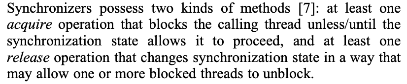

https://gee.cs.oswego.edu/dl/papers/aqs.pdf Doug Lea写的论文,下面的功能需求与设计实现中的内容参考了Doug Lea的论文

## 1.功能需求

同步器一般包含两种方法：acquire()和release() acquire:阻塞线程，除非或者直到同步状态运行线程通过 release:修改同步状态，可能运行一个或者多个阻塞线程变为非阻塞状态 但是juc并没有对同步器的API做一个统一的定义,因此上面所描述的两个方法并非具体的方法,比如ReentrantLock.lock()则对应上面的acquire()方法



## 2.设计与实现

同步器背后的设计思想如下：

```plain&#x20;text
while (synchronization state does not allow acquire) { // 当同步状态不允许(线程)acquire「通俗点：线程获取锁失败」
    enqueue current thread if not already queued; // 如果(当前线程)没有在队列中,那么当前线程入队
    possibly block current thread; // 可能阻塞当前线程(这里有个关键的点,是可能阻塞)
}
// 否则同步状态允许(线程)通过
dequeue current thread if it was queued; // 如果当前线程在队列中，则当前线程出队
```

release():

```plain&#x20;text
update synchronization state; // 更新同步状态
if (state may permit a blocked thread to acquire) // 如果同步状态允许一个blocked线程通过acquire()
    unblock one or more queued threads; //那么unblock一个或者多个已经入队的线程
```

为了实现上述操作,需要下面三个基本组件的相互协作：&#x20;

* Atomically managing synchronization state -- 原子性管理同步状态

* Blocking and unblocking threads -- 阻塞和唤醒线程

* Maintaining queues -- 队列的管理

```plain&#x20;text
// 创建一个框架分别实现这三个组件是有可能的。但是，这会让整个框架既难用又没效率
It might be possible to create a framework that allows each of these three pieces to vary independently. 
However, this would neither be very efficient nor usable.
```

如何理解这段话呢？ 在上面也描述了为了支持同步器的工作,需要三个组件相互协作，而创建一个框架分别实现这三个组件的含义是允许这三个部分独立化，也即可以完全设计一个框架以支持让用户完全自定义这三个部分(比如状态类型，节点结构以及唤醒策略)。 但是这种方案将会即难用又没效率,因为：&#x20;

1. 效率低下：组件间需要大量适配层或通用接口来通信，增加开销（虚方法调用、类型转换、冗余数据）。例如，唤醒线程需要的信息（如目标线程引用）必须存在于节点结构中，如果节点结构完全由用户定义，框架就需要额外的机制去查找这些关键信息。

2. 难以使用（Not Usable）： 用户需要理解并协调三个独立组件的交互细节，极大增加使用复杂度。框架暴露的公共 API（如 acquire/release）的签名和行为会变得非常泛化（需要支持各种状态类型和策略），导致 API 难以理解和使用。

所以Doug Lea 并没有采用上述设计理念，而是为这三个组件选择了具体的实现方式

1. 同步状态： 固定使用一个 volatile int state , 用户通过重写 tryAcquire/tryRelease 等方法定义 state 的语（比如大于0表示有锁），但状态本身的存储和原子访问由 AQS 高效实现

2. 队列管理：定义了一个具体的 Node 类结构。这个结构强制包含了框架高效管理队列和进行阻塞/唤醒所必需的信息（如：前驱/后继指针、线程引用、等待状态标志）。用户不能改变节点结构本身

3. 阻塞/唤醒： 使用 LockSupport.park/unpark 作为底层原语。阻塞和唤醒的逻辑流程（何时阻塞、如何检查中断、如何公平/非公平唤醒）由 AQS 的队列管理算法（如 acquireQueued）固定实现
