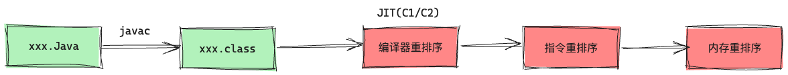
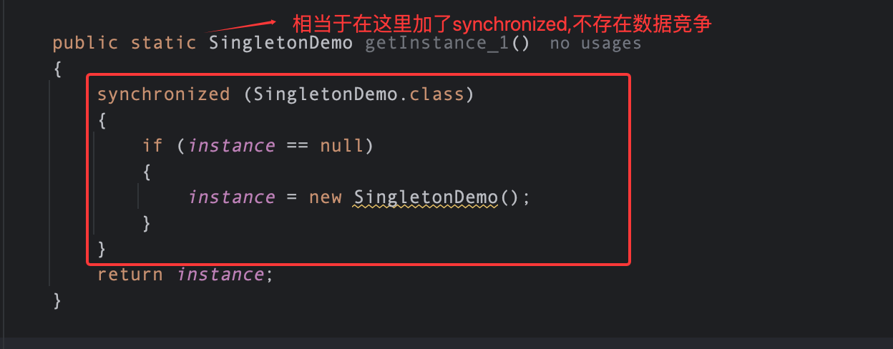
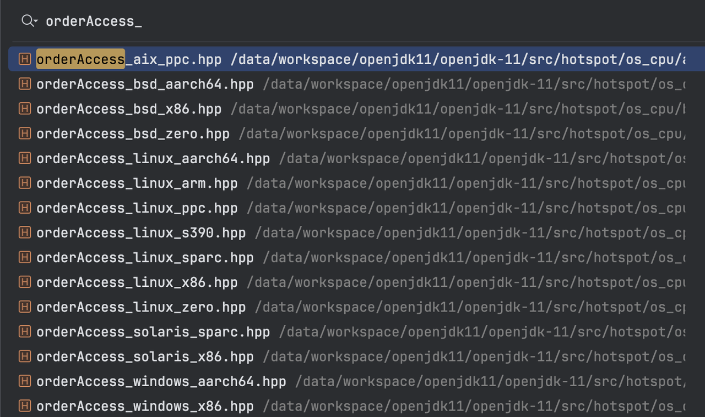
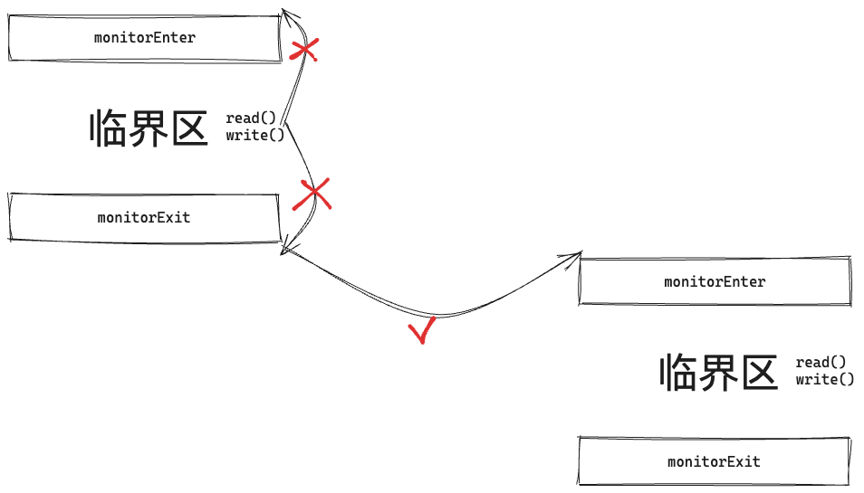
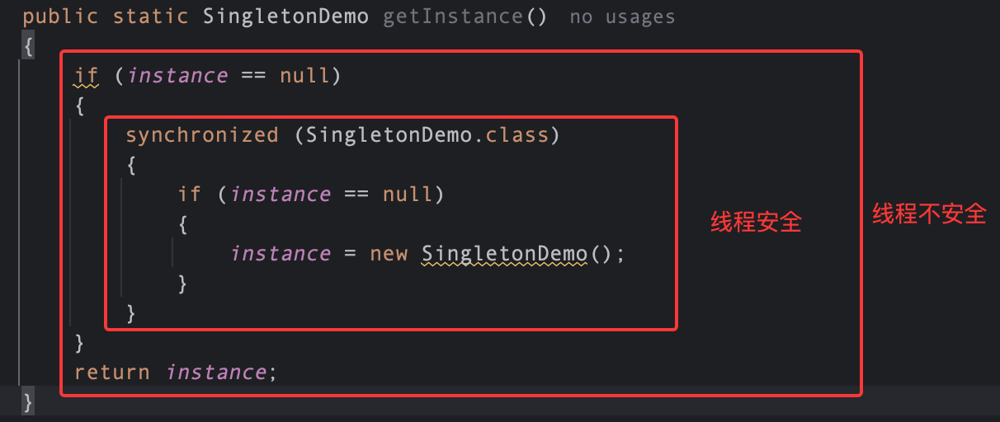

# 一：深入理解Java内存模型

## 1. 前置知识

* 并发编程模型

并发编程中需要处理的两个核心问题：线程之间如&#x4F55;**<span style="color: rgb(216,57,49); background-color: inherit">通信</span>** 以及 线程之间如&#x4F55;**<span style="color: rgb(216,57,49); background-color: inherit">同步</span>**

通信：指的是多线程如何交换信息/数据，在命令式编程中，线程之间的通信方式有两种：共享内存和消息传递

> 这里提出一些问题：
>
> 1. 什么是命令式编程?
>
> 2. 这里的用词并没有使用：线程之间的通信方&#x5F0F;**<span style="color: rgb(216,57,49); background-color: inherit">主要</span>**&#x6709;两种，是不是其他通信方式的本质上就是这两种呢？
>
> 3. 进程间的通信方式有哪些呢？

同步：程序用于控制不同线程之间操作发生的相对顺序的一种机制/手段

而Java的并发模型采用的就是共享内存模型

其实这里想表达的就是：***Java中的并发编程模型是基于共享内存的,某个变量位于内存中的某个位置,多个线程通过读该变量的值来进行通信***

***

* Java内存模型的抽象

在Java中,实例域/静态域/数组元素「**共享变量**」存储在堆内存中，堆内存在线程之间是共享的，而局部变量,方法定义参数,异常处理器参数不会在线程之间共享，所以不会有线程安全问题，不存在内存可见性问题

> 这个观点是否重要,造成线程不安全的根本原因其实是因为多个线程会操作共享变量(再通俗一点可以说是共享数据)，而对于线程私有的数据则不存在这些问题，所以为了保证对共享数据访问的线程安全性，就需要付出一定的代价，这也是性能优化的一个方面，也&#x5373;**<span style="color: rgb(216,57,49); background-color: inherit">数据线程私有化(减少/避免锁的开销)</span>**

JMM定义了线程和主内存之间的抽象关系：线程之间的共享变量存储在主内存(Main Memory)，每个线程都有私有的本地内存(Local Memory)

> 这里需要注意：JMM所定义的主内存和本地内存是抽象的,是不存在的,因为不管是什么语言编写的程序最终都是运行在硬件上的,所有只存在真实的物理内存模型，比如主存,L1/L2/L3 Cache,寄存器,NUMA架构,SMP架构,这些才是真正的实体

而这里JMM定义的Main Memory可以认为是主存，本地内存可以认为是L1/L2/L3 Cache / 寄存器(**<span style="color: rgb(216,57,49); background-color: inherit">这点很重要</span>**) / 以及其它的用于**性能优化（<span style="color: rgb(216,57,49); background-color: inherit">编译器/硬件优化</span>）**&#x7684;存储(比如Store Buffer)都可以认为是本地存储

> 当然,有的架构中只有L1 Cache 和L2 Cache 是core 私有的，而L3 Cache 是 处理器私有,core 共享的，在这里说明一下,这里的本地内存通常指的线程私有的存储「内存」

那么为什么要存在Java内存模型（JMM）呢？

"write once , run every",JMM让Java程序员可以用简单的规则(volatile,sychronized,happen-before等)写出在所有平台上都正确运行的并发程序，不需要考虑底层的硬件实现,由JVM统一处理了

***

* 重排序

通常为了提高程序的运行效率/性能，编译器/处理器常常会对指令做重排序,重排序的类型一般可以分为三种：

1. 编译器重排序：这里的准则为，编译器在不改变单线程程序语义的情况下,可以重新安排语句的执行顺序

> 这里编译器指的是什么呢？是javac吗? 是gcc吗？我认为不是的，这里应该指的&#x662F;**<span style="color: rgb(216,57,49); background-color: inherit">JIT</span><span style="color: rgb(216,57,49); background-color: inherit">(C1/C2编译器)</span>**

* 指令并行重排序：指令流水线，这里的重排序准则是，如果多条指令之间不存在数据依赖性，那么CPU可以改变语句(代码)所对应的机器指令的执行顺序

> 比如 a = 1 和 b=2 ，这两行代码不存在数据依赖,如果CPU认为b = 2 和 a = 1 性能更高，那么就会重排序这两条指令执行的顺序「这里没有上下文,只是举一个例子,毕竟a=1和b=2没有什么性能问题」

* “内存”重排序：这里不是广义上的内存,而是硬件为了提高性能，采用了读/写缓冲区 (这里比较典型的就是Store Buffer 和 Invalid Queue )& 缓存(Cache)，这会使得读/写操&#x4F5C;**<span style="color: rgb(216,57,49); background-color: inherit">看起来</span>**&#x53EF;能是在乱序执行

> 这里的用词是“看起来”，而不是真正的乱序执行，很重要



* 屏障

由于Java代码与最终的指令执行需要经过JIT编译,CPU指令重排序，内存重排序,而这些重排序就可能会导致可见性与有序性问题,所以为了解决这里的问题就引入了屏障

> 这里需要强调一下 可见性 与 有序性
>
> * 可见性：一个线程的修改对另外一个线程可见  「不可见的原因：线程"本地内存"」
>
> * 有序性：代码按照编写的顺序执行 「无序的原因: 编译器/指令重排序/"内存重排序"」
>
> * 原子性：这里并不是Java内存模型的讨论范围了

而这里可见性 和 有序性 讨论的则是共享数据的普通读写操作(比如a = 1, b = y这种读写操作),而不是复杂操作(比如count++这种操作，这种则是原子性的讨论范围)

而针对共享数据的普通操作 - 也即读写操作，那么2\*2,也就是四种组合，那么对应着四种屏障(LoadLoad,LoadStore,StoreStore,**<span style="color: rgb(216,57,49); background-color: inherit">StoreLoad</span>**)

需要注意的是：处理器支持哪种内存重排序，就会提供禁止相应重排序的指令,这些指令被称为基本内存屏障「就是上面的四种内存屏障」，如果是处理器不支持的重排序类型，那么相应的屏障实现就为空(可能退化为编译器屏障)


* 顺序一致性

这里可能会存在什么样的重排序呢？

> 这里a = 1 和 flag = true 不存在数据依赖性，所以可能会被重排，但是这并不是造成线程安全的原因，即使这里没有重排，依旧存在线程安全问题，其根本原因其实在于 原子性，也即这里是存在数据竞争的

所以这个例子并不能体现有序性的重要性,但是这里可以验证书中所说的数据竞争 与 顺序一致性，Java内存模型对数据竞争的定义如下：

* 在一个线程中写共享变量

* 在另外一个线程中读共享变量

* 而读和写操作之间并没有通过同步操作来排序

下面这个案例很符合数据竞争的条件，如果代码中包含数据竞争时,那么程序的最终运行效果是不可预估的，反之,如果一个程序没有数据竞争，那么最终的结果与在顺序一致性模型中得到的结果是一致的「拿下面的例子来说，如果同步了，那么要么是T-1先执行，此时的顺序就是T-1 -> T-2,最终的结果就是输出 a = 1,反之 T-2 -> T-1 ,那么最终的结果就是a = 0,这是毫无疑问的，确定的」

> 在书中讲解了 非同步的顺序一致性，但是我觉得没意义，并且书中也说了，这是一种理想化的模型，在这里重点掌&#x63E1;**<span style="color: rgb(216,57,49); background-color: inherit">JMM</span><span style="color: rgb(216,57,49); background-color: inherit">对数据竞争的定义</span>**


```java
public class Conflict {

    public static boolean flag;
    public static int value;
    public static void read(){
        if (flag)
            System.out.println(value);
    }

    public static void write(){
        flag = true;
        value = 2;
    }
}

// t1 - write() t2 - read()2
```

* 单例模式

```java
public class SingletonDemo {
    public static SingletonDemo instance;
    public static SingletonDemo getInstance()
    {
        synchronized (SingletonDemo.class)
        {
            if (instance == null)
            {
                instance = new SingletonDemo();
            }
        }
        return instance;
    }
}

```

> 先看上面的代码,这样写会有问题吗？
>
> 首先要知道的是单例模式的意思是：在程序运行的过程中,只会存在一个对象「比如Spring中的Bean对象」，所以这里需要保证只能初始化一个对象，在这里是通过加锁来保证的，也就是synchronized。
>
> 上面这种写法**没有线程安全问题**，但是存在一个**性能问题**，那就是既然是单例,当对象已经存在的时候(这是大部分情况，通常只有在系统启动或者第一次访问这个变量的时候才会进行初始化，而后续都不会触发初始化动作的)。
>
> 但是在这里，后续的每一次操作首先上来就是加锁,如果在单例对象已经初始化的情况下，多个线程同时调用getInstance()方法，这就会导致竞争，锁的开销比较大。
>
> 其实这种情况下，线程都只是读操作，并不存在线程安全问题，那么其实当对象不为空时，直接返回对象即可，代码改动如下：

```java
public static SingletonDemo getInstance()
{
    if (instance == null) 
    {
        synchronized (SingletonDemo.class)
        {
            if (instance == null)
            {
                instance = new SingletonDemo();
            }
        }
    }
    // 如果单例对象不为null,那么就直接返回
    return instance;
}
```

这样做性能确实提升了,对于已经初始化了的对象，多个线程调用getInstance()时，都是直接执行return xxx操作，并不需要执行加锁的动作。

这里就是不那么典型的数据竞争了，为什么呢？这里不是用了synchronized吗？

> 这就是并发编程的难点,看似优化了性能，其实却引入了一个新的问题，这也是为什么锁的粒度如此难把控的问题，粒度大，性能差，粒度小，考虑的问题就多


多个线程调用，一个线程在写，另外的线程在读，并且没有使用正确的同步机制，存在数据安全，而这里就会和有序性挂钩了,在这里new操作并不是一个原子性的操作，在底层会被分解成更加细致的粒度：通常认为是

* 在堆中找到一块内存：0xaaa \~ 0x bbb  #1

* 初始化这块内存: 清0/调用构造函数 #2

* 将内存地址赋值给引用：instance = 0xaaa #3

由于#3和#2没有数据依赖关系(#2和#1是有的),并且由于使用了synchronized保证了单线程，所以在这里是完全有可能将执行顺序重排序为如下顺序：

* 在堆中找到一块内存：0xaaa \~ 0x bbb  #1

* 将内存地址赋值给引用：instance = 0xaaa #3 「**<span style="color: rgb(216,57,49); background-color: inherit">此时instance就不为null了,这相当于是一个store/write操作</span>**」

* 初始化这块内存: 清0/调用构造函数 #2

此时如果读线程在写线程调用构造函数之前就读取了instance，这是可能的，那么直接就返回instance,然后使用instance进行业务处理了,这可能会导致无法预知的问题

所以这里如果确实要避免每次都加锁的开销，那么必须要保证上面的#2和#3不能重排序，在这里就可以使用volatile关键字来修饰instance变量

> 那么volatile是如何解决这个重排序的问题的呢？后续继续分析

那么第一种写法存在这个问题吗？答案是不存在的




## 2. jvm内存屏障

> 再介绍volatile之前,先学习一下jvm内存屏障的具体实现，然后再看读写volatile变量时的操作,以及synchronized.final的操作

在jvm中有关屏障的实现在orderAccess.hpp中,这个文件是定义，而jvm根据不同的体系结构有不同的实现，实现文件是以区分了操作系统和硬件架构。

> 从这里也可以看出JMM的必要性,当Java程序员在编写程序的时候，只要遵循了JMM的规范,那么就不存在问题，不需要考虑这段代码是跑在什么平台上面的，一切都由jvm解决了

```plain&#x20;text
┌────────────────────────────────────────
│                    orderAccess.hpp (通用接口)                    │
│     loadload() / storestore() / acquire() / release() / fence() │
└───────────────────────────────┬──────────
                                │ #include OS_CPU_HEADER(orderAccess)
                                ↓
┌──────────────────────────────────────────
│              平台特定实现 (orderAccess_<os>_<cpu>.hpp)           │
├─────────────┬─────────────┬─────────────
│  linux_x86  │ linux_aarch64│  linux_arm  │      aix_ppc         │
│  bsd_x86    │ bsd_aarch64  │  linux_ppc  │      linux_s390      │
│ windows_x86 │windows_aarch64│ linux_sparc │      ...             
```


> 在这里并没有去关注JIT中(C1/C2)中的屏障实现,后面会简单的提一下

* 下面看下orderAccess.hpp中定义的内容

```c++
 public:
  // barriers
  // 四大基本屏障
  static void     loadload();
  static void     storestore();
  static void     loadstore();
  static void     storeload();
  // “发布 - 订阅” / “申请 - 释放”
  static void     acquire(); // acquire[ - 阻止后面的操作上浮(重排序到前面) - LoadLoad & LoadStore
  static void     release(); // ]release - 阻塞上面的操作下沉(重排序到后面) - StoreStore & LoadStore
  static void     fence(); // == 四大基本屏障
  // 操作 + 屏障绑定
  template <typename T>
  static T        load_acquire(const volatile T* p);

  template <typename T, typename D>
  static void     release_store(volatile D* p, T v);

  template <typename T, typename D>
  static void     release_store_fence(volatile D* p, T v);
```

为什么这里的屏障分为了3种类型呢？

* 四大基本屏障：最精细的内存屏障,根据具体的场景来使用,性能最好(开销最小)

* 语义屏障：表达的是同步意图而非具体的屏障组合「虽然内部就是使用屏障的组合来实现的」，在许多文章中会看到“发布 - 订阅”模式

> 这里的发布-订阅模式是什么意思呢？可以这样理解：
>
> * 生产者有两个动作：生产数据 ，发布标识
>
> * 消费者有两个动作：观察标识，消费数据
>
> 如果消费者看到了发布标识，那么一定能够正确的消费数据，这是一种语义

```plain&#x20;text
┌─────────────────────────────────────────────────────────────────┐
│  生产者（Publisher）           消费者（Subscriber）              │
│                                                                 │
│  1. 准备数据                                                     │
│  2. release ─────────→ 3. 观察到标志  - load(flag)                     │
│  3. 发布标志  store(flag)      4. acquire                        │
│                               5. 使用数据（保证看到完整数据）      │
└─────────────────────────────────────────────────────────────────┘
```

* 绑定操作：在orderAccess.hpp文件的注释有关于这部分的说明,那就是使用这种屏障,**<span style="color: rgb(216,57,49); background-color: inherit">对应的平台可以进行深度的优化(这是核心,并且官方也推荐使用这种方式)</span>**,以上面的消费者为例,acquire()不知道要保护的load操作是针对谁的，所以默认对前面所有的load操作都生效，但是其实这是没必要的,因为在这里只要保证load(flag)和后面的操作有acquire的语义即可

下面简单的看一下linux\_x86的实现

* orderAccess\_linux\_x86.hpp

可以看到,在x86下面,只有storeload屏障是处理器屏障和内存屏障，而loadload/loadstore/storestore全部都是编译器屏障(禁止编译器优化)，说明x86架构默认不支持这几种重排序,所以不需要实现

> 前面说过,处理器支持哪几种重排序，就会提供禁止这几种重排序的屏障，这些屏障被称为基本屏障，如果不支持，那么就不会提供（当然也没必要提供）
>
> 注意这里的volatile可不是java中的volatile
>
> 而屏障的最终实现则是依赖lock前缀指令来实现的，这是硬件提供并且支持的

```c++
static inline void compiler_barrier() {
  __asm__ volatile ("" : : : "memory");
}

inline void OrderAccess::loadload()   { compiler_barrier(); }
inline void OrderAccess::storestore() { compiler_barrier(); }
inline void OrderAccess::loadstore()  { compiler_barrier(); }
inline void OrderAccess::storeload()  { fence();            }

inline void OrderAccess::acquire()    { compiler_barrier(); }
inline void OrderAccess::release()    { compiler_barrier(); }

inline void OrderAccess::fence() {
   // always use locked addl since mfence is sometimes expensive
#ifdef AMD64
  __asm__ volatile ("lock; addl $0,0(%%rsp)" : : : "cc", "memory");
#else
  __asm__ volatile ("lock; addl $0,0(%%esp)" : : : "cc", "memory");
#endif
  compiler_barrier();
}
// 第三层的优化实现（x86）
template<>
struct OrderAccess::PlatformOrderedStore<4, RELEASE_X_FENCE>
{
  template <typename T>
  void operator()(T v, volatile T* p) const {
    __asm__ volatile ("xchgl (%2),%0"  // 直接用 xchg 指令
                      : "=r" (v)
                      : "0" (v), "r" (p)
                      : "memory");
  }
};
```

上面已经简单了解了屏障以及屏障的实现,下面就看下volatile,final以及synchronized的屏障语义吧

### 2.1 volatile

在jvm中有个很重要的文件：accessDecorators.hpp，这个文件定义了 JVM 中**内存访问的装饰器系统**——用位标志来描述一次内存访问需要什么样的保证。

> 每次内存访问可以附加多个装饰器，告诉 JVM：
>
> * ***需要什么内存顺序保证？***
>
> * ***需要什么 GC 屏障？***
>
> * ***访问的是什么类型的引用？***
>
> * ***访问发生在哪里？***
>
> 这里对于volatile的内存访问所采用的内存顺序&#x7684;**<span style="color: rgb(216,57,49); background-color: inherit">顺序一致性</span>**
>
> 这是最强的内存一致性模型,由 Lamport 在 1979 年提出
>
> 顺序一致性要求：
>
> 1. 每个处理器的操作按程序顺序执行
>
> 2. 所有处理器看到的操作顺序相同（全局一致）

```c++
// 内存顺序 (MO_*)
const DecoratorSet MO_UNORDERED      = UCONST64(1) << 6;   // 无保证
const DecoratorSet MO_VOLATILE       = UCONST64(1) << 7;   // C++ volatile
const DecoratorSet MO_RELAXED        = UCONST64(1) << 8;   // 原子但无序
const DecoratorSet MO_ACQUIRE        = UCONST64(1) << 9;   // 获取语义
const DecoratorSet MO_RELEASE        = UCONST64(1) << 10;  // 释放语义
const DecoratorSet MO_SEQ_CST        = UCONST64(1) << 11;  // Java volatile

// 屏障强度 (AS_*)
const DecoratorSet AS_RAW            = UCONST64(1) << 12;  // 绕过 GC 屏障
const DecoratorSet AS_NO_KEEPALIVE   = UCONST64(1) << 13;  // 不保持对象存活
const DecoratorSet AS_NORMAL         = UCONST64(1) << 14;  // 正常 GC 屏障

// 引用强度 (ON_*)
const DecoratorSet ON_STRONG_OOP_REF  = UCONST64(1) << 15;  // 强引用
const DecoratorSet ON_WEAK_OOP_REF    = UCONST64(1) << 16;  // 弱引用
const DecoratorSet ON_PHANTOM_OOP_REF = UCONST64(1) << 17;  // 虚引用
const DecoratorSet ON_UNKNOWN_OOP_REF = UCONST64(1) << 18;  // 未知（Unsafe）

// 访问位置 (IN_*)
const DecoratorSet IN_HEAP           = UCONST64(1) << 19;  // 堆内访问
const DecoratorSet IN_NATIVE         = UCONST64(1) << 20;  // 堆外访问

```

* 举例：

```java
volatile int x = 0;
volatile int y = 0;

// Thread 1          // Thread 2
x = 1;               y = 1;
int r1 = y;          int r2 = x;

// 顺序一致性保证：不可能 r1 == 0 && r2 == 0
// 因为如果r1 == 0,那么说明 x =1 ,r1 = y(0) 这两行代码都先于Thread-2执行,
// 那么此时Thread-2看到x值一定为1(因为Thread-1先于Thread-2执行)
```

在这里不管Thread-1和Thread-2以什么样的顺序执行,在任何一个CPU上看到&#x7684;**<span style="color: rgb(216,57,49); background-color: inherit">全局执行顺序</span>**&#x90FD;是一样的

```java
全局操作序列（所有 CPU 看到的顺序必须一致）：
┌─────────────────────────────────────┐
│  1. store(x, 1)   ← CPU0           │
│  2. store(y, 1)   ← CPU1           │
│  3. load(y) → 1   ← CPU0           │
│  4. load(x) → 1   ← CPU1           │
└─────────────────────────────────────┘

或者：
┌─────────────────────────────────────┐
│  1. store(y, 1)   ← CPU1           │
│  2. store(x, 1)   ← CPU0           │
│  3. load(x) → 1   ← CPU1           │
│  4. load(y) → 1   ← CPU0           │
└─────────────────────────────────────┘
```

那么volatile的屏障语义是什么呢？

> 这里在许多文章中都会看到volatile的屏障语义，比如读一个volatile变量和应该加什么屏障，写一个volatile变量应该加什么屏障，说实话，有点难以理解并且记不住，过几天就会忘记到底要加什么屏障了

那么如何理解呢？从accessDecorators.hpp文件中可以得知访问volatile变量的内存模型是顺序一致性模式，所有的核心看到的全局执行顺序是一样的:

* 读一个volatile变量,在读这个变量之前的其他操作其实和这里的读操作没关系，重点是在该读操作的后面的读写操作与该volatile读必须保证顺序一致性

> 

为什么不允许读写操作重排序到前面呢？对于写操作很好理解，代码如下：

```java
x = a -- read(a)
y = x*x -- write(y)
printf(y)
// 如果重排序了,那么输出的y可能就是错误的值
```

那么为什么读操作也不允许呢？

```java
write()
{
    data = 42;
    a = true
}
read()
{
    if (a)  -- read(a)
    {
        t = data; // write(t)
    }
}
// 如果重排序了,那么可能读取到错误的值
```

其实可以看到,volatile读其实防止的是依赖这个volatile读操作的读写操作，如果是无关的,那么理论上是可以重排序的，但是不支持,因为很难实现，所以默认的语义是：所有的读写操作都无法被重排序到volatile读之前，那么要加什么屏障呢？

在jvm实现中，默认是添加acquire() 「也就是LoadLoad & LoadStore 屏障」

也即读一个volatile变量，需要在其后面添加 LoadLoad & LoadStore 屏障

* 写volatile变量，应该保证什么呢？首先考虑volatile的可见性，当写了一个volatile变量后，位于其他处理器(核心)上的线程应该能够立即看到这个值，这往往是由storeLoad屏障来实现的,这个屏障的功能最强（同时性能损耗也最大），包含了另外三种内存屏障。

所以在写volatile变量时，会在后面加StoreLoad屏障来保证可见性,同时也保证了后面的所有读写操作不会重排序到该写操作之前

而在写操作之前呢？为了保证volatile的内存语义 - 顺序一致性，在这里同样不允许读写操作重排序到写volatile之后，所以这里在写volatile之前会加上release()屏障 -- 也就是 StoreStore & LoadStore

* 总结一下

  * 为了保证volatile 读的语义：acquire

  > 在Java多线程编程实战指南这本书中，说在读取一个volatile变量之前会添加LoadLoad屏障 - 也就是读屏障，这是用于清空InvalidQueue的,这样读取的变量就是最新的
  >
  > 但是在jvm中,并没有实现,也即在volatile读之前并没有添加屏障，那如果是这样，volatile读不就可能读到旧值了吗？是的，理论上是存在这个可能的，但是这并没有违反volatile在jvm中的语义
  >
  > 在jvm中，volatile的内存语义是顺序一致性，它不保证volatile读是最新值，但是如果读到了最新值，那么一定能够保证看到正确的数据
  >
  > 所以这里要注意：**<span style="color: rgb(216,57,49); background-color: inherit">在volatile读操作之前并不会添加屏障</span>**

  * 为了保证volatile 写的语义：release\_store\_fence「这里的饭fence 相当于 StoreLoad屏障」

下面在回头来看下单例模式 + volatile

```java
public class SingletonDemo 
{
    public static volatile SingletonDemo instance;
    SingletonDemo()
    {
        // init something
    }
    public static SingletonDemo getInstance()
    {
        if (instance == null)
        {
            synchronized (SingletonDemo.class)
            {
                if (instance == null)
                {
                    /*
                        instance = new SingletonDemo()
                            - ptr = allocate() #1
                            - 调用构造函数 #2 
                                 -- release() 禁止#3之前的读写操作重排序到#3之后,避免了上述的问题
                            - instance = ptr #3
                                 -- fence()
                    */
                    instance = new SingletonDemo();
                }
            }
        }
        return instance;
    }
}
```

### 2.2 final

final的内存语义：

如果一个对象被正确构造（**即在构造函数中没有发生this引用逃逸**），那么所有线程都能看到该对象final字段的正确初始化值，无需同步

> 上面这段话的意思为：如果某个线程看到了demo对象的引用,那么一定能够看到 i= 10

```java
public class Demo 
{
    public final int i;
    
    /*
        Demo demo = new Demo()
            - ptr = allocate()
            - i = 10
            - demp = ptr
        但是最终的执行顺序可能为：
        Demo demo = new Demo()
            - ptr = allocate()
            - demp = ptr # 看到了demo的引用,但是demo.r依旧为0
            - i = 10
        那么final是如何解决这个问题的呢？他是通过在写final变量之后添加StoreStore屏障来解决的
         Demo demo = new Demo()
            - ptr = allocate()
            - i = 10 
                -- StoreStore 这两个操作不能重排序,那么当看到demo引用时,一定能够看到i = 10
            - demp = ptr  
    */
    public Demo() {
        i = 10;
    }
    
}
```


### 2.3 synchronized



可以看到synchronized需要保证：

* 位于临界区中的读写操作不能重排序到获取锁之前

* 位于临界区的读写操作不能重排序到释放锁之后

* 释放锁之后,在临界区的写操作需要对其他处理器可见




