从java的视角来看线程可以分为三个层次,java线程,jvm线程,linux内核线程,在本篇文章中就从下向上简要的分析一下线程的原理

# 一：前置概念

> 目标:需要搞清楚在Linux内核中(真实操作系统),线程和进程到底的真实面貌是什么？以及相关的Linux系统编程

## 1.为什么要有进程？

进程的概念是随着操作系统的不断发展而引入的,这里比较关键的两个时期就是单道批处理系统和多道批处理系统

> 这里的批处理系统指的是程序员将作业(早期是称为job的)按照顺序组织好,将整个批作业放在输入设备上,供监控程序(monitor，早期操作系统的雏形，常驻在内存中的一段程序)使用，每个程序完成后,控制权从程序返回到monitor，然后又monitor自动的加载下一个程序

* 单道批处理系统

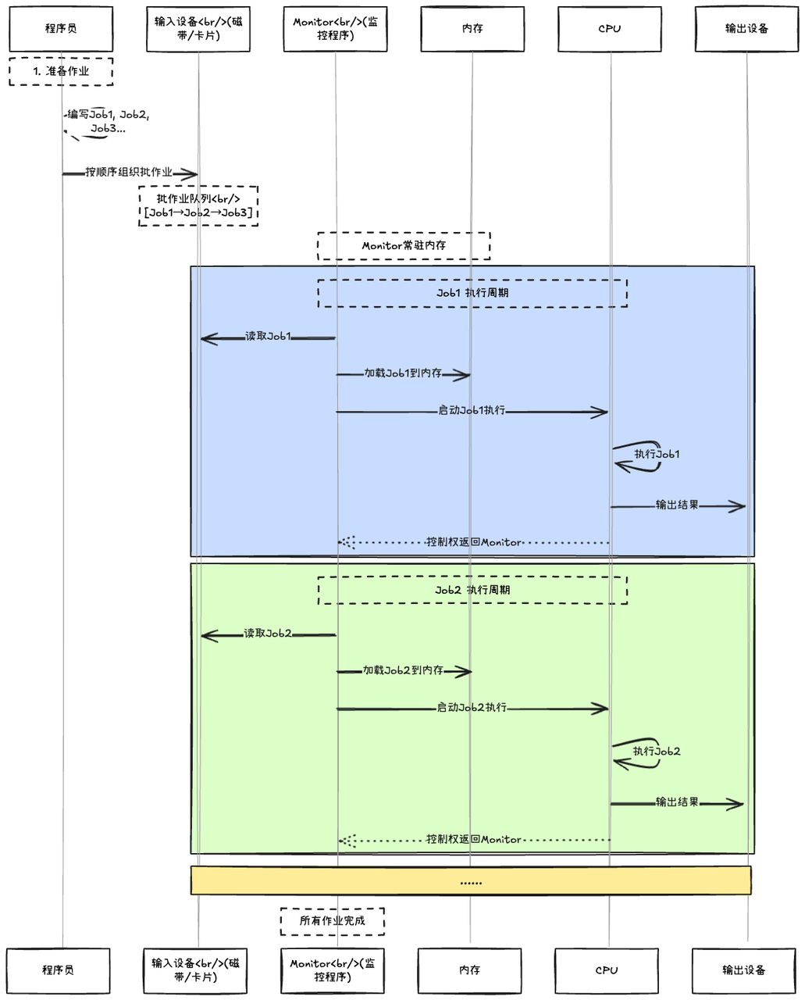

这种工作模式的特点就是一次只能运行一个JOB,这个JOB独占计算机的所有资源(CPU,内存...),直到它运行完毕,Monitor才会去加载下一个JOB将来。

这会导致什么问题？那就是CPU的计算速度与IO的处理速度不匹配,当JOB遇到一条IO指令后，CPU将会等待IO操作的结果,此时CPU处于空闲状态，造成了巨大的资源浪费。

为了解决这个问题,引入了多道批处理系统.

* 多道批处理系统

该系统允许在内存中同时存放多个程序,当某个程序需要等待IO时,Monitor可以选择切换到另外一个程序中去执行,这样就能充分的利用CPU资源了

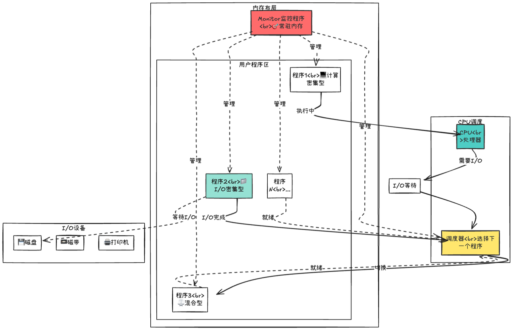

那么这就引入了新的问题(当然不止一个问题)，那就是如何管理和描述这些正在运行的程序呢？

比如：当前被切换的程序运行到了哪一步?占用了哪些资源？使用一个更加专业的名词：现场。

为了保证切换回来后能够正常的继续运行下去，就需要一个实体来抽象和封装一个程序的执行现场，这个实体就是进程，并且该阶段的出现也让并发(通常特指单核)成为了可能。

> 当然该阶段需要解决的问题绝不止提出进程的概念这么简单,比如：
>
> 1. 内存管理：当多个程序同时处于内存中时,如何防止一个程序只会访问自己的代码和数据呢？&#x20;
>
> 2. 定时器(调度)：当多个程序同时存在时，如果程序并没有执行IO操作呢？而是一直计算呢？那其他程序岂不是永远无法被执行了? 「所以这里不能依赖程序猿所写的代码来进行切换」
>
> 3. 中断：当被切换的程序对应的IO事件执行完毕了，如何通知CPU呢？
>
> 4. ....

总结一下：为什么要有进程？

**本质上还是为了提升性能,在多道批处理系统中,为了能够尽量的榨干CPU,当某个程序在等待IO操作时,CPU可以去执行另外一个就绪的程序，而为了保证程序在被切换回来后能够正常的继续的往下执行，需要有一个实体来抽象和封装一个程序的执行现场，这个实体就是进程。**

> 体会到的哲学：**为了解决一个问题而引入的方法，往往会带来新的问题**

## 2.可执行文件的出现

目前出现了许许多多的高级语言，换句话说,我们可以使用Python,java,c++等语言来编写程序，而这些程序想要变成进程,那么就需要Monitor(也就是操作系统)来进行加载，这个就有个问题，那就是操作系统需要为不同的语言编写的程序来实现不同的加载代码吗？

如果是这样,那么操作系统的代码将会变得十分臃肿并且难以维护。所以为了解决这个问题,就引入了可执行文件这个概念，所有的现代操作系统都定义了标准的可执行文件格式(**Linux中的ELF,**~~Windows上的PE~~等)。

不管是什么编程语言,最终都必须编译或者转换为标准的格式,内核只看可执行文件，而不关心是什么编程语言编写的程序。内核只需要一个ELF加载器,就能处理不同语言生成的可执行文件

> *"All problems in computer science can be solved by another level of indirection, except of course for the problem of too many indirections."*
> 计算机科学中的所有问题都可以通过增加一个间接层来解决,当然,除了间接层过多这个问题本身

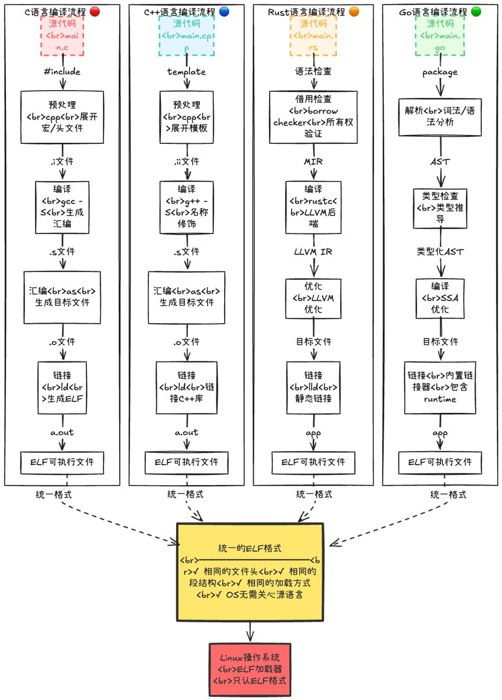

> 那Java呢?Java文件的执行原理首先编译为.class文件啊,然后再由jvm加载.class文件,并没有看到什么可执行文件啊？关于这部分在介绍JVM的会单独出一篇文章来讲述JVM的启动

## 3.ELF简介

这个是我写的一个简单的c语言程序,从我写的hello.c到控制台输出hello,world!

这中间到底都经历了些什么呢？

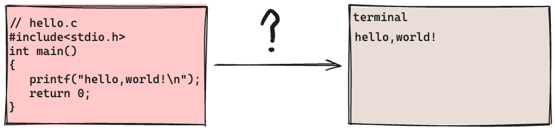

### 3.1 可执行文件的生成

从一个hello.c文件到真正可以被执行,中间需要经历许多步骤,在这里首先学习一下到从c源文件到目标文件的过程。

也即：预处理 - 汇编 - **编译** -> 当编译之后生成的文件就是一个目标文件(xxx.o文件)

> 虽然xxx.o文件是ELF格式的,但是它是一个不可执行的文件(通过file命令可以知道这是一&#x4E2A;**可重定位**&#x7684;文件)
>
> 那么接下来就简要地分析一下这三个步骤(预处理 / **编译** / 汇编 都做了什么，以&#x53CA;**xxx.o文件中都有什么(core)**

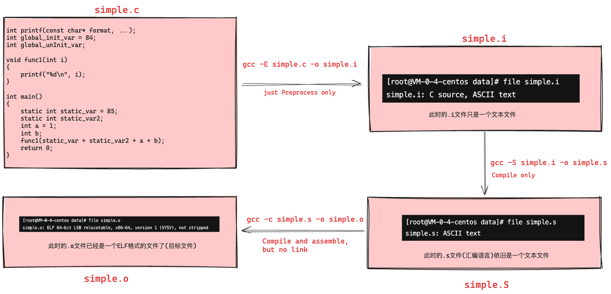

* 预处理

这一步骤的主要职责是处理.c文件中的预处理指令(以#开头)，然后生成一个.i文件

* 编译

这一步骤的主要职责是将预处理后的文件翻译为汇编代码，这通常是通过编译器来完成的，编译的过程一般可以分为以下几步：**扫描，语法分析，语义分析，中间代码生成(**&#x751F;成与机器无关的代&#x7801;**)，源代码优化(**&#x5E38;量计算，循环优化....**)，目标代码生成**(生成与平台相关的汇编代码)

到这一步结束后就生成了一个与平台相关的汇编文件了，如图所示(simple.s的不完整截图)：

#### 3.1.1 汇编 (目标文件的生成)

* 汇编代码

这一步就是将上面的simple.s文件转变为simple.o文件的过程了(**也即将汇编语言翻译为二进制目标文件**)，

而目标文件(.o)就已经是ELF格式的文件了，**那么汇编器就承担着解析汇编文件并且最终生成一个ELF格式文件的职责**

> 下面就简要的分析一下,汇编器是如何解析并且生成目标文件的

其核心工作原理如下：

1. 将汇编语言转换为二进制代码

2. **构建符号表,记录所有标签和变量的位置信息**

3. **生成重定位信息,标记需要链接器修正的地址引用**

4. **按照ELF格式组织输出文件(节的组织)**

从上面给出的汇编代码可以看出来,充斥着大量&#x7684;**符号**,而汇编器就会遍历并且处理这些符号，但是这里有个问题：

那就是此时文件(或者说程序)还只是在磁盘上呢,并不知道(同样也没有)虚拟地址，那下面这行代码应该怎么翻译呢？

此时根本就不知道printf函数的地址啊,根本翻译不了啊。

这里就要涉及到目标文件的种类了,在Linux系统中，目标文件一般有4种形式：

1. 可重定位目标文件(Relocatable File)「典型的后缀：xxx.o」

   1. **特征**：包含代码和数据，但**不能直接运行**。其中的代码地址是从 0 开始的（相对地址），且包含未解析的符号（如调用了外部函数 `printf` ）

   2. **用途**：它需要在**链接阶段**与其他目标文件或库合并，创建一个可执行文件或共享目标文件。

2. 可执行目标文件(Executable File)「没有后缀,通常在终端上显示为绿色的文件」

   1. **特征**：包含**完全链接好**的代码和数据，可以被操作系统直接加载到内存并**执行**。**所有的符号引用都已被解析，或者标记为在运行时解析**。

3. 共享目标文件(Shared Object File) 「典型的后缀：xxx.so 」

   1. **特征**：一种特殊的可重定位文件。它包含位置无关代码（PIC）。

   2. **用途**

      1. **动态链接**：在程序启动或运行时，由**动态链接器**（如 `ld-linux.so` ）加载到内存中，与其他程序共享。

      2. **开发库**：作为动态链接库（Dynamic Library）提供给开发者使用。

4. 核心转储文件(Core Dump File)「典型后缀：xxx.core/xxx.core.pid」

   1. **特征：**&#x8FD9;是一种“尸体”文件。当进程意外终止（如段错误 Segmentation Fault）时，操作系统会将该进程在内存中的状态（寄存器、栈、堆等）原样“转储”到磁盘上。

   2. **用途：**&#x7528;于调试。你可以用 GDB 加载它来查看程序崩溃时的具体状态，找出 BUG。

而上面一直在讨论的simple.o文件就是一个可重定位文件

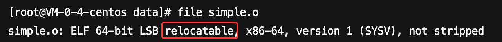

通过它的特征应该就可以知道了,既然不知道具体的内存地址，那就不解析呗，使用0替代。

但是又不能不放着不管(否则真到运行时访问0地址会导致错误),在这里就生成一个“标记”，告诉链接器,这个位置还有不确定的地址,记得修复

> 这一段的核心内容想表达的就是:汇编器在遇到未知的符号(未定义的符号)时,会生成一个“标记”，等到链接的时候再进行修复「这里实际上就&#x662F;**重定位记录**」

* 汇编介绍

汇编器会将汇编文件分为几种不同的Token(词法单元)

* 而伪指令又会再进行细分

* 下面就简要的分析一下汇编器是如何解析上面的simple.s文件的

##### 1.第一遍扫描

* 解析

第一遍扫描的主要目的就是为了知道当前汇编文件都有哪些符号(以及对符号的一些特殊处理)

处理流程如下：

第一遍扫描后的结果如下：

* 各段LC最终值以及段的状态

* 符号表(一共13个符号)

* 重定位类型分析

1. 为什么需要重定位呢？哪些操作需要重定位呢？

在之前,我一直认为只有调用别的c文件中的函数时才需要重定位(比如printf)，但是在上面的simole.s中一共有5处是需要重定位的。

那么重定位主要解决什么问题呢？

1. 汇编器在汇编时并不知道符号的最终内存地址

2. 同一个文件内的段间引用：代码段(.text)需要引用数据段(.data/.rodata/.bss)中的符号

   1. **movl $.LC0, %edi  -- .rodata段中的字符串 -- 字符串地址在编译时未知**

   2. **call printf -- 外部函数printf -- 外部符号地址在链接时才能确定**

   3. **movl static\_var.1(%rip), %edx -- .data段中的静态变量 -- RIP相对寻址需要知道段间距离**

   4. **movl static\_var2.0(%rip), %eax -- .bss段中的静态变量 -- RIP相对寻址需要知道段间距离**

   5. **call func1 -- 本地函数func1 -- 函数相对位置可能因链接器优化改变**

3. 外部依赖：当前模块需要调用外部模块中的函数(printf)

可以看到在simple.s中出现的重定位类型一共分为三种：

* 计算公式说明

###### 总结

总结一下：第一遍扫描的目的：符号表构建与地址分配(也即：汇编器如何确定每个符号的位置)

> .text/.data/.rodata/.bss/符号表的构建/可重定位条目的构建

##### 2.第二遍扫描

* .text段 (87字节)

这一步就是将汇编代码翻译为机器码(二进制)，关于机器码的翻译在这里不再详细的介绍

结果：.text段( **func1 + main「汇编」**) --> .text( **func1 + main「机器码」**)

当然最关键的一步就是还生成了一个重定位表，因为需要告诉链接器,有哪些地址是需要被重定位的「也就是.rela.text表」

* .rela.text表

5条记录 \* 24B = 120B(0x78)

* .data段（8字节）

* .rodata段(4字节)

* .bss段

* 字符串表的构建

* .strtab（符号字符串表）—— 89 字节

* .shstrtab（节名字符串表）—— 116 字节

* ELF HEADER的生成

* section header的生成

* simple.o文件的完整布局

#### 3.1.2 链接

核心问题：

在上面介绍过,汇编器的输出是生成一个目标文件(.o格式的),但是这通常是不可执行的,其还需要与其他的目标文件一起作为链接器的输入，最终才会变成一个可以被操作系统加载的可执行文件，那么这里就有一个问题：多个.o文件是如何变成一个可执行文件的呢？

> 多个.o文件中的各个SECTION如何存放呢？
>
> 1. 链接器将输入的多个.o文件(各个SECTION)按序叠加存放 「也即先放hello.o文件的各个section,然后再放world.o文件的各个section」
>
> 2. 链接器将输入的多个.o文件的相似段(SECTION)合并到一起,也就是多个.o文件的section合成一个大的"SECTION"（在链接时这个大SECTION通常被称为**SEGMENT**）

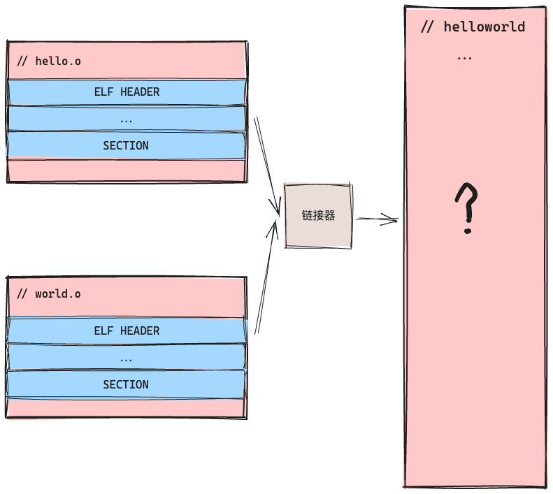

##### 1.静态链接

在静态链接中,链接器的主要职责分为3个步骤：布局，符号解析，重定位

1. **布局：链接器将多个.o文件中相同类型的SECTION合并到一起(比如将多个.o文件中的.text段合成一个.text段,...「其他同理」)，然后一个很关键的步骤就是分配 虚拟地址「!!!」**

> 布局操作：是将构成可执行文件的目标代码里的各个SECTION在内存中安排位置摆放，因此每条指令和每个数据都将有唯一确定的地址(这里还会额外添加程序的启动代码和结束代码所对应的SECTION)

* **符号解析**

* **重定位**

在这里以一个简单的例子来简要的介绍一下静态链接的工作原理

* makefile

* 验证脚本

* 内存布局

可以看到,在链接之前,mian.o和math.o的.text段的VMA(虚拟内存地址)都是0

在链接之后生成的.text的VMA = **0000000000401020**

通过objdump -D -j .text program命令来看一下通过静态链接之后生成的可执行文件的.text段的反汇编

main()被放到了虚拟地址为0000000000401106的位置，add()则在main()后面,虚拟地址为0000000000401125

**/—可执行文件的内存布局—/**

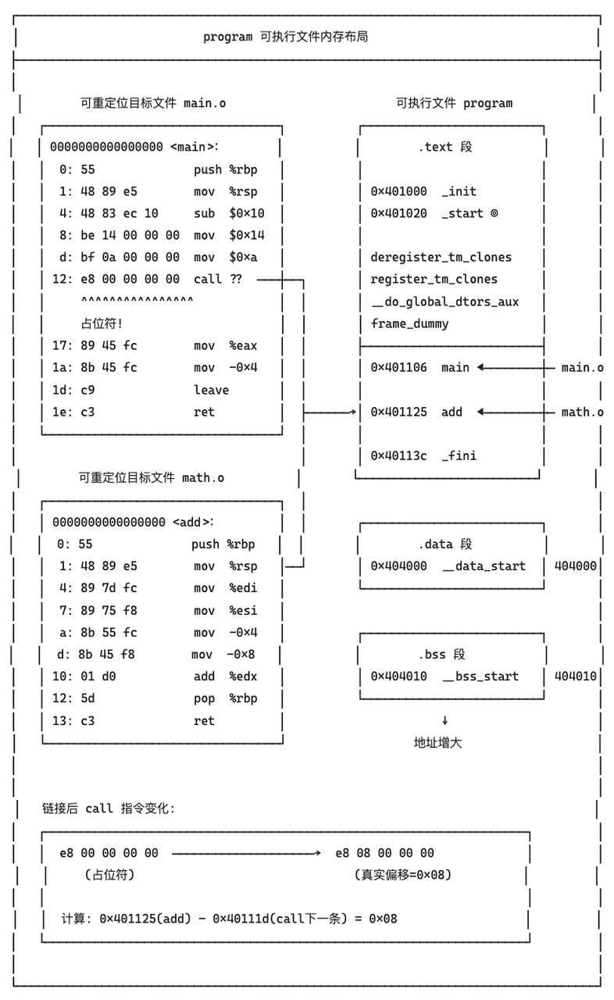

* 符号解析与重定位

经过布局之后,代码和数据都有了确定的地址了(虚拟地址)，这个时候在重定位表中记录的那些未定位的“引用”,在这个时候就可以重新填写地址了

* 符号解析：如果一个函数/数据不在本模块中实现，那么就必须找出在哪个模块中有实现「找到所引用的符号(函数/变量)在哪里定义的，以及所在的节和在节内的偏移，从而知道符号的地址」，这个过程称为对被引用函数/数据的符号解析(并且符号解析的对象是符号表中所有类型为UND的符号,当所有外部引用的符号完成解析后,就可以进入到重定位操作)

* 重定位：上一步已经找到了所有未定位符号的地址了(没有找到则会抛出异常),这一步只需要填写即可（不同的重定位符号地址的计算是不同的，在这里不展开细节）「比如add()是在.text段的偏移xxx处，而.text段的虚拟地址是：0000000000401020，那么add符号的地址就是 0000000000401020 + xxx = 0000000000401125 」

* 总结(静态链接的特点)

从上面的介绍中可以看到 , program这个可执行文件包含了所有需要的代码，不依赖外部库文件,无运行时符号解析开销（所有地址在链接时已经确定）。

缺点：

1. **文件大，包含所有的库文件**

2. **内存占用大(每个进程有独立的副本)：内存和磁盘的空间浪费，以printf()所在的库为例,只要使用到了printf()这个函数(在lib.o中),就需要包含这个lib.o(多个.c文件调用了，那么多个文件都需要包含！)**

3. 更新维护发布麻烦：一旦某个xxx.o更新的时候,那么./program就需要重新链接

##### 2.动态链接

为了解决静态链接的上述缺点,就引入了动态链接：

1. 空间浪费(磁盘和内存)：**代码共享思想**

2. 启动缓慢(加载所有库)：**延迟绑定思想**

/---/

* **位置无关：通过PLT/GOT间接跳转，间接哲学「xxx.so可以被加载到内存的任何位置」**

* 安全隔离：代码段只读共享，GOT可写私有

对于一个.c文件,通常可以使用如下命令将其变为一个动态库(共享库)：gcc **-fPIC -shared&#x20;**&#x20;xxx.c -o xxx.so

-shared则代表生成的是一个动态库(共享对象),然后某个.c文件想要使用该共享库，可以通过 gcc -o xxx xxx.c ./xxx.so(这里是该共享库的地址)

从这里可以看到在链接的时候,动态库和静态链接是存在差别的，但是相同的是，动态库(共享库)同样也参与了链接的过程

> 以main.c 和 math.c为例
>
> 在静态链接中,最终整个程序只有一个可执行文件，它是一个不可分割的整体(这个可执行文件包含了main.c和math.c的全部内容)，但是在动态链接下，一个程序被分为若干个文件 -- 有程序的主要部分(也即可执行文件：main) 和 程序所依赖的动态库(libmath.so)，不管是程序的主体部分还是动态库都可以看作是程序的一个模块

这也是为什么链接的时候也需要动态库参与的原因,因为此时并不知道add()方法的地址,而动态库内部也有符号,在链接的时候需要标记,可执行文件中的add符号是一个定义在libmath.so中的动态符号，这样后续就能进行特殊处理了。

* 查看可执行文件的内存布局

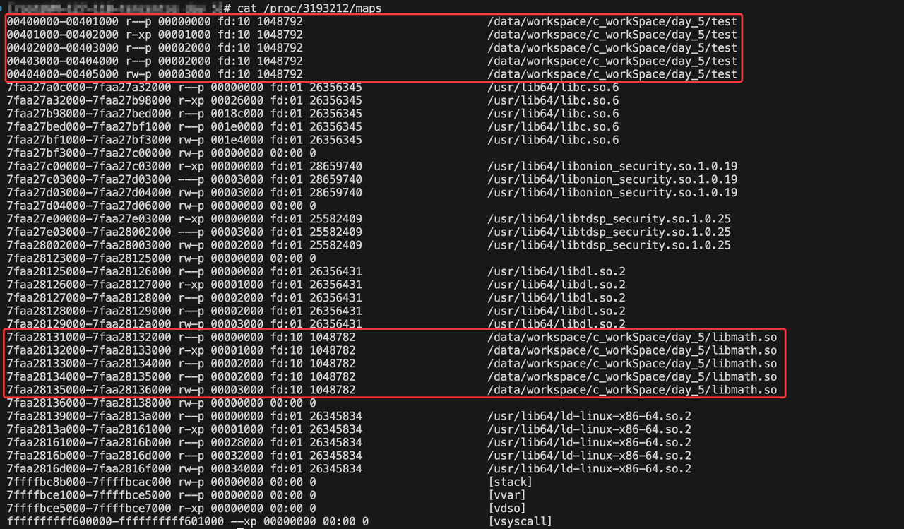

可以看到,运行时,动态库也是在进程的虚拟空间中的,暂停后重启进程，然后再次查看：

可以发现,动态库的虚拟地址发生变化了,这说明了动态库(共享库)的最终装载位置在编译时是不确定的，而是在进程装载时,装载器根据当前地址空间的空闲情况，动态的分配一块大小足够的虚拟地址空间给该动态库

> 注意这里是装载的是虚拟地址，为什么不将共享对象在进程中装载的地址固定呢?&#x20;

* 装载时重定位

如上图,在上面的libmath.c代码中，add()内部可能会调用别的函数,而这个函数在编译(或者在生成动态库)的时候是不知道的，call help(这里help的地址应该是为0的)，

这个时候如果进程1(test.c)调用libmath.so中的add()方法，它首先会加载到某个地址(有地址了,符号的位置就能确定)，然后就会修正test.c中的call add 为 call add\_addr,同样也要修正在libmath.so中的add()中的call helper 为 call helper\_addr

进程2(test.c)同理

这会有什么问题呢？那就是libmath.so的代码段会被修改,上面也说过,libmath.so的加载位置,不同进程加载的位置是不确定的，那么每个进程修正的值也不一样，如果要正常的运行,那么最终就会导致libmath.so在内存中存在多份

> 如果是这样的话，那动态链接不就失去意义了吗？说好的代码共享呢?

但是如果是本来就不共享的呢？因为动态库其实是由.c文件构建的,那么就可能也有全局数据，那么当不同的进程访问某个共享库中定义的数据时,能否共享呢？

答案肯定是不能的，因为进程之间默认是隔离的,这样会使得进程的隔离性大大下降。所以对于动态库中全局变量的访问，可以使用装载时重定位，也即每个进程都会有对应的副本

> 当gcc~~ ~~**~~-fPIC~~ -shared&#x20;**&#x20;math.c -o libmath.so 没有-fPIC时,默认生成的.so就是装载时重定位

* 地址无关

在接受地址无关之前,需要先了解一下动态库(共享对象)内部可能存在的地址引用

* 动态库内部

  * 数据访问：全局变量，静态变量(局部变量)

  * 函数调用，跳转

* 动态库外部(其他.c或者.so中的)

  * 数据访问：全局变量

  * 函数调用，跳转

1. 模块内部函数调用/跳转

这种情况相对来说会简单一些,因为在同一个模块块内(一个.so文件可能会包含.c文件,所以这里可能调用的是同一模块中不同.c文件的函数)，调用函数与被调用函数的相对位置都是固定的，这种情况通常是相对地址调用，是不需要重定位的。

> call(E8)  xxxx() , 后面的xxxx是目的地址相对于下一条指令的偏移(也即bar函数地址 = xxxx + 下一条指令的地址)
>
> 也即这条指令&#x662F;**地址无关**&#x7684;，不管该动态库被哪个进程加载到哪个位置，这条指令都能正常的工作
>
> 「但是有另外一种情况：共享对象全局符号介入」，这种情况会更加的复杂一些，后面再介绍

* 模块内部数据访问

要想实现地址无关，那么在指令中就不能使用数据的绝对地址，那就使用相对地址「指令地址 + 固定偏移量」，在模块内部的数据访问，这也能支持，因为同一模块内，数据段和代码段的之间的偏移也是确定的。

~~但是，**早期**&#x7684;体系结构中,数据的相对寻址往往没有相对于PC的直接寻址方式，也即不支持 mov eax，\[PC+offset]这样的指令，所以就需要先获取PC值,再进行计算。~~

不过现代的体系结构已经支持：mov 0xxx(%rip),%reg, rip(也就是ip寄存器，其存放的就是下一条指令的地址)，该条指令就能轻松的进行相对地址了

> 但是其实即使是模块内的数据访问,也用到了**GOT**的概念,在下面会讲解

* 模块间数据访问

在这里首先需要解释动态库的文件格式(也是ELF格式)，这里先以模块内/间的数据访问为例子

在下面主要关注4种场景：

1. 动态库访问自己的(本.c文件或者同一个动态库中的其他.c文件「在这里以前者为例子」)全局变量（变量定义在动态库）

2. 动态库直接访问主程序的全局变量（变量定义在主程序）

3. 主程序直接访问动态库的全局变量(变量定义在动态库)

* 模块内数据访问

* 反汇编gg.so动态库,看一下access\_lib\_internal()是如何访问lib\_internal\_data变量的

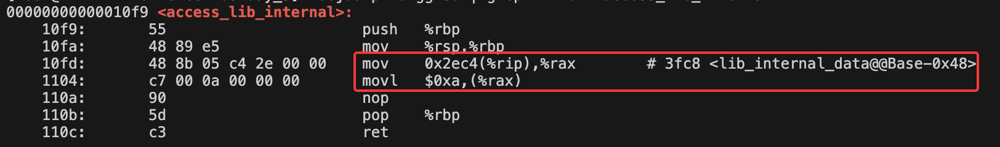

这里的含义是：将 下一条指令的地址(0x1104) + 0x2ec4(这是offset) 的值（**0x3fc8**） 放入到rax寄存器中，然后将0xa(这个就是10)赋值给rax所指向的值(此时rax中存放的应该是lib\_internal\_data变量的地址)。

可以看到，这就是相对寻址，那么 0x3fc8**存放的是什么呢？**

> GOT表是一个数组，每一个元素都是一个GOT表项

可以看到,0x3fc8所指向的GOT表项全部都为0，这是正确的，因为此时gg.so还处于编译阶段，并没有解析链接，所以在这里为0是正确的。

那么当程序运行起来后,这个GOT表项的值会被填写为什么值呢？

这是一个简单的程序，通过access\_lib\_internal()方法来访问动态库中的全局变量，在这里重点关注GOT表项,这里test.c运行起来后会变为一个进程「使用sleep(-1)让程序不会退出」，其使用到了动态库，那么在运行时就会动态的加载gg.so，下面看下该进程的运行时内存：./test & 「这会输出进程号」，然后cat /proc/xxx/maps

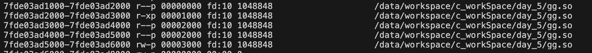

可以看到gg.so被加载的位置是：0x7fde03ad1000

那么lib\_internal\_data变量所对应的GOT表项的地址应该是：0x7fde03ad1000 + 0x3fc8 = 0x7fde03ad4fc8

查看一下,这个地址的值「这个值现在应该已经被填写为lib\_internal\_data变量的真实地址了」

不出意外的话，这个0x00007fde03ad5010地址，应该存放的就是10

* 模块间数据访问

动态库访问主程序的全局变量,其实这种和上面是类似的，因为最终还是主程序通过访问动态库的函数，来进行数据访问，当然这里也会生成一个GOT表项

* 主程序直接访问动态库的全局数据

这里会有个问题，因为主程序并不是地址无关的，那么它访问变量时就是通过绝对地址的，这个时候就需要将动态库的变量拷贝一份到主程序的.data段或者.bss段，然后主程序访问自己的副本

而动态库是地址无关的，它则是通过GOT来访问的

这样一份数据在内存中存在两份，这是不被允许的，所以一种解决办法就是，运行时，将.so中对应的GOT表项填写的地址指向进程的.data/.bss段中变量的地址(而不是.so中的.data段中变量的地址)，这样不管是进程还是.so,访问的都是一个变量

验证一下

可以看到gg.so被加载到main进程的这个位置：起始地址为7f65fe04b000

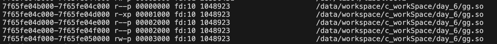

单独看下动态库：readelf -r gg.so | grep lib\_internal\_data

可以看到,位于GOT表的0x3fc8偏移处,按照正常的逻辑「上面演示过的」,程序运行起来后, 该偏移对应的got表项应该要被填写为 lib\_internal\_data变量的地址，而这个地址是在gg.so的data段的「后面会再讲解一下进程的虚拟内存布局的，.so也有自己的代码段，数据段，got表，...」

如果按照上面给的结论,那么这里最终填写的应该是位于main进程.data段中的副本数据。

下面单独看下main进程：readelf -r main | grep COPY

可以看到main进程确实为lib\_internal\_data变量分配了一个副本「在地址0x000000404018处,这是data段」

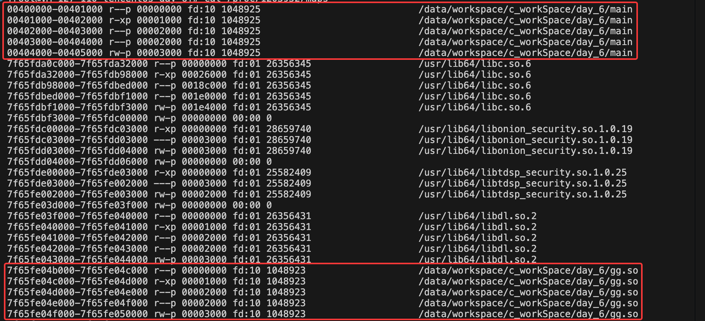

下面再查看一下GOT表项的值：gg.so被加载的位置（0x7f65fe04b000） + 0x3fc8 = 0x7f65fe04efc8「如果该地址存放的值 = 0x000000404018，那么就说明没有问题，下面进行验证」

gdb -p 1203952 -batch -ex "p \&lib\_internal\_data"，这是查看lib\_internal\_data的地址的(希望是0x000000404018)

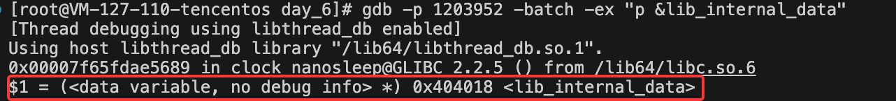

gdb -p 1203952 -batch -ex "x/gx 0x7f65fe04efc8"，这是查看got表项的(希望是0x000000404018)

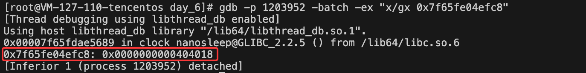

验证成功✅

* GOT表

那么到这里总结一下,针对动态库全局数据的访问，是如何做到(加载)地址无关的呢？

xxx 暂时搁置，先掌握JVM线程和JAVA线程的原理吧（以及相关的系统API吧）

## 系统调用

# 二：Linux线程

后续补充上

# 三：JVM线程

## 1. 线程的创建

这里就看下start()方法的源码,到底是如何启动一个线程的

* start0()

* 核心数据结构体

* 状态转化图

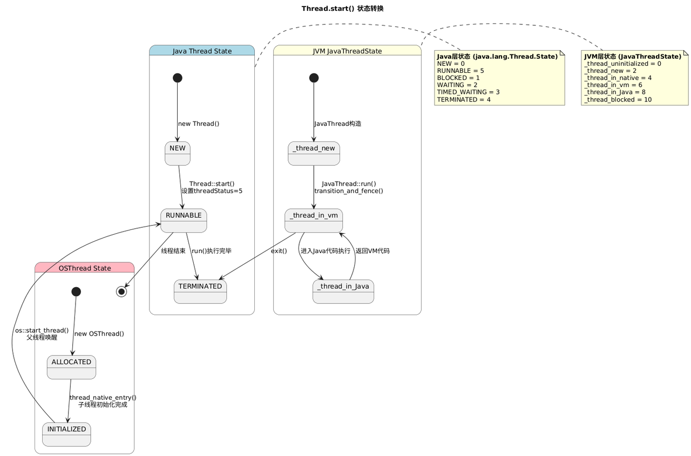

## 2. 线程数据结构

在这里阅读源码的时候会涉及到4个类：java.lang.Thread(这个类是位于java.lang包中的)，java\_lang\_Thread(这个类是位于jvm内部的 - jvmClasses.hpp文件中的)，JavaThread(jvm内部类)，OSThread(jvm内部类)

## 3. 线程的状态

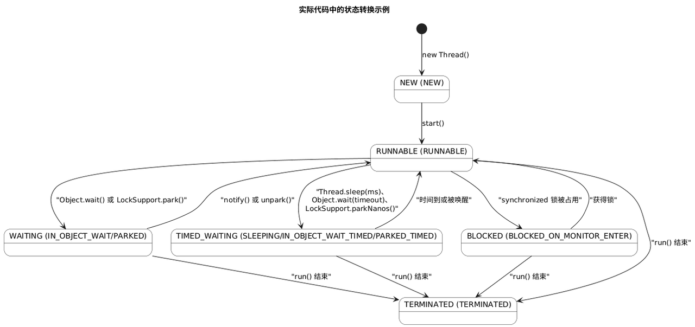

在4.2章节中也说过线程的状态,不过指的是java层面的状态,在这里一共有6种,而在jvm内部,和线程有关的状态枚举还有3种:

* java\_lang\_Thread(jvm工具类)

在这里需要详细的说明一下这个类的作用：java\_lang\_Thread是Java线程在VM中的“代言人”，负责将Java的线程抽象转化为VM能理解和操作的底层结构。

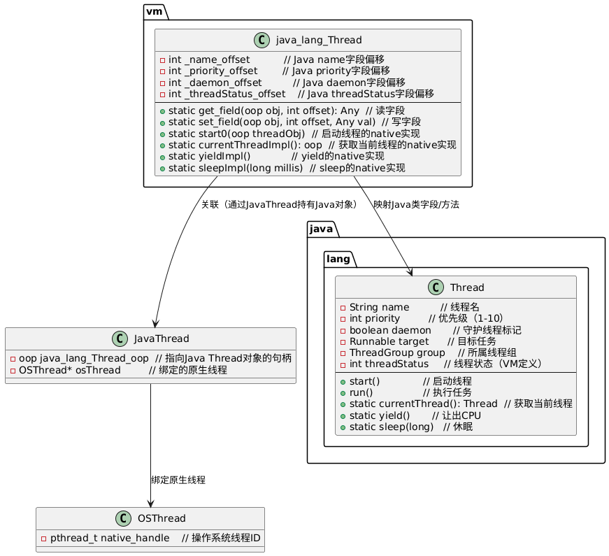

* JavaThread(jvm内部)

* OSThread

# 四：JAVA线程

## 1. 线程的创建方式

从一个简单的问题开始线程的学习：在Java中创建一个线程有几种方式呢？

> 其实应该从什么是线程开始聊的,这个问题看似很简单,其实非常的复杂,这里将会放到Linux线程(章节)去讲解

这个问题其实也是有点坑的,在这里应该从两个方面来回答：

一是从底层的角度来说(线程模型,在Java中,线程模型是一对一的，也就是java中的一个线程对应着Linux中的一个线程,而对于底层来说，创建线程的方式只有一种,那就是通过pthread\_create()库函数来创建，而在Java中,创建线程的方式也只有一种,那就是通过new Thread()创建一个Thread对象，然后调用这个对象的start()方法)

**也即创建线程的方式只有一种,那就是调用thread对象的start()方法来真正的创建一个可以被CPU调度的线程**

> 既然JVM与Linux内核的线程模式是一对一的，那么最终这里的start()方法一定会调用到pthread\_create()「这个在JVM线程中会介绍」
>
> **start() -> pthread\_create()**

二是从上层的角度来说,也就是线程执行的任务的创建方式,在这里有两种方式：一种是继承Thread类,然后重写其中的run()方法，另外一种则是实现Runnable接口,然后实现其中的run方法。

但是通常推荐使用第二种方式来进行任务的实现，为什么呢？

> 1. Java单继承的限制
>
> 2. **设计原则 - 职责分离: 前者将线程本身与任务逻辑混合在一起**
>
> 3. **任务共享：当多个线程需要执行相同的逻辑时，不需要每个线程单独实现,共享Runnable即可**

而针对这个问题通常会见到其他的答案：

* 比如通过线程池,ComputureFuture,Callable等方式,而CF内部使用的就是线程池，而线程池也是通过创建Thread对象,然后调用start()方法来启动一个线程，

* 而Callable就有些不对了，因为在java中，线程只能接受runnable类型的任务,而不支持callable

> 那callable和runnable的区别是什么呢？这里主要有两个区别：
>
> 1. callable支持返回值
>
> 2. callable支持抛出异常
>
> 而callable则通常和FutureTask来搭配使用,而FutureTask又实现了Runnable接口，所以这里兜兜转转还是回到了上面的第二种方式

**所以在这里创建线程执行体的方式也只有两种**

> ***也即在这里需要从两个层面来回答，一个是线程模型（也就是真正的线程创建，只有一种方法），另外一个是线程执行体的创建（本质上也只有一种，但是通常会说成两种），这里可以扩展一下目前市面上答案的误区：线程池，CF，ForkJoinPool,特别是Callable需要特别澄清***

## 2. 线程的状态

> 在这里目前只关注Java层面的线程状态,而在JVM和Linux内核中也有对应的线程状态,这里则放到上面来讲解

在Thread.java类中有一个枚举类,定义java线程的状态

6种状态,其中BLOCKED状态最容易和WAITING状态混淆,在这里再次强调一下：

* BLOCKED：这种状态代表线程正在等待某个monitor锁,触发场景有两种

  * 线程进入synchronized方法或者代码块失败阻塞 -- 线程处于真的阻塞状态

  * 线程调用object.wait()后被object.notify()唤醒，重新竞争monitor锁，此时线程处于运行状态

* WAITING：这种代表线程处于阻塞状态 - 真的阻塞

## 3. 总结

到这里关于线程的基本原理就讲解到这里,但是依旧只是冰山一角,后续会继续补充,后续将主要关注 **线程和进程的内存空间 /  性能优化** / **问题排查**

