# 管程概念

## 管程概念

在之前的文章中,我简要的提到过管程的概念,管程概念的提出主要是为了降低开发者的难度,不需要在手动的利用低级的原语来保证代码的安全性,开发者只需要调用管程保留给我们的接口即可,而不需要关系内部具体的实现了。

在这里一个管程应该包含哪些部分呢？

1. 共享资源：条件判断

2. 操作函数：暴露给开发者调用的外部接口

3. 条件变量：

> 为什么需要条件变量？因为单纯的互斥是不够的，在某些情况下,某个线程进入到管程后发现继续往下执行的某些条件不满足,那么这个时候应该怎么办呢？如果不释放锁,那么很有可能造&#x6210;**死锁**
>
> 1. 以生产者消费者举例：生产线程获取了容器的访问权限(其他生产线程或者消费线程无法访问容器),当生产线程想要put元素的时候发现容器满了,这个时候如果不释放锁,那么消费者线程无法进行消费「也即生产者等待消费者获取锁并且take元素，而消费者在等待生产者释放锁」,这样就造成了死锁
>
> 既然这样，那当条件不满足的时候将锁释放了不就可以了吗?
>
> * 直接释放锁可以避免上面的问题，但是这又可能会造成另外一个问题：**活锁**(性能下降)
>
> 活锁：锁的竞争者很长一段时间内都无法获取锁进入到临界区
>
> 线程进入管程是不公平的,并不是FIFO,在上面的场景中,释放锁的生产者线程很可能会再次获取锁,这根本没有意义，因为它所等待的条件并没有被满足，它只能再次释放锁

所以基于上面两点：就引入了条件变量的概念 - 当获取锁的线程发现继续往下执行的条件不满足时,就释放锁并且阻塞在该条件变量上。

上面就是管程的一些基本概念,而基于管程又存在多种模型(目前最主流的就是MESA模型)&#x20;

## MESA模型

当线程挂起时,通常会进入到队列中等待,在管程的实现中,通常包含两种队列 - 入口队列和等待队列，入口队列中存储的是那些获取锁失败的线程，而等待队列中存储的则是获取锁成功后由于条件不满足而阻塞的线程(当然这里需要先释放锁)

这里就有一个问题：当生产者线程在等待队列中等待时,此时消费者消费了元素,也即满足了条件,这个时候需要去唤醒生产者线程吗？

基于这点就产生了不同的管程模型,这里会简单的介绍MESA模型,该模型也是目前主流的管程实现模型。

该模型的做法为：当条件被其他持有锁线程满足时,并不会直接去唤醒等待队列中的线程，而是选择将其从等待队列中移动到入口队列，然后与其他线程重新竞争。（从这里可以看出，AQS就是典型的MESA模型的具体实现）

这里在wiki中有做介绍(下面这张图是隐式条件变量管程的工作图),而synchronized就是这种实现(synchronized并不像AQS一样，可以显式的声明条件变量)

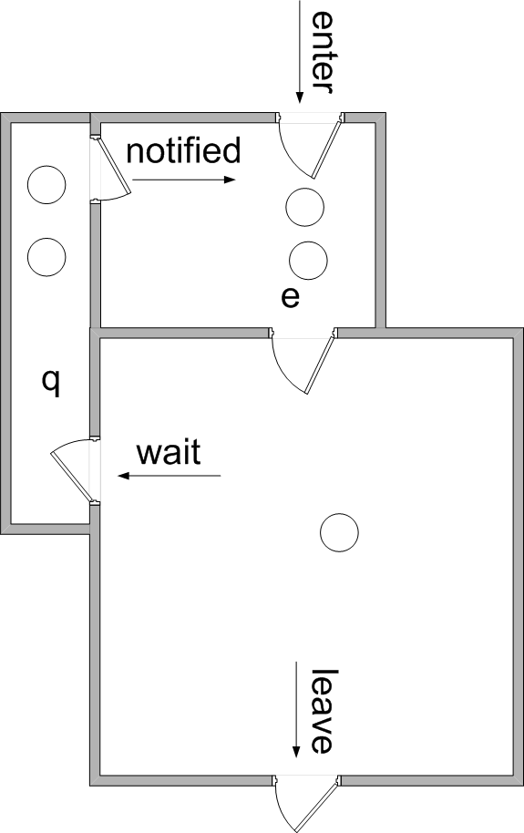

# synchronized

### 前言

前面说了管程有几个非常重要的部分：共享资源(具体来说是作为能否进入管程的条件)，方法，以及等待队列

先来看下ReentrantLock的是否包含这三部分：

1. 共享资源：state(AQS中的state)
   当state=0的时候代表锁还在,多个线程会竞争的设置这个值为1，只有设置成功的才会进入到管程中，而失败的则会进入到入口队列中「对应着AQS中的Node head,Node tail」

2. 方法：lock.lock()/unlock()/...

3. 等待队列：ConditionObject「Node firstWaiter,Node lastWaiter」

那么在研究synchronized的时候同样需要搞明白下面这些问题：方法就不用了,因为synchronized是内置锁,没有暴露的方法,暴露的是synchronized本身

1. 多个线程竞争的共享资源到底是什么?

2. 入口队列在哪里？

3. 等待队列在哪里?&#x20;

4. synchronized是不是MESA模型的一种实现呢?

### 使用

synchronized关键字有两种用法：方法 和 代码块

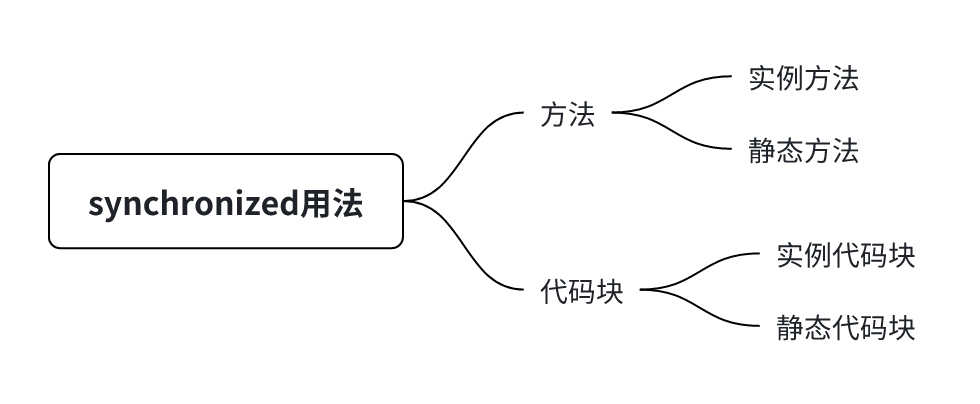

* 简单示例

可以看到,ReentrantLock是使用lock()和unlock()来进行加锁和释放锁的,但是从synchronized的使用来看,根本看不出来synchronized做了什么。

需要将java代码转化为字节码后再来看：

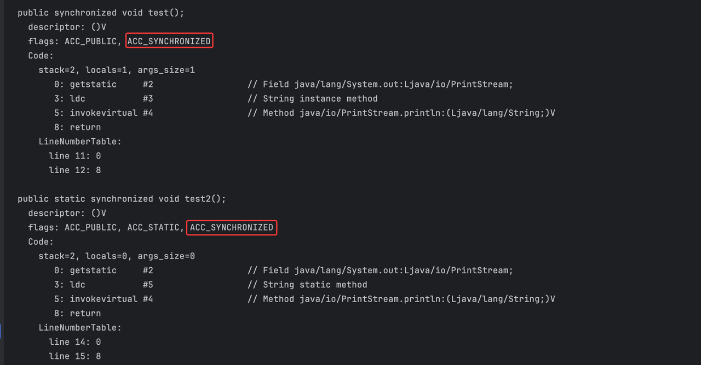

可以看到对于方法来说,是在方法的flags上打上了ACC\_SYNCHRONIZED标识,如果想要知道该标识是如何起作用的,则还需要进一步的探究当jvm执行方法的时候是如何处理这个标签的(关于jvm执行方法的原理,后续会单独出文章来讲解)

在这里直接简要地看一下jvm的源码

> 这里看的是解释器的代码,并且可以看到在真正执行方法内部的逻辑之前,确实会对ACC\_SYNCHRONIZED进行处理,并且这里还可以得到一个很重要的消息,那就是当方法是静态方法时,获取的对象是java\_mirror对象,而方法是实例方法时,获取的则是实例对象(this/调用该方法的对象)

继续再看下当synchronized作用在代码块时的字节码

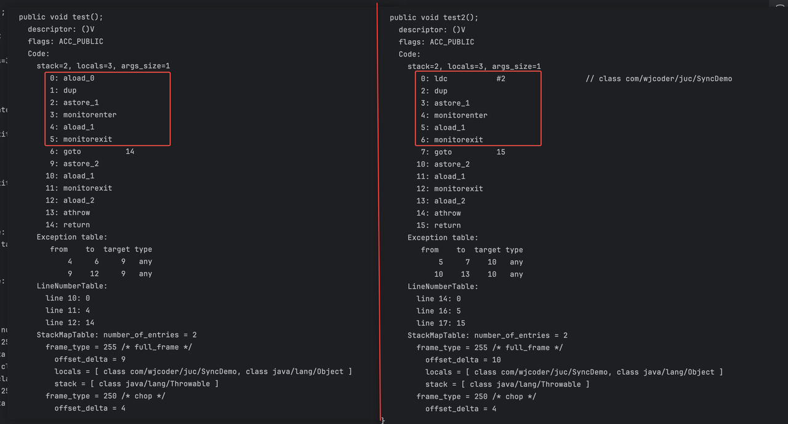

下面就介绍一下这几个字节码

从字节码的简单介绍来看下上面两个代码块都干了什么

经过上面的分析可以知道，synchronized起作用其实是依赖monitorenter和monitorexit这两条字节码指令的,

和ReentrantLock一样,它是依赖lock.lock()和lock.unlock()这两个方法来工作的,在之前的文章中讲解过lock()是如何保证同一时刻只有一个线程获取锁成功的「基本原理就是CAS设置state的值,CAS能够保证同一时刻有且只有一个线程能够设置成功」，那么在这里想要知道synchronized是如何保证线程安全的，那么答案应该就在monitorenter字节码中了。

除此之外还有另外一个现象,那就是monitorenter依赖一个对象(这个对象可能是实例对象「this」，或者是类对象)。

这里猜测一下,我们在上面讨论的管程中的共享资源在这里是否就是这个对象,但是在reetrantLock的实现中,cas的是一个state

> CAS(硬件提供的原子操作技术支持),其特点就是只能操作一个变量(或者说是一个内存地址),
>
> 那么在synchronized中,操作的是对象的什么属性呢？是整个对象都替换掉吗？还是对象中有专门的属性来代表对象锁呢？在jvm中对象到底是以什么样的形式存在呢？

### jvm相关

\-- 简单介绍一下

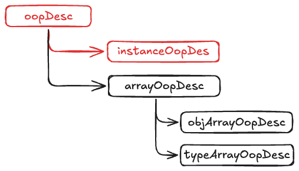

> 在面向对象的编程语言中,为什么要有继承呢？主要是为了复用,父类通常具有的是其子类都需要的功能,所以首先看一下顶级父类里面都有什么

从上面可以看出,对象头的组成部分是由oopdesc中的markword + metadata构成的,而metadata的内容已经很明显了,就是指向klass(这个对象所属的类在jvm中的实体,在这里暂时不讨论)。下面就看下markword中都有什么

在上面举例了jdk21和jdk11,可以看到,不同版本的openjdk,markword的位起到的作用已经发生了变化，但是我觉得最重要的就是掌握核心：

1. 多个线程cas的共享资源到底是什么？

2. 条件变量在哪里？

3. 入口队列,等待队列在哪里？

4. 获取锁和释放锁都干了什么？

5. 线程是怎么阻塞/唤醒的？

在进入到monitorenter之前,首先看一下一个初始对象的对象头是什么样的

下面再来看一下monitorenter字节码

* monitorenter

这里引入了一个新的类 - BasicObjectLock,看下这个类的作用是什么

继续看下解释器栈帧的结构，可以看到在线程栈帧中存在一块monitor区域,这里就存放着一些预先创建好的monitor对象(BasicObjectLock对象)

此时的结构如下：

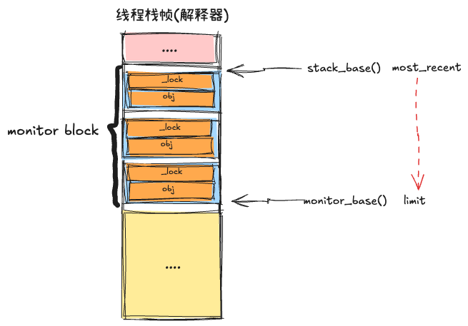

继续看代码

此时的结构为:

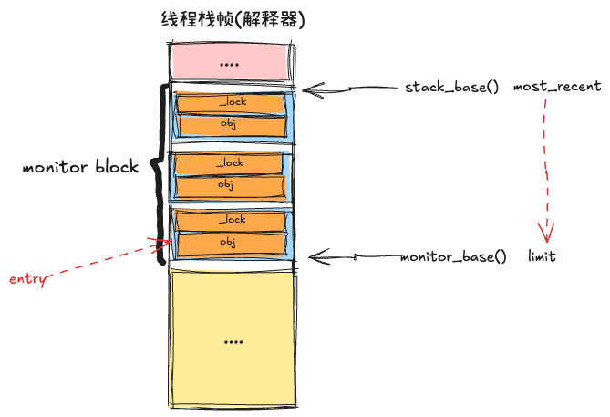

此时的结构为:

此时的结构为：

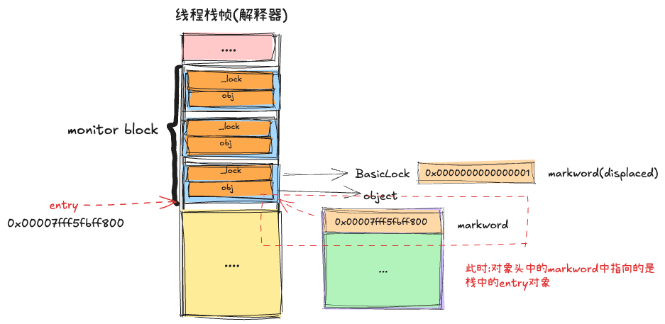

到这里就结束了，线程加锁就成功了

验证一下：

可以看到,轻量级锁的开销很小,并没有什么很重的操作,而通常的锁基本上都是支持锁重入的(除了StampedLock),那么下面再来看下轻量级锁是如何处理重入的?

继续再看monitonenter

此时的结构变为：

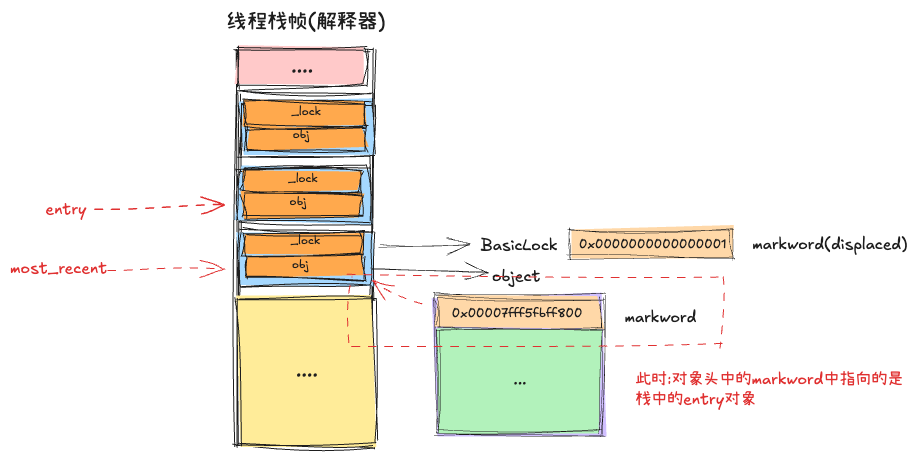

继续看代码：

这里是如何判断锁重入的呢?这里涉及到进程和线程的概念,在linux中,线程是共享地址空间的,也即每个线程的线程栈是处于不同的虚拟地址空间的(线程有私有的数据和共享的数据)

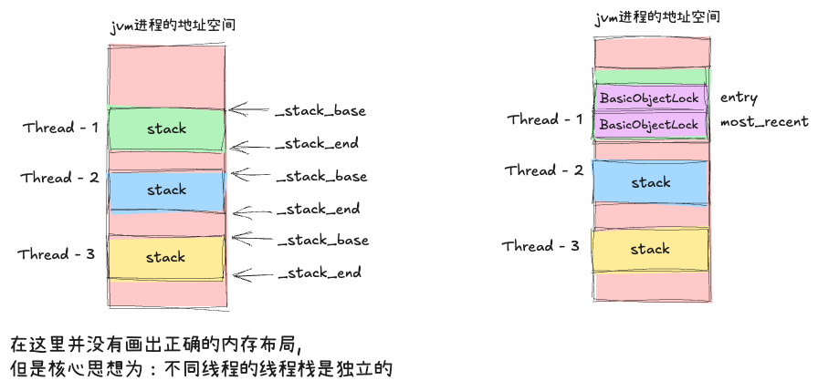

此时的结构为: 在线程栈上有两个BasicObjectLock了

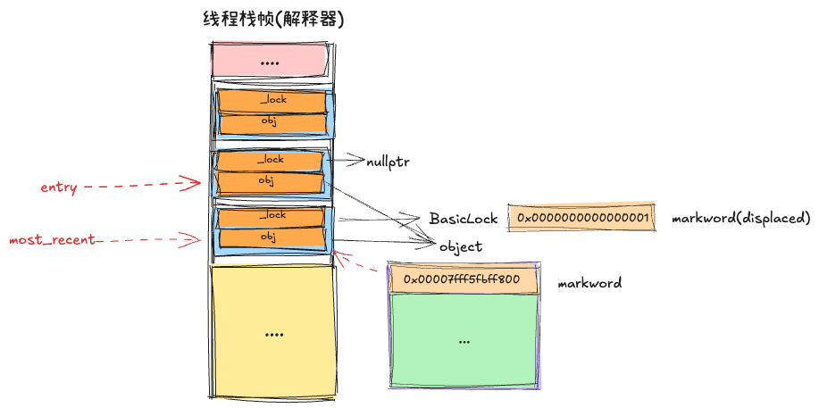

下面来验证

偏向锁,轻量级锁（或者是jdk21中的新轻量级锁）都不是synchronized的核心，都只是jvm的优化手段,下面就看下当另外一个线程来获取的时候(产生了竞争),会是什么样的。

下面的这段代码,执行多次会有不同的执行结果

在看重量级锁相关的代码之前,看下轻量级锁释放的代码

此时的结构为:该场景为轻量级锁重入

monitorexit

此时线程栈的结构变为:

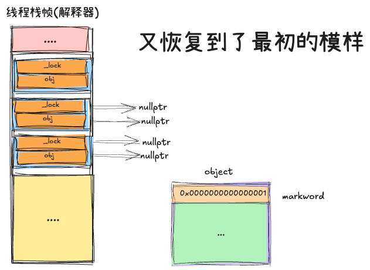

下面再来看下锁竞争的逻辑：此时的结构背景为：

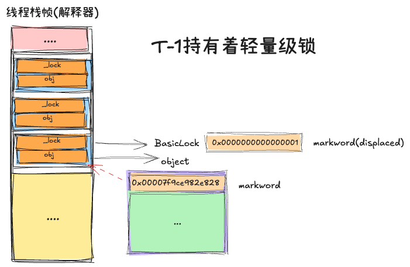

再次进入到monitorenter中

当判断出当前锁对象已经被其他线程持有轻量级锁时,就会进入到InterpreterRuntime::monitorenter()方法中

对象句柄:

在这里先总结一部分的代码：可以看出轻量级锁在线程交替执行时，能够起到很好的优化效果,因为此时并没有重量级操作(没有看到什么系统调用的发生)

此时的结构为：

但是如果T-1并没有释放轻量级锁,或者正在释放,但是还没有完全释放,那么此时的结果为:

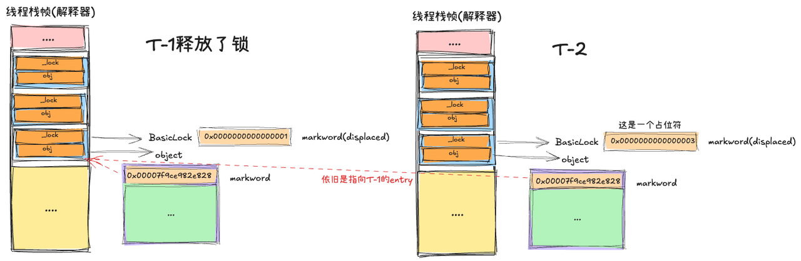

下面进入到膨胀的流程:

* inflate()

此时的结构为：

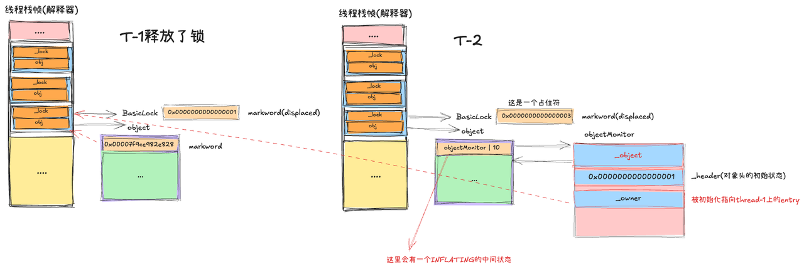

在进入到锁膨胀的逻辑之前,再回过头来看下轻量级锁的释放流程

此时的状态为上图

可以看到,轻量级锁在释放锁的过程中,会将objectMonitor的\_owner从BasicLock(BasicObjectLock)设置为thread（持有轻量级锁的线程），然后再设置为nullptr(前提是thread-1没有锁重入)。这就代表了锁已经释放了

下面再来看下锁膨胀的逻辑：

* 阻塞操作：EnterI()

到目前为止,已经知道了两个比较关键的点：

1. 共享资源是对象(更具体点是对象头中的markword)

2. 入口队列是objectMonitor中的\_cxq队列(这是一个单链表)

此时的结构应该为：

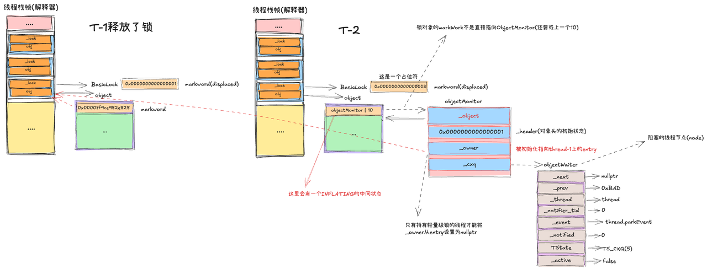

下面尝试验证一下：

并且此时thread-2的状态为**BLOCKED**

下面就看下当thread-1释放轻量级锁的时候,是如何唤醒thread-2的

可以看到上面的逻辑主要为：

1. 如果objectMonitor上存在\_entryList链表,那么进入到唤醒逻辑(不会将\_cxq中的等待节点移动到\_entryList)

2. 否则,\_entryList为nullptr，那么一次性将\_cxq中的等待节点迁移到\_entryList中

下面在来看下线程是如何被唤醒的

现在来简单总结一下工作原理：

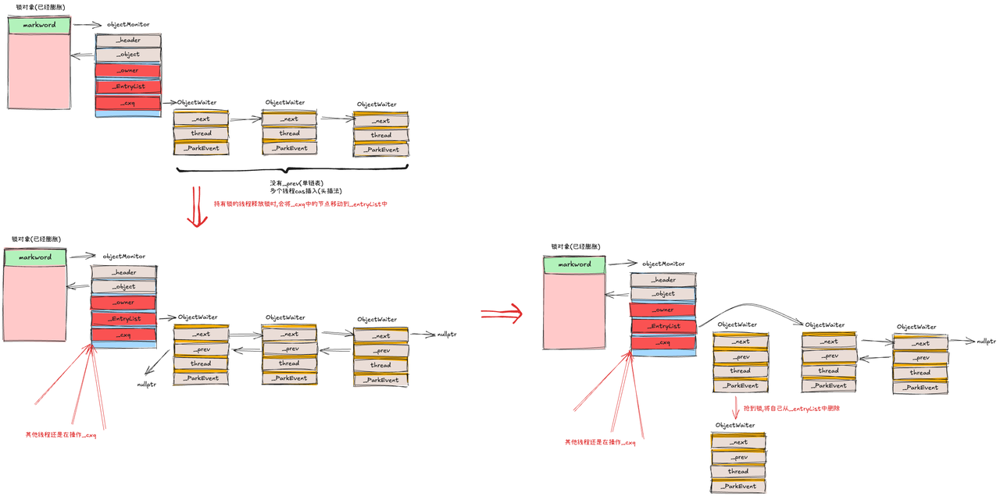

上面标红的是非常重要的,其中\_owner的作用很重要，因为它是重量级锁的共享资源(说对象头有点太宽泛了)

1. 当处于轻量级锁时,每个线程的共享资源是对象头（markWord），线程再想要加锁的时候,会判断对象头是否处于无锁状态，如果是，自己cas设置对象头指向自己线程栈中的BasicObjectLock即可

2. 如果cas失败，那么再判断是否是重入的，怎么判断的？这里涉及到进程和线程的内存布局,线程是共享进程的内存空间的，所以不同的线程所属的线程栈的虚拟地址是不重复的，所以这里可以通过BasicObjectLock的地址来判断是否是重入

* 重量级锁的共享资源：对象头 -> objectMonitor.\_owner

否则一旦确定存在竞争，则立即进入到膨胀过程，轻量级锁不存在自旋操作，但是在锁膨胀的过程中则存在着大量的自旋

而对于重量级锁来说，共享资源是什么呢？具体点，ObjectMonitor(每个重量级锁对象有一个)中的\_owner字段，最开始的时候指向持有轻量级锁的线程栈上的BasicObjectLock，其他线程在膨胀的时候会不断的尝试将该值从entry设置为current（但是只要轻量级锁线程没有释放锁，那么就不会为nullptr）

入口队列很明显就是\_cxq了，但是这里为什么需要\_entryList呢?

回顾ReentrantLockd,它是只用了一个队列的,那么这会出现一个什么样的问题呢？

A线程持有锁，其他线程需要插入到队列(入口队列)中进行等待，大量的cas双向链表的操作,由于cas的特点是只能保证单变量的原子性，但是双向链表有next和prev两个变量啊，如何保证正确性呢?「在真实实现中,是每个线程都将自己的prev链接到tail节点，然后cas设置tail.next = 自己的节点，只有设置成功的才算插入成功」，而唤醒的线程同样也要操作链表，

换句话说：插入和删除都在一个双向链表中，并且充斥着大量的cas(cas是有性能损耗的)

而synchronized采用获取锁失败时,所有的线程都cas的插入的单链表\_cxq中,单链表的cas比双向链表的cas简单多了。

然后持有锁的线程再释放的时候,会将\_cxq中的节点移动到\_entryList,

然后唤醒第一个等待节点，然后等待节点将自己从\_entryList中移除，只有持有锁的线程才会去操作\_entryList

没有并发竞争问题。从而大大的提高了性能。

> 当然synchronized内部还有很多优化实现....暂时没能力去了解了

验证一下\_cxq和\_entryList的存在

验证成功

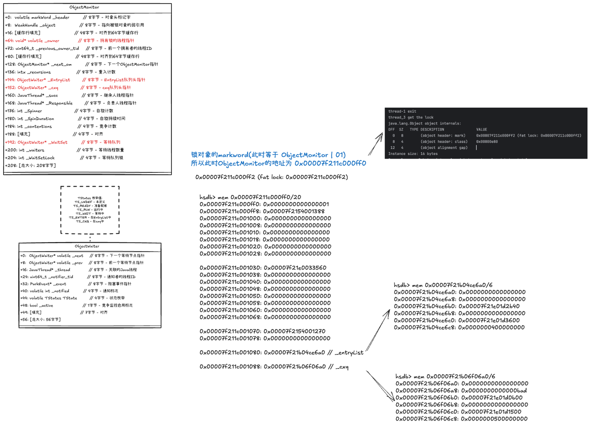

