这篇文章浅析一下locks文件夹下面的三把锁：ReentrantLock,ReentrantReadWriteLock,StampedLock

首先再次回顾管程的概念,管程是封装了更加低级的原语(通常是原子指令),并且暴露出接口给程序员使用,而上面的这3把锁就是对管程的一种实现，比如下面这段代码，通常我们是直接使用其所暴露出来的接口,并不需要关心它到底是如何保障临界区安全

```plain&#x20;text
ReentrantLock lock = new ReentrantLock();
lock.lock();
try{
 TODO
}catch{
 TODO
}finally{
lock.unlock();
}
```

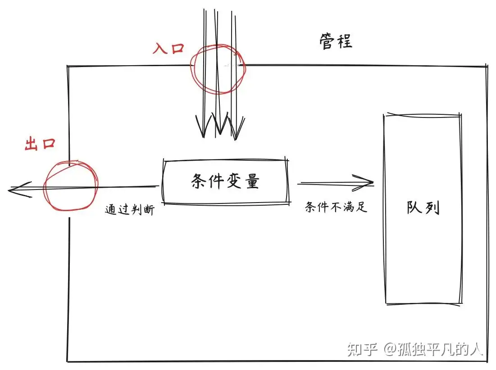

管程模型图

## ReentrantLock

可重入锁

官方文档的介绍：

A reentrant mutual exclusion[Lock](https://docs.oracle.com/javase/8/docs/api/java/util/concurrent/locks/Lock.html)with the same basic behavior and semantics as the implicit monitor lock accessed usingsynchronizedmethods and statements, but with extended capabilities.

一种可重入的互斥锁Lock，其基本行为和语义与通过synchronized方法和语句访问的隐式监视器锁相同，但具有**扩展**功能。

The constructor for this class accepts an optional*fairness*parameter. When settrue, under contention, locks favor granting access to the longest-waiting thread. Otherwise this lock does not guarantee any particular access order. Programs using fair locks accessed by many threads may display lower overall throughput (i.e., are slower; often much slower) than those using the default setting, but have smaller variances in times to obtain locks and guarantee lack of starvation. Note however, that fairness of locks does not guarantee fairness of thread scheduling. Thus, one of many threads using a fair lock may obtain it multiple times in succession while other active threads are not progressing and not currently holding the lock. Also note that the untimed[tryLock()](https://docs.oracle.com/javase/8/docs/api/java/util/concurrent/locks/ReentrantLock.html#tryLock--)method does not honor the fairness setting. It will succeed if the lock is available even if other threads are waiting.

该类的构造函数接受一个可选的公平性参数。当设置为`true`时，在争用情况下，锁会优先授予等待时间最长的线程。否则此锁不保证任何特定的访问顺序。与使用默认设置相比，由多个线程访问的公平锁程序可能表现出较低的整体吞吐量（即速度较慢；通常慢得多），但在获取锁的时间上具有较小的差异，并能保证不会发生线程饥饿。但需要注意的是，锁的公平性并不保证线程调度的公平性。因此，在使用公平锁的多个线程中，某个线程可能会连续多次获取锁，而其他活跃线程此时并未持有锁且没有进展。还需注意，不带超时的`tryLock()`方法不遵循公平性设置。只要锁可用，即使其他线程正在等待，它也会成功获取。

重点： 1.可重入 2.支持公平和非公平：公平锁的整体吞吐量相比于非公平而言相对较低,但是优点就是不存在线程饥饿「非公平锁则相反」,并且通过构造方法来选择公平与非公平「默认就是非公平」

### 类关系图

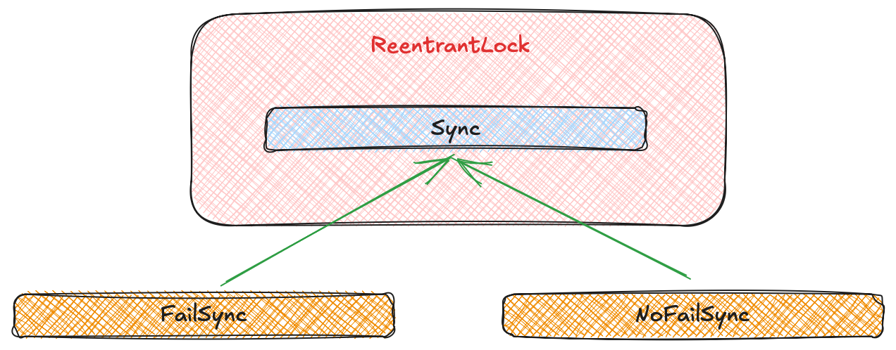

类关系图

### 源码解析

***构造函数***

```plain&#x20;text
/*
     默认采用的是非公平实现,通过构造函数可以选择不同的锁实现
*/
public ReentrantLock() {
   sync = new NonfairSync();
}

public ReentrantLock(boolean fair) {
   sync = fair ? new FairSync() : new NonfairSync();
}
```

***lock()***

当调用ReentrantLock的lock方法时,会继续委托给其内部的sync「failSync对象或者NonFailSync对象的lock方法」

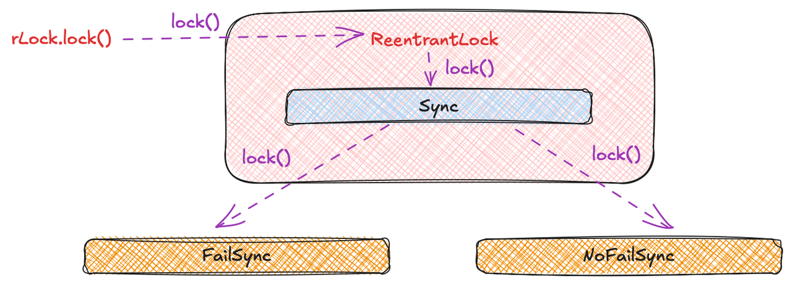

lock()委托

```plain&#x20;text
// ReentrantLock.lock()
public void lock() {
      sync.lock();
  }
// Sync.lock()
 abstract void lock();
```

下面再看下failSync和NonFailSync的lock()方法

两者的第一个实现在于：上锁的时候非公平锁会直接尝试去获取锁资源,但是这里还不够明显区分两者,继续看tryAcquire()方法「acquire()会调用到AQS中,但是能否获取到锁是由子类决定的，所以最终会调用子类的tryAcquire()方法中，如果获取锁失败，则会进入到AQS的入队流程」

```plain&#x20;text
// FailSync.lock()
final void lock() {
   acquire(1);
}

// NonFailSync.lock()
final void lock() {
    if (compareAndSetState(0, 1))
        setExclusiveOwnerThread(Thread.currentThread());
    else
        acquire(1);
}
```

下面看对应的tryAcquire()方法

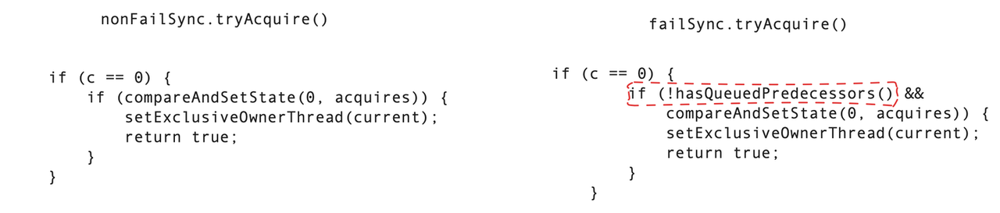

tryAcquire()实现对比

两者实现对比可以发现： 公平锁在获取锁时，如果判断当前锁资源存在,那么首先会调用hasQueuedPredecessors()方法来判断当前同步队列中是否存在线程等待节点,如果队列中没有线程节点「也即方法返回false」,那么才会去竞争锁资源，否则「方法返回true」，则不会去竞争锁资源。 而非公平锁则是直接去CAS竞争锁资源。

所以在这里公平与非公平的区别在与：公平锁在获取锁资源时,会判断当前同步队列中是否已经有线程节点在等待了，如果有则不会去竞争锁资源，而非公平则不管在他之前是否有线程在等待了,而是直接去竞争

hasQueuedPredecessors()：判断当前同步队列中是否存在线程节点

```plain&#x20;text
public final boolean hasQueuedPredecessors() {
    Node t = tail; 
    Node h = head;
    Node s;
    return h != t &&
        ((s = h.next) == null || s.thread != Thread.currentThread());
}
```

tryAcquire()

```plain&#x20;text
// nonFailSync.tryAcquire()
final boolean nonfairTryAcquire(int acquires) {
    final Thread current = Thread.currentThread();
    int c = getState();
    if (c == 0) {
        if (compareAndSetState(0, acquires)) {
            setExclusiveOwnerThread(current);
            return true;
        }
    }
    else if (current == getExclusiveOwnerThread()) {
        int nextc = c + acquires;
        if (nextc < 0) // overflow
            throw new Error("Maximum lock count exceeded");
        setState(nextc);
        return true;
    }
    return false;
}

// failSync.tryAcquire()
protected final boolean tryAcquire(int acquires) {
    final Thread current = Thread.currentThread();
    int c = getState();
    if (c == 0) {
        if (!hasQueuedPredecessors() &&
            compareAndSetState(0, acquires)) {
            setExclusiveOwnerThread(current);
            return true;
        }
    }
    else if (current == getExclusiveOwnerThread()) {
        int nextc = c + acquires;
        if (nextc < 0)
            throw new Error("Maximum lock count exceeded");
        setState(nextc);
        return true;
    }
    return false;
}
}
```

### 公平与非公平

关于锁是否公平,在synchronized中也会遇到，如果要讨论是否公平,那么首先确定,我们所说的公平到底是什么意思？

在这里的公平应该指的是所有线程获取到锁资源的成功概率都是一样的，而关于公平性谈论的前提是：涉及到共享资源的访问时才有谈论公平的必要，如果某个东西只属于一个人,那还谈什么公平「～～」

所以在锁的获取过程中,有哪些地方会涉及到竞争呢？ 1.入同步队列的时候(**入队阶段**) 2.获取资源的时候(state) 而资源获取又可以分为两种情况：唤醒时获取，进入时获取 1.唤醒阶段：线程从阻塞中唤醒后,不一定能够获取到锁，需要继续竞争 2.***进入阶段：在调用lock()的时候 -- 这种情况也是我们平常所讨论的地方***

那么这三个阶段的公平性如何呢？ 1.入队阶段：各个线程通过CAS插入到队列中,***不具备公平性***,因为CAS依赖底层实现(os和硬件),后cas的线程可能比先cas的线程更早的成功入队 2.唤醒阶段：***具有公平性***,因为同步队列采用的是FIFO队列，也即首先唤醒的永远是头节点(被中断唤醒不考虑在内),非首节点是不会去尝试获取锁的(state) 上面两个阶段,不管是公平还是非公平实现,都是一样的 3.进入阶段：这个阶段就是我们通常所讨论的地方. a.对于公平锁而言,每个线程在进入的时候都会判断是有有线程节点在同步队列中,如果有,那么就会进入到队列中等待「并不会直接阻塞,而是进入到AQS的入队流程」 b.对于非公平锁而言,每个线程在进入的时候不会关系同步队列中是否有节点在等待,而是直接通过cas来竞争锁资源

**还有另外一个问题：为什么说非公平锁通常情况下会被公平锁的吞吐量要更高呢？**

吞吐量：指的是系统在单位时间内成功处理的工作量(系统在一定时间内能完成多少任务)

这里需要从整体上来看,假设所有线程所要执行的任务都是正常的(不存在那种死循环或者耗时很久的任务)。

那么在这里存在两个开销：

1. 线程上下文的切换：公平锁的实现相比于非公平来说会把一大部分时间消耗在线程上下文切换上（也即阻塞和唤醒上），如果是公平锁实现，那么一个线程在想要获取锁的时候，发现在队列中已经有线程节点在等待了，那么它不会去竞争锁资源,而会去队列中等待「正常情况下最终会**阻塞**」,而队列中的首节点则会被**唤醒，**&#x8FD9;段时间内锁资源是处于空闲状态的「也许线程上下文切换的时间会远远大于线程执行任务的时间」&#x20;

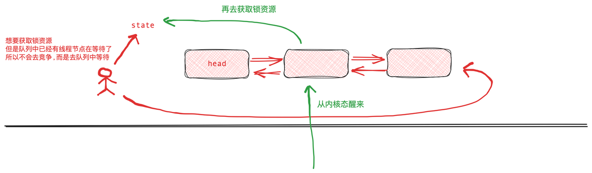

线程上下文切换

2.Cache 位于同步队列中阻塞的线程，在它们阻塞的过程中，CPU中所缓存的代码和数据，可能早就因为Cache满了而被替换出去了,此时重新加载Cache又需要一定的时间

所以非公平锁相对于公平锁的吞吐量会高一些，但是非公平锁的最大缺点就在于可能会造成锁饥饿「但是这个问题在jdk高版本已经缓解了」

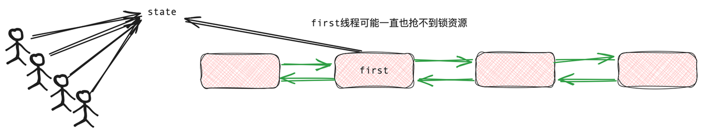

锁饥饿

到这里：ReentrantLock就介绍到这里,总结一下：

1.ReentrantLock是一把可重入的互斥锁，通过构造器传参来影响公平与非公平 2.非公平锁的吞吐量在总体上会比公平锁要高 - 为什么？ 3.非公平锁的缺点在于可能会造成线程饥饿,但是在jdk高版本缓解了这个问题「线程随着唤醒的次数增多，自旋抢锁的次数也会增多」

## ReentrantLockReadWriteLock

可重入的读写锁

为什么需要读写锁？

虽然互斥锁能够保证线程安全,但是这里要注意的是：多线程访问一定会造成线程不安全吗？答案是否定的,这里有两点：

1. 共享资源：只有多线程需要访问共享资源时才可能出现竞争，比如不同进程下的不同线程正常情况下是不会访问到共享资源的，自然也不存在线程安全问题

2. 操作类型：即使访问了共享资源，也不一定会存在线程安全问题，只有某个线程要修改资源,才会存在问题，如果所有的线程都只是读取资源,那么也是不存在线程安全问题的

如果在读多写少的场景下,本来多线程是可以并发读取的,但是由于少量的写操作，导致所有的读操作变为串行执行，系统无法被充分利用「性能差」

读写锁：将读和写两种操作区分开来,读读不互斥，写写和读写互斥

读锁：「共享锁」，当一个线程获取读锁后，后续请求读取操作的线程可以继续获取锁来执行读操作「这里不是很严谨,后续会说明」 写锁：「独占锁」，当一个线程获取写锁后，后续请求读操作和写操作的线程都会被拒绝(除了它本身外)

其中这里有一点非常重要：那就是可重入「锁降级」

Reentrancy also allows downgrading from the write lock to a read lock, by acquiring the write lock, then the read lock and then releasing the write lock. However, upgrading from a read lock to the write lock is **not&#x20;**&#x70;ossible.

可重入性还允许通过先获取写锁，再获取读锁，然后释放写锁的方式，实现从写锁降级为读锁。然而，从读锁升级为写锁是不可能的。

锁降级优势在于：能够保证当前线程所见**数据一致性**的情况下，提前允许其他读线程访问。

### 类关系图

这里的Sync和ReentrantLock中的Sync还不太一样,当然继承AQS是必须的,下面看对应的属性

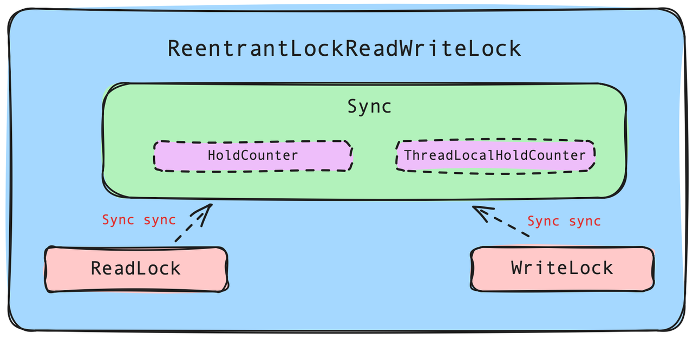

类图

为什么这里的Sync会和ReentrantLock中的Sync实现不一样呢？

因为两者的功能和目标是不一样的,ReentrantLock是一把互斥锁，state = 0 代表锁空闲，state > 0 代表被其他线程独占了, 并不需要做其他额外的处理。

但是RWLock不能这样,当线程调用rLock.lock()或者wLock.lock()时，线程应该如何判断当前的情况呢？换句话说,应该如何知道当前持有锁的线程是读锁还是写锁呢？「因为state > 0 只能代表锁被获取了，但是无法区分是读锁还是写锁？」

在这里可以将state分为多个部分「在这里两个部分足够了」 -- 高16位和低16位，其中低16位用来表示写锁的持有情况，高16位用来表示读锁的持有情况。看Sync的代码

```plain&#x20;text
/*
       Sync将int类型的state分为高16位和低16位
       高16位：代表读锁
       低16位：代表写锁
 */
 abstract static class Sync extends AbstractQueuedSynchronizer {

        static final int SHARED_SHIFT   = 16; // 读锁在state中的偏移量
        static final int SHARED_UNIT    = (1 << SHARED_SHIFT); //读锁计数单位,每次获取读锁时,将state加上该变量(释放读锁则减去该变量)
        static final int MAX_COUNT      = (1 << SHARED_SHIFT) - 1; // 锁阈值
        static final int EXCLUSIVE_MASK = (1 << SHARED_SHIFT) - 1; // 写锁掩码 - 用于获取当前state中的写锁数量

        static int sharedCount(int c)    { return c >>> SHARED_SHIFT; } // 获取读锁数量
        static int exclusiveCount(int c) { return c & EXCLUSIVE_MASK; } // 获取写锁数量

 }
```

可是还有一个问题：state的高16位用来记录当前获取的读锁数量，这没什么问题，但是这记录的只是整体上的，是不支持区分每个线程到底获取了多少次读锁的。

这个问题有必要解决吗？也即每个线程需要知道获取了多少次读锁吗？

当然需要,虽然读锁是共享的，但是读锁释放的时候,每个线程也只能释放自己锁拥有的读锁数量,比如线程A获取了4次读锁,线程B获取了3次读锁,那么state的高16位值应该为7,如果只有state,那么线程A释放锁的时候如何知道自己获取的读锁已经被完全释放了呢？

所以：为了实现这个功能出现了另外一个类：HoldCounter

```plain&#x20;text
static final class HoldCounter {
    int count = 0; // 读锁计数
    final long tid = getThreadId(Thread.currentThread());//获取线程唯一Id
}
```

怎么区分每个线程呢？很自然的能够想到ThreadLocal

```plain&#x20;text
static final class ThreadLocalHoldCounter extends ThreadLocal<HoldCounter> {
    public HoldCounter initialValue() {
        return new HoldCounter();
    }
}
```

Sync中的其他字段

```plain&#x20;text
private transient ThreadLocalHoldCounter readHolds;
private transient HoldCounter cachedHoldCounter;
private transient Thread firstReader = null;
private transient int firstReaderHoldCount;

abstract static class Sync extends AbstractQueuedSynchronizer {

      private transient ThreadLocalHoldCounter readHolds; //TL,用于记录每个线程的读锁数量
      // 性能优化 -- 为什么要多出这些变量呢？注意这可是在多线程下,当线程多起来后,TL会有什么问题呢？
      // 后续再用到这些变量的时候再说明每个变量的作用
      // 并且这里是二级缓存的设计!!
      private transient HoldCounter cachedHoldCounter; // 缓存最近一个成功获取读锁的线程的计数器count
      private transient Thread firstReader = null; // 第一个获取读锁的线程对象
      private transient int firstReaderHoldCount; //第一个获取读锁的线程对象所持有的读锁数量

}
```

### 读锁源码解析

**rlock.lock()「获取读锁」** 在下面的源码讲解中，若无特殊说明，均以非公平锁为例

```plain&#x20;text
//ReadLock.lock() -- 会继续调用sync.acquireShared()方法
public void lock() {
    sync.acquireShared(1);
}

//sync.acquireShared() -- 在这里就已非公平锁为例
public final void acquireShared(int arg) {
    if (tryAcquireShared(arg) < 0)
        doAcquireShared(arg);
}
// tryAcquireShared() -- 这里是RWLock中的Sync的方法  - 下面开始分析这个方法
```

读锁的获取应该怎么处理呢?

第一步肯定是做校验，如果当前资源已经被写线程获取了，那么就不需要再做其他的判断了 并且为对锁降级的支持,在这里需要做额外判断,也即线程可以先获取写锁再获取读锁

```plain&#x20;text
Thread current = Thread.currentThread(); // 获取当前线程
int c = getState(); //获取state「资源」
if (exclusiveCount(c) != 0 && // 如果已经存在写锁
    getExclusiveOwnerThread() != current) // 但是持有写锁的线程不是当前线程,那么获取读锁失败 -> 这里就是对锁降级的支持
    return -1;
```

否则：经过上面的判断，要么是没有写锁,要么是写锁和读锁重入 。 那么下面按道理来说：看见的代码应该是：compareAndSetState(c, c + SHARED\_UNIT)，来竞争锁资源。 但是读写锁必须要考虑的一个问题：那就是写锁饥饿问题。

前面也说过,读写锁是用于读多写少的情况的,提高多线程读的性能,充分利用系统资源，但是一旦当一个线程获取读锁成功后，如果不加以限制,那么会出现什么样的情况？

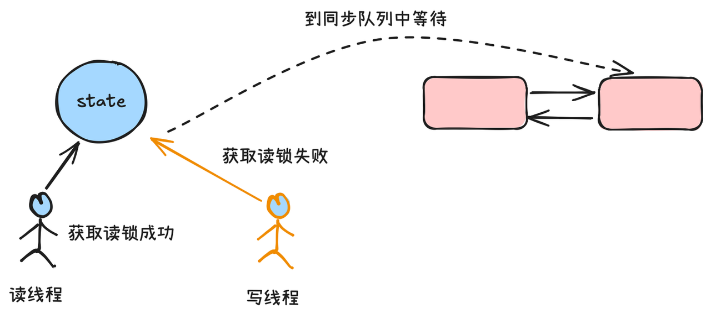

读线程获取读锁先于写线程获取写锁

因为读写锁的适用场景是读多写少,这会出现什么样的情况？ 后续的读线程获取读锁都会成功，在这些读线程释放完所有的读锁之前，这个写线程是别想唤醒获取写锁成功了, 也即造成了**写饥饿**。

所以为了**缓解**这个问题,在通过了上面的判断后,并不会直接去cas,而是需要某个手段来缓解写线程**饥饿**的问题。 这个方法就是readerShouldBlock()「也即读线程是否应该阻塞,看代码实现」

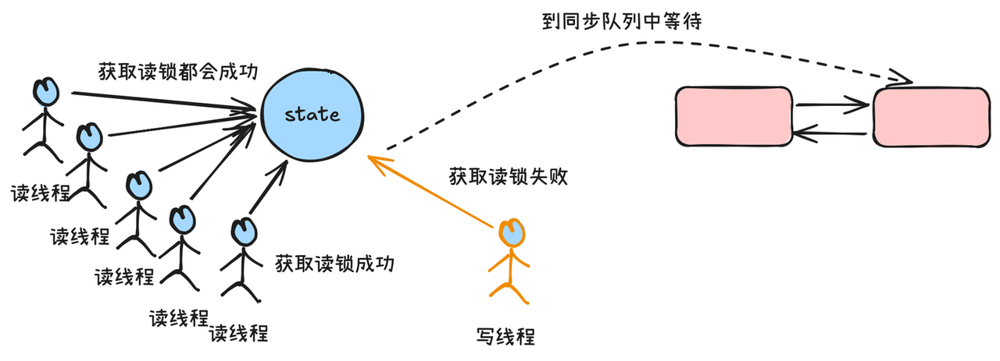


```plain&#x20;text
// 判断同步队列中的首节点是否是一个写线程节点(通过独占模式来区分)
//readerShouldBlock()
final boolean readerShouldBlock() {
    return apparentlyFirstQueuedIsExclusive();
}
//apparentlyFirstQueuedIsExclusive()
final boolean apparentlyFirstQueuedIsExclusive() {
    Node h, s;
    return (h = head) != null &&
        (s = h.next)  != null &&
        !s.isShared()         &&
        s.thread != null;
}
```

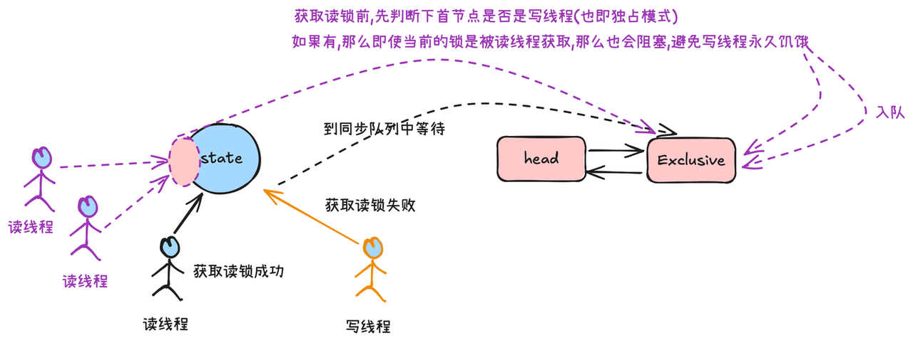

缓解写锁饥饿问题

这样做就行了吗? ReentrantReadWriteLock是可重入的读写锁,那么看下图情况： 当已经获取了读锁的线程,再次获取读锁,如果只是按照上面的来实现,那么就会出现死锁 *读线程持有读锁，然后想要获取读锁，但是有写线程在等待,那么为了避免饥饿,读线程会去阻塞,而写线程又在等读线程唤醒 - 死锁*

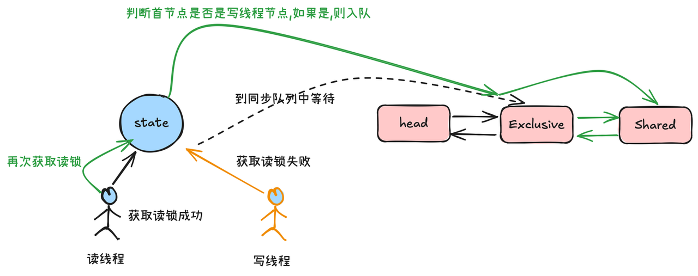


所以：这里的下一步逻辑应该是：如果是已经获取了读锁的线程再次获取读锁时,即使同步队列中的首节点是写线程节点,那么也不应该阻塞,而是继续执行下去,那么应该如何实现呢？

```plain&#x20;text
// 一种简单的实现
HoldCounter rh = null;
if(readerShouldBlock()){ // 如果判断出读锁需要阻塞,那么不能直接阻塞,而是要继续判断
  rh = readHolds.get(); //每个线程获取到的是自己的HoldCounter「里面记录了线程获取读锁的次数和线程id」
  if(rh.count == 0){ //如果当前线程之前没有获取到读锁,那么就需要去同步队列中等待
    return -1;
  }
}
```

但是这里存在一个性能问题：就是readHolds.get()「相当于threadLocal.get()」，当读线程很多时，在TL中查找线程对应的HoldCount,可能会存在性能瓶颈，所以在这里doug lea采用了优化手段，也即使用cachedHoldCounter缓存最近一个读线程的holdCount,如果当前线程就是最近一个获取读锁的线程,那么就不需要去readHolds中查找了,直接用cachedHoldCounter.count来判断就可以了,代码如下：

```plain&#x20;text
else if (readerShouldBlock()) { // 如果判断出当前读线程应该阻塞,那么需要进一步判断,避免死锁发生
  // Make sure we're not acquiring read lock reentrantly
  if (firstReader == current) {
      // assert firstReaderHoldCount > 0;
  } else {
      if (rh == null) {
          rh = cachedHoldCounter; // 获取缓存计数器
          if (rh == null || rh.tid != getThreadId(current)) { //如果为空 或者 当前线程不是缓存计数器所对应的线程,那么只能从TL中获取了
              rh = readHolds.get();
              if (rh.count == 0) // 如果计数为0,那么从TL中移除
                  readHolds.remove();
          }
      }
      if (rh.count == 0) //如果计数为0,那么获取读锁失败,在写线程节点后面排队去
          return -1;
  }
}
```

否则：如果满足上面的条件，那么就可以进行CAS来获取读锁资源了，看代码：通过注释应该能看懂代码了,这里有个非常棒的架构 - 二级缓存

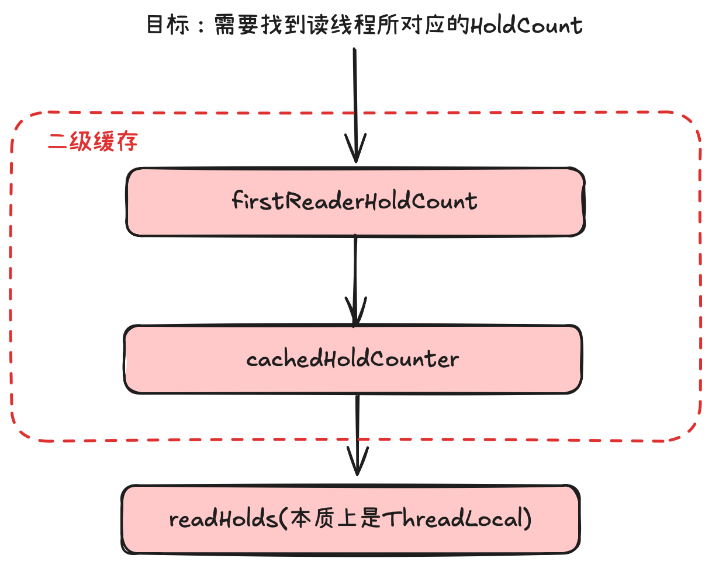


```plain&#x20;text
//限额检查
if (sharedCount(c) == MAX_COUNT)
    throw new Error("Maximum lock count exceeded");

if (compareAndSetState(c, c + SHARED_UNIT)) { // cas将读锁数量+1
    if (sharedCount(c) == 0) { //这里的c是没有+1之前的state,如果为0,那么代表当前线程是此次第一次获取到读锁的线程
        firstReader = current; //那么设置firstReader属性
        firstReaderHoldCount = 1; //设置该读线程的计数器为1
    } 
    // 否则在这之前已经有读线程获取读锁了,那么判断是否是firstReader的读锁重入,如果是,那么直接将计数器+1即可
    else if (firstReader == current) {
        firstReaderHoldCount++;
    } 
    // 否则,当前线程不是首个Reader线程,那么还有cachedHoldCounter
    // 如果当前线程是最近获取读锁的线程,那么依旧可以直接更新计数器
    // 否则：rh = readHolds.get()初始化线程的holdCount,然后再更新计数器(第一次是初始化,后续就是从TL中查找了)
    // 二级缓存的实现就在这里了！
    else {
        if (rh == null)
            rh = cachedHoldCounter;
        if (rh == null || rh.tid != getThreadId(current))
            rh = readHolds.get();
        else if (rh.count == 0)
            readHolds.set(rh);
        rh.count++;
        cachedHoldCounter = rh; // cache for release
    }
    return 1;
}
```

下面看下读锁的锁释放流程：

```plain&#x20;text
//RLock.lock()
public void unlock() {
   sync.releaseShared(1);
}
//releaseShared(1)
public final boolean releaseShared(int arg) {
     if (tryReleaseShared(arg)) {
         doReleaseShared();
         return true;
     }
     return false;
 }
// tryReleaseShared() -- 关键逻辑
```

读锁释放的核心要点： 1.减少每个线程的holdCount:每个读线程只能释放自己所加的读锁数量(比如说:A线程,加了3把读锁,那么就应该只释放3次读锁) 2.减少state的高16位的值

```plain&#x20;text
Thread current = Thread.currentThread();
/*
   firstReader的处理：如果计数为1,那么直接将firstReader设置为null -- 为什么在这里不需要将其-1呢？难道不会影响下一个firstReader吗？
   答案是不会的,因为firstReader的firstReaderHoldCount默认就为1
*/
if (firstReader == current) {
    if (firstReaderHoldCount == 1)
        firstReader = null;
    else
        firstReaderHoldCount--;
} 
//非firstReader的处理:如果所持有的读锁已经释放完了,那么移除在TL中的holdCount即可,否则只是-1
else {
    HoldCounter rh = cachedHoldCounter;
    if (rh == null || rh.tid != getThreadId(current))
        rh = readHolds.get();
    int count = rh.count;
    if (count <= 1) {
        readHolds.remove();
        if (count <= 0)
            throw unmatchedUnlockException();
    }
    --rh.count;
}
// 2
for (;;) {
    int c = getState();
    int nextc = c - SHARED_UNIT;
    if (compareAndSetState(c, nextc))
        // 只有nextc=0,才算释放读锁成功(也即所有的读锁都释放了)
        return nextc == 0;
}
```

### 写锁源码解析

```plain&#x20;text
//WLock.lock()
public void lock() {
   sync.acquire(1);
}
//acquire()
public final void acquire(int arg) {
  if (!tryAcquire(arg) &&
      acquireQueued(addWaiter(Node.EXCLUSIVE), arg))
      selfInterrupt();
}

//tryAcquire() -- 核心逻辑
```

因为写锁是与读锁和写锁互斥的,所以下面这个逻辑很容易理解： 1.如果当前资源已经被读线程获取「读锁」或者已经被写线程获取「写锁」并且获取写锁的线程不能当前线程「锁重入」，那么当前线程获取写锁失败. 2.否则锁重入,那么直接将state+1即可「这里不需要cas，因为锁已经被当前线程获取了」 3.否则当前没有读线程或写线程持有锁资源，那么cas竞争锁资源即可

```plain&#x20;text
//tryAcquire() -- 核心逻辑
protected final boolean tryAcquire(int acquires) {
   Thread current = Thread.currentThread();
   int c = getState(); // 获取state
   int w = exclusiveCount(c); //获取写锁数量
   if (c != 0) { 
       // (Note: if c != 0 and w == 0 then shared count != 0)  存在读锁 或者 非写锁重入
       if (w == 0 || current != getExclusiveOwnerThread())
           return false;
       // 限额检查
       if (w + exclusiveCount(acquires) > MAX_COUNT)
           throw new Error("Maximum lock count exceeded");
       setState(c + acquires);
       return true;
   }
   // 走到这里说明：c = 0 也即没有线程持有锁资源
   if (writerShouldBlock() ||  // 在非公平模式下,writerShouldBlock()永远返回false,也即对于写线程来说,没有条件需要它让步,抢就是了
       !compareAndSetState(c, c + acquires)) // cas抢锁资源
       return false;
   setExclusiveOwnerThread(current); //设置独占线程
   return true;
}
```

写锁的释放：代码逻辑很简单

```plain&#x20;text
//tryRelease()
protected final boolean tryRelease(int releases) {
   // 不允许没持有锁就释放锁
   if (!isHeldExclusively())
       throw new IllegalMonitorStateException();
   // 释放锁后的锁数量
   int nextc = getState() - releases;
   // 如果释放锁后的锁数量 0 -> true,那么代表写锁释放完毕,否则没有
   boolean free = exclusiveCount(nextc) == 0;
   if (free)
       setExclusiveOwnerThread(null); // 写锁释放完毕
   setState(nextc); // 更新state
   return free; // 返回是否释放成功
}
```

读写锁的介绍就到这里吧,总结一下： 1.读写锁的出现原因是什么？ 2.读写锁中的state变量和ReentrantLock中的state有什么不同？ 3.读写锁中的锁降级是什么？有什么用？有锁升级吗？ 4.读写锁是如何缓解写锁饥饿问题的？ 5.读写锁是如何优化高并发下ThreadLocal查询性能瓶颈的问题的？ 6.读写锁中的每个类的作用是什么？


## StampedLock

邮戳锁

为什么需要这个邮戳锁呢？因为前面的ReentrantReadWriteLock存在一个很严重的问题,那就是写饥饿,虽然doug lea通过某种手段 -- 当写线程处于同步队列的首部时,后面的读线程将不能获取锁成功 来缓解写线程饥饿的问题。

但是写线程依旧必须等待在他之前所获得读锁的线程全部释放了读锁后,才能获取写锁。 所以为了解决这个问题，就引入了StampedLock。

问题是什么？读多写少情况下,写线程会饥饿 如何解决？一种很粗暴的解决办法：让读写并发 会出现什么新的问题？不一致读 如何解决新的问题呢？

首先我觉得：既然StampedLock是为了解决RWLock存在的问题,那么它本身应该就具有ReadLock和WriteLock的功能，并且具有额外的设计来解决RWLock的写饥饿问题。

一种想法：读写并发中，读线程害怕的是什么？不就是在线程读的过程中，有写线程操作了共享资源吗？如果能有一种方法让线程知道在读的过程中,是否有写线程操作了？如果没有,那么皆大欢喜(这就是乐观读)，否则，我再做补救措施(比如升级到悲观读)。

### 类关系图

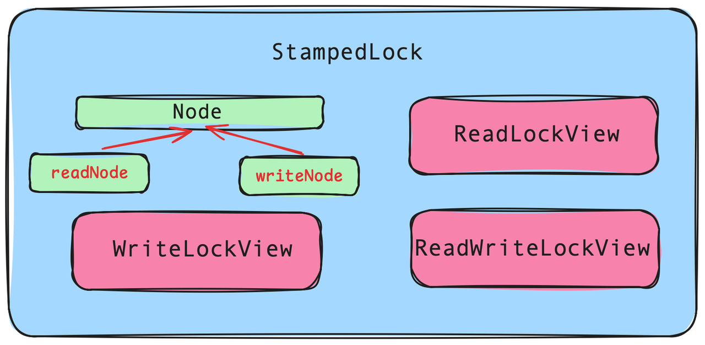

类关系图

因为StampedLock没有直接或者间接的依赖AQS，所以AQS所要完成的功能,如果StampedLock想要有(比如可重入 / 队列的管理),那么StampedLock就要自己在内部实现,其中一个很重要的功能就是队列的管理,在StampedLock就是通过Node来实现的。

基本的属性和AQS中的Node一样,但是在这里多了两个新的类：WriteNode(这个类就是Node类,因为它没有新的属性)和ReadNode 这个类有扩展的属性：cowaiters 它的作用本质上是为了性能,因为在RWLock中,RLock和WLock使用的都是同一个同步队列,这就会导致竞争相对来说较大，doug lea采用了一种惯用的手法,将竞争一个变为竞争多个,这样性能自然就上去了。

```plain&#x20;text
/** CLH nodes */
abstract static class Node {
        volatile Node prev;       // initially attached via casTail
        volatile Node next;       // visibly nonnull when signallable
        Thread waiter;            // visibly nonnull when enqueued
        volatile int status;    
 }

static final class WriterNode extends Node { // node for writers
}  

static final class ReaderNode extends Node { // node for readers
 volatile ReaderNode cowaiters;  
}
```

接下来看下StampedLock是如何工作的,下面给出一个例子:

核心方法：readLock()/unlockRead() , writeLock() / unlockWrite() , tryOptimisticRead() / validate()

```plain&#x20;text
public class SimpleStampedLockExample {
private int value = 0;
private final StampedLock lock = new StampedLock();

// 写操作 - 使用写锁
public void write(int newValue) {
    long stamp = lock.writeLock(); // 获取写锁
    try {
        value = newValue;
        System.out.println("写入值: " + newValue);
    } finally {
        lock.unlockWrite(stamp); // 释放写锁
    }
}

// 读操作 - 使用悲观读锁
public int read() {
    long stamp = lock.readLock(); // 获取读锁
    try {
        System.out.println("读取值: " + value);
        return value;
    } finally {
        lock.unlockRead(stamp); // 释放读锁
    }
}

// 读操作 - 使用乐观读（更高效）
public int optimisticRead() {
    long stamp = lock.tryOptimisticRead(); // 尝试乐观读
    int currentValue = value; // 读取值

    // 检查在读过程中是否有写操作发生
    if (!lock.validate(stamp)) {
        // 如果验证失败，说明有写操作，升级为悲观读锁
        stamp = lock.readLock();
        try {
            currentValue = value;
        } finally {
            lock.unlockRead(stamp);
        }
    }

    System.out.println("乐观读取值: " + currentValue);
    return currentValue;
}
```

### 源码解析

以jdk21为例

先看下StampedLock()的构造函数和类属性 关键属性：state&#x20;


state属性分段

```plain&#x20;text
/*
   初始化state(long 类型变量,分为3部分)
   低7位：记录读锁数量
   第8位：记录写锁标识
   高56位：版本号,每次释放写锁时都会+1
*/
public StampedLock() {
 state = ORIGIN; // 「前面全为0」100000000 = 256 (此时读锁和写锁标识都为0) - 这样设计有什么用途吗?
}
--->
// 暂时只需要关注head,tail,state即可
/** Head of CLH queue */
private transient volatile Node head;
/** Tail (last) of CLH queue */
private transient volatile Node tail;

// views
transient ReadLockView readLockView;
transient WriteLockView writeLockView;
transient ReadWriteLockView readWriteLockView;

/** Lock sequence/state */
private transient volatile long state;
/** extra reader count when state read count saturated */
private transient int readerOverflow;

/* status */
private static final long INTERRUPTED = 1L; 
static final int WAITING   = 1; // 线程处于阻塞等待状态
static final int CANCELLED = 0x80000000; // must be negative 必须为负数 -> 代表为取消状态「异常状态」
```

readLock():获取读锁(***悲观模式)*** 读锁的获取和AQS的设计一样,也有快速获取和慢速获取之分 1.快速获取：队列为空并且没有写锁时直接尝试去cas竞争,否则进入到2 2.慢速获取: 下面就看慢速获取,因为它包含了快速获取的逻辑

```plain&#x20;text
//悲观读锁的获取
public long readLock() {
 // 清除state中的写锁位(第8位) 和 读锁计数的最高位(保证后续的读锁不会那么快的溢出)
 long s = U.getLongOpaque(this, STATE) & RSAFE, nextState;
 // cas增加读锁数量,如果成功,那么代表悲观读锁获取成功
 if (casState(s, nextState = s + RUNIT))
     // 返回的stamped就是state
     return nextState;
 // 否则,慢速获取悲观读锁
 else
     return acquireRead(false, false, 0L);
}
```

下面就进入到acquireRead()方法中 1.如果队列为空或者几乎为空,那么重新尝试cas,如果成功了,那么就直接返回

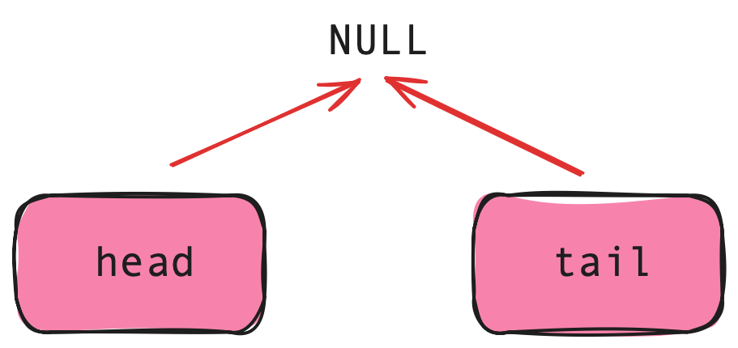

队列的空初始化状态


队列的非空初始化状态

```plain&#x20;text
for (;;) {
     Node tailPred = null, t = tail;
     // if empty, try to acquire
     // 如果队列为空,那么直接尝试cas获取读锁 - 成功了直接返回即可
     // 要理解(tailPred = t.prev) == null)需要知道,队列的非空初始状态(tail.prev是为空的)
     if ((t == null || (tailPred = t.prev) == null) &&
         (nextState = tryAcquireRead()) != 0L) // try now if empty
         return nextState;
     else if (t == null)
         tryInitializeHead();
//  tryInitializeHead() -- 队列的非空初始化状态
private void tryInitializeHead() {
    Node h = new WriterNode(); // 为什么要初始化为WriteNode呢？
    if (U.compareAndSetReference(this, HEAD, null, h))
        tail = h;
}

// 尝试获取锁 -- tryAcquireRead()
private long tryAcquireRead() {
    for (long s, m, nextState;;) {
        // 尝试获取读锁的前提是：读锁数量没有移除,那么cas尝试获取读锁
        if ((m = (s = state) & ABITS) < RFULL) {
            if (casState(s, nextState = s + RUNIT))
                return nextState;
        }
        else if (m == WBIT) // 否则写锁被持有,那么返回0,代表获取读锁失败
            return 0L;
        else if ((nextState = tryIncReaderOverflow(s)) != 0L) // 否则读锁数量溢出,那么使用readerOverflow来计数
            return nextState;
    }
}
```

在这里为什么要初始化为WriteNode呢？ 其实没有什么特殊的含义,他就是一个伪节点,并且WriteNode中没有任何属性

2.否则队列已经不为空，那么下一步应该就是创建线程节点然后准备阻塞了(因为cas失败了) 在这里就会涉及到与RWLock不同的地方了,对于RWLock来说,写线程和读线程都是一起CAS同步队列的, 而在StampedLock中,采用了读写分离的策略，也即读线程和写线程竞争不同的队列。 但是并没有完全分离「为什么呢?因为如果分离了，那么锁是释放的时候应该去唤醒哪一个呢？」


队列初始化状态

当读线程竞争锁资源失败,那么接下来需要入队列了,这里使用cowait来做优化。在RWLock中，读线程和写线程会竞争一个同步队列的tail。&#x20;

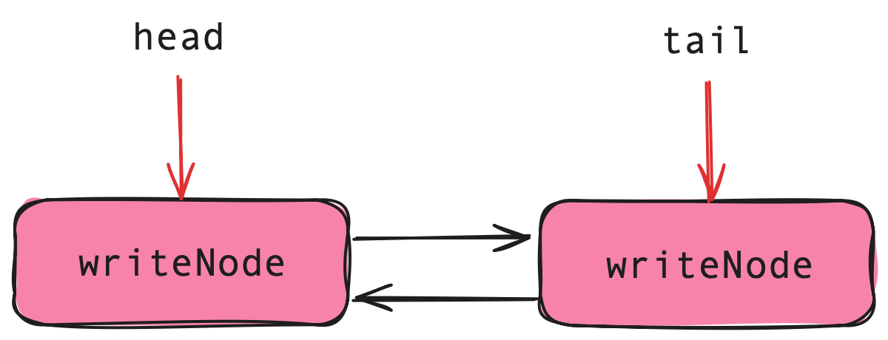

图-1

&#x20;而在StampedLock中，读线程的处理机制为： 1.当tail节点是ReaderNode时,那么当前读线程会链接到该节点所在的队列上,而不是链接到tail的尾部 2.否则，当前读线程会创建一个ReaderNode,然后与写线程竞争插入到同步队列尾部

```plain&#x20;text
for (;;) {
     ReaderNode leader; long nextState;
     Node tailPred = null, t = tail;
     if ((t == null || (tailPred = t.prev) == null) &&
         (nextState = tryAcquireRead()) != 0L) // try now if empty
         return nextState;
     else if (t == null)
         tryInitializeHead();
     // 走到下面的条件：上面两个分支不满足： 也即队列处于初始化状态(非空状态)
     /*
        1.tailPred == null -> true 队列处于初始化状态(没有第二个节点)
        2.tailPred != null but !(t instanceof ReaderNode) -> true 
          也即已经存在首节点,并且首节点不是ReaderNode类型的,那么当前节点需要创建一个ReaderNode并且插入到尾部(如上图1)
     */
     else if (tailPred == null || !(t instanceof ReaderNode)){ 
         // 创建新的ReaderNode节点
         if (node == null)
             node = new ReaderNode();
         // cas插入到队列尾部
         if (tail == t) {
             node.setPrevRelaxed(t);
             if (casTail(t, node)) {
                 t.next = node;
            // node is leader; wait in loop below 如果设置成功,当前当前读线程节点就成为leader节点了
            // 那么结束for循环,准备进入到阻塞阶段，如下图-2所示
                 break; 
             }
             // 插入失败,回滚node.setPrevRelaxed(t)操作
             node.setPrevRelaxed(null);
         }
     } 
     // 上面的else if为false了才会进入到这个分支 
     // 也即 tailPred != null && t instanceof ReaderNode，也即tail节点为ReaderNode模式,那么尝试cowait
     else if ((leader = (ReaderNode)t) == tail) { // try to cowait
         // 后面单独分析这段代码
     }   
 }
```

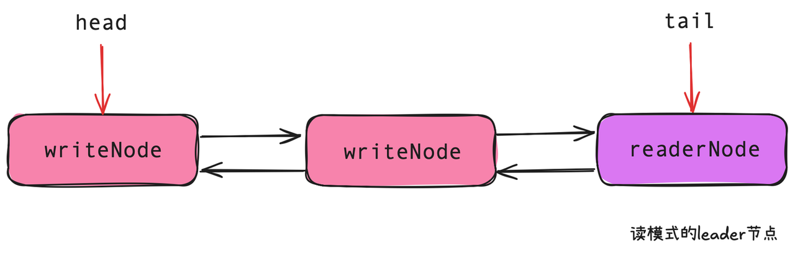

图-2

下面分析,当tail节点就为readerNode模式时,通过cowait方式链接到leader上，而不是tail，先回顾一下Node节点的属性

```plain&#x20;text
/** CLH nodes */
abstract static class Node {
        volatile Node prev;       // initially attached via casTail
        volatile Node next;       // visibly nonnull when signallable
        Thread waiter;            // visibly nonnull when enqueued
        volatile int status;    
 }

static final class WriterNode extends Node { // node for writers
}  

static final class ReaderNode extends Node { // node for readers
 volatile ReaderNode cowaiters;  
}
```

源码解析：先看下前提,某个读线程想要插入到leader中(readerNode)

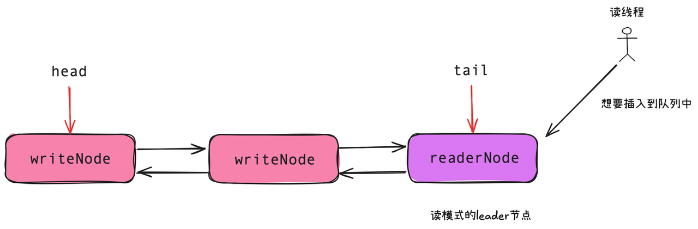


```plain&#x20;text
// 如果leader节点的状态不正确(那么退出当前for循环,重新执行外部大循环)
 for (boolean attached = false;;) {
    if (leader.status < 0 || leader.prev == null)
      break;
    // ....
 }
```

否则leader节点目前是正常的,那么为当前读线程创建一个ReaderNode「如果需要的话」，然后设置该节点的线程属性,这里为什么不在一个else if分支中就完成呢？「我认为有两点原因：1.践行之前的自旋思想，每做一个操作就重新循环一次 2.保证leader节点的状态是正常的(因为可能在通过第一个判断之后,leader节点就被取消了)」

```plain&#x20;text
// 创建一个新的ReaderNode
else if (node == null)
   node = new ReaderNode();
else if (node.waiter == null)
   node.waiter = Thread.currentThread();
```

现在为该读线程创建了对应的ReaderNode,也设置了对应的线程属性,leader节点的状态也是正确的,那么下一步就应该是插入到队列中的，当前队列状态如下：

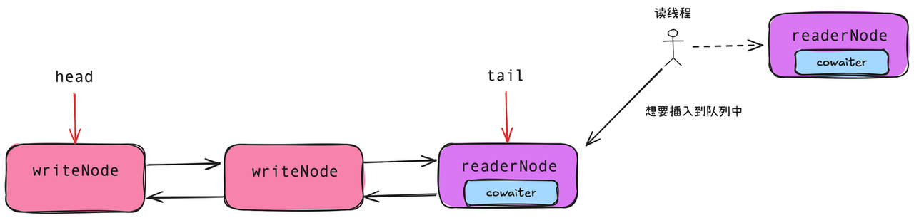


```plain&#x20;text
else if (!attached) { // attached：代表当前读线程节点是否连接到leader上,默认是没有的
    ReaderNode c = leader.cowaiters; // 获取的leader的cowaiters,可能为空
    node.setCowaitersRelaxed(c); // 将当前读线程节点的cowaiters指向leader节点的cowaiters
    attached = leader.casCowaiters(c, node); // cas的将当前节点设置为leader的cowaiters 整体效果如下图-1
    if (!attached) // 如果在上面cas失败,则回滚node.setCowaitersRelaxed(c)操作
        node.setCowaitersRelaxed(null);
}
```

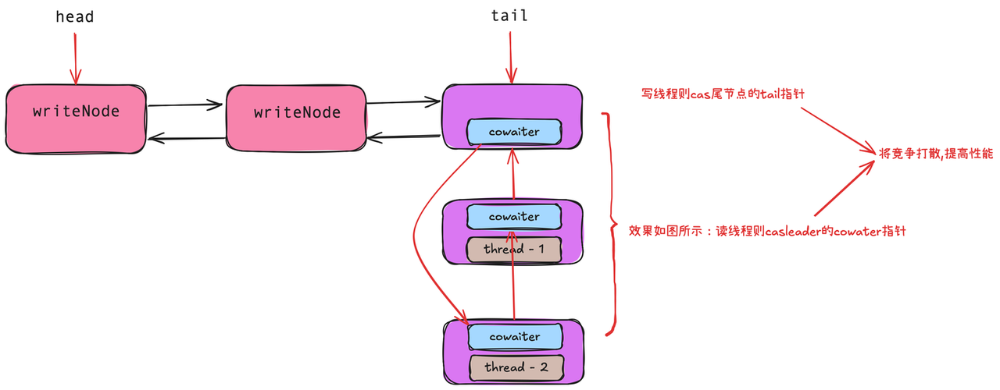

图-1

接下来就是阻塞的代码了:

```plain&#x20;text
else {
    long nanos = 0L;
    if (!timed)
        LockSupport.park(this); // 阻塞
    else if ((nanos = time - System.nanoTime()) > 0L)
        LockSupport.parkNanos(this, nanos);
    // 暂时不考虑中断相关的操作
}
// 省略唤醒后的操作
```

唤醒的代码后面在看,下面看下当读线程成为了leader后的操作：「下面这段代码,只有在读线程成为leader后(读线程节点处于tail节点)才会执行」,如下图所示：

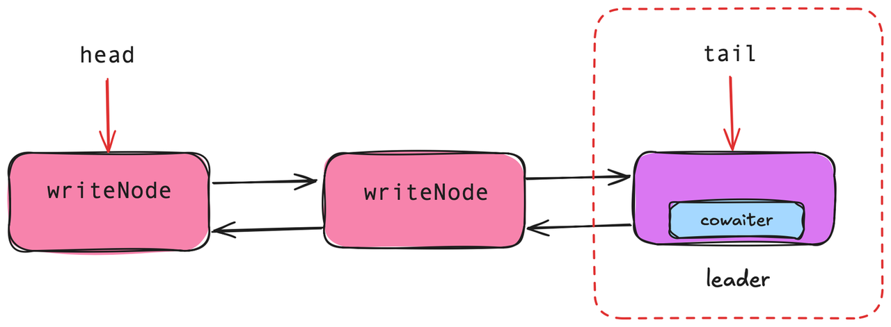


前面说过只有首节点才有资格去重新尝试获取锁,所以在这里也有这样的约束

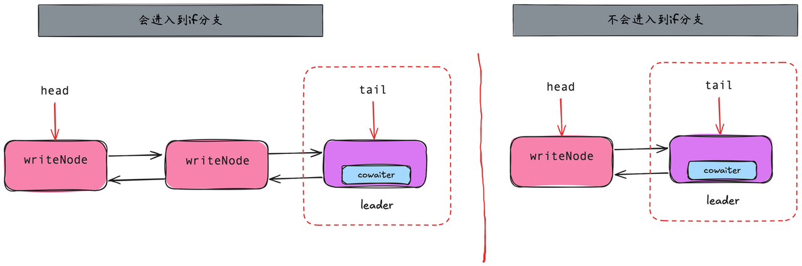


```plain&#x20;text
// node is leader of a cowait group; almost same as acquireWrite
byte spins = 0, postSpins = 0;   // retries upon unpark of first thread
boolean first = false;
Node pred = null;
for (long nextState;;) {
    /*
        第一次fisrt永远为false
        获取当前节点的前驱节点pred：如果不为空
         !(first = (head == pred)) ： 如果当前节点的前驱节点为head节点,那么将当前节点设置为first节点标识(first = true)
        也即如果当前节点为首节点,那么first会被设置为true,并且不会进入到这里的if分支
        除非当前readerNode不是first节点,那么才会进入,如下图所示
    */
    if (!first && (pred = node.prev) != null &&
        !(first = (head == pred))) {
        // 进入则代表当前readerNode不是first节点
        // 如果前驱节点处于不正常的状态,那么做清理操作
        if (pred.status < 0) {
            cleanQueue();           // predecessor cancelled
            continue;
        } 
        //确保处于稳定状态,前驱节点确实存在,但是可能正在被移出队列,所以自旋,重新判断
        else if (pred.prev == null) {
            Thread.onSpinWait();    // ensure serialization
            continue;
        }
    }
```

否则当前节点就是first节点了,那么可以尝试重新获取锁 - tryAcquireRead()

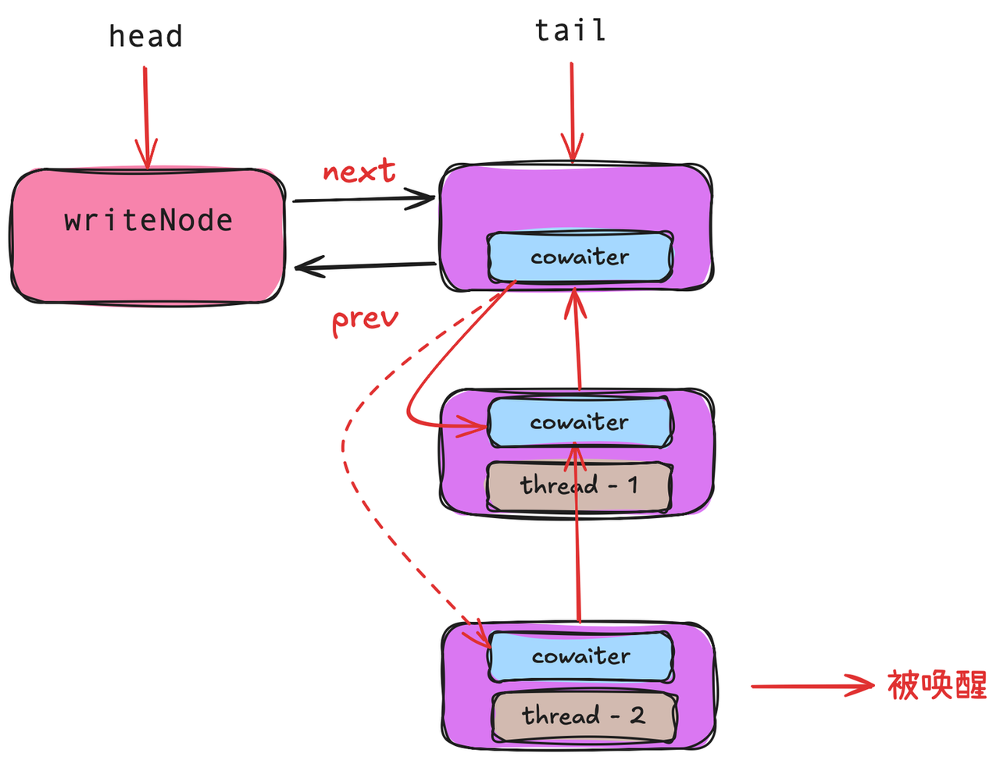

唤醒的逻辑(其实就是单链表操作)

```plain&#x20;text
// 否则当前节点为首节点,那么尝试重新获取锁
if ((first || pred == null) &&
    (nextState = tryAcquireRead()) != 0L) { // 重新尝试获取锁,返回非0代表获取成功,那么将当前节点从队列中移除，并且唤醒链接在它上面的其他readerNode
    if (first) { // 移出队列
        node.prev = null;
        head = node;
        pred.next = null;
        node.waiter = null;
    }
    signalCowaiters(node);//唤醒其他readerNode节点
    if (interrupted) // 中断处理
        Thread.currentThread().interrupt();
    return nextState;
} 

// signalCowaiters(node);//唤醒其他readerNode节点
//传入的是leader节点
private static void signalCowaiters(ReaderNode node) {
    if (node != null) {
        for (ReaderNode c; (c = node.cowaiters) != null; ) { // c指向的是栈顶(最后一个插入到读队列中的ReaderNode)
            if (node.casCowaiters(c, c.cowaiters))
                LockSupport.unpark(c.waiter); // 唤醒
        }
    }
}
```

但是也有可能不会处于首节点,那么依然是需要阻塞的,在阻塞前,需要设置想要的属性 -- status和thread

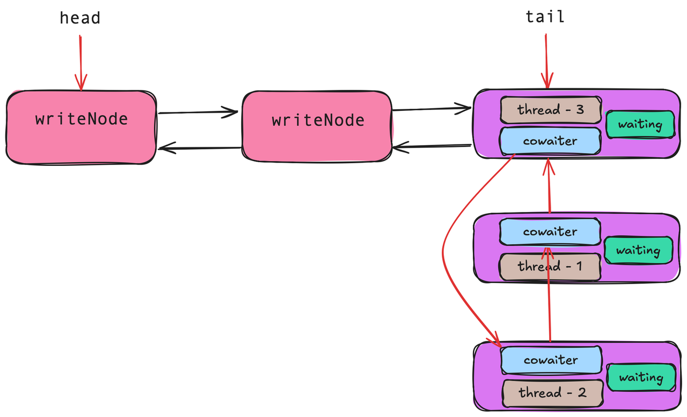


```plain&#x20;text
// 线程节点处于初始化状态,那么设置线程属性和状态
else if (node.status == 0) {
    if (node.waiter == null) 
        node.waiter = Thread.currentThread();
    node.status = WAITING;
```

一切准备就绪了,那么准备进入到阻塞了

```plain&#x20;text
// 阻塞,就是通过park(this)来阻塞,但是值得注意的是在每次阻塞之前都会更新spins变量,
// 每次都是double + 1,这是为了缓解线程饥饿
 else {
        long nanos;
        spins = postSpins = (byte)((postSpins << 1) | 1);
        if (!timed)
            LockSupport.park(this);
        else if ((nanos = time - System.nanoTime()) > 0L)
            LockSupport.parkNanos(this, nanos);
        else
            break;
        // 唤醒后清除状态
        node.clearStatus();
        if ((interrupted |= Thread.interrupted()) && interruptible)
            break;
    }
```

下面在看下自旋操作:每次线程唤醒后是不一定能够获取到锁的,为了缓解锁饥饿,以及线程频繁的唤醒和睡眠的上下文开销,每次线程醒来后都会自旋来获取锁

```plain&#x20;text
// 自旋优化,防止锁饥饿
    else if (first && spins != 0) {
        --spins;
        Thread.onSpinWait();
    }
```

下面再会头看看,当位于cowaiters队列中的ReaderNode醒来后的操作

```plain&#x20;text
// 上面的else if为false了才会进入到这个分支 - 也即 tailPred != null && t instanceof ReaderNode，也即tail节点为ReaderNode模式,那么尝试cowait
else if ((leader = (ReaderNode)t) == tail) { // try to cowait
     for (boolean attached = false;;) { # 1 
         if (leader.status < 0 || leader.prev == null)
             break;
         // ..... 省略其他分支代码
         else{
            // ....
            LockSupport.park(this); # 2
            // ....
         }
     }
     /*
        cowaiters队列中的ReaderNode从上面的#2处苏醒后,会重新执行#1的for循环,只有当leader处于first节点时(也即leader.prev == null)
        这里要与leader醒来后,并且成功获取到锁的代码结合来看,leader线程首先会将自己移除队列(此时leader.prev == null),然后再唤醒cowaiters上的其他ReaderNode
        「只有leader线程获取了线程,其余的ReaderNode才能醒来获取」
        它才会结束上面的for循环,然后进入到下面的处理中
        1.同样也需要清理节点
        2.并且尝试获取读锁
        3.帮助唤醒后续的ReaderNode
        4.返回获取锁的stamped即可
     */
     if (node != null)
         node.waiter = null;
     long ns = tryAcquireRead();
     signalCowaiters(leader);
     if (interrupted)
         Thread.currentThread().interrupt();
     if (ns != 0L)
         return ns;
     else
         node = null; // restart if stale, missed, or leader cancelled
}
}
```

到这里,StampedLock.readLock()就介绍完毕了,首先可以看到的一点是：它并没有HoldCounter类,并且在操作的时候也没有看到什么计数的操作，所以可以推断出，该类是不支持重入操作的。「并且官网也是这样介绍的」。

相比于RWLock的readLock()来说,StampedLock的readLock()有额外的两个特性：

**1.新增加cowaiters来链接其他的ReaderNode，减少与写线程的cas竞争2.增加spins自旋,缓解了锁饥饿的问题**

下面继续看下StampedLock.writeLock()的实现：独占写锁&#x20;


```plain&#x20;text
public long writeLock() {
    // try unconditional CAS confirming weak read
    // ABITS = RBITS | WBIT : 也即后8位全位1, ~(取反后,后8位全为0)
    // 这行代码的作用是获取state变量的值,并且清除后8位(清除读锁和写锁位),只保留版本号部分
    long s = U.getLongOpaque(this, STATE) & ~ABITS, nextState;
    // 通过cas进行快速获取,也即将写标识位cas为1
    if (casState(s, nextState = s | WBIT)) {
        // 这里先不考虑可见性的问题
        U.storeStoreFence();
        //如果cas成功(获取写锁成功),那么返回nextState
        return nextState;
    }
    // 否则进入到慢速获取
    return acquireWrite(false, false, 0L);
}
```

下面看下writeLock的慢速获取

首先需要判断自己是否是first节点,当前写线程还没有创建writeNode,当然不是首节点

```plain&#x20;text
/*
    fisrt:默认都是为false
    刚进来的写线程还没有构建writeNode,所以pred == null,结束该if分支
    但是该分支的作用有两点:
        1.判断当前线程节点是否是first节点
        2.保证队列处于稳定状态(serialization)

*/
if (!first && (pred = (node == null) ? null : node.prev) != null &&
    !(first = (head == pred))) {
    if (pred.status < 0) {
        cleanQueue();           // predecessor cancelled
        continue;
    } else if (pred.prev == null) {
        Thread.onSpinWait();    // ensure serialization
        continue;
    }
}
```

既然没有节点,那么下面就应该创建对应的节点了&#x20;


```plain&#x20;text
else if (node == null) {  // retry before enqueuing    
     node = new WriterNode();
```

从注释也可以看出doug lea惯有的代码风格和思想,也即每做一个操作都重新循环一次「自旋」,避免直接陷入到阻塞，下面的代码本来在创建WriterNode之前的,但是直接解释代码不太好理解，所以先讲述了创建节点的代码(实际上写线程会先尝试一次casState，如果成功了,那么连WriterNode都不需要创建)

```plain&#x20;text
if ((first || pred == null)  //同样,只有当前节点为first时才有资格重新尝试获取锁 或者 pred为null,也即节点还未入队
        && ((s = state) & ABITS) == 0L  // 并且此时没有任何读线程或者写线程持有锁
        && casState(s, nextState = s | WBIT)) { // 那么通过CAS尝试获取锁,也即将第8位CAS为1
    // cas成功,可见性处理,暂时不讨论
    U.storeStoreFence();
    // 如果是首节点,那么出队,但是在这里节点还没有入队,所以直接返回nextState即可
    if (first) {
        node.prev = null;
        head = node;
        pred.next = null;
        node.waiter = null;
        if (interrupted)
            Thread.currentThread().interrupt();
    }
    return nextState;
}
```

在这个分支中,写线程已经创建了节点，但是cas失败了，那么接下来按道理应该是插入到同步队列中了，然后去阻塞。当然代码也确实如此,这段代码执行完毕后,WriterNode就被插入到同步队列了

```plain&#x20;text
else if (pred == null) {          // try to enqueue 尝试入队
    Node t = tail;
    node.setPrevRelaxed(t);
    if (t == null)
        tryInitializeHead(); // 如果队列为空,需要先初始化队列,然后重试for循环
    else if (!casTail(t, node)) // 否则队列不为空,cas入队
        node.setPrevRelaxed(null);  // back out cas失败回滚入队的操作
    else //形成双向链表
        t.next = node;
}
```

同样在阻塞之前,需要设置线程节点的状态和线程:如下图所示

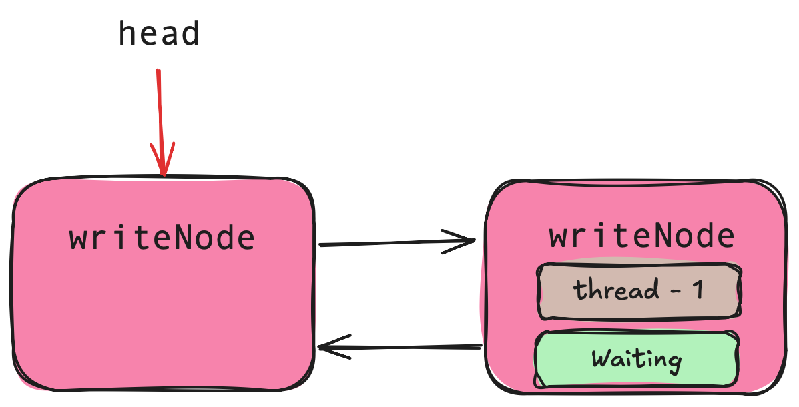


```plain&#x20;text
else if (node.status == 0) {      // enable signal
    if (node.waiter == null)
        node.waiter = Thread.currentThread();
    node.status = WAITING;
```

然后就是真的阻塞了,同样在阻塞之前会初始化spins,来缓解锁饥饿的问题「代码很简单，不再赘述」

```plain&#x20;text
// ......
else if (first && spins != 0) {   // reduce unfairness
    --spins;
    Thread.onSpinWait();
}
// ......
else {
    long nanos;
    spins = postSpins = (byte)((postSpins << 1) | 1);
    if (!timed)
        LockSupport.park(this);
    else if ((nanos = time - System.nanoTime()) > 0L)
        LockSupport.parkNanos(this, nanos);
    else
        break;
    node.clearStatus();
    if ((interrupted |= Thread.interrupted()) && interruptible)
        break;
}
```

总结一下：WriteLock()如果成功,就是将第8位设置为1然后返回，失败了则cas入队然后阻塞，并没有什么特别的。「不过使用了spins来缓解锁饥饿的问题」

可以看到:StampedLock的readLock()和writeLock()和RWLock的readLock()和writeLock()很类型,虽然后者性能更高,但是不支持重入。

下面看下StampedLock的乐观读：先看下一般的使用方式 关键函数：tryOptimisticRead() / validate()

```plain&#x20;text
// 读操作 - 使用乐观读（更高效）
public int optimisticRead() {
    long stamp = lock.tryOptimisticRead(); // 尝试乐观读
    int currentValue = value; // 读取值

    // 检查在读过程中是否有写操作发生
    if (!lock.validate(stamp)) {
        // 如果验证失败，说明有写操作，升级为悲观读锁
        stamp = lock.readLock();
        try {
            currentValue = value;
        } finally {
            lock.unlockRead(stamp);
        }
    }

    System.out.println("乐观读取值: " + currentValue);
    return currentValue;
}
```

乐观读锁的获取：tryOptimisticRead() 该方法很简单，如果当前锁没有被写锁持有,那么直接返回stamped即可(高56位)

```plain&#x20;text
// 尝试乐观读获取
public long tryOptimisticRead() {
    long s;
    /*
        如果当前没有写线程获取写锁成功
        那么返回s & SBITS - 也即只返回高57位(序列号+写锁标识位),否则返回0,代表获取乐观锁失败
    */
    return (((s = state) & WBIT) == 0L) ? (s & SBITS) : 0L;
}
```

下面看下validate(stamp)方法

```plain&#x20;text
public boolean validate(long stamp) {
    // 可见性问题
    U.loadFence();
    // 判断旧标识符 和 当前标识符 是否一致,如果一致,则代表从乐观读 - - validate()之间,没有写线程获取过写锁
    // 那么此次乐观读就是安全的,不会存在一致性问题
    return (stamp & SBITS) == (state & SBITS);
}
```

在分析state的变化之前,再分析一下unlockWrite()的源码,重点看最后一个方法，在这里解释一下,为什么+WBIT就能实现两个效果呢？如下图所示：&#x20;

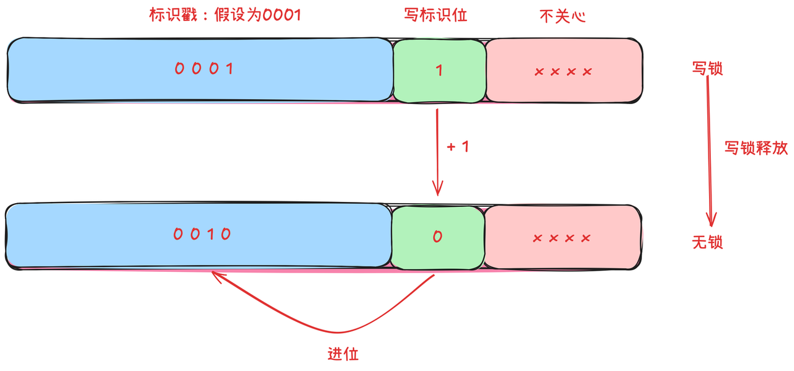


```plain&#x20;text
public void unlockWrite(long stamp) {
    if (state != stamp || (stamp & WBIT) == 0L) // stamped变化了 或者 写标志位为0 ，这是不可能,直接抛出异常(因为现在是写锁在释放)
        throw new IllegalMonitorStateException();
    releaseWrite(stamp); // 释放
}

//releaseWrite(stamp)
private long releaseWrite(long s) {
    long nextState = state = unlockWriteState(s); // 重点看这个方法
    signalNext(head);
    return nextState;
}

//unlockWriteState(s) - stamped
private static long unlockWriteState(long s) {
    /*
        如果溢出了,则恢复到ORIGIN(256) - 依旧能够实现下面两个效果
        这里的操作实现了两个效果：
         1.清空写标识位(第8位)
         2.递增序列号
    */
    return ((s += WBIT) == 0L) ? ORIGIN : s;
}
```

下面在介绍一下：state的变化

初始化状态：


初始化状态

读锁获取：不会修改序列号


读锁获取

写锁获取：注意序列号是前57位,不是前56位(写锁标识位也被包含在内),会修改序列号


写锁获取

写锁释放：会修改序列号


写锁释放

所以在乐观读的过程中，一旦出现写线程获取或者释放写锁,那么序列号就会发生变化,那么此次乐观读就是失败的，那么升级到悲观读,确保读取是有效的。

这样通过乐观读就能实现读写并发，只有在少数几次需要重新读,同时不会阻塞写线程(前提是使用乐观读),在读多写少的情况下，能够使性能更上一层楼。

到这里关于StampedLock的基本原理就讲到这里了，总结一下：相比于RWLock,StampedLock的特点如下： 1.允许读写并发 2.使用cowaiters来减少竞争,提高性能 3.使用spins来缓解锁饥饿 4.state的分段作用&#x20;

总结：java.util.concurrent.locks包下的类的基本原理已经讲的差不多了,其中的LockSupport.park()/unpark()是如何阻塞和唤醒线程的,则留到讲jvm的线程原理时再介绍。 后续会继续分析java.util.coucurrent的其他包(只剩下一个atomic包了)和其他类的基本原理 最后：感谢阅读，若有任何讲的不对的地方，欢迎提出，感谢！

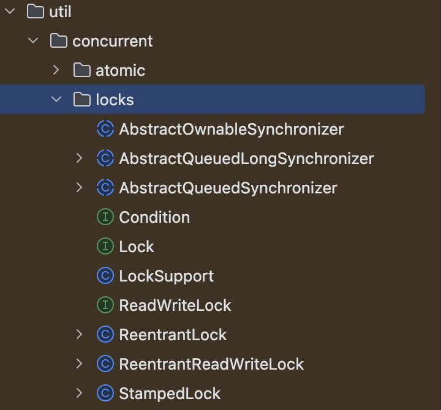

