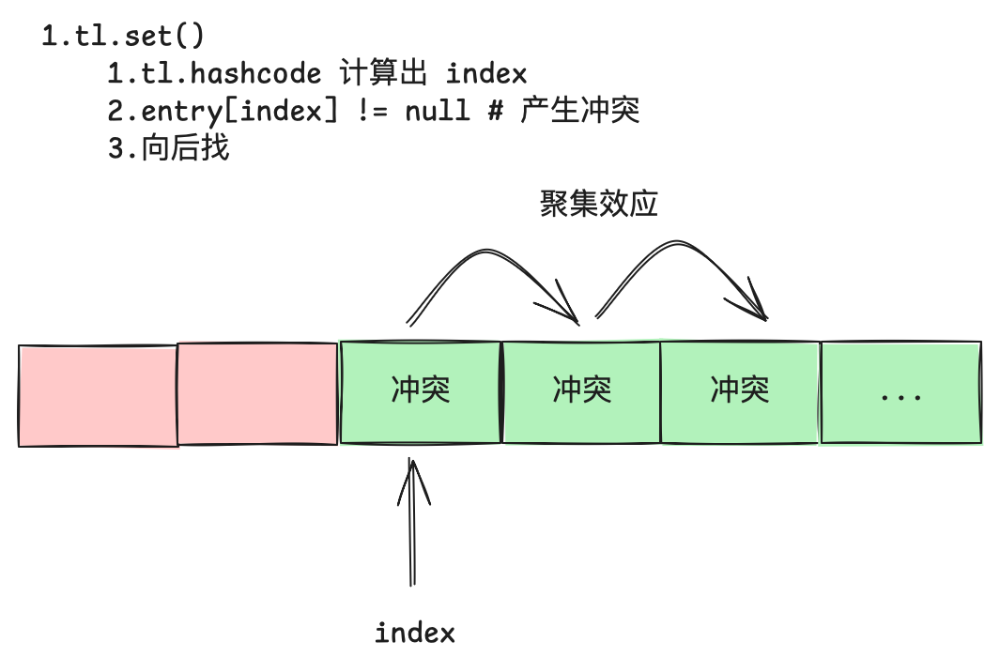
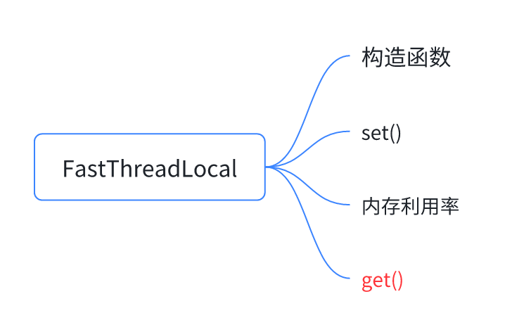
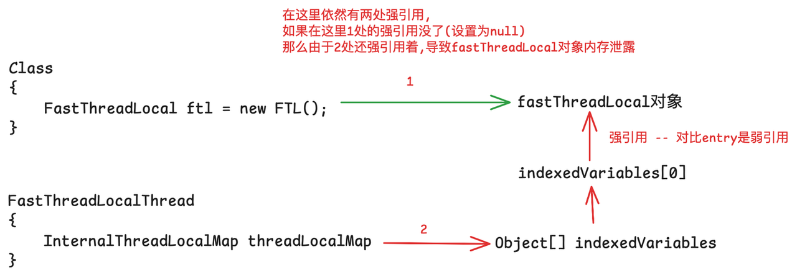

本篇文章介绍一下Netty框架的ThreadLocal -> FastThreadLocal「后续简称FTL 和 TL」

基于Netty版本:4.2.6.Final

## jdk的TL的缺点

在介绍FTL之前,先回顾一下jdk中TL的"不足",以下为我的理解：

1. 哈希冲突与线性探测法：目前接触到的哈希冲突的解决办法有两种：一种是hashMap中的链地址法，另外一种则是在ThreadLocal中的线性探测法

2. 链地址法：数组+链表(在实际中还使用了红黑树来做性能优化)：数组主要是用来做索引的，而数据则主要存储在数组外部 - 链表中，当冲突发生时，只需要在这个小范围中去线性搜索

3. 线性探测法：将所有的数据都放在数组内部，当冲突发生时,主动的去寻找下一个空位

当然两者都有各自的优点和缺点,在这里就简单讲一下TL所用的线性探测法的缺点：

TL的”不足“

&#x20;缺点： 1.**聚集效应,这是最致命的缺点**,一旦出现较长的连续占用块,任何哈希到该区域的key都需要很长的时间才能找到空位。 删除操作：非常复杂,因为不能简单的将数组槽位置空,具体的原因在TL的文章中详细讲过了

2.**内存泄露风险：** 在TL文章中讲过,这里的内存泄露分为两部分，一个是ThreadLocal本身的内存泄露,另外一个是entry和value的内存泄露。 而ThreadLocal对entry的key采用了弱引用来解决这个问题。 但是对于entry和value的内存泄露,虽然threadLocal采用了内部补救的方式,但是还是无法完全避免

3.**性能开销** 有一句名言：You don’t pay for what you don’t use ThreadLocal在get()/set()操作时,都可能会尝试做清理操作,虽然能够在一定程度上避免内存泄露，但是带来了额外的CPU开销

而在高并发,低延迟的网络通信中，jdk中的ThreadLocal的缺点会被无限放大,最终可能成为性能瓶颈,因此Netty设计了FastThreadLocal来代替ThreadLocal「从名字上就可以听出 ， 它应该很快」

## FastThreadLocal

那么应该如何避免TL的聚集效应呢？ 在这里先回顾一下TL的工作方式「简要介绍」：每一个tl对象都有hashcode,在调用tl.set()的时候，会使用这个hashcode来计算出它在map中entry\[]的下标index，获取entry\[index]上的entry对象 1.如果为空，那么创建一个新的entry，存放到到entry\[index] 2.如果不为空,并且entry.key == 当前tl,那么使用新值覆盖旧值即可 3.**如果不为空，并且也不相等,那么会继续往后找**

聚集效应最大的问题就是在第三步,第1步和第2步都是O(1)的,如果能够解决掉第3步的瓶颈,那么性能自然就上去了。 这还不简单? 从 线性探测法 换成 链地址法 不就行了？ 链地址法也有他的缺点，比如它的cache友好型就不如数组....「当然还有其他的不足」。

如果是基于数组的特性来做优化，应该如何做呢？ 为什么会出现上述的问题呢？因为通过每个threadLocal的hashcode「不管是什么黄金数字/黄金分割 」计算下标时，不可避免的会产生冲突，而产生冲突就可能会出现聚集效应。

那么是否可以从这里作为出发点呢？也即不要产生冲突？但是又没有一个完美的哈希算法来避免哈希冲突，应该怎么做呢？ -> 没有完美的哈希函数 -- 哈希冲突 -- 聚集效应&#x20;

要解决这个死循环的方法有：1.找到一个完美的哈希算法 2.不要用哈希的方式来计算每个tl所在的位置

在这里FTL采用的则是第2种方式：也即不再采用hash的方式来决定每个FTL对象在数组中的下标，而是采用基于index，也即每一个FTL对象都有一个唯一对应的数组槽位「但是显然这会付出一定的代价」

### 源码解析

前提：使用FTL的前提是需要线程是FastThreadLocalThread(Netty内部的线程默认就是该类型的)

下面开始介绍FTL是如何工作的

* **构造函数**

这里涉及到了一个核心属性index以及一个很重要的类InternalThreadLocalMap 对比一下ThreadLocal的构造函数, threadLocal在初始的时候计算hashcode, 而FTL在初始的时候计算index

* **InternalThreadLocalMap类**

其结构为：

继续回到FTL的构造函数,可以看出每一个FTL对象在初始化时都会设置自己的index,并且这个index是自增的 结构如下： 这里就是和ThreadLocal不同的一点,不是采用hash值,而是index,每个FTL对象固定放在一个位置，永远不会产生冲突

下面看下Netty中的线程：每个线程对象都有一个InternalThreadLocalMap属性，并且也是懒加载，应该是在线程第一次set('xx')的时候才会进行初始化

* set()

看下map的初始化过程 此时的结构如下：

下面继续看set()方法

* setKnownNotUnset()

1.调用getAndSetIndexedVariable()设置value，并且返回旧值，从这个方法可以看到，Netty中的数组没有阈值这个概念,只有当tl对应的index 大于数组的当前容量时，才会扩容。这会导致什么问题？ -- **内存浪费(或者说空间利用率低,也即使用内存来换取性能)** 2.如果当前线程是第一次set(),那么还会调用addToVariablesToRemove()方法

继续看下addToVariablesToRemove()，当线程第一次调用某个FTL.set()时的额外操作 在这里每个线程中的map的数组对象的index = 0 都是一个Set<>集合,用来跟踪所有set过的FTL对象 此时的结构为：&#x20;

此时的结构

验证一下：

所以当线程第一次调用ftl-x.set(value)时会做以下事情： 1.将value设置到对应的槽位上去 2.如果是第一次设置,则可能会初始化一个set集合,然后将其添加到该set中进行保存 3.如果index > 数组的长度,那么还会出发扩容

下面再看下扩容的操作：expandIndexedVariableTableAndSet(index, value)，index是当前FTL对象的index,value就是要存储的值。「新容量计算 和 数组拷贝, 逻辑比较清晰」

下面来看下为什么在上面说FastThredLocal的设计其实是用内存来换取性能呢？ 之前介绍过,在创建FastThreadLocal的时候就会初始化每个FTL对象对应的index属性：注意在创建的时候就会初始化index（这会影响到InternalThreadLocalMap中的nextIndex属性 - - 因为每个FTL对象的index都是通过返回nextIndex属性 并且 递增它 来获取的）

而在set()中,如果发现当前的FTL对象的index > indexedVariables\[].length , 那么就会出发扩容。 前提：每个线程内部的map对应的数组的初始容量都为32（其中0位置是用来存放set集合的），剩下31个位置是用来存放对应的value值的，如果此时已经创建了32了FTL对象「 FTL-1 \~ FTL-32」,FTL-32的index = 32， 那么如果有个线程执行如下代码：

数组容量为64

可以看到，由于Netty中的ThreadLocal采用的是基于index的方式，虽然避免了JDK中ThreadLocal的哈希冲突带来的影响，但是Netty中的每一个线程都需要为它没有使用到的FastThreadLocal预留空间，也即Netty是使用内存来换取性能的一种做法(当然,如果线程没有不需要的ThreadLocal「或者很少」，那么这里就不算缺点了)。

下面来看下get()方法：正常逻辑就是返回index上的value即可，但是如果线程之前没有set()过,就调用get()方法，那么这里有一个扩展方法：initialValue() - 但是默认为null,所以这里的结构会有点奇怪： index = 1 位置上为存储的是null

下面在简单看一下“内存泄露”相关的内容： 在TL的文章中说过ThreadLocal的内存泄露包括“两部分”：&#x20;

但是在FastThreadLocal中,没有entry,所以在这里的引用情况为：

在这里可没有entry,没有兜底的清理策略,那么Netty是如何处理的呢？ ThreadLocal虽然存在兜底策略，但是为什么要兜底呢？还不是因为没有调用remove()，才导致的性能下降「get()/set()如果遇到了stale entry，那么需要做清理操作」

那么如果调用了remove()，不就不存在这些问题了 如下图所示：

到这里FastThreadLocal的简单介绍就到这里了。 核心要点： 1.使用index来代替hash 2.主动清理来彻底避免内存泄露

