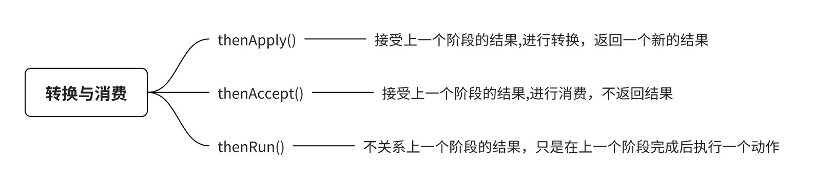
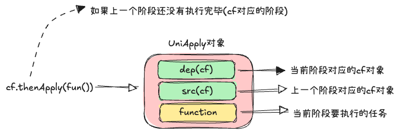
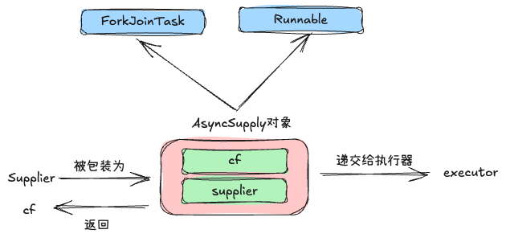
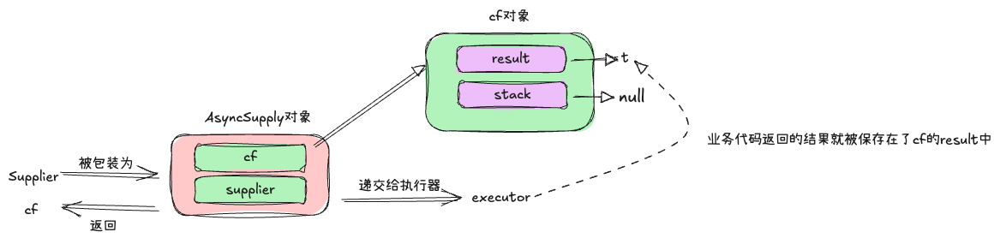
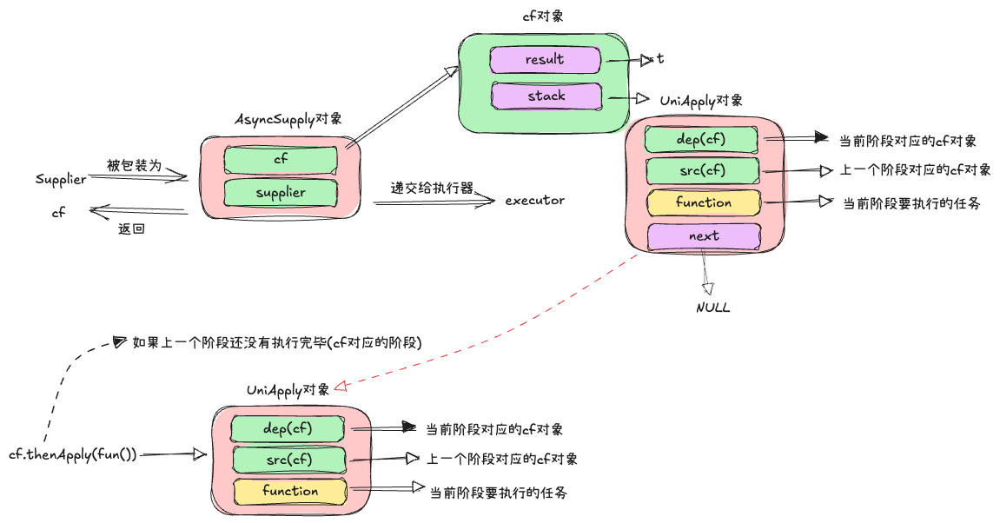
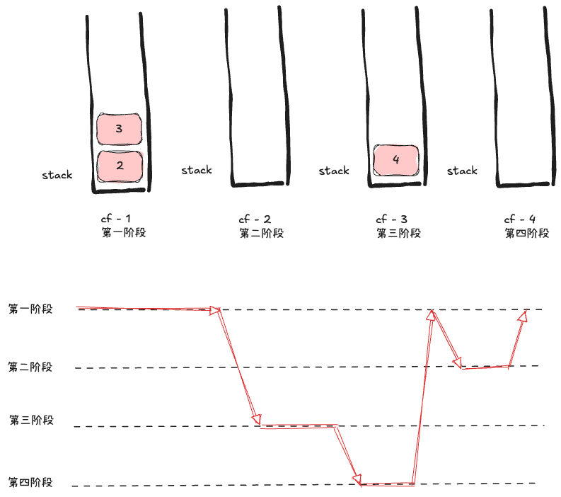

## 介绍

> 在该接口出现之前,java的异步编程主要依赖Future接口(FutureTask),但是Future有以下主要痛点
>
> 1. 获取结果阻塞：future.get()方法是阻塞的
>
> 2. 组合能力弱：很难表达组合逻辑，比如"当任务A完成后，再执行任务B，然后再将两者的结果合并"这样的逻辑，通常需要手动编写回调函数(但是jdk的future原生也不支持回调)，会使得代码变得臃肿并且难以维护(以及回调地域)
>
> 3. 异常处理不便
>
> 4. 不能手动的设置一个future的结果

该接口的核心思想就是：**stage（阶段）**

其将一个复杂的异步流程分解为了一系列相互依赖的阶段，

每个CompletionStage代表一个异步计算的一个步骤或者一个阶段，

这个阶段可能在等待上一个阶段的结果,可能正在执行，也可能已经完成,

CompletionStage接口中的所有方法返回的全部都是CompletionStage对象

## 使用案例

* 转换与消费



```java
// thenApply()
public static void main(String[] args) throws ExecutionException, InterruptedException {
    ExecutorService executorService = Executors.newFixedThreadPool(10);
    CompletableFuture<String> future = CompletableFuture.supplyAsync(() -> {
        System.out.println("hello thread : " + Thread.currentThread().getName());
        return "hello result";
    },executorService); // executorService指定线程池
    // 接受前一个阶段的结果,处理后返回一个新的结果
    CompletableFuture<String> transformed = future.thenApply(result -> {
        System.out.println("thenApply result thread : " + Thread.currentThread().getName());
        return result + " thenApply";
    });
    System.out.println(transformed.get()); // 这里依旧是阻塞的!
}
// out put 可以看到,这种方式中,多阶段是在同一个线程中执行的
hello thread : ForkJoinPool.commonPool-worker-19
thenApply result thread : ForkJoinPool.commonPool-worker-19
hello result thenApply

//out put 当然可以使用普通的线程池
hello thread : pool-1-thread-1
thenApply result thread : pool-1-thread-1
hello result thenApply

// thenAccept()
public static void main(String[] args) throws ExecutionException, InterruptedException {
    ExecutorService executorService = Executors.newFixedThreadPool(10);
    CompletableFuture<String> future = CompletableFuture.supplyAsync(() -> {
        System.out.println("hello thread : " + Thread.currentThread().getName());
        return "hello result";
    }, executorService);
    // 接受前一个阶段的结果,只处理结果,不会返回新的结果
    CompletableFuture<Void> transformed = future.thenAccept(result -> {
        System.out.println("thenAccept result thread : " + Thread.currentThread().getName());
    });
    System.out.println(transformed.get()); // 这里获取的就是null,因为thenAccept没有返回值
}

//out put
hello thread : pool-1-thread-1
thenAccept result thread : pool-1-thread-1
null

// thenRun() 不关心上一个阶段的执行结果
public static void main(String[] args) throws ExecutionException, InterruptedException {
    ExecutorService executorService = Executors.newFixedThreadPool(10);
    CompletableFuture.supplyAsync(() -> {
        System.out.println("hello thread : " + Thread.currentThread().getName());
        Tools.sleep(2);
        System.out.println("after sleep");
        return "hello result";
    }, executorService).thenRun(() -> {
        System.out.println("then run after hello stage :" + Thread.currentThread().getName());
    });
}

// out put
hello thread : pool-1-thread-1
after sleep
then run after hello stage :pool-1-thread-1
```

在上面展示的是多个阶段(stage)都是在同一个线程执行的，当然cf也支持不同的阶段在不同的线程中执行

```java
// 以thenRunAsync()为例,thenApplyAsync() & thenAcceptAsync() 也是同理
public static void main(String[] args) throws ExecutionException, InterruptedException {
    ExecutorService executorService = Executors.newFixedThreadPool(10);
    CompletableFuture.supplyAsync(() -> {
        System.out.println("hello thread : " + Thread.currentThread().getName());
        Tools.sleep(2);
        System.out.println("after sleep");
        return "hello result";
    }, executorService).thenRunAsync(() -> {
        System.out.println("then run after hello stage :" + Thread.currentThread().getName());
    }, Executors.newFixedThreadPool(10));
}

// out put
hello thread : pool-1-thread-1
after sleep
then run after hello stage :pool-2-thread-1
```

关于CompletableFuture更多的使用案例就不再赘述，下面也只是选择最简单的案例来讲解CompletableFuture的基本工作原理

* 源码讲解案例：主要思考一个问题：**<span style="color: rgb(216,57,49); background-color: inherit">上一个阶段执行完毕后是如何自动调用下一个阶段的？</span>**

```java
// 后续讲解案例：supplyAsync() -> thenApply() -> thenRun()
public static void main(String[] args) {
    ExecutorService executorService = Executors.newFixedThreadPool(10);
    CompletableFuture.supplyAsync(() -> {
        System.out.println("hello thread : " + Thread.currentThread().getName());
        return "hello result";
    }, executorService).thenApply(result -> {
        System.out.println("then apply result : " + Thread.currentThread().getName());
        return result + " world";
    }).thenRun(() -> {
        System.out.println("then run completed");
    });
}
```

* supplyAsync()

在这里以普通的线程池为例

```java
public static <U> CompletableFuture<U> supplyAsync(Supplier<U> supplier,
                                                   Executor executor) {
    return asyncSupplyStage(screenExecutor(executor), supplier);
}

static <U> CompletableFuture<U> asyncSupplyStage(Executor e,Supplier<U> f) {
    if (f == null) throw new NullPointerException(); // 不允许supplier为null
    // 每一个阶段都对应一个CompletableFutured,这是支持链式调用的基础
    CompletableFuture<U> d = new CompletableFuture<U>(); 
    // 在这里会将要执行的任务和cf包装为AsyncSupply对象,然后递交给执行器执行
    e.execute(new AsyncSupply<U>(d, f));
    return d;
}
```

此时的结构如下：

注意这里的执行是异步的,提交任务的线程在执行完SupplyAsync()时,将任务丢给线程池后就会返回一个cf对象。

那么问题就来了

1. 当前阶段执行完后如何自动的调用下一个阶段呢？「栈」

2. 下一个阶段如何判断上一个阶段是否执行完毕了呢？「看下面的代码」


```java
public static void main(String[] args) throws ExecutionException, InterruptedException {
    ExecutorService executorService = Executors.newFixedThreadPool(10);
    CompletableFuture<String> future = CompletableFuture.supplyAsync(() -> {
        System.out.println("hello thread : " + Thread.currentThread().getName());
        Tools.sleep(10000); // 模拟耗时,该阶段一直不执行完毕
        System.out.println("after sleep");
        return "hello result";
    }, executorService);
    System.out.println("==== 1");
    Tools.sleep(2);
    System.out.println("==== 2");
    /**
     * 可以看到,thenApply()本身是异步的,但是其对应的阶段必须等待上一个阶段执行完毕后才能执行
     * 那么cf是如何做到,让阶段(任务)按照流水线的方式执行的呢？
     */
    CompletableFuture<Object> future1 = future.thenApply(result -> {
        System.out.println("thenApply thread : " + Thread.currentThread().getName());
        return result + "world";
    });
    System.out.println("==== 3");
    System.out.println(future1.get());
}

// out put
==== 1
hello thread : pool-1-thread-1
==== 2
==== 3 // thenApply()本身是异步的
```

这种上一个执行完再执行下一个的模式，有点类似于栈(先进先出)，在这里先看下cf的结构

```java
/*-----这两个变量是非静态的,是属于专门的cf对象的------*/
// 用于存储当前阶段(cf)的执行结果
volatile Object result;       // Either the result or boxed AltResult
// 栈
volatile Completion stack;    // Top of Treiber stack of dependent actions
```

* thenApply()

```java
public <U> CompletableFuture<U> thenApply(
    Function<? super T,? extends U> fn) {
    return uniApplyStage(null, fn);
}

private <V> CompletableFuture<V> uniApplyStage(
    Executor e, Function<? super T,? extends V> f) {
    // ...null值判断
    Object r;
    // 这里的result是上一个阶段cf中的result,如果不为空(代表上一个阶段已经执行完毕了)
    // 那么进入到uniApplyNow(r, e, f)
    if ((r = result) != null)
        return uniApplyNow(r, e, f);
    // 否则上一个阶段还没有执行完毕,那么在这里创建一个新的cf对象
    CompletableFuture<V> d = newIncompleteFuture();
    /*
        UniApply(): 
              将 d(当前阶段所对应的cf对象),this(上一个阶段的cf对象),f(当前阶段要执行的任务)
              包装为一个UniApply对象
        unipush():这里调用的是上一个阶段的cf对象的unipush()方法
    */
    unipush(new UniApply<T,V>(e, d, this, f));
    return d;
}
```


* UniApply构造函数

```java
UniApply(Executor executor, 
         CompletableFuture<V> dep, // 当前阶段所对应的cf对象
         CompletableFuture<T> src, // 上一个阶段所对应的cf对象
         Function<? super T,? extends V> fn) { // 当前阶段要执行的任务
    super(executor, dep, src); 
    this.fn = fn;
}

// super()
UniCompletion(Executor executor, CompletableFuture<V> dep,
              CompletableFuture<T> src) {
    this.executor = executor;  // 默认为null
    this.dep = dep; 
    this.src = src;
}
```

此时的结构如下：



* unipush(UniApply)

此时的调用方是上一个阶段的future调用的

```java
final void unipush(Completion c) {
    if (c != null) { // 当前阶段所对应的comPletion对象(对应上面的UniApply对象)
        // 一个while()死循环,尝试将当前c推入到上一个阶段cf对象的stack中
        // 因为采用的是cas算法,所以这里需要使用while循环 - 先看下该方法
        while (!tryPushStack(c)) {
             // ...
        }
        // ...
    }
}
```

在正式阅读该方法之前,需要看下第一个阶段(通过supplyAsync()提交的任务)的执行过程




```java
// 在这里会交给线程池来执行 
//     - 最终会来到runWorker() -> task.run()「在这里对应的就是AsyncSupply.run()」
e.execute(new AsyncSupply<U>(d, f));

/*
    AsyncSupply.run()
        - d:cf对象
        - f:supplier对象,当调用supplier.get()方法时就是代表执行我们编写的业务代码
        upplier supplier = new Supplier() {
            @Override
            public Object get() {
                System.out.println("hello thread : " + Thread.currentThread().getName());
                Tools.sleep(10000); // 模拟耗时,该阶段一直不执行完毕
                System.out.println("after sleep");
                return "hello result";
            }
        };
*/
public void run() {
    CompletableFuture<T> d; Supplier<? extends T> f;
    if ((d = dep) != null && (f = fn) != null) {
        dep = null; fn = null;
        // 当前阶段还没有执行完毕
        if (d.result == null) {
            try {
            /*
                1.f.get()：这里会执行我们编写的业务代码,并且得到返回值
                2.调用cf.completeValue()方法：设置执行结果
            */
                d.completeValue(f.get());
            } catch (Throwable ex) {
                d.completeThrowable(ex); // 异常处理..
            }
        }
        d.postComplete(); // 触发依赖
    }
}

/*
    d.completeValue(f.get()) 设置执行结果,当get()的返回值为null时,这里会用NIL对象来包装
        - 因为cf是通过内部的result是否等于null来判断对应的阶段是否执行完毕的
        - 但是如果业务确实是执行完毕,只不过返回值是null而已
        - 那么为了区分两种状态：未完成 & 完成了但是返回值为null
        - 就引入了这个AltResult类(使用该类来包装业务代码返回的null值,与未完成做区分)
*/
/** Completes with a non-exceptional result, unless already completed. */
final boolean completeValue(T t) {
    return RESULT.compareAndSet(this, null, (t == null) ? NIL : t);
}
static final class AltResult { // See above
    final Throwable ex;        // null only for NIL
    AltResult(Throwable x) { this.ex = x; }
}
static final AltResult NIL = new AltResult(null);
```

此时的结构如下：



此时在会过头来看下unipush(UniApply)方法

```java
final void unipush(Completion c) {
    if (c != null) { // 当前阶段所对应的comPletion对象(对应上面的UniApply对象)
        // 一个while()死循环,尝试将当前c推入到上一个阶段cf对象的stack中
        // 因为采用的是cas算法,所以这里需要使用while循环 - 先看下该方法
        while (!tryPushStack(c)) {
             // ...
        }
        // ...
    }
}

// tryPushStack(c)
/** Returns true if successfully pushed c onto stack. */
final boolean tryPushStack(Completion c) {
    Completion h = stack; // 获取上一个阶段cf的stask(默认为null)
    NEXT.set(c, h);         // CAS piggyback cas的将 c.next 设置为 h
    return STACK.compareAndSet(this, h, c); // 更新cf中stack的引用
}
```

此时的结构如下：UniApply对象被压入栈的前提是result为null（下图中是演示执行完后设置的），因为如果result不为null,那么就不会压入栈中了



现在在回到之前的run()方法中

```java
public void run() {
    CompletableFuture<T> d; Supplier<? extends T> f;
  // ... 省略代码
        d.postComplete(); // 触发依赖
    }
}

// d.postComplete(); 触发依赖
final void postComplete() {
    /*
     * On each step, variable f holds current dependents to pop
     * and run.  It is extended along only one path at a time,
     * pushing others to avoid unbounded recursion.
     */
    CompletableFuture<?> f = this; Completion h;
    while ((h = f.stack) != null ||
           (f != this && (h = (f = this).stack) != null)) { // 获取第一阶段对应的cf中的stack
        CompletableFuture<?> d; Completion t;
        if (STACK.compareAndSet(f, h, t = h.next)) { // 弹出栈顶元素(UniApply对象)
            // ...
            /*
                调用UniApply.tryFire()方法
                    - 如果返回的是null,那么继续当前cf的stack处理
                    - 否则处理返回的d的stack
            */
            f = (d = h.tryFire(NESTED)) == null ? this : d;
        }
    }
}
```

* tryFire()

先回顾一下当前的结构：


```java
/*
mode = NESTED(-1),因为这里是嵌套执行,用于依赖链的级联触发
*/
final CompletableFuture<V> tryFire(int mode) {
    CompletableFuture<V> d; CompletableFuture<T> a;
    Object r; Throwable x; Function<? super T,? extends V> f;
    /*
        看上图：
        这里的dep(d):指的是当前阶段的cf对象
        src(a):指的是上一个阶段的cf对象(依赖的)
        fn:当前阶段要执行的动作
    */
    if ((d = dep) == null || (f = fn) == null
        || (a = src) == null || (r = a.result) == null) // r是上一个阶段的执行结果
        return null;
    tryComplete: if (d.result == null) { // 如果d不为null,那就不需要执行了(正常情况下就是为null的)
        // .. 异常处理
        if (r instanceof AltResult) {
            if ((x = ((AltResult)r).ex) != null) {
                d.completeThrowable(x, r);
                break tryComplete;
            }
            r = null;
        }// end for ex handle
        try {
            if (mode <= 0 && !claim())  // claim()返回true代表是由当前线程执行
                return null;
            else {
                 T t = (T) r; // r是上一个阶段执行的结果
                /*
                    当前线程执行：
                        - f.apply(t):这里的f就是当前阶段要执行的任务,并且将上一个阶段的结果传递给了f
                            而这里的apply就是我们编写的业务代码
                            Function<String, String> function = new Function<>() {
                                    @Override
                                    public String apply(String s) {
                                        // todo
                                        return "";
                                    }
                                };
                        - d.completeValue(res):res是当前阶段执行的结果,设置当前阶段的执行结果
                */
                d.completeValue(f.apply(t));
            }
        } catch (Throwable ex) {
            d.completeThrowable(ex);
        }
    }
    dep = null; src = null; fn = null;
    /*
        d:当前阶段对应的cf对象
        a:上一个阶段对应的cf对象
        mode:执行模式
    */
    return d.postFire(a, mode); 
}
// claim()
final boolean claim() {
    /*
         这里的e是当前阶段cf对应的executor,目前讨论的是supplyAsync().thenApply().thenRun()
         也即所有阶段都是在同一个线程中执行的情况.所以这里的e展示为空
    */
    Executor e = executor; 
    // cas 设置tag从0->1,确保只有一个线程能够执行
    if (compareAndSetForkJoinTaskTag((short)0, (short)1)) {
        if (e == null) // e为null的话,则会返回true,否则调用e.execute()进行异步的执行
            return true;
        executor = null; // disable
        e.execute(this);
    }
    return false;
}
```

到这里关于CompletableFutured的基本原理就介绍到这里(目前所了解的连冰山一角都没有),在这里总结一下大概的处理流程：

核心特点：栈(后进先出)，深度优先遍历(而不是广度优先遍历)




```java
public static void main(String[] args) throws ExecutionException, InterruptedException {
    ExecutorService executorService = Executors.newFixedThreadPool(10);
    CompletableFuture<String> future = CompletableFuture.supplyAsync(() -> {
        System.out.println("stage - 1 :"+Thread.currentThread().getName());
        return "hello";
    },executorService);
    CompletableFuture<String> future_1 = future.thenApply(result -> {
        System.out.println("stage - 2 :"+Thread.currentThread().getName());
        return result + " world-1";
    });

    CompletableFuture<String> future_2 = future.thenApply(result -> {
        System.out.println("stage - 3 :"+Thread.currentThread().getName());
        return result + " world-2";
    });

    CompletableFuture<Void> none = future_2.thenRun(() -> {
        System.out.println("stage - 4 :"+Thread.currentThread().getName());
    });
}

// out put
stage - 1 :pool-1-thread-1
stage - 3 :pool-1-thread-1
last stage :pool-1-thread-1
stage - 2 :pool-1-thread-1

```

那么cf是如何解决回调地狱的呢？栈/发布-订阅模型/生产者消费者模型

