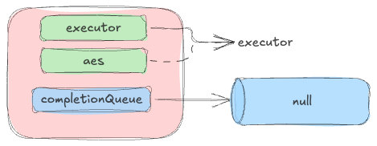
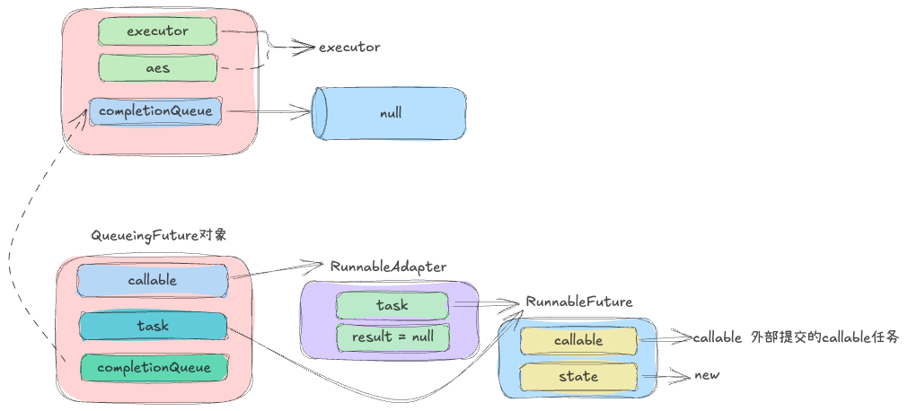
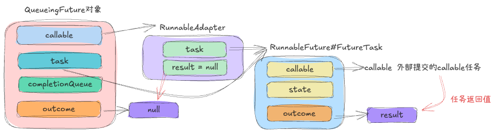
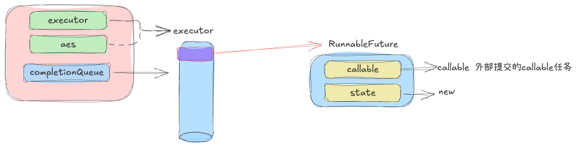
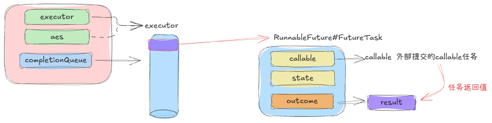

# CompletionService

> 该接口及其实现类的出现是为了解决传统ExecutorService在处理异步任务时的关键痛点
>
> 那就是不&#x6309;**<span style="color: rgb(216,57,49); background-color: inherit">提交顺序</span>**，而是按&#x7167;**<span style="color: rgb(216,57,49); background-color: inherit">完成顺序</span>**&#x6765;处理结果

## 介绍

* 传统的ExecutorService方法

```java
public static void main(String[] args) throws Exception {
    ExecutorService executorService = Executors.newFixedThreadPool(5);
    List<Future> futureList = new ArrayList<>();
    futureList.add(executorService.submit(() -> {
        Tools.sleep(5);
        System.out.println("Task - 0 completed");
        return "Slow Task - 0";
    }));
    futureList.add(executorService.submit(() -> {
        Tools.sleep(1);
        System.out.println("Task - 1 completed");
        return "Fast Task - 1";
    }));
    futureList.add(executorService.submit(() -> {
        Tools.sleep(1);
        System.out.println("Task - 2 completed");
        return "Fast Task - 2";
    }));
    futureList.add(executorService.submit(() -> {
        Tools.sleep(1);
        System.out.println("Task - 3 completed");
        return "Fast Task - 3";
    }));
    futureList.add(executorService.submit(() -> {
        Tools.sleep(1);
        System.out.println("Task - 4 completed");
        return "Fast Task - 4";
    }));
    for (Future future : futureList) {
        System.out.println(future.get());
    }
}

// out put
Task - 1 completed
Task - 2 completed
Task - 3 completed
Task - 4 completed // 即使后面的fast task完成了,外部线程也无法获取到相应的结果,因为是按照任务提交顺序来获取结果的
Task - 0 completed 
Slow Task - 0
Fast Task - 1
Fast Task - 2
Fast Task - 3
Fast Task - 4
```

* 使用CompletionService

```java
public static void main(String[] args) throws Exception {
    ExecutorService service = Executors.newFixedThreadPool(5);
    ExecutorCompletionService<String> 
                executorService = new ExecutorCompletionService<>(service);
                
    // .... 和上面的代码一样
    
    for (int i = 0; i < 5; i++) {
            Future<String> future = executorService.take();
            System.out.println(future.get());
    }
}

// out put
/*
    可以看到fast task 执行完毕后,就能立即获取到结果,而不需要等待slow task执行完
    也即结果的获取,是按照任务完成的顺序,而不是提交的顺序
*/
Task - 1 completed
Task - 2 completed
Task - 3 completed
Fast Task - 1
Fast Task - 2
Fast Task - 3
Task - 4 completed
Fast Task - 4
Task - 0 completed
Slow Task - 0
```

* jdk注释文档阅读

```java
"A service that decouples the production of new asynchronous tasks 
from the consumption of the results of completed tasks."
将任务的生产与结果的消费解耦(生产者-消费者模型)
// ---
"Producers submit tasks for execution. Consumers take completed tasks 
and process their results in the order they complete."
生产者:调用submit()来生产任务
消费者:调用take()来获取已经完成任务的结果
// ---
"in the order they complete"
关键特性：不按提交顺序,而是按照完成的顺序
// ---
"Typically, a CompletionService relies on a separate Executor to actually execute the tasks, 
in which case the CompletionService only manages an internal completion queue."
内部实现细节：
 - Executor：实际执行任务的线程池
 - Completion Queue：内部完成队列，存储已完成的任务
// ---
"Memory consistency effects: Actions in a thread prior to submitting a task to a CompletionService 
happen-before actions taken by that task, which in turn happen-before actions following a successful return from the corresponding take()."
内存一致性保证：线程A提交任务前的操作 → 任务执行中的操作 → 线程B调用take()返回后的操作
```


## 源码解析

* 构造函数

```java
public ExecutorCompletionService(Executor executor) {
    if (executor == null)
        throw new NullPointerException();
    this.executor = executor;
    this.aes = (executor instanceof AbstractExecutorService) ?
        (AbstractExecutorService) executor : null;
    this.completionQueue = new LinkedBlockingQueue<Future<V>>();
}
// 支持自定义的队列
public ExecutorCompletionService(Executor executor,
                                     BlockingQueue<Future<V>> completionQueue) {}
```

可以看到这里只是对传入的执行器做了保存操作以及创建了一个阻塞队列(内部默认使用的是LinkedBlockingQueue,当然也支持指定的队列)

不过这里有一点：那就是当传入的执行器是AbstractExecutorService类型时,会额外的保存在aes这个属性中,这是为什么呢？

```java
private RunnableFuture<V> newTaskFor(Callable<V> task) {
    if (aes == null)
        return new FutureTask<V>(task);
    else
        return aes.newTaskFor(task);
}
```

在包装任务时如果aes不为空，那么使用aes的方法来创建任务，否则使用new方式，这是因为传入的执行器可能重写了newTaskFor()方法来添加监控,日志等功能。

此时的结构为：



* submit(runnable/callable)

由于runnable没有返回值，在这里以callable为例

```java
public Future<V> submit(Callable<V> task) {
    if (task == null) throw new NullPointerException(); // 不允许递交null任务
    RunnableFuture<V> f = newTaskFor(task); // 包装任务为futureTask
    executor.execute(new QueueingFuture<V>(f, completionQueue));//再使用QueueingFuture来包装
    return f;
}
```

这里引入了另外一个核心的类QueueingFuture,这个类会被执行器执行

```java
private static class QueueingFuture<V> extends FutureTask<Void> {
    /*----------------fields------------------*/
    private final Future<V> task;
    private final BlockingQueue<Future<V>> completionQueue;
    /*----------------constructor------------------*/
    QueueingFuture(RunnableFuture<V> task,
                       BlockingQueue<Future<V>> completionQueue) {
            super(task, null); // 调用父类的构造函数
            this.task = task;
            this.completionQueue = completionQueue;
     }
}
// newTaskFor(task) - 以这个为例子
public FutureTask(Callable<V> callable) {
    if (callable == null)
        throw new NullPointerException();
    this.callable = callable;
    this.state = NEW;       // ensure visibility of callable
}
// super()
public FutureTask(Runnable runnable, V result) {
    this.callable = Executors.callable(runnable, result);
    this.state = NEW;       // ensure visibility of callable
}
public static <T> Callable<T> callable(Runnable task, T result) {
    if (task == null)
        throw new NullPointerException();
    return new RunnableAdapter<T>(task, result);
}
RunnableAdapter(Runnable task, T result) {
    this.task = task;
    this.result = result;
}
```

此时的结构如下：被执行器处理的是这个QueueingFuture对象



```java
/*
    然后就是调用具体的executor.execute()方法
    关于线程池的原理这里不在赘述,最终会被工作线程调用task.run()方法,
    这里调用的是QueueingFuture.run() - futureTask.run()
*/
// futureTask(QueueingTask)#run()
public void run() {
     Callable<V> c = callable; // 这里获取的就是上面的 RunnableAdapter
     /*
           public T call() {
            task.run(); // 继续调用task.run() -> 这里调用的则是最内部的futureTask.run()
            return result;
            }
            注意：然后还会到这个方法,不过此时的对象为最内层的futureTask,然后set()
            这里set()的位置是最内层的task.outcome
     */
     result = c.call(); // 最外层的QueueingFuture获取到的是RunnableAdapter返回的null
     ran = true;
     set(result);
}
// set()
protected void set(V v) {
    outcome = v; // 将任务执行的结果保存到QueueingTask.outcome属性中
    finishCompletion();
}

// finishCompletion()
private void finishCompletion() {
    for (WaitNode q; (q = waiters) != null;) {...}
    done();
}
```

此时的结构为



* done()

这是一个扩展方法,而QueueingFuture就重写了这个方法

```java
 // 将执行完成的任务(task属性)添加到队列中
 protected void done() { completionQueue.add(task); }
```



* take()

```java
// 这个返回的就是futureTask,然后调用future.get()就能获取result了
public Future<V> take() throws InterruptedException {
    return completionQueue.take();
}
```



回过头来看看CompletionService是如何做的？
想要实现按照任务的完成顺序来获取结果，而不是任务的提交顺序,那么一种很自然的想法就是任务一旦执行完毕就告知外部："我执行完了"（换个角度来说就是外部线程能够获取到已经执行完任务的引用，那么自然能够获取到结果）

而这种实现则是通过任务(futureTask#done())来实现的，任务一旦执行完毕就会把自己添加到队列中，外部就能获取到

> 其实这种思想和epoll()有些类似，也即只感知就绪事件

