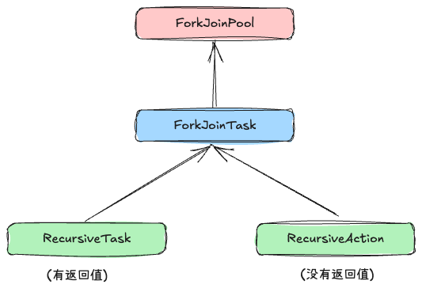
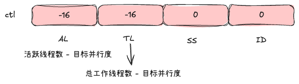
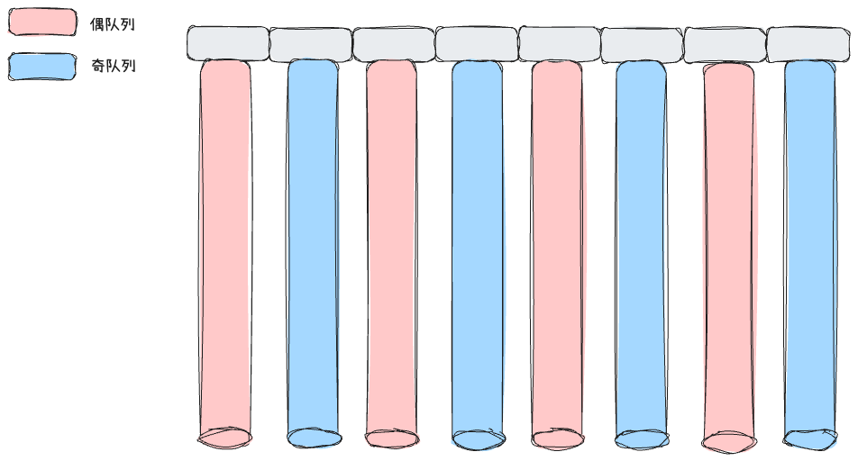
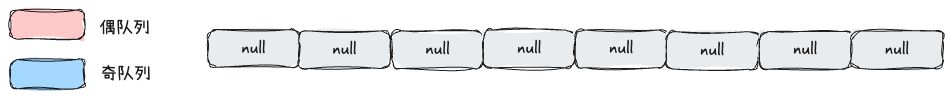
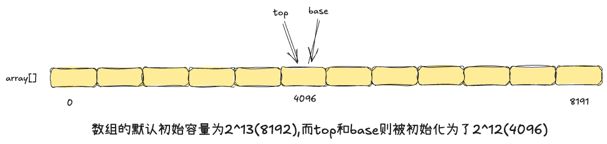
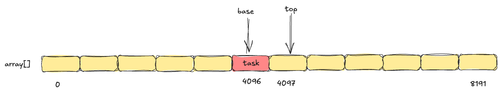
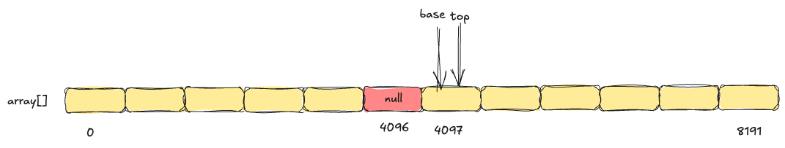
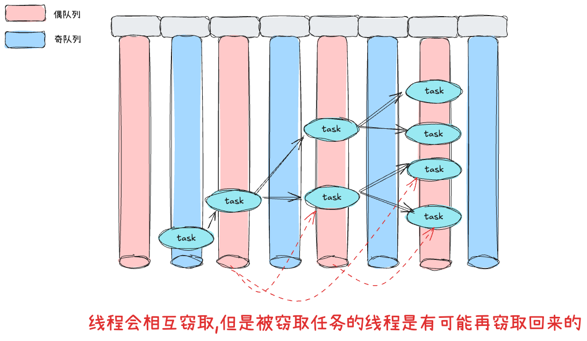

## 介绍

> ForkJoinPool 是 Java 7 引入的一个特殊的线程池实现，专门为"**<span style="color: rgb(216,57,49); background-color: inherit">分而治之</span>**"的并行计算场景设计

传统线程池的局限性：

* <span style="color: rgb(216,57,49); background-color: inherit">任务粒度不均</span>：传统线程池处理的任务通常粒度相似，不适合处理递归分解的任务

* <span style="color: rgb(216,57,49); background-color: inherit">工作窃取需求</span>：在递归任务中，不同线程的工作负载可能严重不平衡(多处理器的普及使得并行计算变得重要)

* 使用案例：求1到n的和

```java
// forkJoinPool的简单案例
public class SimpleForkJoinDemo {
// 定义阈值，当任务规模小于该值时直接计算
private static final int THRESHOLD = 1000;

// 自定义递归任务类，继承RecursiveTask
static class SumTask extends RecursiveTask<Long> {
    private final int start;
    private final int end;

    public SumTask(int start, int end) {
        this.start = start;
        this.end = end;
    }

    @Override
    protected Long compute() {
        // 如果任务规模小于阈值，直接计算
        if (end - start <= THRESHOLD) {
            long sum = 0;
            for (int i = start; i <= end; i++) {
                sum += i;
            }
            return sum;
        } else {
            // 否则拆分任务
            int mid = (start + end) / 2;
            // 创建子任务
            SumTask leftTask = new SumTask(start, mid);
            SumTask rightTask = new SumTask(mid + 1, end);
            /*
                这里可以以两种方式来执行：
                    - 同步执行右边任务
                    - 异步执行左边任务
                // 异步执行左任务
                leftTask.fork();
                Long rightResult = rightTask.compute();// 同步执行右边任务
                long leftResult = leftTask.join(); // 异步获取左边任务结果
                return leftResult + rightResult;
            */
            // 异步执行左任务
            leftTask.fork();
            rightTask.fork();
            // 获取左任务结果
            long leftResult = leftTask.join();
            // 获取右任务结果
            long rightResult = rightTask.join();
            return leftResult + rightResult;
        }
    }
}

public static void main(String[] args) {
    int n = 100000;
    long startTime = System.currentTimeMillis();
    long result = ForkJoinPool.commonPool().invoke(new SumTask(1, n));
    long endTime = System.currentTimeMillis();
    System.out.println("计算结果: " + result);
    System.out.println("耗时: " + (endTime - startTime) + "ms");

    long check = 0;
    for (int i = 1; i <= n; i++) {
        check += i;
    }
    System.out.println("校验结果: " + check);
}
```

* 数据结构



## 源码解析

* 内部字段

下面的介绍了解即可,在阅读具体流程时,使用到什么再查看即可

```java
/*---------------基本边界常量----------------*/
/*
    Bounds
        - 16位掩码,用于限制索引范围
        - 最大工作线程数-1
        - 偶数掩码,用于确保索引为偶数,在workQueue数组中,偶数索引用于外部提交,奇数索引用于工作线程
        - 限制工作队列槽位数(最多64个偶数槽位)
*/
static final int SMASK        = 0xffff;        // short bits == max index 
static final int MAX_CAP      = 0x7fff;        // max #workers - 1 
static final int EVENMASK     = 0xfffe;        // even short bits 
static final int SQMASK       = 0x007e;        // max 64 (even) slots 

/*
    Masks and units for WorkQueue.scanState and ctl sp subfield
        - 工作队列状态控制
        - scanState 字段的位布局：
        - [INACTIVE(1位) | 版本计数(15位) | SCANNING(1位) | 工作队列索引(15位)]
*/
static final int SCANNING     = 1;             // false when running tasks
static final int INACTIVE     = 1 << 31;       // must be negative
static final int SS_SEQ       = 1 << 16;       // version count

/*
    Mode bits for ForkJoinPool.config and WorkQueue.config
    队列模式控制：config
        - LIFO_QUEUE：工作线程使用，后进先出，提高缓存局部性
        - FIFO_QUEUE：外部提交使用，先进先出，保证公平性
        - SHARED_QUEUE：标记队列是否为共享队列
*/ 
static final int MODE_MASK    = 0xffff << 16;  // top half of int 模式掩码(高16位)
static final int LIFO_QUEUE   = 0;
static final int FIFO_QUEUE   = 1 << 16;
static final int SHARED_QUEUE = 1 << 31;       // must be negative
```

\--

```java
/*
 * ctl 字段的位和掩码，包含4个16位子字段：
 * AC: 活跃运行工作线程数减去目标并行度
 * TC: 总工作线程数减去目标并行度  
 * SS: 顶部等待线程的版本计数和状态
 * ID: 等待线程 Treiber 栈顶的 poolIndex
 *
 * 在方便时，我们可以提取低32位栈顶比特(包括版本比特)作为 sp=(int)ctl。
 * 通过目标并行度计算的计数偏移量和字段位置使得可以通过字段的符号测试执行
 * 最常见的检查：当 ac 为负时，活跃工作线程不足；当 tc 为负时，总工作线程不足。
 * 当 sp 非零时，存在等待的工作线程。为了处理可能为负的字段，我们使用"short"
 * 类型的转换和/或有符号移位来保持符号性。
 *
 * 由于它占据最高位，当从阻塞的 join 返回时，我们可以使用 AC_UNIT 的 getAndAddLong
 * 来增加一个活跃计数，而不是 CAS。其他更新涉及多个子字段和掩码，需要 CAS。
 */
 /*
     Lower and upper word masks
         - 将64位的ctl分割为高32位和低32位
         - 低32位掩码(栈指针)
         - 高32位掩码(计数字段)
 
 */ 
private static final long SP_MASK    = 0xffffffffL;
private static final long UC_MASK    = ~SP_MASK;

/*
    Active counts 
        - 活跃计数控制:跟踪活跃工作线程数与目标并行度的差值
        - 活跃计数位移量
        - 活跃计数单位
        - 活跃计数掩码
    
*/ 
private static final int  AC_SHIFT   = 48;
private static final long AC_UNIT    = 0x0001L << AC_SHIFT;
private static final long AC_MASK    = 0xffffL << AC_SHIFT;

/*
    Total counts：总计数控制
        - 总计数位移量
        - 总计数单位：用于增加/减少总工作线程数
        - 总计数掩码
        - 添加工作线程标识：设置符号位,代表需要创建工作线程
*/
private static final int  TC_SHIFT   = 32;
private static final long TC_UNIT    = 0x0001L << TC_SHIFT;
private static final long TC_MASK    = 0xffffL << TC_SHIFT;
private static final long ADD_WORKER = 0x0001L << (TC_SHIFT + 15); // sign

/*
    runState bits: SHUTDOWN must be negative, others arbitrary powers of two
    线程池的运行状态
        - 
*/
private static final int  RSLOCK     = 1;
private static final int  RSIGNAL    = 1 << 1;
private static final int  STARTED    = 1 << 2;
private static final int  STOP       = 1 << 29;
private static final int  TERMINATED = 1 << 30;
private static final int  SHUTDOWN   = 1 << 31;
```


\--&#x20;

```java
/*
    Instance fields
        - ctl:主池控制字段(分为4个部分)
            - AC(48~63位): 活跃工作线程数 - 目标并行度
            - TC(32~47位)：总工作线程数 - 目标并行度
            - SS(16~31位)：等待线程栈顶状态和版本号
            - ID(0~15位)：等待线程栈顶的工作队列索引
        - runState:可锁状态
        - config:并行度和模式配置(存储不可变的配置参数-并行度&队列模式)
        - indexSeed:生成工作索引的种子
            - 原子生成工作队列的唯一索引
        - workQueues：主注册表-所有工作队列的注册中心,采用奇偶索引策略
            - 偶队列：外部提交队列(FIFO)
            - 奇队列: 工作线程队列(LIFO)
        - factory：线程工作,具体生产线程的
        - ueh：异常处理器,处理工作线程中未捕获的异常,确保任务异常不会导致线程终止
        - workerNamePrefix：生成有意义的线程名称,便于监控和调试
        - stealCounter：
            - 统计功能：记录工作窃取的总次数
            - 同步监视器：在某些同步操作中作为锁对象
*/ 
volatile long ctl;                   // main pool control
volatile int runState;               // lockable status
final int config;                    // parallelism, mode
int indexSeed;                       // to generate worker index
volatile WorkQueue[] workQueues;     // main registry
final ForkJoinWorkerThreadFactory factory;
final UncaughtExceptionHandler ueh;  // per-worker UEH
final String workerNamePrefix;       // to create worker name string
volatile AtomicLong stealCounter;    // also used as sync monitor
```

* 构造函数

```java
/*
    在ForkJoinPool的静态代码块中初始化了线程工程:
    defaultForkJoinWorkerThreadFactory =
            new DefaultForkJoinWorkerThreadFactory();
*/
public ForkJoinPool(int parallelism) {
    this(parallelism, defaultForkJoinWorkerThreadFactory, null, false);
}
// --
public ForkJoinPool(int parallelism,
                    ForkJoinWorkerThreadFactory factory,
                    UncaughtExceptionHandler handler,
                    boolean asyncMode) {
    this(checkParallelism(parallelism),
         checkFactory(factory),
         handler,
         asyncMode ? FIFO_QUEUE : LIFO_QUEUE, // 默认是LIFO-缓存友好型
         "ForkJoinPool-" + nextPoolId() + "-worker-");
}
// --
// 这里假设希望的并行线程数为16(0x0000_0010),默认的队列模式是LIFO(默认为0)
private ForkJoinPool(int parallelism,
                     ForkJoinWorkerThreadFactory factory,
                     UncaughtExceptionHandler handler,
                     int mode,
                     String workerNamePrefix) {
    this.workerNamePrefix = workerNamePrefix;
    this.factory = factory;
    this.ueh = handler;
    // config = 0x0000_0010[就是16,这里这里的mode是LIFO,值为0],如果是FIFO,那么就是[0x0001_0010]
    this.config = (parallelism & SMASK) | mode; // config代表的是不可变属性：并行度&队列模式
    // np = -16 = 0xffff_ffff_ffff_fff0
    long np = (long)(-parallelism); // offset ctl counts
    /*
        (np << AC_SHIFT) & AC_MASK):计算AC值,AC值代表的是: 活跃线程数 - 期望并行数
            - 在这里的值为-16:0xfff0000000000000
        (np << TC_SHIFT) & TC_MASK):计算TC值,TC值代表的是：工作线程数 - 期望并行数
            - 在这里默认为-16: 0x0000fff000000000
        最终ctl的初始值:0xfff0fff000000000 - 十机制的值为-4222193370136576
    */
    this.ctl = ((np << AC_SHIFT) & AC_MASK) | (np << TC_SHIFT) & TC_MASK));
}
```

在构造函数中主要关注两个值：config和ctl

这这里为什么AC和TC要初始化为负数呢？并且TC的初始值为-1呢?

```markdown
1.为什么ForkJoinPool使用的是相对计数而不是绝对计数呢？
    - 比如直接使用activeCount/targetParallelism来直接记录活跃线程数和目标并行度呢？
    - 这里我认为的原因:
        - 符号检查:只需要判检查符号就能判断出状态
        - 原子操作:cas只能操作单个变量,无法一次性操作多个变量(将多个属性放在long的不同bit位,便于使用cas)
```

此时的结构如下：



从构造函数中可以看出来，ForkJoinPool采用的默认是懒加载的方式,初始化时并没有初始化工作队列以及相关线程。

那么在下面后续提交任务的过程中一定会涉及到各种分支(这是doug lea的一贯写法)

* invoke(Task)

> 在ForkJoinPool中还有另外两个提交任务的方法,submit(),execute(),在这里以invoke()为例

```java
public <T> T invoke(ForkJoinTask<T> task) {
    // ..异常处理
    externalPush(task); // #1 外部线程提交任务的核心方法
    return task.join(); // #2
}
```

* externalPush(task)



ForkJoinPool默认采用的是懒加载的方式,**在第一次提交任务之前,队列数组和工作线程并没有被初始化**

```java
final void externalPush(ForkJoinTask<?> task) {
    WorkQueue[] ws; WorkQueue q; int m;
    // ... 快速路径 - 跳过,这里和AQS的设计是一样的,在慢速路径中会包含快速路径的逻辑代码
     externalSubmit(task);
}

// externalSubmit(task)
private void externalSubmit(ForkJoinTask<?> task) {
    int r;                                    // initialize caller's probe
    // 初始化提交线程的随机探针
    if ((r = ThreadLocalRandom.getProbe()) == 0) {
        ThreadLocalRandom.localInit();
        r = ThreadLocalRandom.getProbe();
    }
    // 接下来就是一个大的for(;;)循环
     for (;;){...}
}
```

在for循环中就是该方法的核心逻辑,在这里首先看工作队列初始化的代码,因为工作队列是基石

```java
for(;;){

     if ((rs = runState) < 0){...} // 线程池被关闭,这里的重点是rs为runState的值
    else if ((rs & STARTED) == 0 ||     // initialize 初始化操作
         ((ws = workQueues) == null || (m = ws.length - 1) < 0)) {
    int ns = 0;
    rs = lockRunState(); // 对runState上锁 ，返回的是旧的rs
    // ....
}
}

// lockRunState()
private int lockRunState() {
    int rs;
    /*
        - ((rs = runState) & RSLOCK) != 0 
            - 如果runState中的锁标识位已经被设置了,那么代表已经有其他线程在操作了，需要等待
        - !U.compareAndSwapInt(this, RUNSTATE, rs, rs |= RSLOCK))
            - 否则此时还没有线程操作,那么cas设置锁标识位（保证线程安全性）
            - 但是如果竞争失败了，那么也需要等待
        - 否则 当前线程成功设置了RSLOCK标志,那么返回old rs
    */
    return ((((rs = runState) & RSLOCK) != 0 ||
             !U.compareAndSwapInt(this, RUNSTATE, rs, rs |= RSLOCK)) ?
            awaitRunStateLock() : rs);
}

/*
    awaitRunStateLock() 阻塞等待
*/

private int awaitRunStateLock() {
    Object lock;
    boolean wasInterrupted = false;
    for (int spins = SPINS, r = 0, rs, ns;;) {
        // 如果在阻塞之前另外的线程已经释放了RSLOCK,那么当前线程直接去cas尝试获取即可
        // 并且在这里会忽略中断
        if (((rs = runState) & RSLOCK) == 0) {
            if (U.compareAndSwapInt(this, RUNSTATE, rs, ns = rs | RSLOCK)) {
                if (wasInterrupted) {
                    try {
                        Thread.currentThread().interrupt();
                    } catch (SecurityException ignore) {
                    }
                }
                return ns;
            }
        }
        else if (r == 0)
            r = ThreadLocalRandom.nextSecondarySeed(); // 获取随机数种子
        else if (spins > 0) { // 自旋操作
            r ^= r << 6; r ^= r >>> 21; r ^= r << 7; // xorshift
            if (r >= 0)
                --spins;
        }
        // STARTED=0,但是又进入到了这个方法,说明出现了初始化队列冲突
        // 其他线程正在初始化,那么在这里让出CPU,避免CPU资源抢占
        else if ((rs & STARTED) == 0 || (lock = stealCounter) == null) 
            Thread.yield();   // initialization race
        // 否则阻塞等待,在这里会设置runState的RSIGNAL标志位,这代表有线程需要被唤醒
        // 在这里stealCounter起到了同步的作用
        else if (U.compareAndSwapInt(this, RUNSTATE, rs, rs | RSIGNAL)) {
            synchronized (lock) {
                if ((runState & RSIGNAL) != 0) {
                    try {
                        lock.wait();
                    } catch (InterruptedException ie) {
                        if (!(Thread.currentThread() instanceof
                              ForkJoinWorkerThread))
                            wasInterrupted = true;
                    }
                }
                else
                    lock.notifyAll();
            }
        }
    }
}
```

目前所涉及到的逻辑为:

1. 工作队列为null,需要进行初始化,在初始化之前会设置RunState的锁标识位

2. 设置成功的线程才能去执行初始化操作，其他的线程会阻塞(stealCount充当同步锁)

下面回到初始化队列的逻辑

```java
else if ((rs & STARTED) == 0 ||     // initialize
         ((ws = workQueues) == null || (m = ws.length - 1) < 0)) {
    int ns = 0;
    rs = lockRunState(); // 上面已经介绍过了,这里是获取锁标识的，并且返回的old rs
    try {
        if ((rs & STARTED) == 0) { // 线程池还没有启动
        // 在这里初始化stealCount属性: null -> 0
            U.compareAndSwapObject(this, STEALCOUNTER, null,
                                   new AtomicLong());
            // create workQueues array with size a power of two
            // 前面说过:config是用来存储不变的属性的 - 并行度(低16位) + 队列工作模式(高16位)
            /*
                下面的运算是用来计算工作队列的初始容量的,数组容量至少为2
                具体的原理和hashMap一样,找到离p-1最近的一个2次幂数
                在这里就以16为例,那么最终得到的结果就是为32
            */
            int p = config & SMASK; // ensure at least 2 slots
            int n = (p > 1) ? p - 1 : 1;
            n |= n >>> 1; n |= n >>> 2;  n |= n >>> 4;
            n |= n >>> 8; n |= n >>> 16; n = (n + 1) << 1;
            // 初始化工作队列数组(但是数组的每一个元素都是空的)
            workQueues = new WorkQueue[n]; // 当期望的并行度为16时,workQueue[]的初始长度为32
            // 更新线程池的状态为STARTED(已经启动)
            ns = STARTED;
        }
    } finally {
        // 释放锁(复原锁标识)
        unlockRunState(rs, (rs & ~RSLOCK) | ns);
    }
}
```

此时的结构如下：并且runState中的状态变为了STARTED



当工作队列数组初始化完毕后,那么下一步要做的操作应该是什么？

我们现在的流程是执行invoke(task)提交任务,所以最终的目的是要保存任务，然后启动线程来执行，

那么下一步应该就是保存任务,而任务又是保存在工作队列中的(上面只是初始化了工作队列数组而已，但是并没有初始化工作队列)。所以继续看下代码

```java
// 在这里初始化工作队列数组,下一步就是初始化工作队列并且存放任务了
else if ((rs & STARTED) == 0 ||     // initialize
                     ((ws = workQueues) == null || (m = ws.length - 1) < 0))
/*
    r是线程随机种子(可以理解为threadLocal中的hash值),m是工作队列数组长度-1,
    SQMASK（int）的值为:0x007e = 0x0000_0000_0111_1110
    按照threadLocal中的做法：index = r(hash)&m(length-1)其实就能算出来在数组中对应的位置了
    但是由于线程池是区分了奇偶队列的,所以这里的index与SQMASK再做一次&操作有两个功能:
        - 将队列长度限制在64之内
        - 外部提交任务时，一定是存放在偶队列
    在这里的判断是不为空(内部是存储任务以及启动线程的)
    但是在这之前需要先执行初始化工作队列的操作,这是在下一个else完成的
*/              
else if ((q = ws[k = r & m & SQMASK]) != null) {
    // ..
}
// 上面的else if不满足，那么代表对应的工作队列为空,在这里进行初始化
// 由于工作队列(偶队列)是所有外部线程(提交任务的线程)所共享的(多个外部线程可能会被分配到同一个工作队列)
// 所以在这里需要使用runState中锁标识来保证线程安全
else if (((rs = runState) & RSLOCK) == 0) { // create new queue
    q = new WorkQueue(this, null); // 创建队列,并且队列引用了当前线程池,由于是共享队列(偶队列),所以线程为null
    q.hint = r;  // 设置随机探针值
    /*
        从这里可以看出来：不管是线程池的config,还是工作队列的config,都存储的是不变值
            - pool.config : 期望并行度 + 工作队列模式(FIFO/LIFO)
            - queue.config : 队列在数组的下标index + 工作模式(共享)
    */
    q.config = k | SHARED_QUEUE; 
    q.scanState = INACTIVE; // 设置队列为非活跃状态
    /*
        上面的没有线程安全问题,但是在更新刚创建的数组到workQueue[]时就需要保证线程安全了,
        这里doug lea将锁的力度控制的很小,
            - 问题
                  - 既然锁是在这里加的,那么多个线程在上面都有可能创建新的数组(假设多个线程想要初始化同一个位置上工作队列)
                  - 只有一个能成功设置
                  - 而另外失败的多个线程，将会重新执行for循环,然后发现数组对应的位置已经有队列了
                  - 那么就会进入到添加任务的流程
                  - 这里存在内存泄露吗?
                      - 答案是不存在的,因为q是局部变量,但是这里的缺点就是当外部线程很多时,
                      - 并且不巧的是多个线程都被映射到同一个位置上
                      - 那么这里将会创建多个工作队列,使得内存压力增加(GC)
                      - 所以这里的优化我觉的各有优缺点吧
    */
    rs = lockRunState();           // publish index 
    if (rs > 0 &&  (ws = workQueues) != null &&
        k < ws.length && ws[k] == null)
        ws[k] = q;                 // else terminated
    unlockRunState(rs, rs & ~RSLOCK); // 释放锁
}

// -- 队列初始化
WorkQueue(ForkJoinPool pool, ForkJoinWorkerThread owner) {
    this.pool = pool; // 引用线程池
    this.owner = owner; // 共享队列(偶队列)-没有所属的线程
    // Place indices in the center of array (that is not yet allocated)
    base = top = INITIAL_QUEUE_CAPACITY >>> 1; // base和top都指向默认容量的中间位置(但是队列内部存储数据的容器并没有初始化)
}
```

此时的结构为：


现在工作队列也初始化好了，那么下一步就是添加任务了

```java
// 外部线程映射到的共享队列不为空
else if ((q = ws[k = r & m & SQMASK]) != null) {
    /*
        同样这里多个外部线程都能判断出当前队列不为null,然后向其添加任务
        为了保证线程安全,这里使用的是queue.qlock属性
        0 - 没有其他线程在操作该工作队列
        1 - 反之
        但是需要知道的是:此时的队列虽然已经初始化了,但是内部真正用来存储任务的容器(数组)并没有初始化
        并且队列的top和base都初始化为了INITIAL_QUEUE_CAPACITY >>> 1; 2^12
        但是此时queue.array.length==0（还未初始化）
    */
    if (q.qlock == 0 && U.compareAndSwapInt(q, QLOCK, 0, 1)) {
        ForkJoinTask<?>[] a = q.array;
        int s = q.top;
        boolean submitted = false; // initial submission or resizing
        try {                      // locked version of push
            /*
                第一次添加任务的时候是没有空间来存储任务的，第一个()判断是不通过的
                这个时候需要再进一步初始化内部的数组 - q.growArray()
            */
            if ((a != null && a.length > s + 1 - q.base) || 
                (a = q.growArray()) != null) {
                // ...
            }
        }
        // ...
    }
}

// growArray() - 数组扩容或者初始化 - 再这里先看初始化的操作
final ForkJoinTask<?>[] growArray() {
    ForkJoinTask<?>[] oldA = array;
    // 初始时,array为null,这里的初始容量为2^13
    int size = oldA != null ? oldA.length << 1 : INITIAL_QUEUE_CAPACITY;
    if (size > MAXIMUM_QUEUE_CAPACITY)
        throw new RejectedExecutionException("Queue capacity exceeded");
    int oldMask, t, b;
    // 初始化数组
    ForkJoinTask<?>[] a = array = new ForkJoinTask<?>[size];
    // ... 省略真正的扩容操作
    return a;
}
```

此时的结构为:



```java
else if ((q = ws[k = r & m & SQMASK]) != null) {
    if (q.qlock == 0 && U.compareAndSwapInt(q, QLOCK, 0, 1)) {
        ForkJoinTask<?>[] a = q.array;
        int s = q.top;
        boolean submitted = false; // initial submission or resizing
        try {                      // locked version of push
            if ((a != null && a.length > s + 1 - q.base) ||
                (a = q.growArray()) != null) {
                /*
                    计算任务存储的位置,每次都存放在top位置上,下面的代码做了两件事情
                        - 将task存放在对应的位置上
                        - 增加top值
                            - base:4096
                            - top:4097
                */
                int j = (((a.length - 1) & s) << ASHIFT) + ABASE;
                U.putOrderedObject(a, j, task);
                U.putOrderedInt(q, QTOP, s + 1);
                submitted = true;
            }
        } finally {
            U.compareAndSwapInt(q, QLOCK, 1, 0); // 释放工作队列的锁
        }
        /*
            如果提交任务成功,那么在这里会创建线程,
            传入了pool.workQueue以及上面操作的队列
        */
        if (submitted) { 
            signalWork(ws, q);
            return;
        }
    }
    move = true;                   // move on failure
}
```

此时的结构如下：



但是我觉得有点奇怪，为什么要将base和top都初始化为数组的中间位置呢？按照正常的逻辑来说，不应该是base=top=0吗？然后每存放一个任务top+1(这里没搞明白)

下面继续看一下创建线程的逻辑

```java
// signalWork(ws,q)
final void signalWork(WorkQueue[] ws, WorkQueue q) {
    long c; int sp, i; WorkQueue v; Thread p;
    while ((c = ctl) < 0L) {                       // too few active 初始时的ctl的值为:0xfff0_fff0_0000_0000(活跃线程数和总工作线程数都不够)
        if ((sp = (int)c) == 0) {                  // no idle workers 在这里将ctl强转为int类型,丢弃高位获取低32位(在这里是为0的)
            /*
                重点看后面的16位(TC部分),如果这两个值执行&操作不为0,
                那么说明TC(总工作线程 - 期望并行数)不为0,则代表需要添加新的线程来进行工作
                ctl初始值为: 
                    - 0x1111_1111_1111_0000_1111_1111_1111_0000_xxx
                ADD_WORKER为:
                    - 0x0000_0000_0000_0000_1000_0000_0000_0000_xxx
            */
            if ((c & ADD_WORKER) != 0L)            // too few workers
                tryAddWorker(c); // 增加一个新的工作者线程
            break;
        }
       // ...
    }
}
```

接下来看一下增加工作线程的方法

```java
// tryAddWorker(c) 传入的是ctl
private void tryAddWorker(long c) {
    boolean add = false;
    do {
        // new ctl的值,在这里将活跃线程数 和 工作线程数都加了1(AC/TC)
        long nc = ((AC_MASK & (c + AC_UNIT)) |
                   (TC_MASK & (c + TC_UNIT)));
        if (ctl == c) { // 稳定型判断
            int rs, stop;                 // check if terminating
            if ((stop = (rs = lockRunState()) & STOP) == 0) // 不考虑线程池关闭的情况,在这里对runState上锁
                add = U.compareAndSwapLong(this, CTL, c, nc);// cas 设置 new ctl,返回true,代表设置成功了
            unlockRunState(rs, rs & ~RSLOCK);
            if (stop != 0)
                break;
            if (add) { // 核心方法,创建线程
                createWorker();
                break;
            }
        }
    } while (((c = ctl) & ADD_WORKER) != 0L && (int)c == 0);
}


// createWorker()
private boolean createWorker() {
    ForkJoinWorkerThreadFactory fac = factory; // 获取线程工厂
    Throwable ex = null;
    ForkJoinWorkerThread wt = null;
    /*
        在这里的工厂默认为:DefaultForkJoinWorkerThreadFactory
        在这里传入了pool对象进去
    */
    if (fac != null && (wt = fac.newThread(this)) != null) {
        wt.start();
        return true;
    }
}
```

之前说过,ForkJoinPool的工作队列数组采用的是奇偶队列,外部线程提交的任务是存放在偶队列中的(在上面的源码中也看到过了)，而工作线程则是使用的奇队列,那么在这里创建线程的时候,就必然需要创建每一个线程所专属的工作队列

那么问题就来了,每个线程所在的队列应该放在哪个位置呢?

按照偶队列的计算方式,那么这里应该也是使用随机种子来计算，其实这和hash是一样的,不可能没有冲突的,那么产生了冲突应该如何解决呢(线性探测法)

下面进入到源码中

```java
public final ForkJoinWorkerThread newThread(ForkJoinPool pool) {
    return new ForkJoinWorkerThread(pool);
}

protected ForkJoinWorkerThread(ForkJoinPool pool) {
    // Use a placeholder until a useful name can be set in registerWorker
    super("aForkJoinWorkerThread");
    this.pool = pool;
    this.workQueue = pool.registerWorker(this);
}

// registerWorker(this) 这里调用的则是ForkJoinPool中的registerWorker()方法
final WorkQueue registerWorker(ForkJoinWorkerThread wt) {
    UncaughtExceptionHandler handler;
    wt.setDaemon(true);                           // configure thread 配置工作线程为守护线程
    if ((handler = ueh) != null) // 设置异常处理函数(兜底的异常处理函数)
        wt.setUncaughtExceptionHandler(handler);
    WorkQueue w = new WorkQueue(this, wt); // 创建工作队列(线程专属的),在这里就会传入thread对象(队列有专属的线程)
    int i = 0;                                    // assign a pool index
    int mode = config & MODE_MASK; // 获取奇队列的工作模式(默认为LIFO)
    /*
      对runState上锁,我觉得这里很奇怪,在外部线程提交任务时创建队列的时候,
      可不是在这里加锁的,而是在将队列赋值给workQueues时才加锁的
    */
    int rs = lockRunState(); 
    try {
        WorkQueue[] ws; int n;                    // skip if no array
        if ((ws = workQueues) != null && (n = ws.length) > 0) {
            int s = indexSeed += SEED_INCREMENT;  // unlikely to collide
            int m = n - 1;
            i = ((s << 1) | 1) & m;               // odd-numbered indices 保证索引位置一定在奇数位置
            if (ws[i] != null) {                  // collision // 如果不为null,那么代表产生了冲突
                int probes = 0;                   // step by approx half n 采用线性探测法,不过这里的step并不是1,而是约为数组长度的一半,这样做的目的是为了减少聚集效应
                int step = (n <= 4) ? 2 : ((n >>> 1) & EVENMASK) + 2;
                while (ws[i = (i + step) & m] != null) {
                    if (++probes >= n) { // 每探测一次,probe都会加1,如果探测次数超过了旧数组的长度,那么就扩容
                        workQueues = ws = Arrays.copyOf(ws, n <<= 1); // 
                        m = n - 1;
                        probes = 0;
                    }
                }
            }
            // 最终,找到了对应的位置,下面是配置队列的属性
            w.hint = s;                           // use as random seed 随机因子
            w.config = i | mode; // 队列在数组中的下标index + 工作模式(LIFO) 「这里回顾一下,偶队列的工作模式是SHARED」
            w.scanState = i;                      // publication fence volatile的写语义,在这里是代表当前线程处于活跃状态
            ws[i] = w; // 赋值到全局数组中去
        }
    } finally {
        unlockRunState(rs, rs & ~RSLOCK);
    }
    wt.setName(workerNamePrefix.concat(Integer.toString(i >>> 1))); // 设置线程名称 
    return w;
}
```

此时的结构如下：


但是需要注意的是此时的任务还是在偶队列中的，下面看下当队列启动后都在做些什么

这里的逻辑比较复杂,队列启动后,由于初始时工作队列并没有任务,所以在这里工作线程会直接去窃取其他队列中的任务

但是这里有个问题,就是工作线程怎么知道哪个队列中有任务呢？在源码中并没有什么字段来支撑这个功能(知道哪个队列中有任务的功能)

所以在这里的实现应该只能通过随机获取,这里是可能成为性能瓶颈的（因为在这里找不到会继续找,直到遍历完所有的队列后才会去阻塞）

1. 通过工作线程所属的工作队列所对应的随机因子,然后与length-1做与运算就能够得到第一个窃取的位置,在下面的代码中被初始化为origin/k(k是会变化的)


这是队列的基本结构，可以看到,如果队列中有任务的话,那么base是小于top的,只有当队列中有任务的时候,才需要去做窃取操作

所以当base - top >0时就不需要窃取了，那么就和上面所说的一样,需要重新找下一个队列,这里是通过k+1来操作的(就是找下一个队列)

那么当找了一圈后(k\&m=origin)后,说明没有任务可以窃取了,是不是应该要去阻塞呢？(但是这里有个问题,如果窃取时某个队列没有任务，但是之后又有任务了，这个时候直接去阻塞,吞吐量/性能岂不是会降低?)

具体的代码在下面分析

* 否则,base < top，那么代表队列中还有任务可以窃取,那么当前线程要做的事情就是将任务所在的位置设置为null,并且推进base值,以上面的图为例子,应该是：




```java
// run()
public void run() {
    if (workQueue.array == null) { // only run once 这里自会执行一次,会想一下ThreadPoolExecutor,工作线程是在一个死循环里面工作的,这里也一定存在,不然线程就退出了
        onStart(); // 回调函数,默认的实现为null
        pool.runWorker(workQueue); //在这里会调用pool的方法,并且传入了当前工作线程所对应

        // ...省略异常处理
}
// runWorker()
final void runWorker(WorkQueue w) {
    // 当这行代码执行完毕后,当前工作线程所属的工作队列中的array就不为null了,但是此时数组中并没有任务需要被执行
    w.growArray();                   // allocate queue 这里有两个逻辑,数组扩容与数组初始化(在这里执行的是数组初始化的逻辑,之前说过,不再赘述)
    int seed = w.hint;               // initially holds randomization hint 获取随机种子,这里的随机种子
    int r = (seed == 0) ? 1 : seed;  // avoid 0 for xorShift
    for (ForkJoinTask<?> t;;) {
        if ((t = scan(w, r)) != null)
            w.runTask(t);
        else if (!awaitWork(w, r))
            break;
        r ^= r << 13; r ^= r >>> 17; r ^= r << 5; // xorshift
    }
}
private ForkJoinTask<?> scan(WorkQueue w, int r) {
    WorkQueue[] ws; int m;
    if ((ws = workQueues) != null && (m = ws.length - 1) > 0 && w != null) {
        int ss = w.scanState;                     // initially non-negative
        for (int origin = r & m, k = origin, oldSum = 0, checkSum = 0;;) { // 这里的origin = r(随机因子) & (ws.length-1),这个就是要窃取的
            WorkQueue q; ForkJoinTask<?>[] a; ForkJoinTask<?> t;
            int b, n; long c;
            /*
                从这里的代码其实可以看出来,工作线程初始时只会去窃取别的线程中的任务
                因为外部线程只会提交任务到偶队列中,
                那么工作队列中的任务会从哪里来呢？ -- 这个问题待解决
            */
            if ((q = ws[k]) != null) { 
                if ((n = (b = q.base) - q.top) < 0 && // n = base(b) - top,如果top>base,那么代表此时该队列中还有任务(并且此时的n代表队列中还有多少个任务)
                    (a = q.array) != null) {      // non-empty
                    long i = (((a.length - 1) & b) << ASHIFT) + ABASE; // 获取到b这个任务的内存位置
                    if ((t = ((ForkJoinTask<?>)
                              U.getObjectVolatile(a, i))) != null && // 获取到b这个任务的内存位置所对应的任务
                        q.base == b) { 
                        if (ss >= 0) { // ss是当前线程所对应的随机因子,>0说明是活跃状态(非INACTIVE状态)
                            if (U.compareAndSwapObject(a, i, t, null)) { // 那么将a(被窃取的数组)的i位置置为空,因为该任务已经被当前线程窃取成功了
                                /*
                                    更新q的base位置
                                    从这里的代码也可以看出一个特点：
                                        - 添加任务时,是操作top的
                                        - 而窃取任务时,则是操作base的
                                */
                                q.base = b + 1; 
                                if (n < -1)       // signal others 如果当前队列中不止一个任务,那么继续“唤醒”其他线程,可能是创建新的线程
                                    signalWork(ws, q);
                                return t;
                            }
                        }
                       // ...
                    }
                 // ...
                }
                checkSum += b;
            }
            if ((k = (k + 1) & m) == origin) {    // continue until stable
                // ...
            }
        }
    }
    return null;
}
```

现在工作线程也启动了,任务也获取到了,那么下面就应该是执行任务了，这里回到runWorker()方法中

> 上面还有if ((k = (k + 1) & m) == origin)这个分支没有讲解,后面进行补充

```java
// runWorker()
final void runWorker(WorkQueue w) {
    w.growArray();                   // allocate queue 
    int seed = w.hint;               // initially holds randomization hint 
    int r = (seed == 0) ? 1 : seed;  // avoid 0 for xorShift
    for (ForkJoinTask<?> t;;) {
        if ((t = scan(w, r)) != null) // 在这里获取到了任务,下面就是执行
            w.runTask(t);
        else if (!awaitWork(w, r))
            break;
        r ^= r << 13; r ^= r >>> 17; r ^= r << 5; // xorshift
    }
}
/*
    w.runTask(t)
    在这里就会执行我们提交的任务,重点是doExec()方法
*/
final void runTask(ForkJoinTask<?> task) {
    if (task != null) {
        /*
            mark as busy 将工作队列的状态设置为~SCANNIN,代表正在执行任务,而不是在扫描任务
                - 在这里不是真正的设置,而是将scanState-1
                - 怎么判断工作队列(工作线程)是处于工作状态还是扫描状态呢？前面说过,工作线程操作的是奇数队列(也即队列的下标是奇数)
                - 而scanState就被初始化为index(也即初始为一个奇数,这代表可以扫描)
                - 那么怎么表达处于工作状态呢？ 减1就可以,不是奇数(偶数代表处于)(奇偶思想)
        */
        scanState &= ~SCANNING; 
        (currentSteal = task).doExec(); // 真正执行任务,最终会调用到我们编写的任务方法去
        U.putOrderedObject(this, QCURRENTSTEAL, null); // release for GC
        execLocalTasks(); // 然后执行工作线程本地的任务
        ForkJoinWorkerThread thread = owner;
        if (++nsteals < 0)      // collect on overflow 溢出处理
            transferStealCount(pool);
        scanState |= SCANNING; // 将状态又设置回SCANNING状态,代表可以继续寻找任务
        if (thread != null)
            thread.afterTopLevelExec();
    }
}

// doExec() - 
final int doExec() {
    int s; boolean completed;
    if ((s = status) >= 0) {
        try {
            completed = exec(); // #1
        } catch (Throwable rex) {
            return setExceptionalCompletion(rex);
        }
        if (completed)
            s = setCompletion(NORMAL);
    }
    return s;
}
// exec() - 这里会根据不同的实现调用不同的方法,比较常见的为 RecursiveAction「没有返回值」 & RecursiveTask「有返回值」
protected abstract boolean exec();
// 以 RecursiveTask为例,这里就可以看到熟悉的compute()方法了,下面就会来来我们编写的业务代码了
protected final boolean exec() {
    result = compute();
    return true;
}
//
static class SumTask extends RecursiveTask<Long> {
    @Override
        protected Long compute() {TODO}
}
```

但是目前还没有看到分治的思想,此时来到了我们的代码中,那么下一步调用的则是fork()方法


* fork()

1. 任务提交：将当前任务提交到当前工作线程的工作队列中 - 这里就是提交来源

2. 异步任务：任务不会立即执行,而是进入到队列中，等待工作线程处理

3. 工作窃取：其他线程可以窃取刚提交的任务

队列的初始化状态：


然后结构变为：


```java
public final ForkJoinTask<V> fork() {
    Thread t;
    // 添加到当前工作线程的工作队列中
    if ((t = Thread.currentThread()) instanceof ForkJoinWorkerThread)
        ((ForkJoinWorkerThread)t).workQueue.push(this);
    // ..省略非ForkJoinThread
    return this;
}
// push()
final void push(ForkJoinTask<?> task) {
    ForkJoinTask<?>[] a; ForkJoinPool p;
    int b = base, s = top, n;
    if ((a = array) != null) {    // ignore if queue removed
        int m = a.length - 1;     // fenced write for task visibility 
        U.putOrderedObject(a, ((m & s) << ASHIFT) + ABASE, task); // 设置到当前队列的top位置
        U.putOrderedInt(this, QTOP, s + 1); // 更新top值
        if ((n = s - b) <= 1) {
            if ((p = pool) != null)
                p.signalWork(p.workQueues, this); // 唤醒其他线程
        }
        else if (n >= m) 
            growArray();
    }
}
```

再看下join()方法

* join()

这个方法可以体现出forkJoinPool的高性能之处,思考一下这些问题：

在上面讲解过,工作线程初始化时会去窃取别的队列中的任务,但是由于并不知道具体哪一个队列中有任务存在，所以在具体实现时采用的是随机窃取(然后线性遍历),

这就会存在一个问题,当前工作线程调用fork()将子任务添加到自己的工作队列后,就会返回,这确实是异步的

如果join()的实现只是单纯的等待,那么性能岂不是太差了?

因为其他工作线程可能需要遍历很多工作队列后才能窃取到这个任务,而当前线程却在白白等待?

所以join()并不会傻等,而是会尝试自己去执行这个任务，当然如果其他工作线程窃取成功了,那么没话说

但是当前线程就要去阻塞了吗？

forkJoinPool的理念就是窃取,虽然join()的核心目标是等待子任务执行完毕,但是为了榨干CPU(线程)，如果当前工作线程的本地队列中没有任务可以执行了,那么也会执行窃取任务(可能会窃取到被窃取任务的子任务)

```java
final int awaitJoin(WorkQueue w, ForkJoinTask<?> task, long deadline) {
    int s = 0;
    if (task != null && w != null) {
        ForkJoinTask<?> prevJoin = w.currentJoin;
        U.putOrderedObject(w, QCURRENTJOIN, task);
        // ..
        for (;;) {
            if ((s = task.status) < 0)
                break;
            // ..
            else if (w.base == w.top || w.tryRemoveAndExec(task)) // 如果当前工作队列的base=top,那么代表本地队列没有任务可以执行了,那么执行窃取操作
                helpStealer(w, task);
            if ((s = task.status) < 0) // 否则任务已经执行完毕,返回即可
                break;
            long ms, ns;
            // ....
            if (tryCompensate(w)) { 
                task.internalWait(ms);
                U.getAndAddLong(this, CTL, AC_UNIT);
            }
        }
        U.putOrderedObject(w, QCURRENTJOIN, prevJoin);
    }
    return s;
}
```

基本原理



到这里forkJoinPool的基本原理就告一段落了,说实在的我没有完全看懂,可以说只了解了皮毛,应该是我某些知识没有掌握,比如doug lea可能参考了某些算法的实现，但是我并不了解这些算法的思想。

总之,forkJoinPool的了解就先到这里,后续再沉淀一下，再来尝试学习
