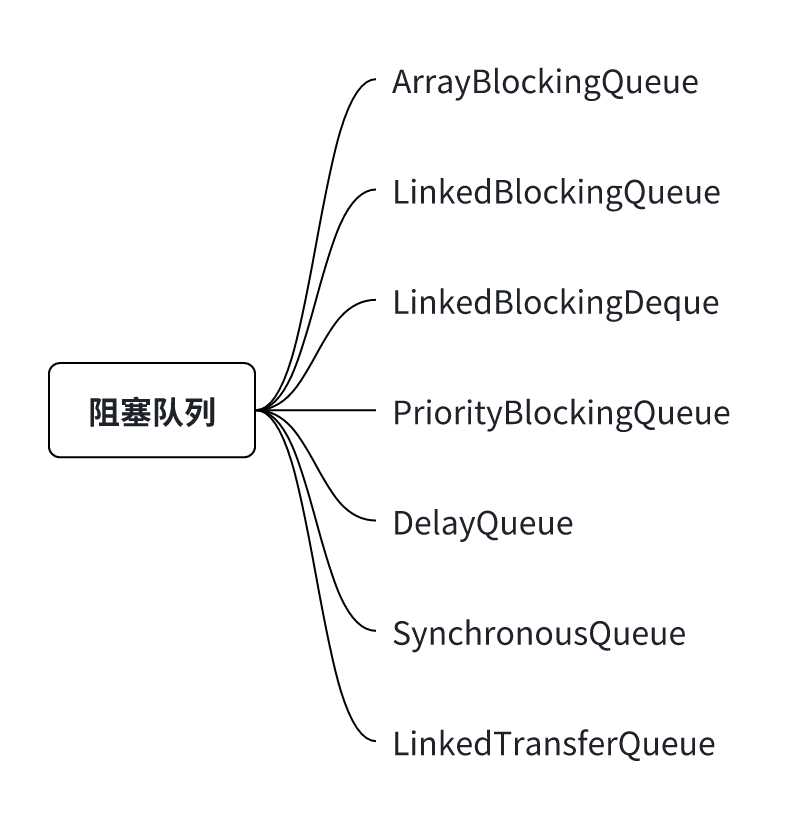


> 本文章会对JUC包下的各种阻塞队列做简要的分析,然后会对线程池做额外的补充「Executors类以及调度线程池」


> 为什么需&#x8981;**<span style="color: rgb(216,57,49); background-color: inherit">阻塞</span>**&#x961F;列呢？普通的队列无法满足吗？

它解决了并发编程中一个最基本,最常见的问题：生产者和消费者之间的速度协调和线程协作「并且在很大程度上解放了程序员」

阻塞队列首先是一个队列,能够起到缓冲的作用,但是最为重要的一点&#x662F;**<span style="color: rgb(216,57,49); background-color: inherit">简化了线程间协作的编程模型</span>**

如果没有阻塞队列,那么就需要开发人员手动的调用的wait()/notify()/notifyAll()/synchronized/或者Lock相关操作来实现相关的功能，代码会变得复杂并且容易出错「比如需要自己处理临界条件 - <span style="color: rgb(216,57,49); background-color: inherit">内部容器为空/为满</span>」

```java
// ---- 非阻塞队列的实现 -----
// 生产者伪代码
synchronized(lock) {
    while (queue.isFull()) {
        lock.wait(); // 等待队列非空
    }
    queue.add(data);
    lock.notifyAll(); // 通知消费者
}

// 消费者伪代码
synchronized(lock) {
    while (queue.isEmpty()) {
        lock.wait(); // 等待队列非空
    }
    data = queue.remove();
    lock.notifyAll(); // 通知生产者
}

// ---- 阻塞队列的实现 ----- 屏蔽了内部临界条件的处理以及锁使用等细节,避免代码变得复杂和出错
// 生产者
blockingQueue.put(data); 
// 消费者
Data data = blockingQueue.take();
```

和线程池相关的操作

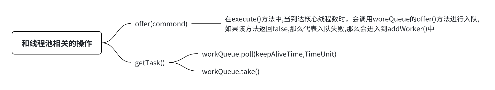

由于线程池中只涉及到了三个方法,后续在介绍源码时也只介绍这三个方法：**offer() / poll(time) / take()**

# ArrayBlockingQueue

> 官方介绍：https://devdocs.io/openjdk\~11/java.base/java/util/concurrent/arrayblockingqueue

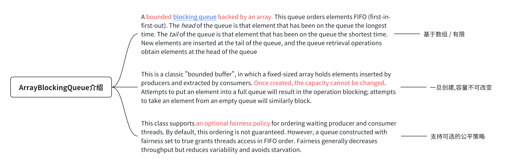

## 构造函数及属性

```java
public ArrayBlockingQueue(int capacity) {
    this(capacity, false);
}

// -- 
public ArrayBlockingQueue(int capacity, boolean fair) { // 支持传入公平模式,不传默认为非公平
    if (capacity <= 0) // 不允许容量<=0
        throw new IllegalArgumentException();
    this.items = new Object[capacity]; //创建内部数组容器
    lock = new ReentrantLock(fair); // 创建锁,用于操作数组,这里影响的是Lock的公平性
    notEmpty = lock.newCondition(); // 两个条件变量
    notFull =  lock.newCondition();
}
```

此时的结构如下：

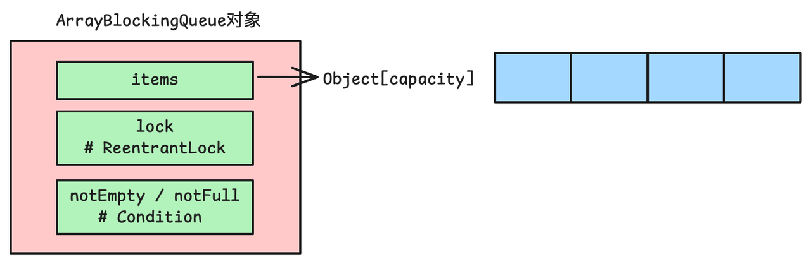

操作数组元素的方法


## 源码解析

```java
// -- add()
public boolean add(E e) {
    return super.add(e); // 调用父类的add()
}

public boolean add(E e) {
    if (offer(e)) // 会委托给offer()方法,当队列满时,offer()返回false,那么在下面抛出异常
        return true; 
    else
        throw new IllegalStateException("Queue full");
}

// -- offer(E e)
public boolean offer(E e) {
    Objects.requireNonNull(e); // 要添加的元素不能为null
    final ReentrantLock lock = this.lock; // 对数组上锁
    lock.lock();
    try {
        if (count == items.length) // 如果数组满了,那么返回false
            return false;
        else { // 否则调用enqueue()入队
            enqueue(e);
            return true;
        }
    } finally { // 解锁
        lock.unlock();
    }
}

// enqueue(e)
private void enqueue(E e) {
    final Object[] items = this.items;
    items[putIndex] = e;
    if (++putIndex == items.length) putIndex = 0;
    count++;
    notEmpty.signal(); // 唤醒因为数组为空而阻塞的消费者
}

// -- put(E e)
public void put(E e) throws InterruptedException {
    Objects.requireNonNull(e); // 要添加的元素不能为null
    final ReentrantLock lock = this.lock; // 上锁
    lock.lockInterruptibly(); // 可被中断
    try {
        while (count == items.length) // 如果数组满了,那么阻塞在notFull条件变量上
            notFull.await();
        enqueue(e); // 满足条件了再入队
    } finally {
        lock.unlock();
    }
}
```

从enqueue()中可以看出：内部的数组是一个循环数组

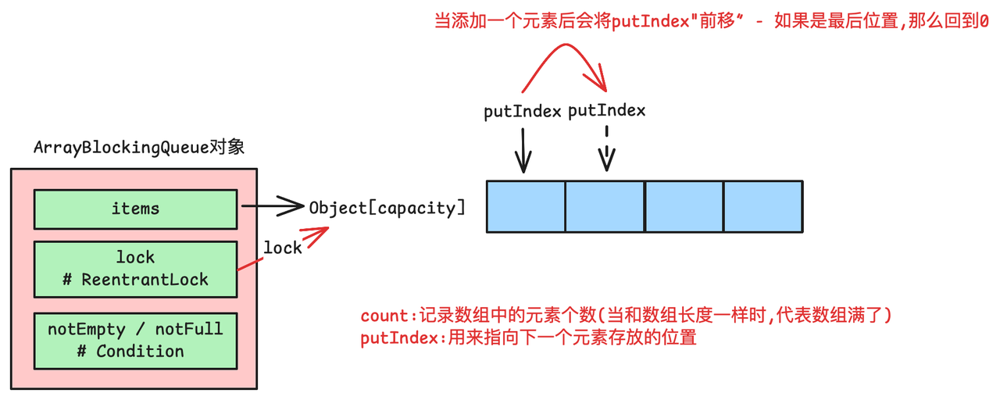

删除(取出)元素源码解析

```java
// -- poll()
public E poll() {
    final ReentrantLock lock = this.lock;
    lock.lock();
    try { // 队列为null,返回null,否则出队
        return (count == 0) ? null : dequeue();
    } finally {
        lock.unlock();
    }
}

// dequeue()
private E dequeue() {
    final Object[] items = this.items;
    E e = (E) items[takeIndex]; // takeIndex指向获取元素的下一个位置(可以看出是FIFO类型的)
    items[takeIndex] = null; // 将对应位置置为空
    if (++takeIndex == items.length) takeIndex = 0; // 如果队列中没有元素了,那么重置takeIndex = 0
    count--; 
    // .... 省略迭代器操作
    notFull.signal(); // 唤醒因为队列满而阻塞的线程
    return e;
}
// -- take()
public E take() throws InterruptedException {
    final ReentrantLock lock = this.lock;
    lock.lockInterruptibly();
    try {
        while (count == 0) // 队列为空,阻塞等待直到有元素或者被中断
            notEmpty.await();
        return dequeue(); // 出队
    } finally {
        lock.unlock();
    }
}
```

从putIndex和takeIndex的操作可以看出ArrayBlockingQueue时FIFO的

可以看到ArrayBlockingQueue的代码逻辑还是比较简单的,其中有一点需要注意：**<span style="color: rgb(216,57,49); background-color: inherit">它是不可扩容的</span>**

它的工作模型：


# LinkedBlockingQueue

> 官网介绍：https://devdocs.io/openjdk\~11/java.base/java/util/concurrent/linkedblockingqueue

关键点：可选的容量边界构造参数用来防止队列过度扩展的,如果未指定容量,则容量默认为Integer.MAX\_VALUE(相当于无限容量)

## 构造函数及属性

```java
public LinkedBlockingQueue() {
    this(Integer.MAX_VALUE); // 默认的容量大小为Integer.MAX_VALUE
}

public LinkedBlockingQueue(int capacity) {
    if (capacity <= 0) throw new IllegalArgumentException();
    this.capacity = capacity;
    last = head = new Node<E>(null); // 创建了一个伪节点
}

public class LinkedBlockingQueue<E> // ....
{
    // ....
    private final int capacity; // 容量大小,默认为MAX
    private final AtomicInteger count = new AtomicInteger(); // 当前队列中的元素
    transient Node<E> head; // 链表头部 - 其item值为null
    private transient Node<E> last; // 链表尾部 - 其item为null
    ReentrantLock takeLock = new ReentrantLock(); // 用于take()/poll()
    Condition notEmpty = takeLock.newCondition(); // 条件变量
    ReentrantLock putLock = new ReentrantLock() // 用于put()/offer()
    Condition notFull = putLock.newCondition(); // 条件变量
    // ....
}
```

结构如下：


## 源码解析


```java
// offer() - 非阻塞插入,如果队列满了,那么返回false,如果容量是MAX,那么offer()会永远返回true
public boolean offer(E e) {
    if (e == null) throw new NullPointerException(); // 不允许添加空数据
    final AtomicInteger count = this.count;
    if (count.get() == capacity) // 如果队列满了,那么返回false
        return false;
    final int c;
    final Node<E> node = new Node<E>(e); // 将e包装为Node节点
    final ReentrantLock putLock = this.putLock;
    putLock.lock(); // 获取生产者锁
    try {
        if (count.get() == capacity) // double check
            return false;
        enqueue(node); // 入队操作
        c = count.getAndIncrement(); // 增加元素个数并且返回old值
        // 如果old + 1 <  capacity,这代表当前生产者插入之后还有空闲的位置
        // 那么唤醒其他因为队列满了而阻塞的生产者线程
        if (c + 1 < capacity) 
            notFull.signal();
    } finally {
        putLock.unlock();
    }
    // 否则如果old count = 0 ，那么代表在当前生产者插入之前,队列为空
    // 那么由于这次插入了元素，队列不为空了，那么需要唤醒因为队列为空而阻塞的消费者
    if (c == 0)
        signalNotEmpty();
    return true; // 返回true代表入队成功
}

// enqueue(node) 入队操作
private void enqueue(Node<E> node) {
    last = last.next = node;
}

```

入队操作

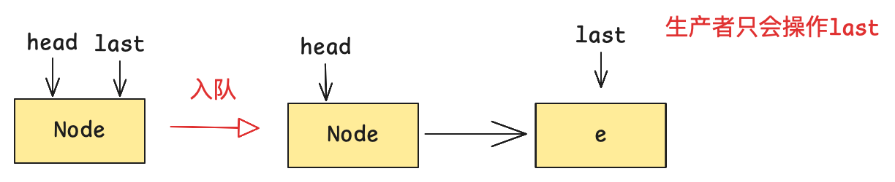


```java
// take()
public E take() throws InterruptedException {
    final E x;
    final int c;
    final AtomicInteger count = this.count;
    final ReentrantLock takeLock = this.takeLock; // 获取消费者锁
    takeLock.lockInterruptibly(); // 可以被中断
    try {
        while (count.get() == 0) { // 如果没有元素,那么阻塞等待,直到有数据或者被中断
            notEmpty.await();
        }
        x = dequeue(); // 出队列
        c = count.getAndDecrement(); // 减少元素个数,返回old count
        if (c > 1) //  如果old count > 1，那么当前线程消费一个后还会有剩余,那么唤醒其他因为队列空而阻塞的消费者
            notEmpty.signal();
    } finally {
        takeLock.unlock();
    }
    if (c == capacity) // 如果old count  = capa,那么当前消费了一个元素,队列有空闲位置了,那么唤醒因为队列满而阻塞的生产者
        signalNotFull();
    return x;
}

// dequeue() 出队列
private E dequeue() {
    Node<E> h = head;
    Node<E> first = h.next; // 获取h.next
    h.next = h; // help GC  将h指向自己
    head = first;  
    E x = first.item;
    first.item = null;
    return x;
}

// poll(time) 原理一样,不再赘述
public E poll(long timeout, TimeUnit unit) throws InterruptedException {
    final E x;
    final int c;
    long nanos = unit.toNanos(timeout);
    final AtomicInteger count = this.count;
    final ReentrantLock takeLock = this.takeLock;
    takeLock.lockInterruptibly();
    try {
        while (count.get() == 0) {
            if (nanos <= 0L)
                return null;
            nanos = notEmpty.awaitNanos(nanos);
        }
        x = dequeue();
        c = count.getAndDecrement();
        if (c > 1)
            notEmpty.signal();
    } finally {
        takeLock.unlock();
    }
    if (c == capacity)
        signalNotFull();
    return x;
}
```

出队列：

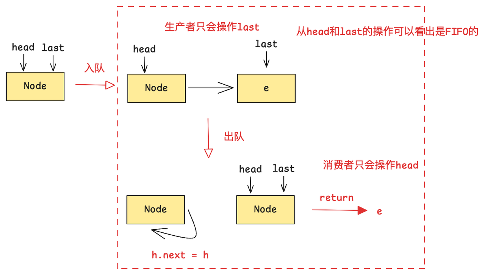

为什么在take()或者在offer()的末尾需要执行：signalNotFull()或者signalNotEmpty()呢？因为存在生产者和消费者并发的问题,例子如下：

```java
// offer() 此时队列为空 count = 0
offer(E e){
    enqueue(node); // 入队操作
   
  // 由于生产者和消费者是并发执行的,在这里可能有消费者执行take()
      take(){
          // ...
           while (count.get() == 0) { // 如果没有元素,那么阻塞等待,直到有数据或者被中断
                notEmpty.await(); // 由于生产者入队和更新count不是原子的,所以导致了"空隙"
            } 
          // ...
      }
    c = count.getAndIncrement(); // 增加元素个数并且返回old值    
    // 如果没有这行代码,那么上面阻塞的消费者将不会被唤醒(只有等别的消费者来消费的时候才会被唤醒,属于bug)
    if (c == 0)
        signalNotEmpty();
}
```

工作模式：使用生产者锁和消费者锁,相比于ArrayBlockingQueue来说,提高了并发度(**需要注意这个阻塞队列是可有界可无界的**)

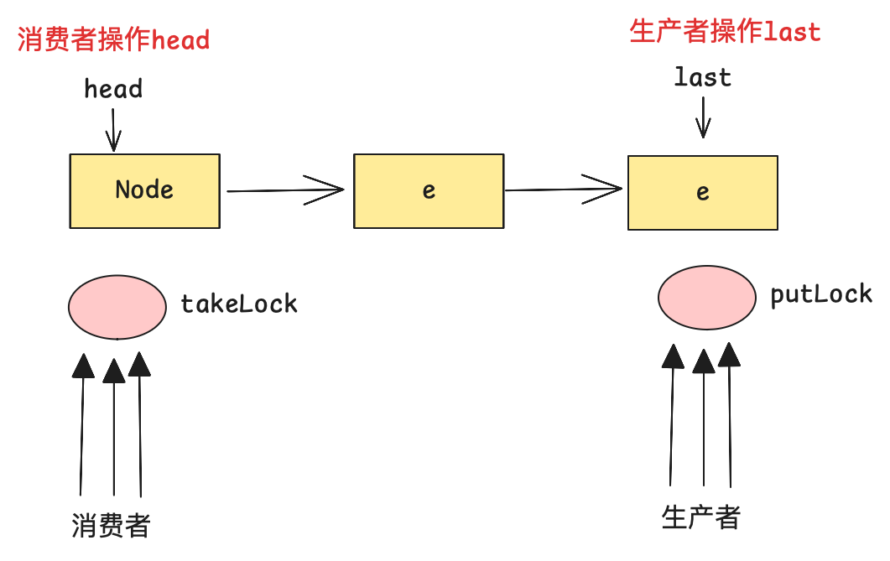


# PriorityBlockingQueue

> 在这里就不单独介绍LinkedBlockingDeque「相比于LinkedBlockingQeque来说它是一个双向队列」,在这里就直接优先级队列了
> 官网介绍：https://devdocs.io/openjdk\~11/java.base/java/util/concurrent/priorityblockingqueue

关键点：
这是一个无界阻塞队列,提供阻塞式的**获取**操作，虽然该队列在逻辑上是无界的,但是受限于内存(插入过多的元素可能会抛出OOM异常)，并且该类不允许插入null元素。

该类在处理具有相同优先级的元素时,不会保证它们的顺序,如果需要强制执行某种顺序,可以自定义比较器

举一个自定义优先级的例子：

```java
class Task {
    String name;
    int priority;

    public Task(String name, int priority) {
        this.name = name;
        this.priority = priority;
    }

    @Override
    public String toString() {
        return name + ": " + priority;
    }
}
public static void main(String[] args) throws InterruptedException {
    // 按照priority降序排列
    Comparator<Task> comparator = (t1, t2) -> Integer.compare(t2.priority, t1.priority);
    PriorityBlockingQueue<Task> priorityQueue = new PriorityBlockingQueue<>(10, comparator);
    priorityQueue.put(new Task("taskA", 2));
    priorityQueue.put(new Task("taskB", 5));
    priorityQueue.put(new Task("taskC", 1)); // 取出顺序：taskB, taskA, taskC
    while (!priorityQueue.isEmpty()) {
        System.out.println(priorityQueue.take());
    }

}
// out put
taskB: 5
taskA: 2
taskC: 1
```

## 构造函数及属性

```java
public PriorityBlockingQueue() {
    this(DEFAULT_INITIAL_CAPACITY, null); // 初始容量默认为11
}

public PriorityBlockingQueue(int initialCapacity) {
    this(initialCapacity, null);
}

public PriorityBlockingQueue(int initialCapacity,
                             Comparator<? super E> comparator) {
    if (initialCapacity < 1)
        throw new IllegalArgumentException();
    this.comparator = comparator; // 赋值比较器
    this.queue = new Object[Math.max(1, initialCapacity)]; // 创建一个数组(实际上是二叉堆)
}

// -- 核心属性
private transient Object[] queue;  // 数据容器 - 二叉堆
private transient int size; // 当前堆中的元素个数
private transient Comparator<? super E> comparator; // 比较器
private final ReentrantLock lock = new ReentrantLock(); // 用于所有公共操作
private final Condition notEmpty = lock.newCondition(); // 用于队列为空时的条件变量
private transient volatile int allocationSpinLock; // 自旋次数
```

结构如下：

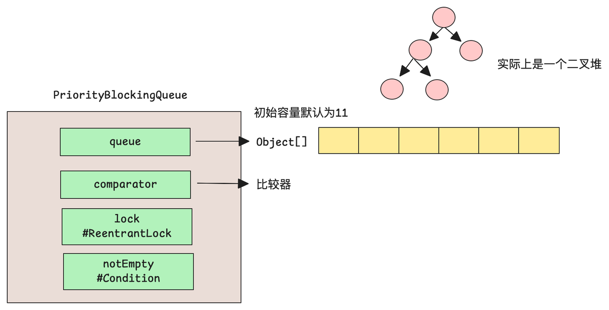

## 源码解析


```java
public boolean offer(E e) {
    if (e == null)
        throw new NullPointerException(); // 不允许添加null元素
    final ReentrantLock lock = this.lock; // 上锁 只允许单线程访问
    lock.lock();
    int n, cap;
    Object[] es;
    while ((n = size) >= (cap = (es = queue).length)) // 如果“队列”已经满了,那么进行扩容操作
        tryGrow(es, cap); // 扩容操作,具体的操作后续在分析
    try {
        final Comparator<? super E> cmp; 
        if ((cmp = comparator) == null) // 如果没有用户自定义的比较器,那么使用默认的,否则使用传入的
            siftUpComparable(n, e, es); // 这里涉及到堆的操作,关于数据结构的操作不在这里介绍
        else
            siftUpUsingComparator(n, e, es, cmp);
        // -- 在上面,元素就已经插入到了队列中了
        size = n + 1; // 更新队列中元素的个数
        notEmpty.signal(); // 唤醒因为队列空而阻塞的线程
    } finally {
        lock.unlock();
    }
    return true;
}

// siftUpComparable(n, e, es)
private static <T> void siftUpComparable(int k, T x, Object[] es) {
    // 强转为比较类型,如果元素是不可比较的,那么在这里会抛出异常
    Comparable<? super T> key = (Comparable<? super T>) x; 
    // 堆数据结构的操作....
}

```

下面来看下扩容操作：tryGrow(es, cap); es:为当前队列，cap为当前数组容量

```java
private void tryGrow(Object[] array, int oldCap) {
    // 释放主锁 ? 这里有个疑问为什么在扩容的时候要释放主锁呢？
    /*
        其实是在 高并发 与 数据安全之前 权衡的一种实现方式
        在这里,不释放锁也是ok的,但是会带来的“负面效果”是什么呢？
            1.所有其他操作队列的方法全部被阻塞 - 队列的性能变差 - 这是主要原因
            2....
        但是,如果把锁释放了,那么不会造成脏数据吗？比如线程操作不同的队列？
        不会 - 为什么呢？因为在更新数组引用时，需要上锁 
        如果扩容线程扩容完毕后,想要更新数组引用,那么必须上锁
        之前已经获取锁的线程,操作的是旧数组,这没问题，在这之后的线程访问的都是新数组，这没问题！
    
    */
    lock.unlock(); // must release and then re-acquire main lock
    Object[] newArray = null;
    /*
        扩容的自旋锁,为1代表有其他线程在扩容了,因为上面释放了锁,
        所以在这里可能其他线程执行offer()函数,同样也进入到这里的分支
        为了保证扩容只能由一个线程来完成,这里需要使用自旋锁来保证安全性
    */
    if (allocationSpinLock == 0 && 
        ALLOCATIONSPINLOCK.compareAndSet(this, 0, 1)) {
        try {
            int newCap = oldCap + ((oldCap < 64) ?
                                   (oldCap + 2) : // grow faster if small
                                   (oldCap >> 1));
            if (newCap - MAX_ARRAY_SIZE > 0) {    // possible overflow
                int minCap = oldCap + 1;
                if (minCap < 0 || minCap > MAX_ARRAY_SIZE)
                    throw new OutOfMemoryError();
                newCap = MAX_ARRAY_SIZE;
            }
            if (newCap > oldCap && queue == array)
                newArray = new Object[newCap];
        } finally {
            allocationSpinLock = 0;
        }
    }
    
    /*
        这里其实也有点难以理解,一开始我是这样想的：
            T-A - 扩容线程
            T-B - 非扩容线程(因为自旋锁已经被T-A获取了)
            那么T-B这里的newArray会一直为null,应该newArray是一个局部变量,是线程不可见的
            那么其实这里的判断不就是多余的吗？
            其实不然,这是一个公共方法,这两行是专门为非扩容线程准备的
                1.非扩容线程 - 一定会Thread.yield(),这样做的目的是为了短暂的让出CPU资源,好让扩容线程能够正常的完成数组扩容
                2.扩容线程 - 不会执行这里的代码,因为newArray在上面会被赋值
    */
    if (newArray == null) // back off if another thread is allocating
        Thread.yield();
        
    // 只有扩容线程会执行这里的代码,上锁,然后再更新数组引用以及数组拷贝
    lock.lock();
    if (newArray != null && queue == array) {
        queue = newArray;
        System.arraycopy(array, 0, newArray, 0, oldCap);
    }
}
```

可以看到扩容的代码的设计理念还是有点复杂的,下面再看下另外的take()方法

```java
public E take() throws InterruptedException {
    final ReentrantLock lock = this.lock;
    lock.lockInterruptibly();
    E result;
    try {
        while ( (result = dequeue()) == null) // 如果队列为空,那么阻塞
            notEmpty.await();
    } finally {
        lock.unlock();
    }
    return result;
}

// poll() 原理一样,不再赘述
```

关键点：扩容时的高并发设计值得学习


# DelayedQueue

> 官方介绍：https://devdocs.io/openjdk\~11/java.base/java/util/concurrent/delayqueue

一个**无界**的**延迟**元素阻塞队列，队列中的元素只有在其延迟到期后才能被取出。
队首元素是那个延迟过期时间最早的 Delayed 元素。如果没有元素的延迟到期，则队列没有队首，poll 方法会返回 null。当某个元素的 getDelay(TimeUnit.NANOSECONDS) 方法返回的值小于或等于零时，表示该元素已过期。尽管未到期的元素无法通过 take 或 poll 方法移除，但在其他方面它们会被当作普通元素对待。例如，size 方法返回的是到期和未到期元素的总数。该队列不允许插入 null 元素。

使用案例：DelayQueue只能取出延迟到期的元素,未到期的元素不会被take()/poll()返回

```java
import java.util.concurrent.DelayQueue;
import java.util.concurrent.Delayed;
import java.util.concurrent.TimeUnit;

public class DelayQueueTest {
    public static void main(String[] args) throws InterruptedException {
        DelayQueue<DelayedTask> queue = new DelayQueue<>();
        // 添加3个延迟不同的任务
        queue.put(new DelayedTask("task1", 3, TimeUnit.SECONDS));
        queue.put(new DelayedTask("task2", 1, TimeUnit.SECONDS));
        queue.put(new DelayedTask("task3", 5, TimeUnit.SECONDS));
        // 取出元素时会按延迟时间顺序输出
        while (!queue.isEmpty()) {
            DelayedTask task = queue.take(); // 阻塞直到到期
            System.out.println(System.currentTimeMillis() + " 执行: " + task);
        }


    }
}

class DelayedTask implements Delayed {
    private String name;
    private long startTime;

    public DelayedTask(String name, long delay, TimeUnit unit) {
        this.name = name;
        this.startTime = System.nanoTime() + unit.toNanos(delay);
    }

    @Override
    public long getDelay(TimeUnit unit) {
        long remain = startTime - System.nanoTime();
        return unit.convert(remain, TimeUnit.NANOSECONDS);
    }

    @Override
    public int compareTo(Delayed o) {
        if (this.startTime < ((DelayedTask) o).startTime) {
            return -1;
        }
        if (this.startTime > ((DelayedTask) o).startTime) {
            return 1;
        }
        return 0;
    }

    @Override
    public String toString() {
        return name;
    }
}

// out put
1759213099945 执行: task2
1759213101944 执行: task1
1759213103944 执行: task3
```

## 构造函数及属性

```java
public DelayQueue() {}

// 属性
private final transient ReentrantLock lock = new ReentrantLock(); // lock
private final PriorityQueue<E> q = new PriorityQueue<E>(); // 内部是基于优先级队列(不是优先级阻塞队列)
private Thread leader; // leader线程 - 在这里会涉及到 Leader - Follower 设计模式
private final Condition available = lock.newCondition(); // 条件变量
```

此时结构如下：

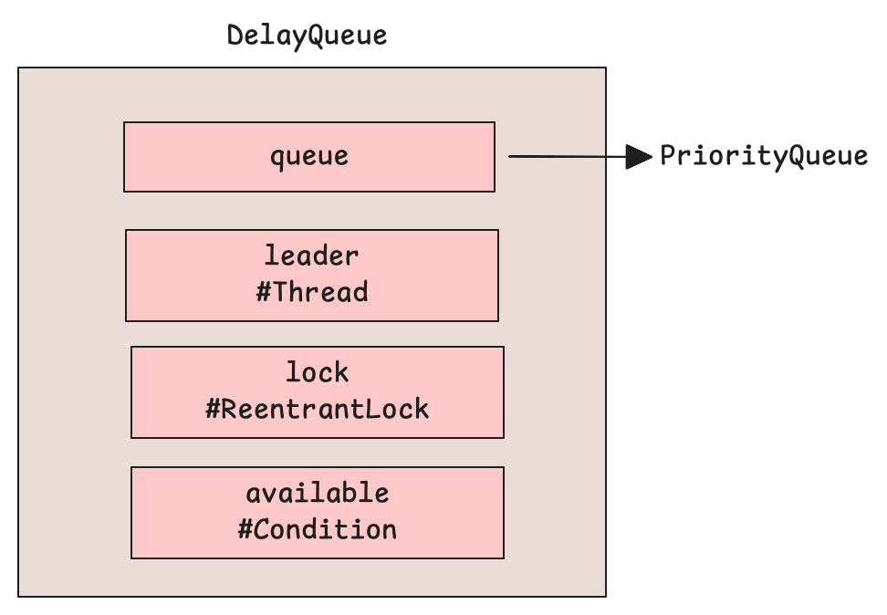

## 源码解析


```java
// 插入元素
public boolean offer(E e) {
    final ReentrantLock lock = this.lock;
    lock.lock();
    try {
        q.offer(e); // 添加到优先级队列中
        /*
            如果刚添加进去元素成为了队首
            这代表着刚才插入的元素的 延迟时间是最短的(也即是最早到期的)
            那么要将leader线程设置为null,并且唤醒一个等待线程 - 为什么要这么做？
            要明白这里,需要先看下take()的代码
        */
        if (q.peek() == e) { 
            leader = null;
            available.signal();
        }
        return true;
    } finally {
        lock.unlock();
    }
}
```

* take()

```java
// 获取元素,如果没有元素到期,那么当前方法会阻塞
public E take() throws InterruptedException {
    final ReentrantLock lock = this.lock;
    lock.lockInterruptibly(); // 上锁
    try {
        for (;;) {
            E first = q.peek(); // 获取队首元素
            if (first == null) // 如果没有元素,那么永久阻塞
                available.await();
            else { // 否则存在元素,那么需要计算当前元素还有多久才过期(才能被取出去)
                long delay = first.getDelay(NANOSECONDS);
                if (delay <= 0L) // 如果已经到期,那么直接返回即可
                    return q.poll();
                // 否则,说明delay > 0,没有元素到期,那么依然需要阻塞等待
                first = null; // don't retain ref while waiting 将first设置为null
                
                if (leader != null) // 如果已经存在leader,那么永久阻塞即可
                    available.await();
                else { // 否则没有leader,当前线程是第一个take()的线程
                    Thread thisThread = Thread.currentThread();
                    leader = thisThread; // 设置为leader,阻塞delay时间即可
                    try {
                        available.awaitNanos(delay);
                    } finally {
                        if (leader == thisThread)
                            leader = null;
                    }
                }
            }
        } // end for
        
    } finally { // 在末尾如果leader为null并且队列中还存在元素,那么需要唤醒一个线程
        if (leader == null && q.peek() != null)
            available.signal();
        lock.unlock();
    }
}
```

在DelayedQueue中采用了Leader - Follower模式,提高了性能（避免了惊群效应）。如下图所示：

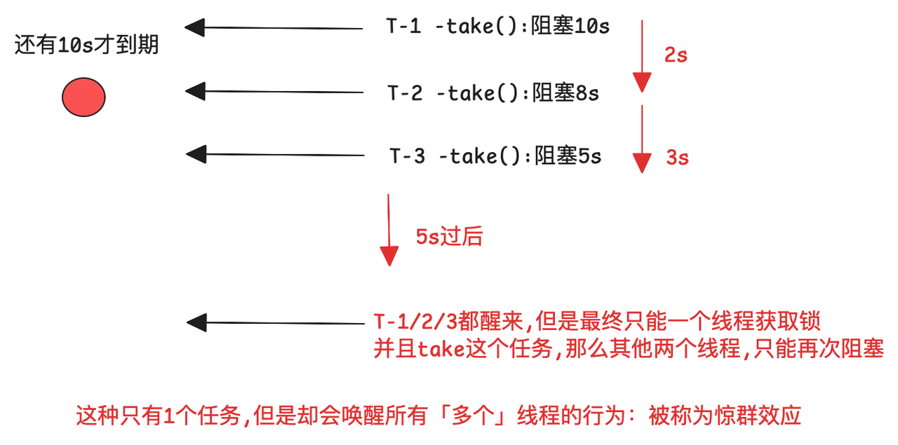

但是如果引入了Leader - Follower模式,就能很好的避免这个问题，如下图所示：

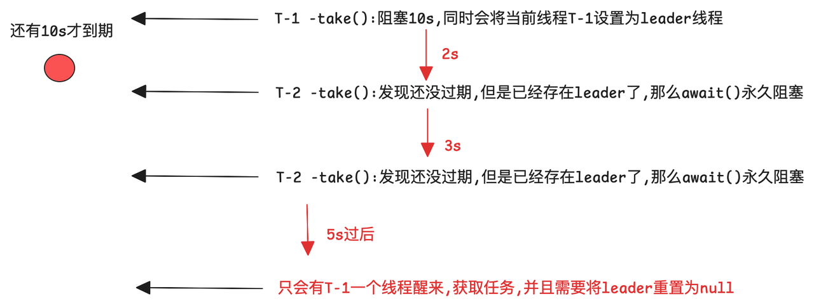

下面就可以来看下上面没有讲述的两处代码：
1\. 在offer()中为什么当新添加的元素是延迟最小的元素时,需要将leader重置为null,并且唤醒一个新的线程呢？
2.在take()的末尾,为什么当leader=null并且队列不为空时,需要唤醒一个新的线程呢？

第一个问题：

看上面的图：因为采用的是 Leader - Follower模式,所以当Leader存在时(T-1),其他的线程会调用await()进行永久的阻塞。

那么如果此时offer()了一个1s的元素，那么T-1还在等10s(当然不准确,可能变成9s了),T-2/3/N是永久阻塞的，但是1s后就有元素要到期了啊，就可以被执行了。所以在这里需要将leader重新设置为null，然后唤醒一个线程来成为leader，让他等待1s（只有leader才能有限等待，其他Follower需要永久阻塞 - - 当然此时T-1已经成为Follower了）

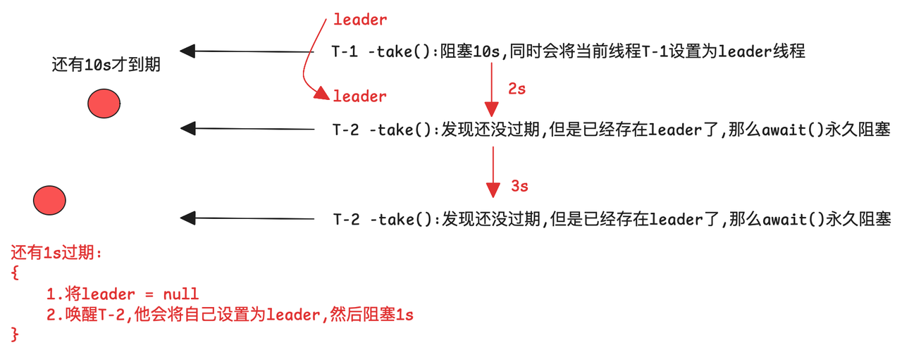

第二个问题：
依旧看上上面的那张图：当T-1等待10s后，拿到任务准备返回了，如果只是unlock(),那么会出现什么问题？
有到期任务,但是线程依旧阻塞，吞吐量变得很低

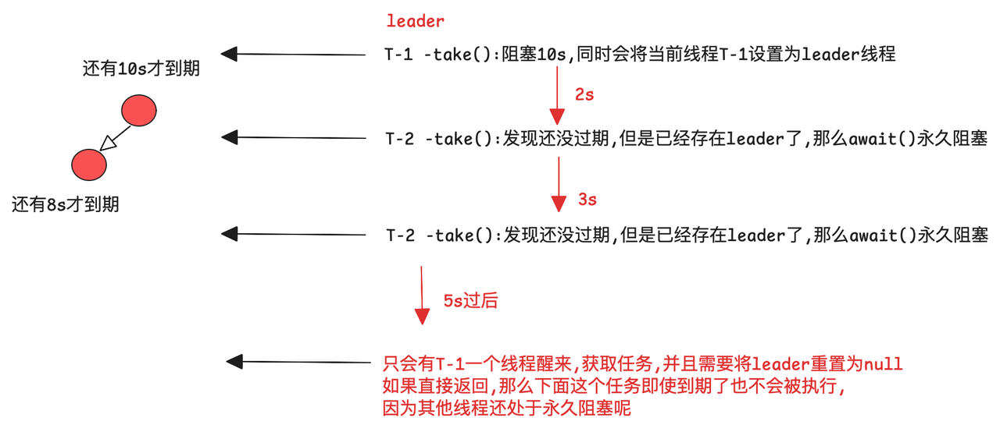

所以当leader线程返回之前(当然他已经将leader设置为null了)，需要判断此时队列中是否还有未过期的task,如果有,那么需要唤醒一个线程来成为leader，这样才能正常的工作下去，如下图所示：

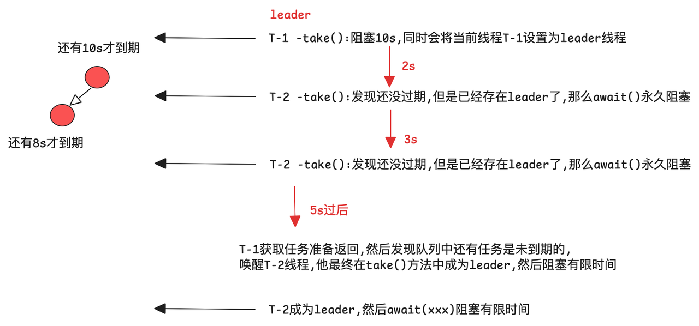

到这里,DelayedQueue就介绍到这里了，关键点：Leader - Follower模式


# SynchronousQueue

> 官网介绍：https://devdocs.io/openjdk\~11/java.base/java/util/concurrent/synchronousqueue

一个阻塞队列，其每次插入操作都必须等待另一个线程的相应移除操作，反之亦然。

SynchronousQueue 没有任何内部容量，甚至连一个元素的容量都没有。

你无法对 SynchronousQueue 进行 peek（查看队首元素），因为元素只会在你尝试移除它时才存在；

**<span style="color: rgb(216,57,49); background-color: inherit">除非有另一个线程在尝试移除元素，否则你无法插入元素（无论用什么方法）；</span>**

你也无法进行迭代，因为没有任何元素可供迭代。

队首元素是第一个排队插入线程试图添加到队列中的元素；

如果没有这样的插入线程，则没有可移除的元素，poll() 方法会返回 null。对于其他 Collection 方法（比如 contains），SynchronousQueue 的行为等同于一个空集合。该队列不允许插入 null 元素

该类支持可选&#x7684;**<span style="color: rgb(216,57,49); background-color: inherit">公平策略</span>**，用于对等待的生产者和消费者线程进行排序。默认情况下，不保证这种排序。然而，如果以公平性设置为 true 构造队列，则会以 FIFO 顺序为线程分配访问权


## 构造函数及属性

此时的结构如下：

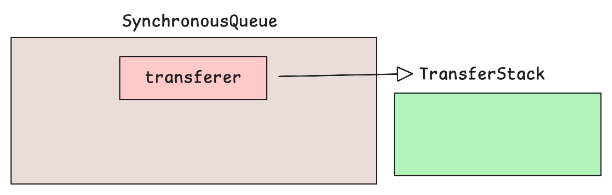

```java
public SynchronousQueue() {
    this(false);
}
// 默认的模式是非公平的,后面的源码讲解也以非公平的为例子
public SynchronousQueue(boolean fair) {
    transferer = fair ? new TransferQueue<E>() : new TransferStack<E>();
}

// ---- 自旋相关的
static final int MAX_TIMED_SPINS = (Runtime.getRuntime().availableProcessors() < 2) ? 0 : 32;
static final int MAX_UNTIMED_SPINS = MAX_TIMED_SPINS * 16;
static final long SPIN_FOR_TIMEOUT_THRESHOLD = 1000L;
private transient volatile Transferer<E> transferer;
```

为什么说该类是一个没有容量的队列呢？因为在类中没有用于存储数据的容器，以ArrayBloackingQueue为例：

```java
public ArrayBlockingQueue(int capacity, boolean fair) { // 支持传入公平模式,不传默认为非公平
    // ....
    this.items = new Object[capacity]; //创建内部数组容器,拥有存储数据的容器
    // ....
}
```

* 类关系图


## 源码解析

在这里还是以线程池中涉及到的两个主要方法为例「poll(time)的原理是一样的,而put()方法也会顺带提一下」


* offer(E e):生产者提交任务 / take()

可以看到,offer(E e)和take其实在内部调用的是同一个方法,不过入参不同

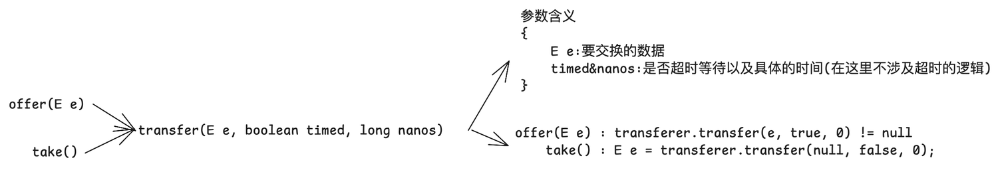

```java
// 该方法是生产者调用的(在线程池中对应添加任务)
// 如果transfer()返回null，代表添加任务失败,否则成功
public boolean offer(E e) { 
    if (e == null) throw new NullPointerException();
    return transferer.transfer(e, true, 0) != null;
}

// 该方法是消费者调用的(在线程池中对应工作线程获取任务)
public E take() throws InterruptedException {
    E e = transferer.transfer(null, false, 0);
    if (e != null)
        return e;
    Thread.interrupted();
    throw new InterruptedException();
}
```

* transfer(xxx):在这里以非公平为例「TransferStack」

在介绍这个方法之前,先了解一下TransferStack的一些属性：


```java
static final class TransferStack<E> extends Transferer<E> 
{
    /** Node represents an unfulfilled consumer */
        static final int REQUEST    = 0; 
    /** Node represents an unfulfilled producer */
        static final int DATA       = 1;
    /** Node is fulfilling another unfulfilled DATA or REQUEST */
        static final int FULFILLING = 2;
    /** The head (top) of the stack */
        volatile SNode head;
}
```

下面进入到方法的原理：注意：此时的head为null

首先看下doug lea对该方法的工作原理的文档注释：


下面先来看：当队列为空或者队列中已经存在相同模式的节点时的处理,此时的结构如下所示：


```java
// 栈为空 或者 已经有相同模式的节点了
/*
    offer(E e):传入的参数为：E e , true , 0
        take():传入的参数为: null ,false ,0
*/
    if (h == null || h.mode == mode) {  // empty or same-mode //如果队列为null 或者 队列中已经存在相同模式的节点了
        // offer(E e) 传入的参数是满足这个条件的
        if (timed && nanos <= 0L) {     // can't wait 不能等待的流程(比如offer(E e))
            // 这里是帮助做清理「如果head已经被取消了」
            if (h != null && h.isCancelled())
                casHead(h, h.next);     // pop cancelled node
                 // 如果没有消费者在等待,那么offer(E e)方法会立即返回null,这个结论很重要!
            else // 否则直接返回null,这对线程池的工作流程会产生影响!,也即在这里入队失败
                return null;
        } else if (casHead(h, s = snode(s, e, h, mode))) { // 否则可以等待,比如take()
            SNode m = awaitFulfill(s, timed, nanos); // 等待匹配
           // .....
        }
    }
    
/*
    在casHead(h, s = snode(s, e, h, mode))做了两件事情
        1.snode(s, e, h, mode)
        2.casHead(h,s)：将当前node设置为head
*/
// snode() - 创建一个SNode对象
static SNode snode(SNode s, Object e, SNode next, int mode) {
    if (s == null) s = new SNode(e);
    s.mode = mode;
    s.next = next;
    return s;
}
   
```

当发现队列为空或者已经存在相同模式的节点时,如果是不可等待「can't wait,比如offer(E e)」，那么就会直接返回null，反正，则会创建一个对应的线程节点SNode，添加到队列中并且设置成为新的head。
此时的结构如下：「以队列为空作为例子」


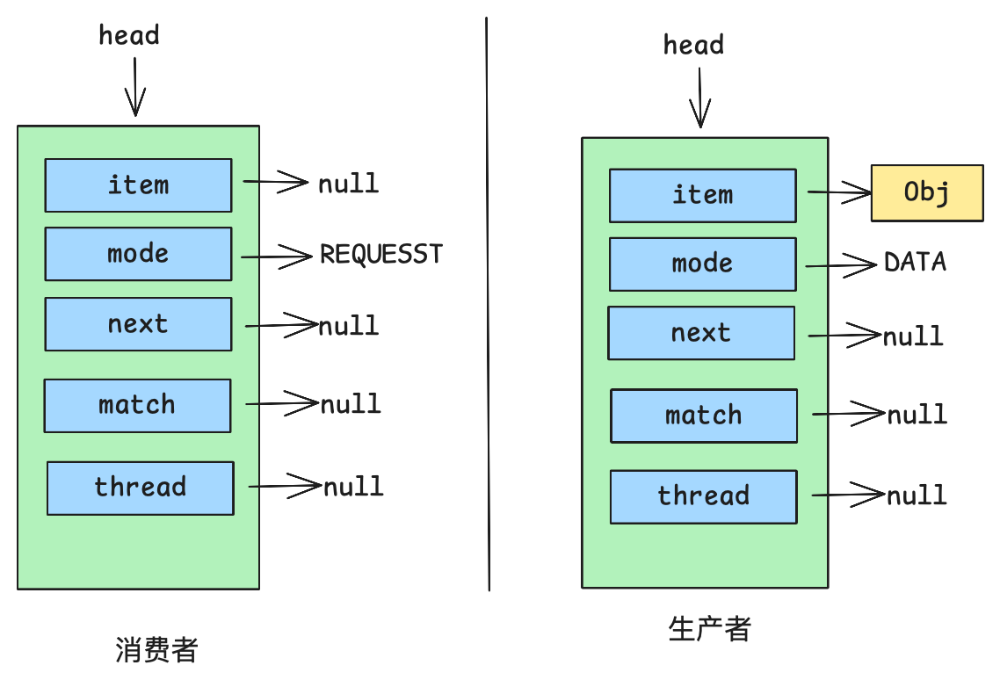

那么下一步就是阻塞等待匹配了： SNode m = awaitFulfill(s, timed, nanos)
此时的结构如下：


```java
/*
awaitFulfill(s, timed, nanos):
    1.s:等待被匹配的节点
    2.timed&nanos:是否超时等待已经对应的时间
*/
SNode awaitFulfill(SNode s, boolean timed, long nanos) {
    final long deadline = timed ? System.nanoTime() + nanos : 0L; // 等待时间
    Thread w = Thread.currentThread(); // 获取当前线程
    // 自旋次数计数 - shouldSpin(s)：判断条件有什么含义吗？
    int spins = shouldSpin(s) 
        ? (timed ? MAX_TIMED_SPINS : MAX_UNTIMED_SPINS)
        : 0;
    
    for (;;) {
        if (w.isInterrupted()) // 如果在等待匹配的过程中被中断了,那么取消等待
            s.tryCancel(); // SMATCH.compareAndSet(this, null, this); 将当前节点的match字段指向自己
        SNode m = s.match; // 获取对应的match字段,如果没被匹配,那么该字段是为null的,否则在执行transfer() - awaitFulfill()之间,当前节点已经被匹配了，那么直接返回即可
        if (m != null)
            return m;
        if (timed) {
            nanos = deadline - System.nanoTime();
            if (nanos <= 0L) {
                s.tryCancel(); // 如果已经超时,将当前节点的match字段指向自己,再次循环时,在上面的if(m!=null)就会返回
                continue;
            }
        }
        // --- 上面是一些前置处理
        // 否则自旋等待
        if (spins > 0) {
            Thread.onSpinWait();
            spins = shouldSpin(s) ? (spins - 1) : 0;
        }
        else if (s.waiter == null) // 超过了自旋次数,那么将当前thread设置到node的waiter字段中,确保能够被唤醒
            s.waiter = w; // establish waiter so can park next iter
        else if (!timed) // 永久阻塞
            LockSupport.park(this);
        else if (nanos > SPIN_FOR_TIMEOUT_THRESHOLD) // 超时阻塞
            LockSupport.parkNanos(this, nanos);
    }
}
```

该方法的核心为设置节点的waiter字段,然后去阻塞「但是在阻塞前还有自旋的处理,关于这里自旋后面再来分析」

下面继续回到transfer()方法:下面看下匹配的操作
此时结构如下：以消费者去匹配生产者为例子,此时的状态为正在匹配


```java
/*
     if (h == null || h.mode == mode)
     进入到下面的逻辑的前提是上面的两个判断都不满足：也即队列不为空,并且栈顶节点的模式和当前请求的模式不同
     比如：当前是消费者,其mode = REQUEST,那么需要栈顶节点的mode = DATA
*/
else if (!isFulfilling(h.mode)) { // try to fulfill - head节点模式需要与当前节点相反,并且不能为FULFILLING「因为这代表节点已经被匹配了」
    if (h.isCancelled())            // already cancelled 如果h已经被取消了,那么将当前head节点弹出栈,然后重新执行for循环
        casHead(h, h.next);         // pop and retry 
    else if (casHead(h, s=snode(s, e, h, FULFILLING|mode))) { // 否则,当前节点是正常节点,那么尝试匹配,在这里会创建一个新的节点,其mode = FULFILLING,并且会将其设置为新的head
        for (;;) { // loop until matched or waiters disappear
            SNode m = s.next;       // m is s's match m节点是s节点「在上面刚创建的s节点」的匹配节点
            if (m == null) {        // all waiters are gone 如果发现要匹配的节点已经不存在了「可能是被取消了,也可能是被其他线程匹配了」,那么会弹出刚插入的s节点，并且重试
                casHead(s, null);   // pop fulfill node
                s = null;           // use new node next time
                break;              // restart main loop
            }
            SNode mn = m.next; // 获取m.next
            if (m.tryMatch(s)) { // 将m节点与s节点进行匹配,返回true,代表匹配成功
                casHead(s, mn);     // pop both s and m 将s和m都弹出栈,并且设置新的head为mn
                return (E) ((mode == REQUEST) ? m.item : s.item); // 如果当前是消费者请求,那么s的item=null,m的item才是消费者想要的,所以返回m.item,生产者同理
            } else                  // lost match  否则匹配失败,那么设置s.next = mn,重新尝试
                s.casNext(m, mn);   // help unlink
        }
    }
}
```

下面继续看下匹配的处理流程：m.tryMatch(s)
此时的结构如下：


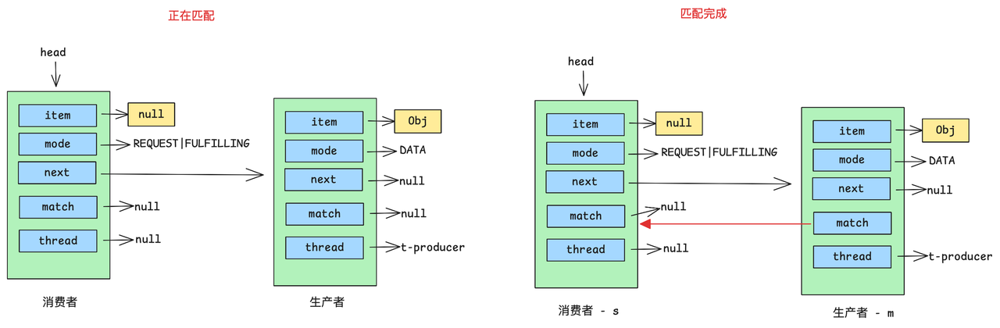


```java
// m.tryMatch(s) : m是生产者节点,s是消费者节点
boolean tryMatch(SNode s) { // s是消费者节点,当前的执行对象是m节点
    if (match == null &&  // m.match需要为null
        SMATCH.compareAndSet(this, null, s)) { // cas将当前m.match设置为s节点
        Thread w = waiter;
        if (w != null) {    // waiters need at most one unpark
            waiter = null;
            LockSupport.unpark(w); // 唤醒生产者线程
        }
        return true; // 返回true,也即匹配成功
    }
    // 否则在这里返回match == s,如果是则代表已经匹配成功,不过不是当前线程匹配的,否则代表匹配失败
    return match == s;
} 

// 当消费者线程执行tryMatch()成功后,会执行下面代码
if (m.tryMatch(s)) { // 将m节点与s节点进行匹配,返回true,代表匹配成功
    casHead(s, mn);     // pop both s and m 将s和m都弹出栈,并且设置新的head为mn(在这里为null)
    // 返回m.item「消费者」
    return (E) ((mode == REQUEST) ? m.item : s.item); 

```

此时的结构如下：


下面看下当生产者被消费者唤醒后的处理：

```java
else if (casHead(h, s = snode(s, e, h, mode))) {
    SNode m = awaitFulfill(s, timed, nanos); // 从阻塞从唤醒,m返回的是匹配的节点,在这里对应的是 FULFILLING节点
    if (m == s) {               // wait was cancelled 如果指向的是自己,那么代表被取消了
        clean(s);
        return null;
    }
    // 此时的视角为生产者线程(在这里m对应消费者的s，s对应消费者的m「也即生产者节点」)
    // 因为在消费者线程中是先唤醒再弹出m和s的，如果生产者醒来发现还没有弹出,那么在这里协助消费者操作
    if ((h = head) != null && h.next == s)
        casHead(h, s.next);     // help s's fulfiller
    // 这里会返回s.item,而这里s是生产者节点,也即会返回自己的item，所以是不为null的
    return (E) ((mode == REQUEST) ? m.item : s.item);
}
```

下面看下最后一个逻辑：也即当某个线程进来时,发现栈顶是一个FULFILLING节点时的处理：
可以看到这就消费者的处理逻辑,就不在赘述了

```java
else {                            // help a fulfiller 发现栈顶的节点是fulfiller类型的
    SNode m = h.next;               // m is h's match
    if (m == null)                  // waiter is gone
        casHead(h, null);           // pop fulfilling node
    else {
        SNode mn = m.next;
        if (m.tryMatch(h))          // help match
            casHead(h, mn);         // pop both h and m
        else                        // lost match
            h.casNext(m, mn);       // help unlink
    }
}
```

