# 大纲

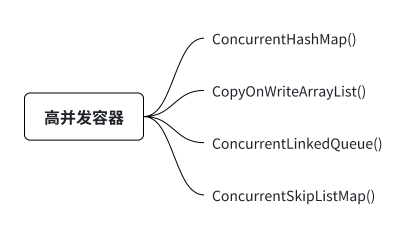

# ConcurrentHashMap

> 线程安全的HashMap

## HashMap源码解析

> HashMap 是一个基于哈希表的 Map 接口的实现。它存储的是键值对（key-value）映射，**并允许使用 null 值和 null 键**。HashMap 不保证映射的顺序，特别是它不保证该顺序恒久不变
>
> 此实现为基本操作（get 和 put）提供**常数时间**性能，前提是哈希函数将元素恰当地分散在各桶中。
>
> HashMap 实例有两个影响其性能的参数：**初始容量和负载因子**

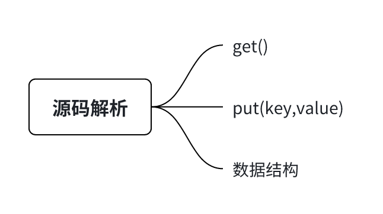

* 初始化

```java
public HashMap() {
    this.loadFactor = DEFAULT_LOAD_FACTOR; // 负载因子,默认是0.75
}

public HashMap(int initialCapacity) { // 用户自定义初始容量
    this(initialCapacity, DEFAULT_LOAD_FACTOR);
}

public HashMap(int initialCapacity, float loadFactor) {
    // .... 异常校验
    this.loadFactor = loadFactor; // 负载因子
    /*
        tableSizeFor()方法是返回最靠近initialCapacity的一个二次幂数
        比如10 -> 那么就返回16
        而threshold这个值是用来代表扩容阈值,正常情况下应该是等于 capacity * load factor
        但是在这里却等于16
         - 这是因为hashMap默认采用是懒加载的模式,在初始化时并不会创建内部保存数据的数组
         - 连数组都没有,就不用谈扩容了,所以此时threshold用来存储任何值都可以
         - 在这里存储的就是数组的初始容量(经过处理的)
    */
    this.threshold = tableSizeFor(initialCapacity); 
}
```

* put(key,value)

```java
public V put(K key, V value) {
    return putVal(hash(key), key, value, false, true);
}
// 根据key来计算hash值
static final int hash(Object key) {
    int h;
    return (key == null) ? 0 : (h = key.hashCode()) ^ (h >>> 16);
}

final V putVal(int hash, K key, V value, boolean onlyIfAbsent,
               boolean evict) {todo}
```

在put(key,value)之前,会调用hash(key)来计算key所对应的hashcode

「

在这里回顾一下之前介绍过的ThreadLocal和FastThreadLocal

ThreadLocal:每个threadLocal对象都有对应的hashcode,(递增,以hash算法来计算位置)
FastThreadLocal:每个fastThreadLocal对象都有自己的index(递增,不是以hash算法来计算位置)

」

从hash()方法可以知道:

1. 对于为null的key,其hashcode = 0

2. 对于非null的key,其hashcode = (h = key.hashCode()) ^ (h >>> 16) ：调用key对应的hashCode()方法然后做异或对象

这里需要注意两点:这两个问题会在后面做解答

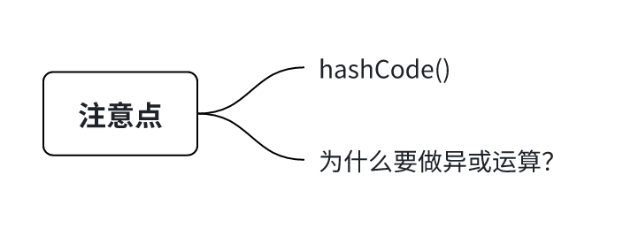

继续阅读putVal()方法

```java
/**
 * Implements Map.put and related methods.
 *
 * @param hash hash for key key所对应的hash值
 * @param key the key 
 * @param value the value to put
 * @param onlyIfAbsent if true, don't change existing value 决定是否替换已经存在的值
 * @param evict if false, the table is in creation mode. 主要用于LinkedHashMap中的回调函数
 * @return previous value, or null if none
 */
final V putVal(int hash, K key, V value, boolean onlyIfAbsent,
               boolean evict) {
    Node<K,V>[] tab; Node<K,V> p; int n, i;
    /*
        这里提一个问题?
            - 数组为null,那么直接去扩容,这很容易理解
            - 但是会出现数组不为空,但是tab.length=0的场景吗？ 难道是可见性问题？
    */
    if ((tab = table) == null || (n = tab.length) == 0) // @1
        n = (tab = resize()).length;
    if ((p = tab[i = (n - 1) & hash]) == null) // @2
        tab[i] = newNode(hash, key, value, null);
    else {  // @3
        Node<K,V> e; K k;
        if (p.hash == hash &&
            ((k = p.key) == key || (key != null && key.equals(k))))
            e = p;
        else if (p instanceof TreeNode)
            e = ((TreeNode<K,V>)p).putTreeVal(this, tab, hash, key, value);
        else {
            for (int binCount = 0; ; ++binCount) {
                if ((e = p.next) == null) {
                    p.next = newNode(hash, key, value, null);
                    if (binCount >= TREEIFY_THRESHOLD - 1) // -1 for 1st
                        treeifyBin(tab, hash);
                    break;
                }
                if (e.hash == hash &&
                    ((k = e.key) == key || (key != null && key.equals(k))))
                    break;
                p = e;
            }
        }
        if (e != null) { // existing mapping for key
            V oldValue = e.value;
            if (!onlyIfAbsent || oldValue == null)
                e.value = value;
            afterNodeAccess(e);
            return oldValue;
        }
    }
    ++modCount;
    if (++size > threshold)
        resize();
    afterNodeInsertion(evict);
    return null;
}
```

可以看到put()函数分为了三个分支

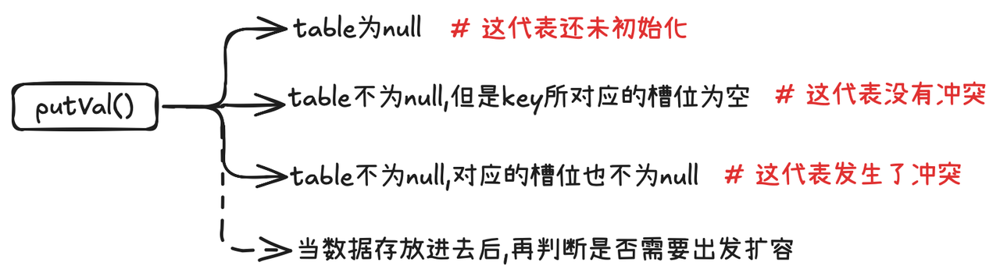

* 初始化操作 - resize()

```java
// 可以看到:数组初始化 和 数组扩容使用的都是同一个方法
// 目前只看数组初始化的代码逻辑
final Node<K,V>[] resize() {
    Node<K,V>[] oldTab = table; // 获取table,由于还未初始化,所以table是为null的
    int oldCap = (oldTab == null) ? 0 : oldTab.length; // oldCap = 0
    int oldThr = threshold; // 在这里获取的是数组的初始大小(和上面呼应 - 假设为16)
    int newCap, newThr = 0;
    if (oldCap > 0){...} // 真正的扩容操作
    else if (oldThr > 0){ // 如果oldThr > 0，那么作为数组的新容量
        newCap = oldThr;
    } 
    else {  // 这里的逻辑对应调用的是hashMap的无参构造函数(此时的oldThr = 0)
        newCap = DEFAULT_INITIAL_CAPACITY;
        newThr = (int)(DEFAULT_LOAD_FACTOR * DEFAULT_INITIAL_CAPACITY);
    }
    if (newThr == 0) { // 计算新的阈值(在这里threshold就是代表扩容阈值了)
        float ft = (float)newCap * loadFactor;
        newThr = (newCap < MAXIMUM_CAPACITY && ft < (float)MAXIMUM_CAPACITY ?
                  (int)ft : Integer.MAX_VALUE);
    }
    threshold = newThr; // 代表扩容阈值
    Node<K,V>[] newTab = (Node<K,V>[])new Node[newCap]; // 创建数组
    table = newTab; // 赋值给table
    if (oldTab != null){...} // 扩容操作
    return newTab;
}
```

当上述代码执行完毕后：结构变为

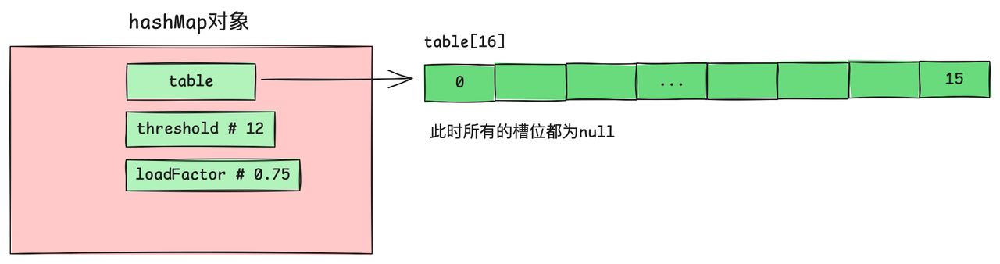

* 数组不为null,并且对应的槽位也为null

当数组已经存在时，那么下一步的操作就应该是将\[key,value]存放到数组中

```java
 final V putVal(int hash, K key, V value, boolean onlyIfAbsent, boolean evict) {
      // ....
      // 通过hash 与 length - 1 做 &运算，来获取对应的下标
      // 如果槽位为空,那么直接存放进去即可
      // 非线程安全,可能被覆盖
      if ((p = tab[i = (n - 1) & hash]) == null)
            tab[i] = newNode(hash, key, value, null);
      // ....
 }
```

此时的结构为：


* 出现冲突

```java
else {
    Node<K,V> e; K k;
    // p是槽位上的节点,如果槽位节点对应的hash值和当前key-hash不一样,那么说明"不是同一对象"
    // 根本就不会去判断后面
    if (p.hash == hash && 
        ((k = p.key) == key || (key != null && key.equals(k))))
        e = p;
    // ... 省略红黑树的操作
    // 走到这里,则会进入到链表操作
    else {
        for (int binCount = 0; ; ++binCount) {
           /*
                如果p.next为null
                这里分为两种情况:
                    1.整个链表第一次出现冲突:那么创建新节点并且链接
                    2.遍历完整个链表后发现之前没有put()过：创建新节点并且链接
           */
            if ((e = p.next) == null) {
                p.next = newNode(hash, key, value, null);
                /*
                    如果链表长度大于等于7，则会进入到红黑树相关处理「
                    内部还有额外的条件，那就是数组的长度不能小于64」
                    也即：链表长度>=7 并且 数组的长度大于64时(不是元素个数)
                    (n = tab.length) < MIN_TREEIFY_CAPACITY 「是length而不是size」
                */
                if (binCount >= TREEIFY_THRESHOLD - 1) // -1 for 1st 
                    treeifyBin(tab, hash);
                // 否则,没有树形化,那么结束for循环
                break;
            }
            // 否则,链表中有其他元素,代表不是第一次产生冲突了,那么需要判断是否是之前相同的key调用put()方法,逻辑依旧为先通过hash来判断,如果hash相同(这不能确定),还需要通过key来进一步判断
            // 在hashMap中判断两个对象是否相等的逻辑是重点,后面会单独讲解
            // 如果找到了,那么就break,否则继续找,直到链表为null
            if (e.hash == hash &&
                ((k = e.key) == key || (key != null && key.equals(k))))
                break;
            p = e;
        }// end for
    }// end else
    // -- 上面的else的目的就是为了找到 e(之前put()过的旧的key-value)
    // 当然也可能没找到
    
    if (e != null) { // existing mapping for key e!=null,那么代表之前put()过
        V oldValue = e.value; // 获取旧的value
        // 如果 onlyIfAbsent = false，那么替换旧的值
        // 或者即使 onlyIfAbsent = true,但是oldValue = null,那么也同样会覆盖null值
        if (!onlyIfAbsent || oldValue == null)
            e.value = value;
        // Callbacks to allow LinkedHashMap post-actions 钩子方法
        afterNodeAccess(e);
        // 如果找到了old value，那么返回即可
        return oldValue;
    }
}

// -- 操作完毕
 ++modCount; // fast-fail
 if (++size > threshold) // 判断是否需要扩容
       resize();
 afterNodeInsertion(evict); // linkedHashMap的Hook函数
 return null;

```

此时的结构为：

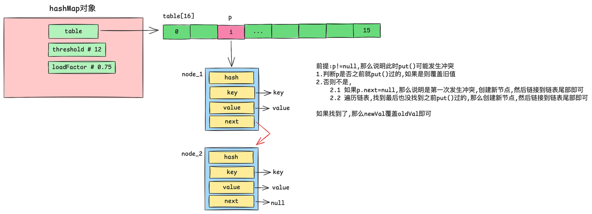

* hashMap中判断是否重复put()的逻辑

```java
if (p.hash == hash &&
        ((k = p.key) == key || (key != null && key.equals(k)))){
  
  /*
      当上面的判断为true时则代表找到了之前put()过的元素
      判断条件为：1和2都为true
          1.p.hash == hash
          2.(k = p.key) == key 或者 (key != null && key.equals(k)) 其中一个为ture
  */
}
```

先阅读一下Object#hashcode()的文档

```java
/*

    {@code hashCode} 方法的通用规范如下：有3点规范
    <li>在 Java 应用程序的一次执行过程中，只要对象在 {@code equals} 比较中使用的信息未被修改，
        对同一对象多次调用 {@code hashCode} 方法必须始终返回相同的整数。
        此整数在应用程序的多次执行间不必保持一致。
    <li>如果两个对象根据 {@code equals(Object)} 方法判断相等，
        那么分别对这两个对象调用 {@code hashCode} 方法必须产生相同的整数结果。
    <li>如果两个对象根据 {@link java.lang.Object#equals(java.lang.Object)} 方法判断不相等，
        <em>并不要求</em>分别对这两个对象调用 {@code hashCode} 方法必须产生不同的整数结果。
        但是，程序员应该知道，为不相等的对象生成不同的整数结果可以提高哈希表的性能。
*/
```

此时再来看hashMap中的判断：

1. 如果hash值不同,那么它们一定不是同一个对象(在这里指的是不是同一个key)，那么就不是新值覆盖旧值

2. 但是hash值相同,并不能代码就是同一个对象(在这里指的是同一个key)，所以还需要进一步判断,两者的key是否是指向同一对象。

到这里应该就结束了，为什么还有后面的判断呢？那是因为key可能会重写了equal()方法「比如String类或者我们自己写的类」

下面再看下Object#equal()方法的文档

```java
/*
    指示其他某个对象是否与此对象"相等"
    # 省略性质的介绍：自反性,对称性,传递性，一致性 # 
    <p>
        请注意，每当重写此方法时，通常都需要重写 {@code hashCode} 方法
        以维护 {@code hashCode} 方法的通用规范，该规范规定相等的对象必须具有相等的哈希码
    # 省略其他
*/
public boolean equals(Object obj) {
    return (this == obj);
}
```

equal()方法的作用是用来判断两个对象是否相等的,所有对象都是Object类型的,如果没有重写equal()方法,那么判断两个对象是否相等的默认逻辑就是'=='，而==判断的则是对象的引用.

而如果有这样的需求：即使是不同的对象,但是对象的值一样,那么也算是相同的对象,==就无法做到了，这个时候可以通过重写equal()来实现自己的需求。

而一旦重写了equal()方法，那么在hashMap#putVal()判断时,就不能仅仅的依赖p.hash == hash和(k = p.key) == key ，因为此时的key#equal()方法被重写,可能出现对象地址不一样,但是对于用户来说却是一样的对象

所以在这里当(k = p.key) == key不满足的时候,还需要继续通过 key.equals(k)来判断,如果该方法返回true,那么也代表是同一个对象,那么执行的逻辑就是新值覆盖旧值,而不是创建一个新的节点并且插入到链表中

* 扩容机制

```java
// 将当前key-value存放到map中后,会元素个数是否超过阈值,如果超过了则进行扩容处理
 if (++size > threshold)
    resize();
    
 // resize() 
 final Node<K,V>[] resize() {
    Node<K,V>[] oldTab = table; // 获取map中的数组,此时是不会为空的
    int oldCap = (oldTab == null) ? 0 : oldTab.length; // 获取旧数组的容量
    int oldThr = threshold; // 获取阈值-12(不会为空)
    int newCap, newThr = 0;
    if (oldCap > 0) { // 如果存在旧数组
        if (oldCap >= MAXIMUM_CAPACITY) { // 容量到达上限,无法再扩容了
            threshold = Integer.MAX_VALUE;
            return oldTab;
        } // 否则 newCap = oldCap << 1,并且旧容量必须>=16才会设置新阈值为doubl,否则不会更新
        else if ((newCap = oldCap << 1) < MAXIMUM_CAPACITY &&
                 oldCap >= DEFAULT_INITIAL_CAPACITY)
            newThr = oldThr << 1; // double threshold
    }
     // -- 初始化的逻辑
     // -- oldThr为null的处理 - 在扩容时不会遇到
    // ....
    
    threshold = newThr; // 更新扩容阈值
    @SuppressWarnings({"rawtypes","unchecked"})
    Node<K,V>[] newTab = (Node<K,V>[])new Node[newCap]; // 创建一个新数组
    table = newTab; // 更新引用
    if (oldTab != null) { // 数据拷贝
        for (int j = 0; j < oldCap; ++j) {
            Node<K,V> e;
            //... 单独拿一个方法来讲解
        }
    }
    return newTab;
}
```

关于新容量和新阈值大小的处理就不在赘述了，关键点在于数据拷贝,因为每个key所在位置是通过key.hash & tab.length - 1来计算的，此时由于tab.length-1变化了，所以key所在的位置也可能会变化,此时就需要将其放到正确的位置上,不然get()的时候会拿不到数据，下面看下具体的迁移过程

> 每个节点的hash值都被保存起来了,所以是不需要重新计算hash值的
> 按照一般的思路：新位置 = e.hash & newTab.length - 1 (这没有什么问题,这样做也能实现)
>
> 但是在jdk11中(jdk8也是如此),并没有采用这种直接的方式,而是采用另外一种方式 - 高低链表

其基本原理为(假设数据)：

原数组长度 = 16 = 0001 0000  - - length - 1 = 0000 1111

新数组长度 = 32 = 0010 0000  - - length -1  = 0001 1111

如果是采用普通的计算：新位置 = e.hash & (newLen - 1),其与oldLen-1的区别就在最高位的1，如果e.hash的最高位是0,那么e所在的索引位置不变,否则e.hash的最高位=1，那么新位置 = 旧位置 + oldCap

利用这个规律,在这里采用的是先判断元素的索引位置是否会发生变化,将不会发生变化的元素按照原有顺序形成低链表，会发生变化的元素按照原有顺序形成高链表

然后只需要迁移两个链表即可

```java
if (oldTab != null) {
        for (int j = 0; j < oldCap; ++j) { // 遍历旧数组上的每一个槽位oldCap[j]
            Node<K,V> e;
            if ((e = oldTab[j]) != null) {
                oldTab[j] = null;
                if (e.next == null)
                    newTab[e.hash & (newCap - 1)] = e;
                // ... 省略红黑树相关的操作
                else { // preserve order
                    Node<K,V> loHead = null, loTail = null;
                    Node<K,V> hiHead = null, hiTail = null;
                    Node<K,V> next;
                    do {
                        next = e.next;
                        // @1 如果索引位置不会发生变化
                        if ((e.hash & oldCap) == 0) {
                            if (loTail == null)
                                loHead = e;
                            else
                                loTail.next = e;
                            loTail = e;
                        }
                        else { // @2 否则索引位置会发生变化
                            if (hiTail == null)
                                hiHead = e;
                            else
                                hiTail.next = e;
                            hiTail = e;
                        }
                    } while ((e = next) != null);
                    // 迁移两个链表到新数组上
                    if (loTail != null) {
                        loTail.next = null;
                        newTab[j] = loHead;
                    }
                    if (hiTail != null) {
                        hiTail.next = null;
                        newTab[j + oldCap] = hiHead;
                    }
                }
            }
        }
    }
```

结构图如下：

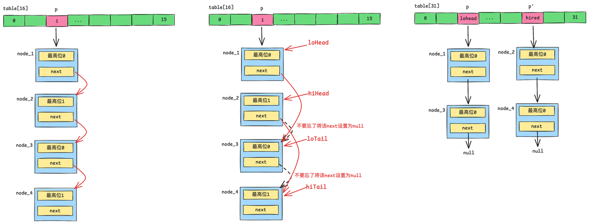

到这里put()方法就简单介绍到这里了,但是还有几个其他的点值得学习一下


1. key的hash值为什么不是直接使用hashCode()返回的值,而是要再与自己的高16位做异或运算呢？「**<span style="color: rgb(216,57,49); background-color: inherit">这可以称为扰动函数</span>**」

为了减少哈希冲突,因为hashMap内部的数组的长度通常不会超过2^16次方,也即length的长度最多为：

length = 0000 0000 0000 0001 0000 0000 0000 0000 (2^16次方)
length - 1  = 0000 0000 0000 0000 1111 1111 1111 1111（计算元素位置时使用的是length - 1）

可以看到length-1的特点为：前16位均为0,这就会导致通过hashcode()返回的hash值,在与length-1做&操作时,

即使是不一样的hashcode(前16位存在不同，但是后16位相同)，也会被映射到相同的位置,从而造成冲突

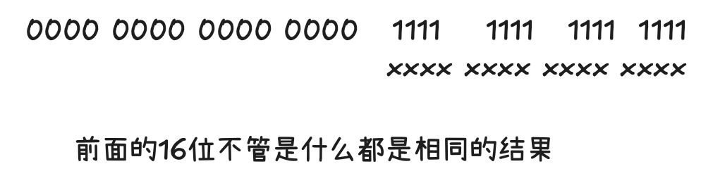

所以在这里将hash值的高位扩展至低位进行异或处理,让高位也参与影响hash值计算，从而减少哈希冲突,提高性能

* 为什么hashMap内部的数组长度一定是2的次幂的？

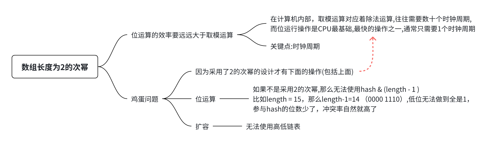

* get(key):获取key所对应的value

```java
public V get(Object key) {
    Node<K,V> e;
    // 如果返回的node为null,那么就返回null,否则返回e.value
    return (e = getNode(hash(key), key)) == null ? null : e.value;
}
// 获取key对应的node
/*
    代码逻辑比较清晰,通过hash定位到对应的槽位,然后依次判断就可以了
*/
final Node<K,V> getNode(int hash, Object key) {
    Node<K,V>[] tab; Node<K,V> first, e; int n; K k;
    if ((tab = table) != null && (n = tab.length) > 0 &&
        (first = tab[(n - 1) & hash]) != null) {
        if (first.hash == hash && // always check first node
            ((k = first.key) == key || (key != null && key.equals(k))))
            return first;
        if ((e = first.next) != null) {
            if (first instanceof TreeNode)
                return ((TreeNode<K,V>)first).getTreeNode(hash, key);
            do {
                if (e.hash == hash &&
                    ((k = e.key) == key || (key != null && key.equals(k))))
                    return e;
            } while ((e = e.next) != null);
        }
    }
    return null;
}
```

下面再来看下hashMap的另外3个问题

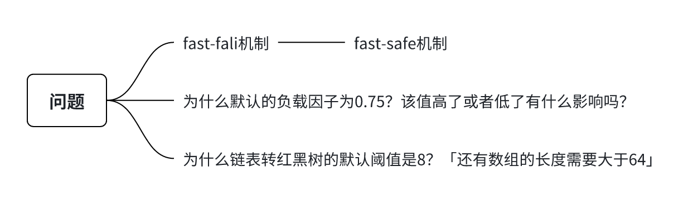

* fast-fail机制

fast-fail机制,是Java集合中的一&#x79CD;**<span style="color: rgb(216,57,49); background-color: inherit">错误检测机制</span>**,被用来设计&#x5728;**<span style="color: rgb(216,57,49); background-color: inherit">迭代器遍历集合</span>**&#x7684;过程中,如果集合中的元素被除了迭代器自身的remove()方法之外的任何方式修改，那么就立刻抛出ConcurrentModificationException 异常。

其实现依赖于一个整型变量：modCount

工作原理

```java
abstract class HashIterator {
    // ...
    int expectedModCount;  // for fast-fail
    // ...
       HashIterator() {
        // ...
        expectedModCount = modCount; // 在初始化迭代器的时候,就会保存hashMap此刻的modCount
        // ...
   }
}

// hahNext()
 final Node<K,V> nextNode() {
  // ....
  // 如果之前保存的expectedModCount 和 现在hashMap中的modCount不一致,
  // 那么在迭代过程中出现了其他线程对元素做了添加/删除操作(这会改变modCount的值,具体是+1)     
    if (modCount != expectedModCount)
        throw new ConcurrentModificationException();
  // ...
}
```

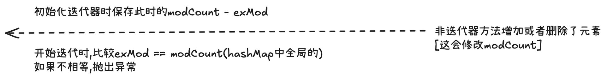

我感觉在哪里见过？StampedLock(并且StampedLock可以看作是fail-safe机制的一种实现,因为当写线程操作后,读线程没有抛出异常，通常的做法是重新去读取)


* fail-safe机制(安全失败)

这是一种设计哲学,目的是确保即使系统状态发生变化,操作也不会失败或者抛出异常,而是继续以某种安全的方式继续运行。**<span style="color: rgb(216,57,49); background-color: inherit">在Java集合中特指那些在迭代过程中能够容忍集合被修改的并发集合类</span>**

核心特点：

* 不会抛出ConcurrentModificationException

* 通常基于副本或快照进行迭代(只适合读多写少的情况,因为当写操作很多时,短时间内可能会造成内存使用升高,从而导致gc)

* 提供弱一致性保证

简单介绍源码实现：以CopyOnWriteArrayList为例子

```java
// add()
public boolean add(E e) {
    synchronized (lock) {
        Object[] es = getArray();
        int len = es.length;
        es = Arrays.copyOf(es, len + 1); // 拷贝
        es[len] = e; // 设置 - 操作的是拷贝的新数组
        setArray(es); // 回写引用
        return true;
    }
}

// 迭代器 - 在创建迭代器的时候会保存此刻cowArrayList内部的数组
Iterator<String> iterator = copyOnWriteArrayList.iterator();
public Iterator<E> iterator() {
    return new COWIterator<E>(getArray(), 0);
}
final Object[] getArray() {
    return array;
}
COWIterator(Object[] es, int initialCursor) {
    cursor = initialCursor; // 保存的是数组的引用
    snapshot = es;
}
```

此时的结构如下：


* 为什么默认的因子为0.75呢？这个值是如何影响hashMap的性能的？

```java
// jdk11文档注释
<p>作为通用规则，默认负载因子（0.75）在时间成本与空间成本之间实现了较好的平衡。增大负载因子会减少空间开销，但会增加查找成本（体现在HashMap类的大部分操作中，包括get和put）。设置初始容量时，应考虑映射中的预期条目数量及其负载因子，以最大限度减少重新哈希操作的次数。如果初始容量大于最大条目数除以负载因子，则不会发生重新哈希操作。
```

负载因子的作用是用来影响扩容阈值的：threshold = cap \* 负载因子

如果该值太小：那么会导致扩容阈值变小，这会出现hashMap还有很多空位的情况下,频繁的扩容(空间浪费并且扩容耗时导致性能下降)

如果该值太大：那么会导致扩容阈值变大，这会出现数组已经很饱和了(冲突比较多了)，才进行扩容（会导致get()和put()操作的成本增加-具体来说是查找成本）

那么为什么是0.75呢？ - **<span style="color: rgb(216,57,49); background-color: inherit">二项分布的概率公式计算</span>**（不扩展）


* 链表转为红黑树的阈值为什么是8，而不是其他值呢？(还需要满足数组的长度超过64)

**<span style="color: rgb(216,57,49); background-color: inherit">泊松分布</span>**

该值选的太小：频繁的树型化会导致性能下降(而退化阈值设置为6的原因是为了避免节点数在阈值附近波动时频繁触发树化和反树化，这会导致性能下降。)

该值选的太大：会导致链表长度过长影响查询性能

* 红黑树转链表

与树化相反的过程叫做反树化，也即从红黑树退化为链表的操作，但是退化操作不是仅仅由红黑树的个数来决定的，而是&#x7531;**<span style="color: rgb(216,57,49); background-color: inherit">个数</span>**&#x548C;**<span style="color: rgb(216,57,49); background-color: inherit">树的结构</span>**&#x4E00;起来决定的

反树化通常是发生在删除和动态扩容的时候：

1. 在删除的时候,根据红黑树的结构来判断是否需要退化为链表,红黑树结构不同,退化的阈值也不同,通常范围是在\[2-6],但是如果超过6个，那么是一定不会退化的

2. 在动态扩容的时候，红黑树也会分为两个两个红黑树，如果在分割后的某个红黑树的节点小于6个，那么退化为链表

到这里HashMap就简单介绍到这里了。

***

## ConcurrentHashMap源码解析

> 在阅读HashMap的源码的时候可以看到,在操作的过程中,比如put()/resize()方法中都没有加锁,也即是线程不安全的,对于put()操作,对于两个hash值一样的元素（不同对象），最终的结果可能为后put()的值覆盖了先put()的值,而不是产生冲突形成链表
>
> 本文章默认讲解的版本为jdk11，最后会简单介绍下jdk7的实现（主要看两者的对比）

而ConcurrentHashMap则是线程安全的（其内部所使用的数据结构并没有发生变化 - 使用的还是数组 + 链表 + 红黑树）


* 主要属性

```java
public class ConcurrentHashMap<K,V> extends AbstractMap<K,V>
    implements ConcurrentMap<K,V>, Serializable {
    
     /*
         Encodings for Node hash fields. See above for explanation.
         下面几个常量是用于标识特殊节点状态和哈希值处理的标记,用于并发控制和数据结构优化
         
     */
      static final int MOVED     = -1; // hash for forwarding nodes 代表正在迁移的节点
      static final int TREEBIN   = -2; // hash for roots of trees 代表当前节点对应的是一个树节点
      static final int RESERVED  = -3; // hash for transient reservations 该节点专门用来占位
      // 哈希正数化处理,用来保证节点的hash值一定为正数,因为负数有其他的作用(如上面3个)
      static final int HASH_BITS = 0x7fffffff; // usable bits of normal node hash 
      
      /* ---------------- Fields -------------- */
      transient volatile Node<K,V>[] table; // 和hashMap中的table作用一样,数据容器
      private transient volatile Node<K,V>[] nextTable; // 用于支持并发扩容(指向新的数组),不扩容时为null
      /*
          该值是一个非常重要的控制变量,负责管理表的初始化和扩容操作
           0:代表集合还未初始化
           -1:代表集合正在被初始化(已经有其他线程在初始化了)
           其他负数:表示当前集合正在进行扩容操作,并且该负数的低16位可以用来表示参与扩容的线程数量-1
           >0:表示下次扩容的阈值,并且当前集合没有在扩容
      */
      private transient volatile int sizeCtl;
      /*---------------- 多线程扩容时,下一个需要被迁移的桶结构的index --------------*/
      private transient volatile int transferIndex;
      /* ---------------- like LongAdder -------------- */
      private transient volatile long baseCount;
      private transient volatile int cellsBusy;
      private transient volatile CounterCell[] counterCells;
      
      // Node节点的结构和hashMap是一样的
      static class Node<K,V> implements Map.Entry<K,V> {
        final int hash;
        final K key;
        volatile V val;
        volatile Node<K,V> next;
      // ...
      }
}
```

* 构造函数

```java
public ConcurrentHashMap() {
}

public ConcurrentHashMap(int initialCapacity) {
    this(initialCapacity, LOAD_FACTOR, 1);
}

// 传入初始容量 
// LOAD_FACTOR = 0.75f; # 默认为0.75
public ConcurrentHashMap(int initialCapacity,
                         float loadFactor, int concurrencyLevel) {
    // 异常处理
    if (!(loadFactor > 0.0f) || initialCapacity < 0 || concurrencyLevel <= 0)
        throw new IllegalArgumentException();
    // 该参数在jdk11中不再使用,可以忽略
    if (initialCapacity < concurrencyLevel)   // Use at least as many bins
        initialCapacity = concurrencyLevel;   // as estimated threads
    /*
         在这里,并不会以用户传入的初始容量为准(即使是2的次幂)
         在这里会计算存储initialCapacity个元素,最少需要的数组长度
         计算公式为:理论容量 = 初始容量 / 加载因子 + 1
         比如用户传入的期望容量为16,但是在这里的size就是22
    */
    long size = (long)(1.0 + (long)initialCapacity / loadFactor);
    // 在这里会继续将size调整为2的次幂 - 22->32
    int cap = (size >= (long)MAXIMUM_CAPACITY) ?
        MAXIMUM_CAPACITY : tableSizeFor((int)size);
    // 然后保存在sizeCtl中(当大于0时代表下次扩容的阈值,此时代表数组的初始化容量)
    this.sizeCtl = cap;
}
```

* 验证

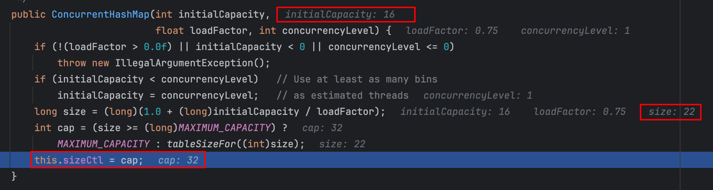

这么做的意义是什么呢？
用户传入16,这代表用户想要存储是16个元素,但是如果按照hashMap的做法,内部数组的容量就是16,但是默认的扩容

阈值为12,这会导致存不到16个就会触发。

而cmp在面对用户期望存储的元素数量时,给的初始容量为32,当用户真正只会存16个元素时,是不会触发扩容的(在高并发情况下，扩容是需要耗时的)，这种设计在一定程度上提高了性能,当然是使用空间为代价来交换的

***

下面进入到源码分析中：


* put(key,value)

```java
public V put(K key, V value) {
    return putVal(key, value, false);
}
final V putVal(K key, V value, boolean onlyIfAbsent) {
    // 可以看到,cmp是不允许存储的k-v为null的(这与hashMap是不同的)
    if (key == null || value == null) throw new NullPointerException();
    // 计算key对应的hashCode,cmp的基本工作原理并没有改变
    int hash = spread(key.hashCode()); 
    int binCount = 0;
    for (Node<K,V>[] tab = table;;){TODO} // 在这里完成所有的操作
    addCount(1L, binCount);
    return null;
}

/*
    计算key对应的hashcode
    在hashMap中是直接返回h ^ (h >>> 16) - 为什么这么做在hashMap中已经介绍过了
    而在这里还要 &HASH_BITS(0x7fffffff)的原因是需要保证最终的hash值一定是一个正数
    因为节点的hash值为负数时,在cmp中具有特殊的含义
*/
static final int spread(int h) {
    return (h ^ (h >>> 16)) & HASH_BITS;
}
```

putVal()中的for循环是操作的核心点,在这里采用正常的逻辑,来思考一下可能会遇到的情况

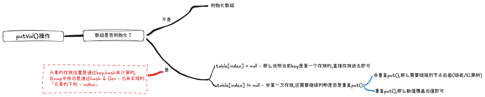

这里有一个问题：那就是cmp可是线程安全的，先给出Map的一般结构：

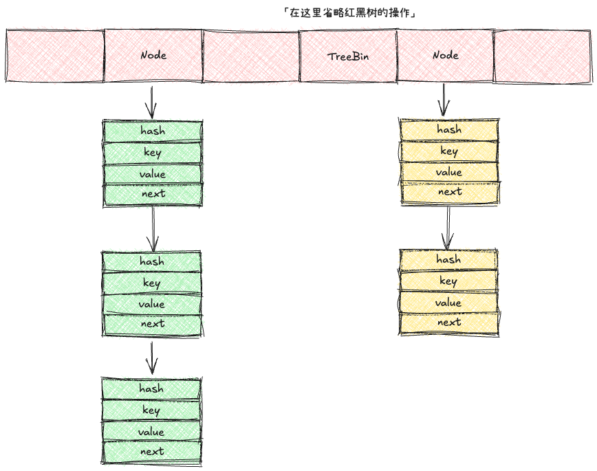

当内部数组为空时(还没有初始化)，如何保证只有一个线程能够进行初始化操作呢？在这里就是通过sizeCtl来控制的

> 当sizeCtl=0时,代表cmp还未初始化(这通常出现在调用cmp的无参构造函数
>
> 通常情况下：sizeCtl = 下一次扩容时的容量（对于第一次来说，就是初始化容量）

```java
tab = table;(table是内部数组)
if(tab == null) {initArray()}
```

下面就先看下这部分的逻辑:

* 数组为null

**/\* ------------------------------数组为null------------------------------\*/**

```java
final V putVal(K key, V value, boolean onlyIfAbsent) {
   for (Node<K,V>[] tab = table;;) {
        Node<K,V> f; int n, i, fh; K fk; V fv;
        if (tab == null || (n = tab.length) == 0) // 多个线程进来都可能判断数组为空,继续看
            tab = initTable();
        // ... 省略其他
}


// 初始化内部数组
private final Node<K,V>[] initTable() {
    Node<K,V>[] tab; int sc;
    // 这里使用的是while()
    while ((tab = table) == null || tab.length == 0) {
        // 看下面的逻辑,其他线程全部被卡在这 - 通过Thread.yield()来减少与初始化数组线程的竞争
        if ((sc = sizeCtl) < 0)
            Thread.yield(); // lost initialization race; just spin
        // cas操作将 SIZECTL设置为-1 - 这代表内部数组正在被初始化
        // 只能有1个线程成功
        else if (U.compareAndSetInt(this, SIZECTL, sc, -1)) {
            try {
                if ((tab = table) == null || tab.length == 0) { // 这个是必然的
                    // 如果用户没有传入初始容量,那么就用默认的 - 16
                    int n = (sc > 0) ? sc : DEFAULT_CAPACITY;
                    // 创建数组,赋值引用
                    Node<K,V>[] nt = (Node<K,V>[])new Node<?,?>[n];
                    table = tab = nt;
                    // 设置扩容阈值
                    sc = n - (n >>> 2);
                }
            } finally {
                sizeCtl = sc;
            }
            break;
        }
    }
    return tab;
}
```

此时的结构为：以初始容量为32为例

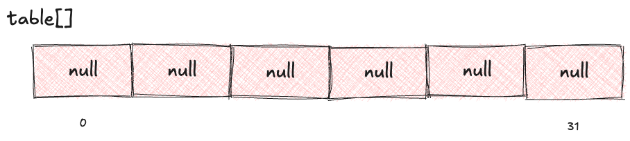

可以看到：cmp是通过sizeCtl来保证数组只能由1个线程初始化的

* 继续看当数组不为null时：

**/\* ------------------------------数组不为null,并且对应的槽位为null------------------------------\*/**

数组不为null,并且key对应的index槽位为null，这代表此刻没有别的线程存放过，那么cas创建一个新的节点并且存放到相应的槽位上

```java
for (Node<K,V>[] tab = table;;) {
     Node<K,V> f; int n, i, fh; K fk; V fv;
     if (tab == null || (n = tab.length) == 0) // #1 数组为null
           tab = initTable();
            // #2 数组不为null,并且key对应的index槽位为null - 这代表此刻该位置还没有别的线程存放过元素
            // 但是多个线程可能会同时判断成功，所以在下面设置的时候还需要保证线程安全,这是通过CAS来完成的
     else if ((f = tabAt(tab, i = (n - 1) & hash)) == null) {
         // 这里只能有一个线程成功
        if (casTabAt(tab, i, null, new Node<K,V>(hash, key, value)))
        // 成功的线程结束for循环,然后调用addCount()来增加计数即可,put()操作就算完成了
            break;                   // no lock when adding to empty bin
    } 
}
```

此时的结构如下：

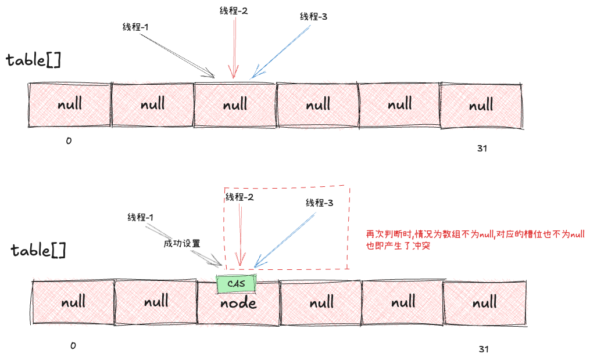

**/\* ------------------------------数组不为null,并且对应的槽位不为null------------------------------\*/**

这里就代表产生了哈希冲突了

> 并且从这里可以看到,concurrentHashMap并不是真正意义上的高并发列表,虽然有cas(数组槽位上的节点设置是通过cas的),但是链表上的节点设置(冲突),则是通过synchronized来实现的

```java
else {
    V oldVal = null;
    // f 对应的是table[index]上的那个节点「是数组上的node节点」
    // 在这里是通过synchronized来保证线程安全的,下面的执行代码就是单线程的
    synchronized (f) {
        if (tabAt(tab, i) == f) { // 确保节点的稳定性
            /*
                fh是f节点对应的hashcode,在这里需要保证>0,因为负数代表其他的含义
                在这里的逻辑就和hashMap一样的
                    1.判断数组节点对应的key 和 当前key是否相同，相同覆盖即可(onlyIfAbsent会影响)
                    2.不同,则遍历链表,同样做相同的判断
                    3.在链表上没找到相同的key,那么插入到链表尾部即可
            */
            if (fh >= 0) {
                binCount = 1;
                for (Node<K,V> e = f;; ++binCount) {
                    K ek;
                    if (e.hash == hash &&
                        ((ek = e.key) == key ||
                         (ek != null && key.equals(ek)))) {
                        oldVal = e.val;
                        if (!onlyIfAbsent)
                            e.val = value;
                        break;
                    }
                    Node<K,V> pred = e;
                    if ((e = e.next) == null) {
                        pred.next = new Node<K,V>(hash, key, value);
                        break;
                    }
                }
            }
            // ....省略红黑树的操作
            // 如果节点是ReservationNode,则抛出异常,这里是对应什么场景呢？
            // 避免递归更新
            else if (f instanceof ReservationNode)
                throw new IllegalStateException("Recursive update");
        }
    } // end for syn
    if (binCount != 0) {
        if (binCount >= TREEIFY_THRESHOLD)
            treeifyBin(tab, i);
        if (oldVal != null) // 如果是重复put,那么直接返回即刻,不需要执行下面的addCount()，因为没有增加新的节点
            return oldVal;
        break;
    }
}
```

此时的结构为：

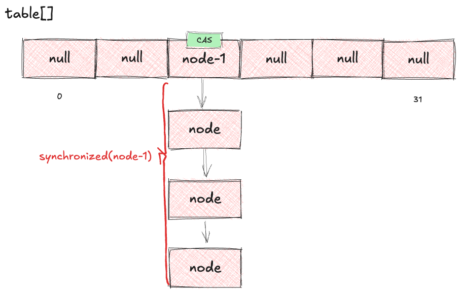

**/\* ------------------------------添加元素成功,更新计数------------------------------\*/**

由于多线程操作put()后都会来更新计数,所以在这里为了性能,并没有采用单纯的count，而是采用类似LongAdder的实现高并发计数器「源码实现思路是和LongAdder一样的」

```java
/*
    addCount(1L, binCount); 
        binCount是链表上的元素个数
            - 0:代表只是将key-node存放到数组的槽位上
            - >=1:代表产生了冲突，也即链表上至少存在一个元素(包括数组上的元素)
*/
private final void addCount(long x, int check) {
    CounterCell[] cs; long b, s;
    // 省略：高并发计数器的原理(在这里check的作用我有点没看明白,是为了优化吗?)
     if(xxx){
      s = sumCount(); // 获取此时cmp中的元素个数(非强一致性)
     }
     if (check >= 0) {
        Node<K,V>[] tab, nt; int n, sc;
        /*
            sizeCtl>0 时代表下一次扩容的阈值
                - (s >= (long)(sc = sizeCtl)：此刻的元素个数>=扩容阈值
                - (tab = table) != null 理论上不会为null
                - (n = tab.length) < MAXIMUM_CAPACITY 内部数组的长度没有超过最大值
            那么进行扩容操作(假设sc=25 > sizeCtl=24)
        */
        while (s >= (long)(sc = sizeCtl) && (tab = table) != null &&
               (n = tab.length) < MAXIMUM_CAPACITY) {
           /*
               n是数组的长度(不是元素个数) - 这个方法分为两个部分
                   - stamped = resizeStamp(n):为不同的数组长度生成不同的唯一标识
                   - stapmed << RESIZE_STAMP_SHIFT : 保证一定为负数
               1.resizeStamp(n)的实现: n = 32(假设长度为32)
                   Integer.numberOfLeadingZeros(n) | (1 << (RESIZE_STAMP_BITS - 1));
                       - Integer.numberOfLeadingZeros(n)：获取长度前面有多少个0 - 不同的长度有不同的值
                       - (1 << (RESIZE_STAMP_BITS - 1)) ：左移15位(第16位为0)
                       - 或操作：10000000 00011011(第16位为1,后面是数据是数组长度的唯一标识)
               2.<< RESIZE_STAMP_SHIFT
                   将返回stamped 左移16,保证一定为负数,以上面的值为例
                   rs = 10000000 00011011 00000000 00000000 「rs一定为负数,这里的低16位就是用来实现并发扩容的」
           */
            int rs = resizeStamp(n) << RESIZE_STAMP_SHIFT;
            // sc<0:代表别的线程已经在扩容,第一个线程扩容的时候,sc还是等于扩容阈值的(比如24)
            // 先看第一个线程扩容的操作「下面」
            if (sc < 0) {
                if (sc == rs + MAX_RESIZERS || sc == rs + 1 ||
                    (nt = nextTable) == null || transferIndex <= 0)
                    break;
                if (U.compareAndSetInt(this, SIZECTL, sc, sc + 1))
                    transfer(tab, nt);
            }
            /*
                 第一个线程扩容的时候会走到这里,在这里会将sizectl设置为rs+2
                「为什么第一个线程是+2呢」
                 第一个线程的操作结果：
                     - 10000000 00011011 00000000 00000000
                     - 10000000 00011011 00000000 00000010(+2)
                     - 然后进行扩容操作transfer(tab, null)
            */
            else if (U.compareAndSetInt(this, SIZECTL, sc, rs + 2))
                transfer(tab, null);
            s = sumCount();
        }
    }
}
```

先来总结一下上面这一段的逻辑：

1. 首先会为每个数组长度生成唯一标识：通过int rs = resizeStamp(n) << RESIZE\_STAMP\_SHIFT来实现,该数值可以分为两个部分,高16位和低16位「高16位代表数组长度唯一标识」「低16位代表扩容线程」

2. 先看第一次扩容的线程：将SIZECTL设置为rs + 2「第一个线程是+2，而不是+1」

3. 并发扩容逻辑，后面补充

**/\* ------------------------------扩容操作------------------------------\*/**

```java
private final void transfer(Node<K,V>[] tab, Node<K,V>[] nextTab) {
    /*
        n:数组的长度
        stride表示每个线程负责迁移的槽位数量
    */
    int n = tab.length, stride;
    /*
        1.多核(现在一般都是多核),(n >>> 3) / NCPU,每个线程大约处理1/8*NCPU的槽位(为什么是这么计算呢？)
        2.最小阈值保护：每个线程最小处理16个槽位 - 在这里就以16为例子
    */
    if ((stride = (NCPU > 1) ? (n >>> 3) / NCPU : n) < MIN_TRANSFER_STRIDE)
        stride = MIN_TRANSFER_STRIDE; // subdivide range
    // 第一个线程扩容时,新数组是为null的
    if (nextTab == null) {            // initiating
        try {
            // 创建一个新的数组,容量为旧数组的两倍
            Node<K,V>[] nt = (Node<K,V>[])new Node<?,?>[n << 1];
            nextTab = nt;
        } catch (Throwable ex) {      // try to cope with OOME 
            sizeCtl = Integer.MAX_VALUE;
            return;
        }
        /*
            nextTable：扩容时的数组
            transferIndex：初始被设置为旧数组的长度,从尾部开始迁移
        */
        nextTable = nextTab;
        transferIndex = n;
    }
    // 新数组的长度(在这里应该为64)
    int nextn = nextTab.length;
    /*
        创建ForwardingNode节点,该节点用来标记某个槽位正在迁移,当线程访问到这个节点时
        就能够知道这个槽位正在迁移(hash = MOVED = -1)
        此时会将线程重定向到新数组来进行查询操作
    */
    ForwardingNode<K,V> fwd = new ForwardingNode<K,V>(nextTab);
    /*
        advance：代表线程是否可以继续推进到下一个槽位,默认是可以的
        finishing：确保所有槽位都被正确迁移后才提交新表(更新数组的引用)
    */
    boolean advance = true;
    boolean finishing = false; // to ensure sweep before committing nextTab
    /*------------------ 核心扩容逻辑 ------------------*/
    for (int i = 0, bound = 0;;){TODO} 
}
```

**/\* ------------------------------<span style="color: rgb(216,57,49); background-color: inherit">核心扩容逻辑</span>------------------------------\*/**

```java
// ... 
for (int i = 0, bound = 0;;) {
    Node<K,V> f; int fh;
       while (advance) { // 当前线程可以推进槽位的处理 - 默认为true
            int nextIndex, nextBound;
            if (--i >= bound || finishing) // 当前线程处理完毕自己负责的槽位
                advance = false;   
            else if ((nextIndex = transferIndex) <= 0) { //旧数组已经全部处理完毕,在这里会赋值nextIndex
                i = -1;
                advance = false;
            } 
    /*
       上面会赋值nextIndex - 在这里会被初始化为旧数组的长度（假设为64）
       nextIndex = 64
       --> 这里在扩容时会涉及到几个比较重要的属性：
           - transferIndex ： global:全局任务分配指针,指向下一个待分配的槽位范围,初始化为旧数组长度
           - nextIndex 线程本地变量:代表当前线程所领取的槽位区间内的下一个待处理的槽位索引
                       线程会从nextIndex-1开始向下扫描并且迁移桶,直到到达nextBound为止
           - nextBound：线程本地变量：表示当前线程领取槽位的下限,线程处理槽位的范围通常是在[nextBound,nextIndex-1]
           - bound:线程本地变量：被初始化为nextBound
           - i:线程本地变量,代表当前线程处理的第一个槽位的index
    */
            else if (U.compareAndSetInt
                     (this, TRANSFERINDEX, nextIndex,
                      nextBound = (nextIndex > stride ?
                                   nextIndex - stride : 0))) {
                bound = nextBound;
                i = nextIndex - 1;
                advance = false;
            }
        }
}
```

假设旧数组的长度为32，新数组的长度为64,那么第一个线程执行完这段代码后的结构如下：

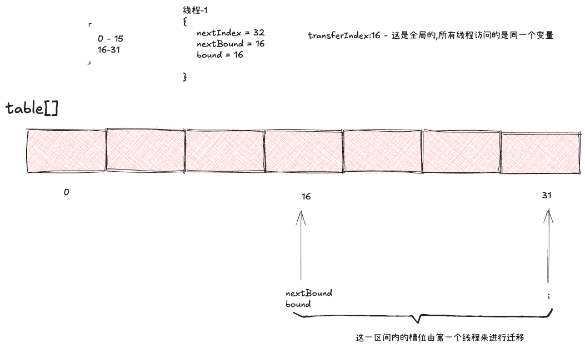

当线程"领取"完自己所对应的处理区间后,下面就要开始进行处理了

```java
private final void transfer(Node<K,V>[] tab, Node<K,V>[] nextTab) {
    // ....
    /*
        这里是用来做边界检查的,i代表的是当前线程处理的索引位,
        如果不满足条件则通常代表线程已经处理完了自己负责的槽位,后续再来补充这里的逻辑
        线程刚开始做迁移动作的时候是肯定满足的
    */
    if (i < 0 || i >= n || i + n >= nextn){...}
    // 如果对应的桶为null,那么将该位置cas设置为fwd(MOVED),这样其他线程在访问时,就会被重定向到新数组上去
    else if ((f = tabAt(tab, i)) == null){ advance = casTabAt(tab, i, null, fwd);}
    // 如果对应的桶不为空,但是其hash为MOVED,那么代表已经被处理过了,那么可以向前推进一个桶位
    else if ((fh = f.hash) == MOVED){advance = true;}
    // 正常情况：那么当前线程需要做迁移操作,这里的操作其实和hashMap中的迁移操作是一样的
    else{
        synchronized (f) {
            if (tabAt(tab, i) == f) { // 确保节点的稳定性
                Node<K,V> ln, hn;
                if (fh >= 0) { // node.hash必须大于0
                    int runBit = fh & n; // 直接与旧数组容量做&运算,如果=0,那么在低位链表,否则在高位链表
                    Node<K,V> lastRun = f; // lastRun是一个特殊节点,从这个节点开始到链表尾部的所有节点都朝一个方向迁移
                    // 处理链表上的所有节点 #1
                    for (Node<K,V> p = f.next; p != null; p = p.next) {
                        int b = p.hash & n; // 计算当前节点所处在的位置/类型「是在高位链表还是在低位链表」
                        if (b != runBit) { // 这里的runBit是槽位上节点的类型,如果不相等
                            runBit = b; // 那么更新runBit和lastRun
                            lastRun = p;
                        }
                    }
                    // #2
                    // 如果最终的runBit=0,那么作为低位链表(lastRun -> list end)
                    if (runBit == 0) {
                        ln = lastRun;
                        hn = null;
                    }// 否则作为高位链表(lastRun -> list end)
                    else {
                        hn = lastRun;
                        ln = null;
                    }
                    // #3 但是由于只处理了从lastRun到list end之间的元素节点(可能只有1个)
                    // 所以在这里还需要处理从[槽位节点,lastRun]之间的节点
                    // 这里的f就是槽位节点,并且不为lastRun[因为lastRun已经在上面处理过了]
                    for (Node<K,V> p = f; p != lastRun; p = p.next) {
                        // 节点的hash,key,value
                        int ph = p.hash; K pk = p.key; V pv = p.val;
                        //高低链表,另我好奇的是,在这里直接通过创建新的节点,为什么不服用之前的存在的节点呢?
                        // 下面的操作就是创建新的节点,并且作为高低链表的新头节点
                        if ((ph & n) == 0)
                            ln = new Node<K,V>(ph, pk, pv, ln);
                        else
                            hn = new Node<K,V>(ph, pk, pv, hn);
                    }
                    // 到这里当前i槽位上的所有元素都处理完了
                    // 设置低位链表和高位链表到新数组上去
                    setTabAt(nextTab, i, ln);
                    setTabAt(nextTab, i + n, hn);
                    // 设置旧数组[i]上的元素为fwd,代表已经处理过了
                    setTabAt(tab, i, fwd);
                    // 可以继续向前推进
                    advance = true;
                }
    }
}

```

在这里说明一下#1处的代码逻辑，在hashMap中的处理是遍历每个节点,然后链接形成高低链表。

但是在cmp中还使用了lastRun机制,结构如下：


\#2处的代码逻辑：形成高低链表

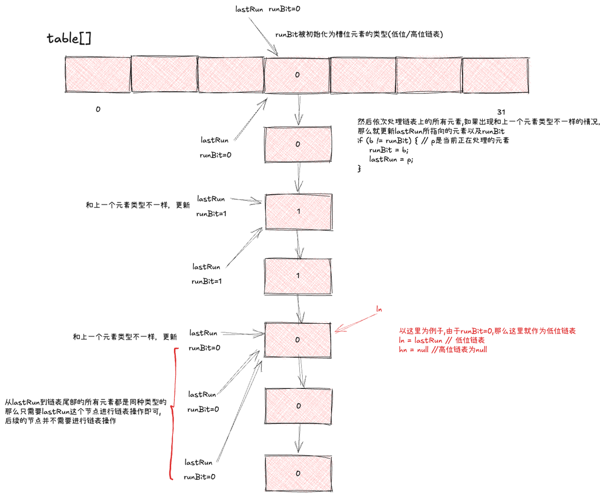

\#3处的代码逻辑：处理\[槽位节点,lastRun)之间的节点

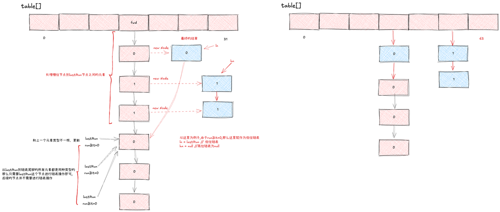

继续回到transfer()方法中

```java
/*
    在上面只是介绍了线程处理一个槽位的流程,但是每个线程领取的是stride(以16个为例)个槽位
    所以当处理完一个后,会继续处理下一个
*/
private final void transfer(Node<K,V>[] tab, Node<K,V>[] nextTab) {
    for (int i = 0, bound = 0;;) {
         while (advance) {
          int nextIndex, nextBound;
             // 在这里会不断的重复,当i=16时,这是当前线程所负责的的最后一个槽位了[16,31]
             // 此时--i = 15 < bound = 16，那么就不会走这个分支
            if (--i >= bound || finishing)
                advance = false;
             // 这里的逻辑是旧数组的槽位都被处理完毕了
            else if ((nextIndex = transferIndex) <= 0) {
                    i = -1;
                    advance = false;
            }
            // 只要还有能够处理的槽位区间，那么就去领取新的任务
            else if (U.compareAndSetInt
                         (this, TRANSFERINDEX, nextIndex,
                          nextBound = (nextIndex > stride ?
                                       nextIndex - stride : 0))) {
                    bound = nextBound;
                    i = nextIndex - 1;
                    advance = false;
            }
         }
    }
}
```

看下当数组迁移完毕后的操作

```java
if (i < 0 || i >= n || i + n >= nextn) {
    int sc;
    if (finishing) { // 最终最后一个线程会走到这里
        nextTable = null;//将新数组引用设置为null
        table = nextTab; //更新数组引用
        sizeCtl = (n << 1) - (n >>> 1); // 计算新的阈值
        return;
    }
    // cas将sizeCtl-1,代表当前线程退出扩容操作(因为旧数组已经迁移完毕了)
    if (U.compareAndSetInt(this, SIZECTL, sc = sizeCtl, sc - 1)) {
        //检查是否是最后一个线程,如果不想等,那么说明还有其他线程在工作(数组还没有完全迁移完毕,但是所有的槽位都已经分配完了)
        //那么当前线程直接返回即可
        if ((sc - 2) != resizeStamp(n) << RESIZE_STAMP_SHIFT)
            return;
        // 否则当前线程就是最后一个线程,那么设置finishing=true
        finishing = advance = true;
        // 重新检查所有槽位,确保每个槽位确实都被迁移完了
        // i=n时,会重新执行for(;;)循环,不过这次只是做个检查
        i = n; // recheck before commit 
    }
}
```

继续看下多线程扩容的逻辑

**/\* ------------------------------多线程扩容-----------------------------\*/**

```java
// 继续回到addCount()方法中
private final void addCount(long x, int check) {
    if (check >= 0) {
            Node<K,V>[] tab, nt; int n, sc;
            while (s >= (long)(sc = sizeCtl) && (tab = table) != null &&
                   (n = tab.length) < MAXIMUM_CAPACITY) {
                int rs = resizeStamp(n) << RESIZE_STAMP_SHIFT;
                /*
                    第一个线程扩容时,会将sizeCtl设置为负数,
                    所以这里能够判断出其他线程已经在扩容的,那么这里就进行协助扩容(多线程扩容)
                */
                if (sc < 0) {
                /*
                    sc == rs + MAX_RESIZERS：一般不会到达最大值
                    sc == rs + 1：这代表数组已经扩容完毕
                */
                    if (sc == rs + MAX_RESIZERS || sc == rs + 1 ||
                        (nt = nextTable) == null || transferIndex <= 0)
                        break;
                    // 否则数组还未扩容完毕,那么将扩容线程数+1，然后帮助扩容
                    if (U.compareAndSetInt(this, SIZECTL, sc, sc + 1))
                        transfer(tab, nt);
                }
                // 这里是第一个线程执行的逻辑....
                else if (U.compareAndSetInt(this, SIZECTL, sc, rs + 2))
                    transfer(tab, null);
                s = sumCount();
            }
        }
}
```

**/\* ------------------------------结束-----------------------------\*/**

到这里关于concurrentHashMap就简单的介绍到这里了，而get()方法则比较简单,在这里就不再赘述


# ConcurrentSkipListMap

## SkipList(简易实现)

> [Skip Lists: A Probabilistic Alternative to Balanced Trees](https://link.segmentfault.com/?enc=GJk3hmY1JFOrlbcbkqEK2Q%3D%3D.EF4WJNQ78whP60o1ysxOHcTmJ80sDt3mTCzKAI7qiUKVylNmPhwTYNSaPHq3gPOVGiPRmkTV0MxesrWyOJU6fyylx6E3WWBFrAvMN7JSIs6O5VGLTtlhfpuM3DZp0UDc) ： 跳表论文,作者：William Pugh

* 简单介绍：

跳表是一种概率性的有序数据结构，它通过维护多级索引来实现快速查找，可以看作是多层次的链表。跳表的平均时间复杂度为O(log n)，最坏情况为O(n)，在性能上可以与平衡树相媲美，**<span style="color: rgb(216,57,49); background-color: inherit">但实现更为简单</span>**

> 其中最关键的一点就在于实现简单(虽然最坏情况可能变为O(n))
> 因为类似平衡树(AVL树,红黑树,B树)等数据结构的痛点就在于实现非常复杂,维护困难并且并发性能差,
> 而跳表的核心设计目标就是：简单实现,良好性能,空间效率以及易于并发

* 单链表的痛点

即使单链表&#x662F;**<span style="color: rgb(216,57,49); background-color: inherit">有序</span>**&#x7684;,但是想要找到某个具体元素，还是需要遍历整个链表,时间复杂度为O(N)「当然跳表也是基于有序的,和数组的二分查找的条件是一样的(要求数组是有序的)」

所以为了优化查询速度可以采用和Mysql存储引擎一样的设计，在mysql中，数据的存储是通过B+树来存储的，其中所有的数据都是存储在底层的叶子节点(双向链表)，而非叶子节点则存储索引信息。

在这里也可以为单链表加上索引,采取类似二分查找的设计,每两个节点构建一个索引

> 如果采用每两个节点就生成一个索引节点，那么当数据量很大的时候，索引节点所占的内存也是不可忽略的，所以在真实实现中并不会采用这种方式,当然也不会选取一个很大的间隔来作为索引生成的条件(这会导致性能下降)，应该是要选择一个合理的值,来到达时间复杂度和空间复杂度的平衡

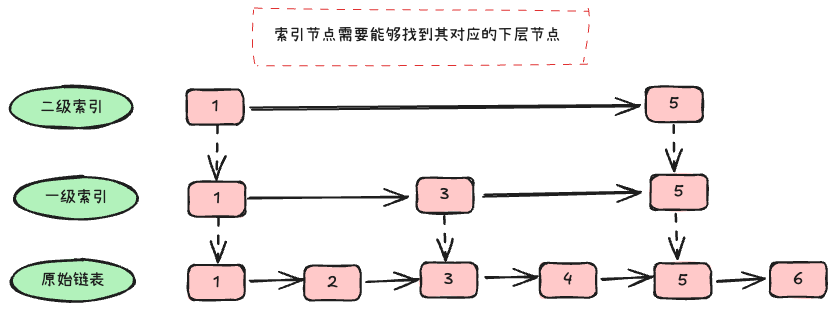


采取二分的另外一个问题，那就是插入的时候，是否需要更新索引呢？

1. 如果更新,那么频繁的索引操作也会导致性能下降 -- O(N)

2. 如果不更新，那么会导致某两个索引节点之间的数据非常多,在极端情况下性能可能会退为单链表 -- O(N)

所以为了避免性能的下降,在这里采用的是随机函数来更新索引结构,而不是固定的方式

> 当插入一个元素时,通过随机函数生成一个K值,将这个节点添加到一级索引到K级索引之间

* 简单跳表的实现

```java
public class SkipList<T extends Comparable<T>> {
    /*-----------------Node for SkipList-------------------*/
    class SkipListNode<T> {
        T value;
        /**
         * 前进指针数组，用于实现跳表的多级索引结构
         * <p>
         * 该数组存储当前节点在跳表各层级中的直接后继节点引用。数组的索引对应于跳表的层级，
         * 其中索引0表示最底层的完整链表，更高的索引表示上层索引层。
         * </p>
         *
         * <h3>数据结构特性：</h3>
         * <ul>
         *   <li><b>数组长度</b>：{@code level + 1}，其中 {@code level} 是当前节点的最大层级</li>
         *   <li><b>索引范围</b>：{@code [0, level]}，包含当前节点出现的所有层级</li>
         *   <li><b>指针语义</b>：{@code forwards[i]} 指向当前节点在第 {@code i} 层的下一个节点</li>
         * </ul>
         *
         * <h3>在跳表操作中的作用：</h3>
         *   <ul>
         *     <li><b>查找操作</b>：通过高层指针快速跳过大量节点，实现 O(log n) 的平均时间复杂度</li>
         *     <li><b>插入操作</b>：在各相应层级中更新前驱节点的 {@code forwards} 指针以链接新节点</li>
         *     <li><b>删除操作</b>：断开各层级中指向被删除节点的 {@code forwards} 指针链接</li>
         *     <li><b>范围查询</b>：利用底层 {@code forwards[0]} 指针高效遍历有序序列</li>
         *   </ul>
         *  <h3>内存布局示例：</h3>
         *  对于层级为 2 的节点（值=15）：
         *   <pre>
         *   ┌─────────────┬────────┬──────────┬──────────┬──────────┐
         *   │    value    │ level  │ forwards[0] │ forwards[1] │ forwards[2] │
         *   ├─────────────┼────────┼──────────┼──────────┼──────────┤
         *   │     15      │   2    │  →18     │  →21     │  →25     │
         *   └─────────────┴────────┴──────────┴──────────┴──────────┘
         *   </pre>
         *  <h3>在跳表结构中的表现：</h3>
         *  <pre>
         *  Level 2:  head → 9 → 15 → 25 → tail
         *  Level 1:  head → 9 → 15 → 21 → 25 → tail
         *  Level 0:  head → 3 → 9 → 12 → 15 → 18 → 21 → 25 → 26 → tail
         *  </pre>
         */
        SkipListNode<T>[] forwards;
        int level; // 节点所在的最大层级

        public SkipListNode(T value, int level) {
            this.value = value;
            this.level = level;
            this.forwards = new SkipListNode[level + 1];
        }
    }

    /*-----------------fields-------------------*/
    private static final int MAX_LEVEL = 16; // 最大层级数
    private SkipListNode<T> head; // 头节点
    private int currentLevel; // 当前层级数
    private Random random; // 随机数生成器
    private int size; // 跳表中元素数量

    public SkipList() {
        this.head = new SkipListNode<>(null, MAX_LEVEL);
        this.currentLevel = 0;
        this.random = new Random();
        this.size = 0;
    }
}
```

当初始化后,跳表的结构如下：head节点的level默认为MAX\_LEVEL,因为每一层都需要有head节点、

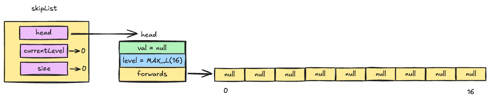

下面看下插入元素的操作

```java
// insert
    public void insert(T value) {
        if (value == null) {
            // throw exception
            return;
        }
        // 记录当前节点在各层级中的直接前驱节点
        SkipListNode<T>[] update = new SkipListNode[MAX_LEVEL + 1];
        SkipListNode<T> current = head;

        // 从最高层级开始，逐层向下查找插入位置 - 每一层都需要查找插入的位置 #1
        for (int i = currentLevel; i >= 0; i--) {
            while (current.forwards[i] != null && current.forwards[i].value.compareTo(value) < 0) {
                current = current.forwards[i];
            }
            update[i] = current;
        }

        // 检查节点是否已经存在
        current = current.forwards[0];
        if (current != null && current.value.equals(value)) {
            // 节点已经存在，可以直接返回也可以选择覆盖,在这里选择直接返回
            return;
        }
        // 生成新节点的层级 #2
        int newLevel = randomLevel();
        // 如果新节点的层级比当前层级大，则需要更新update数组和currentLevel #3
        if (newLevel > currentLevel) {
            for (int i = currentLevel + 1; i <= newLevel; i++) {
                update[i] = head;
            }
            currentLevel = newLevel;
        }

        // 创建新的节点
        SkipListNode<T> newNode = new SkipListNode<>(value, newLevel);
        // 更新指针 #4
        for (int i = 0; i <= newLevel; i++) {
            newNode.forwards[i] = update[i].forwards[i];
            update[i].forwards[i] = newNode;
        }
        size++; // 更新元素个数
    }
    
/**
* 随机生成节点层级
* 遵循概率分布：第i层出现的概率是第i-1层的1/2
*/
private int randomLevel() {
    int level = 0;
    while (level < MAX_LEVEL && random.nextDouble() < 0.5) {
        level++;
    }
    return level;
}
```

插入操作一共有4处代码需要讲解

```java
// #1 从最高层级开始，逐层向下查找插入位置 - 每一层都需要查找插入的位置
for (int i = currentLevel; i >= 0; i--) {
    while (current.forwards[i] != null && current.forwards[i].value.compareTo(value) < 0) {
        current = current.forwards[i];
    }
    update[i] = current;
}
```

这段代码的作用是记录当前要插入的元素在每一个层级的位置：update\[i]代表的是当前节点要插入在update\[i]节点的后面

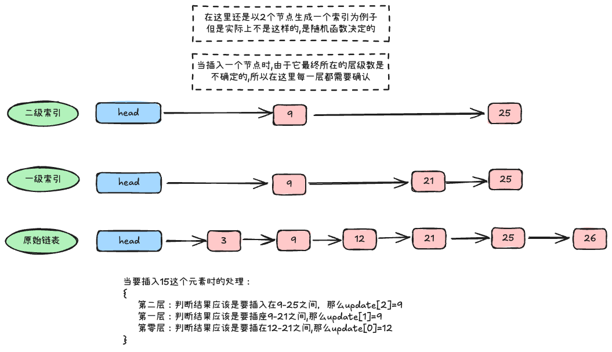

```java
// 生成新节点的层级 #2
int newLevel = randomLevel();
// 如果新节点的层级比当前层级大，则需要更新update数组和currentLevel #3
if (newLevel > currentLevel) {
    for (int i = currentLevel + 1; i <= newLevel; i++) {
        update[i] = head;
    }
    currentLevel = newLevel;
}
```

如果当前节点随机生成的level比现有的level还要大,那么对应新增的层级,当前节点都是插在head节点之后的

那么更新update\[i] = head即刻

```java
// 创建新的节点
SkipListNode<T> newNode = new SkipListNode<>(value, newLevel);
// 更新指针 #4
for (int i = 0; i <= newLevel; i++) {
    newNode.forwards[i] = update[i].forwards[i]; 
    update[i].forwards[i] = newNode; 
}
```

创建新的节点，并且更新指针

```java
/*
    forwards[i]代表的是当前在每一层的下一个节点 -- 相当于是next
*/
```

此时的结构如下：

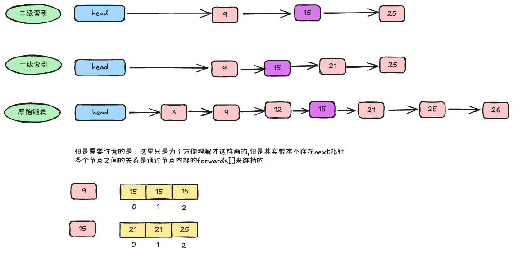

再看一下第一个节点的操作结果(一般情况)：

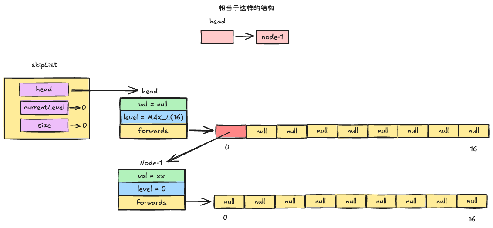

* 删除

```java
public boolean delete(T value) {
    if (value == null) {
        return false;
    }
    SkipListNode<T>[] update = new SkipListNode[MAX_LEVEL + 1];
    SkipListNode<T> current = head;
    /*
        查找要删除的节点
        这里和insert()是一样的逻辑,因为之前在插入的时候可能每一个层级都有,所以这里也必须要处理
        但是逻辑是一样的,不再赘述
    */
    for (int i = currentLevel; i >= 0; i--) {
        while (current.forwards[i] != null &&
                current.forwards[i].value.compareTo(value) < 0) {
            current = current.forwards[i];
        }
        update[i] = current; // 这里记录的是每一层,待删除节点的前驱节点
    }
    // 如果不存在,那么直接返回
    current = current.forwards[0];
    if (current == null || !current.value.equals(value)) {
        return false; // 未找到要删除的节点
    }
    // 更新指针
    for (int i = 0; i <= current.level; i++) {
        if (update[i].forwards[i] != current) {
            break;
        }
        // 将前驱节点的next指针绕过当前待删除的节点,指向当前节点的后继节点「没有next,这里口语话方便理解」
        update[i].forwards[i] = current.forwards[i];
    }
    // 更新当前最大层级 - 如果待删除的节点是最高层的唯一节点,那么需要降低跳表的最大层级
    while (currentLevel > 0 && head.forwards[currentLevel] == null) {
        currentLevel--;
    }

    size--;
    return true;
}
```

* 查找元素

```java
    /**
     * 查找元素 逻辑比较简单不再赘述
     */
    public boolean contains(T value) {
        if (value == null) {
            return false;
        }

        SkipListNode<T> current = head;
        // 从最高层开始查找
        for (int i = currentLevel; i >= 0; i--) {
            while (current.forwards[i] != null &&
                    current.forwards[i].value.compareTo(value) < 0) {
                current = current.forwards[i];
            }
        }

        // 现在current是在第0层的小于value的最大节点
        current = current.forwards[0];
        return current != null && current.value.equals(value);
    }
```

* 调试

```java
/**
 * 打印跳表结构（用于调试）
 */
public void display() {
    System.out.println("SkipList (size: " + size + ", maxLevel: " + currentLevel + ")");
    for (int i = currentLevel; i >= 0; i--) {
        System.out.print("Level " + i + ": ");
        SkipListNode<T> node = head.forwards[i];
        while (node != null) {
            System.out.print(node.value + " ");
            node = node.forwards[i];
        }
        System.out.println();
    }
}
```

* 测试

```java
package com.wjcoder.juc;

// 测试类
public class SkipListTest {
    public static void main(String[] args) {
        SkipList<Integer> skipList = new SkipList<>();

        // 测试插入
        System.out.println("=== 插入测试 ===");
        int[] testData = {3, 6, 7, 9, 12, 19, 17, 26, 21, 25};
        for (int num : testData) {
            skipList.insert(num);
        }
        skipList.display();

        // 测试查找
        System.out.println("\n=== 查找测试 ===");
        System.out.println("包含 19: " + skipList.contains(19));
        System.out.println("包含 100: " + skipList.contains(100));

        // 测试删除
        System.out.println("\n=== 删除测试 ===");
        System.out.println("删除 19: " + skipList.delete(19));
        System.out.println("删除 100: " + skipList.delete(100));
        skipList.display();

        // 性能测试
        System.out.println("\n=== 性能测试 ===");
        SkipList<Integer> performanceList = new SkipList<>();
        long startTime = System.nanoTime();

        // 插入10000个元素
        for (int i = 0; i < 10000; i++) {
            performanceList.insert(i);
        }

        long insertTime = System.nanoTime() - startTime;

        // 查找测试
        startTime = System.nanoTime();
        for (int i = 0; i < 1000; i++) {
            performanceList.contains(i * 10);
        }

        long searchTime = System.nanoTime() - startTime;

        System.out.println("插入10000个元素耗时: " + insertTime / 1e6 + " ms");
        System.out.println("1000次查找耗时: " + searchTime / 1e6 + " ms");
    }
}
// out put
=== 插入测试 ===
SkipList (size: 10, maxLevel: 6)
Level 6: 17 
Level 5: 17 
Level 4: 17 
Level 3: 17 
Level 2: 3 17 
Level 1: 3 12 17 21 
Level 0: 3 6 7 9 12 17 19 21 25 26 

=== 查找测试 ===
包含 19: true
包含 100: false

=== 删除测试 ===
删除 19: true
删除 100: false
SkipList (size: 9, maxLevel: 6)
Level 6: 17 
Level 5: 17 
Level 4: 17 
Level 3: 17 
Level 2: 3 17 
Level 1: 3 12 17 21 
Level 0: 3 6 7 9 12 17 21 25 26 

=== 性能测试 ===
插入10000个元素耗时: 4.974184 ms
1000次查找耗时: 1.103854 ms
```

到这里,一个简易的skipList就介绍到这里了,下面就进入到ConcurrentSkipListMap,看下doug lea是如何实现的

***

## ~~ConcurrentSkipListMap源码解析~~

* 类属性以及构造函数

```java
public class ConcurrentSkipListMap<K,V> extends AbstractMap<K,V>
    implements ConcurrentNavigableMap<K,V>, Cloneable, Serializable {
    
    /*-----------------core fields-------------------*/
    final Comparator<? super K> comparator;
    private transient Index<K,V> head; // 头节点 - 懒初始化
    private transient LongAdder adder; // size计数器,弱一致性
    /*-----------------............------------------*/ 
    
    /*-----------------inner class-------------------*/
    // 底层链表上的节点,用来存储数据
    static final class Node<K,V> {
        final K key; // currently, never detached
        V val;
        Node<K,V> next;
        Node(K key, V value, Node<K,V> next) {
            this.key = key;
            this.val = value;
            this.next = next;
        }
    }
    
   /**
     * Index nodes represent the levels of the skip list.索引节点
     */
    static final class Index<K,V> {
        final Node<K,V> node;  // currently, never detached 指向底层链表的数据节点
        final Index<K,V> down; // 指向下一层索引节点
        Index<K,V> right; // 指向next索引节点
        Index(Node<K,V> node, Index<K,V> down, Index<K,V> right) {
            this.node = node;
            this.down = down;
            this.right = right;
        }
    }
    
    /*-----------------constructor-------------------*/
    public ConcurrentSkipListMap() {
        this.comparator = null;
    }
}

```

目前来说什么也没有干

* put()

```java
public V put(K key, V value) {
    if (value == null)
        throw new NullPointerException();
    return doPut(key, value, false);
}

 private V doPut(K key, V value, boolean onlyIfAbsent) {
     // 有点好奇,key为啥放到这里来判断？在put方法内部判断不是更好吗？还省去了函数调用的开销？
    if (key == null)
        throw new NullPointerException()
    Comparator<? super K> cmp = comparator;// 支持自定义的比较器(默认是为null的)
    for(;;){...} // 核心处理逻辑
    
    
}
/*
    Notation guide for local variables
    Node:         b, n, f, p for  predecessor, node, successor, aux
    Index:        q, r, d    for index node, right, down.
    Head:         h
    Keys:         k, key
    Values:       v, value
    Comparisons:  c
*/
private V doPut(K key, V value, boolean onlyIfAbsent) {
    Index<K,V> h; Node<K,V> b;
    VarHandle.acquireFence(); // 不关注这里的优化 - 很难理解
    int levels = 0;                    // number of levels descended
    // 初始化操作,smap采用的是懒初始化的方式
   if ((h = head) == null) {          // try to initialize
        Node<K,V> base = new Node<K,V>(null, null, null); // 创建head节点
        h = new Index<K,V>(base, null, null); // 创建head对应的index节点
        b = (HEAD.compareAndSet(this, null, h)) ? base : null; // cas设置head属性,线程安全
    }
    // ...
}
```

初始化后的结构如下：

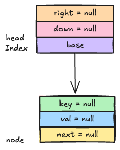

继续看代码:在阅读代码之前需要先了解一下smap的整体结构：

```java
ConcurrentSkipListMap<Integer, String> skipList = new ConcurrentSkipListMap<>();
skipList.put(10, "A");
skipList.put(20, "B");
skipList.put(30, "C");
skipList.put(40, "D");
skipList.put(50, "E");
skipList.put(5, "F");
// 当执行完上述代码后,debug展示的结果如下(多次执行可能展示的结果不一样)
```

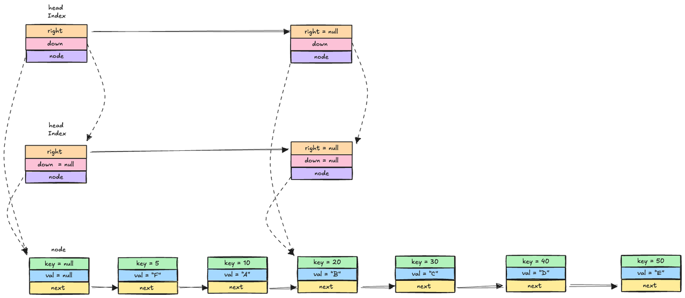


```java
/*
    Notation guide for local variables
    Node:         b, n, f, p for  predecessor, node, successor, aux
    Index:        q, r, d    for index node, right, down.
    Head:         h
    Keys:         k, key
    Values:       v, value
    Comparisons:  c
*/
private V doPut(K key, V value, boolean onlyIfAbsent) {
    // 省略smap初始化的代码
    /*
        现在smap是处于不为null的状态,那么要插入要一个元素
        首先要做的就是通过跳表的特性来找到当前元素应该插入的位置(在最底层链表应该插入的位置)
        q:head节点
        r：q的右侧节点
        d：q的下方节点
    */
        else {
        for (Index<K,V> q = h, r, d;;) { // count while descending
            while ((r = q.right) != null) {
                Node<K,V> p; K k;
                // 这里是在"脏数据清理"... 暂时不关注
                if ((p = r.node) == null || (k = p.key) == null ||
                    p.val == null)
                    RIGHT.compareAndSet(q, r, r.right);
                // 比较当前插入元素的key和当前遍历到节点的k，如果key>k,那么继续向后找
                // 直到找到 或者 当前层没有元素的key大于插入元素的key,那么break
                else if (cpr(cmp, key, k) > 0)
                    q = r;
                else
                    break;
            } // end for while
            
            // q是最上层的某个节点，当前要插入的元素就在这个节点后面
            // 如果q.down不为null,那么继续到下一层,重复上面的步骤,知道到达最后一层
            if ((d = q.down) != null) {
                ++levels; // 同时需要统计当前skipMap的索引层级
                q = d;
            }
            // 到这里,说明是到达最后一层索引了(q是最后一层索引上的节点,并非底层链表的节点)
            else {
            // 获取对应的node,b才是底层的节点，当前元素就需要插入b之后
            // 不一定是b.next，但是一定是在b后面
                b = q.node; 
                break;
            }
        }
    }
}
```

这段代码的目的就是为了底层链表,当前要插入元素的位置，如果要插入的元素是25，35，45...，那么最终得到的b节点就是指向key=20这个节点，但是要插入的位置不一定是b.next，所以还有后续的代码

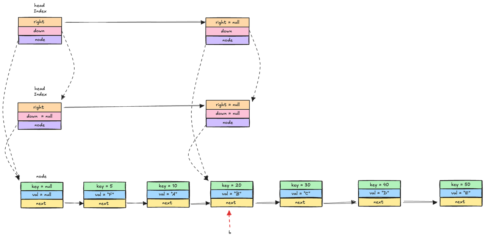

```java
// 这里的b节点就是底层链表上的节点，并且当前元素最终是要插入在其后面的
// 下面这段代码的核心作用就是在底层链表中查找正确插入位置并且执行插入操作的代码逻辑
if (b != null) {
        Node<K,V> z = null;              // new node, if inserted 指向new node(key,val对应当前插入元素)
        for (;;) {                       // find insertion point
            Node<K,V> n, p; K k; V v; int c;
            // # 1 如果b.next为null,这代表b是底层链表的最后一个节点,那么要插入的位置就是b.next
            if ((n = b.next) == null) {
                if (b.key == null)       // if empty, type check key now 
                    cpr(cmp, key, key);
                c = -1; // 设置c=-1，标识当前元素应该插在b.next上
            }
            // 否则n=b.next不为null,但是n.key为null,遇到了已删除节点,重头执行之前的逻辑
            else if ((k = n.key) == null)
                break;                   // can't append; restart
            // 否则n.key不为null,但是n.val=null，遇到了逻辑删除的节点,在这里做物理删除
            // 并且将c设置为1,代表需要继续向后查找
            else if ((v = n.val) == null) {
                unlinkNode(b, n);
                c = 1;
            }
            // 否则n.key&n.val不为null,是一个正常的节点,那么则比较两者的key
            // 如果插入元素key > n(当前处理的节点),那么b=n,继续向后处理
            else if ((c = cpr(cmp, key, k)) > 0)
                b = n;
            // 否则 c=0(上面的else if会将cpr()返回的值赋值给c)
            // 那么代表key相等,则说明是相同的元素，onlyIfAbsent控制是否需要覆盖
            // 但是不管怎么样,到这里put()操作就结束了，不需要增加元素,也不需要更新索引结构
            else if (c == 0 &&
                     (onlyIfAbsent || VAL.compareAndSet(n, v, value)))
                return v;
            // 否则,c=-1的,这代表找到了插入的位置(就是b,n=b.next)
            // 那么在这里new Node(key, value, n)
            // 插入到b,n的中间
            if (c < 0 &&
                NEXT.compareAndSet(b, n,
                                   p = new Node<K,V>(key, value, n))) {
                z = p; // 并且将新创建的节点赋值给z
                break;
            }
        }
        
        // ..... 省略下面的代码
}
```

这段代码的核心原理就是为当前要插入的元素在底层链表中找到要插入的位置b,然后创建新的节点p(z)并且插入在b后面，此时的结构为：假设要插入的元素为35

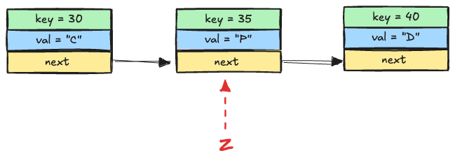

当节点创建完毕后，那么下面就是准备更新索引结构了

```java
// 这里的z就是上面创建的新节点
if (z != null) {
    // 生成随机数,这个随机数会决定当前插入的节点是否需要更新索引结构
    int lr = ThreadLocalRandom.nextSecondarySeed();
    // 如果生成的随机数的后两位bit位都是0(这有1/4的概率 - 00 11 01 10)
    // 那么就进行索引结构的更新,否则不更新
    if ((lr & 0x3) == 0) {       // add indices with 1/4 prob
        // 再生成一个随机数,与上面的lr做｜运算,这是用来影响创建Index节点的个数的
        int hr = ThreadLocalRandom.nextSecondarySeed();
        long rnd = ((long)hr << 32) | ((long)lr & 0xffffffffL);
        // 记录之前从上往下找时所涉及的层数(替代了jdk8中的HeadIndex类)
        int skips = levels;      // levels to descend before add 按照之前的例子,这里等于的是1(1代表的是有2层)
        Index<K,V> x = null;
        /*
            如果初始的rnd>=0，那么只会创建一个Index节点
            否则rnd<0,那么会不断rnd <<= 1(左移),并且不断的创建Index
            最多创建62个,如果rnd一直是小于0的,那么可能会创建62个Index Node，并且skips依旧=1
           
        */
        for (;;) {               // create at most 62 indices
            x = new Index<K,V>(z, x, null);
            if (rnd >= 0L || --skips < 0)
                break;
            else
                rnd <<= 1;
        }
        /*
            将上面创建的skips+1个Index节点链接到现有的索引结构中去
            h:首个Index节点
            skips:需要跳过的层级数
            x:刚才创建的skips+1个Index节点中最上面的一个
            cmp:比较器
            先看下面对该方法的介绍后再来回看后续流程
        */
        if (addIndices(h, skips, x, cmp) && skips < 0 &&
            head == h) {         // try to add new level
            Index<K,V> hx = new Index<K,V>(z, x, null);
            Index<K,V> nh = new Index<K,V>(h.node, h, hx);
            HEAD.compareAndSet(this, h, nh);
        }
        if (z.val == null)       // deleted while adding indices
            findPredecessor(key, cmp); // clean
    }
    addCount(1L);
    return null;
}
```

先讲一下上面的第一个for(;;)，假设创建了skips+1个(2个)Index节点


先回顾下目前的整体架构：重点关注q和x

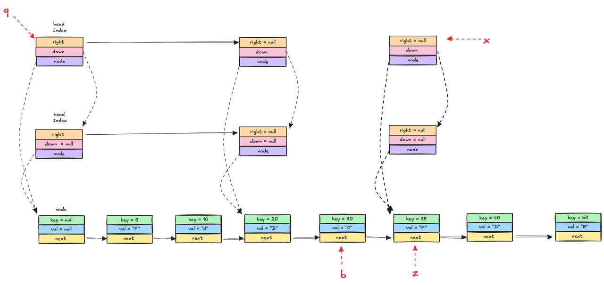

```java
/*
    @param skips levels to skip before inserting,在插入之前需要跳过的层级数
*/
static <K,V> boolean addIndices(Index<K,V> q, int skips, Index<K,V> x,
                                Comparator<? super K> cmp) {
    Node<K,V> z; K key;
    // 确保所有的节点都处于正确的状态
    if (x != null && (z = x.node) != null && (key = z.key) != null &&
        q != null) {                            // hoist checks
        boolean retrying = false;
        for (;;) {                              // find splice point
            Index<K,V> r, d; int c;
            /*
                从最上层开始处理,找到x在最上层应该插入的位置
                    -  bb.node.key < x.node.key < cc.node.key
                    -  在这一层没有找到node.key 大于 x.key的，那么插在这一层的最尾部
                    
            */
            if ((r = q.right) != null) {
                Node<K,V> p; K k;
                // 脏数据处理,暂时忽略
                if ((p = r.node) == null || (k = p.key) == null ||
                    p.val == null) {
                    RIGHT.compareAndSet(q, r, r.right);
                    c = 0;
                }
                // 比较p.key(p是r.node)和key(当前元素)的大小
                // 如果key > p.key,那么继续找(直到找到或者这一层都没有)
                else if ((c = cpr(cmp, key, k)) > 0)
                    q = r;
                else if (c == 0)
                    break;                      // stale
            }
            else
                c = -1;
            // 最终r节点就是最上层要插入的位置(需要将x插入到q和r之间)
            // r可能为null,比如某一层上都没有找到,那么此时的r就为null
            /*
                这里的代码我没太看懂,我期待的实现应该是：
                    - skips = -1(原来的level=1)：这代表有两层,并且生成了两个Index Node
                        1.然后在这里的处理:在处理第一层的时候,先递归处理第二层(传入的是d=q.down,x.down)
                        2.处理第二层(最后一层索引):进入到最后一个else{}分支,将第二层的Index 节点连接到对应的位置后
                        3.返回递归,再处理第一层的Index Node
                    - 但是在doPut()方法中的rdn的值会影响到skips的值
                    - 我总感觉那里不对劲?
            */
            if (c < 0) {
                if ((d = q.down) != null && skips > 0) {
                    --skips;
                    q = d;
                }
                else if (d != null && !retrying &&
                         !addIndices(d, 0, x.down, cmp))
                    break;
                else {
                    x.right = r;
                    if (RIGHT.compareAndSet(q, r, x))
                        return true;
                    else
                        retrying = true;         // re-find splice point
                }
            }
        }
    }
    return false;
}
```

这里我认为的理想状态是这样的：

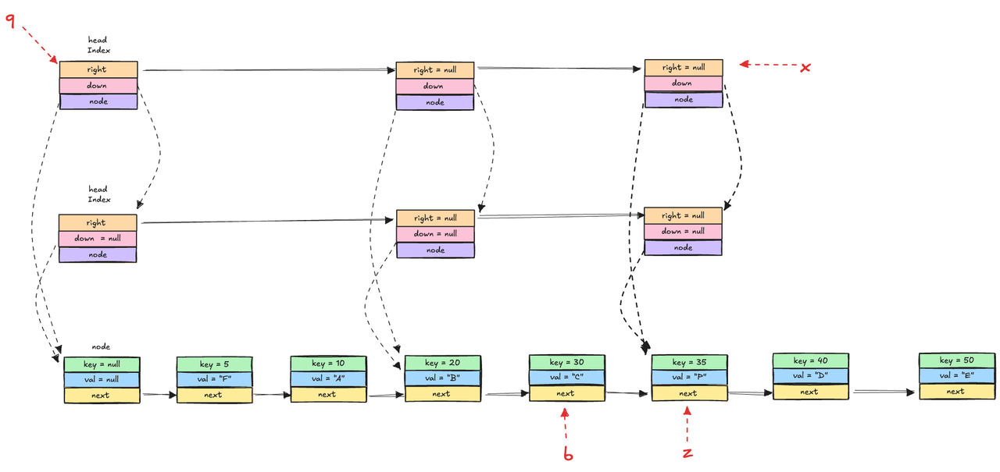

继续回到doput()方法：新增加一个层级

```java
if (addIndices(h, skips, x, cmp) && skips < 0 && // 
        head == h) {         // try to add new level,新增加一个层级
        Index<K,V> hx = new Index<K,V>(z, x, null);
        Index<K,V> nh = new Index<K,V>(h.node, h, hx);
        HEAD.compareAndSet(this, h, nh);
    }
    if (z.val == null)       // deleted while adding indices
        findPredecessor(key, cmp); // clean
}
addCount(1L);
return null;
```

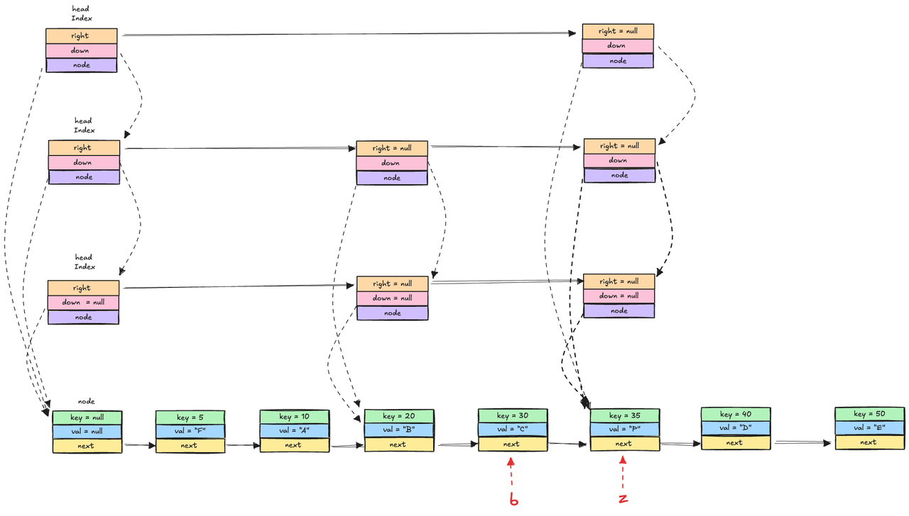

到这里关于concurrenSkipListMap就介绍到这里,但是我并没有完全看明白,因为最终的结构是随机的，和doput()中生成的rdn有很大的关系,但是基本原理是差不多的「这里确实没看懂,没看明白doug lea想要干什么」


# CopyOnWriteArrayList

## ArrayList源码解析

> 动态数组,当满足条件时会触发扩容操作

* 构造函数

```java
public class ArrayList<E> extends AbstractList<E>
        implements List<E>, RandomAccess, Cloneable, java.io.Serializable
{
    /*---------------------fields-----------------------*/
//集合默认的初始容量
private static final int DEFAULT_CAPACITY = 10;
private static final Object[] EMPTY_ELEMENTDATA = {};
private static final Object[] DEFAULTCAPACITY_EMPTY_ELEMENTDATA = {};
transient Object[] elementData;
private int size;

    /*---------------------constructor-----------------------*/
public ArrayList() {
    this.elementData = DEFAULTCAPACITY_EMPTY_ELEMENTDATA;
}

public ArrayList(int initialCapacity) {
    if (initialCapacity > 0) {
        this.elementData = new Object[initialCapacity];
    } else if (initialCapacity == 0) {
        this.elementData = EMPTY_ELEMENTDATA;
    } else { // 传入的容量<0,那么抛出异常
        throw new IllegalArgumentException("Illegal Capacity: "+
                                           initialCapacity);
    }
}
}
```

这里的构造函数会根据初始化传入的参数来进行不同的处理

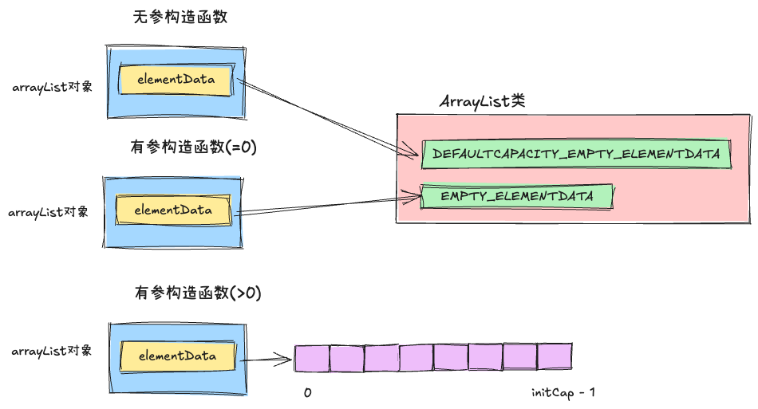

当调用的是无参构造或者是0时,按道理来说容量为0,那么其含义和无参构造是一样的，但是在ArrayList中并没有这样实现,这两者在进行操作时会有不一样的行为.

下面看下add()操作

* add()

```java
// arrayList支持插入元素的位置(代价很高 -O(N))
public void add(int index, E element) {
    // ...
}
//一般操作 -add(E e):直接添加到末尾(轻量级操作 - O(1) - 通过size来决定末尾)
public boolean add(E e) {
    modCount++; // fast-fail
    add(e, elementData, size); // other add 会将size传入,不过这里默认是0
    return true;
}
private void add(E e, Object[] elementData, int s) {
    /*
        这里涉及到两种情况:
            1.非初始化状态：数组确实是慢了,那么执行扩容操作
            2.初始化状态：size = arr.length=0，那么执行初始化操作
              需要注意的是,调用的是有参构造(>0)的话,第一次是不会走到这里的,而是直接赋值
              下面看下初始化操作
    */
    if (s == elementData.length)
        elementData = grow();
    elementData[s] = e;
    size = s + 1;
}
```

初始化操作

```java
private Object[] grow() {
    return grow(size + 1);
}
// 最小的容量为size+1,这很好理解,扩容后的数组至少需要容乃当前要添加的元素
private Object[] grow(int minCapacity) {
    return elementData = Arrays.copyOf(elementData,
                                       newCapacity(minCapacity));
}
/*
    这里可以站在两个不同的角度:
        - 非初始化操作：新数组大小 = 旧数组大小 * 1.5
        - 初始化操作
            - DEFAULTCAPACITY_EMPTY_ELEMENTDATA：初始化为默认容量(10)
            - EMPTY_ELEMENTDATA : size + 1
*/
private int newCapacity(int minCapacity) {
    // overflow-conscious code
    int oldCapacity = elementData.length; 
    int newCapacity = oldCapacity + (oldCapacity >> 1); // 扩容的大小为1.5倍
    // 但是如果是初始化状态,那么oldCap = newCap = 0,就会进入到下面的分支
    if (newCapacity - minCapacity <= 0) {
    // 如果 elementData的类型是DEFAULTCAPACITY_EMPTY_ELEMENTDATA
    // 那么默认第一次扩容的大小就为DEFAULT_CAPACITY(10)
        if (elementData == DEFAULTCAPACITY_EMPTY_ELEMENTDATA)
            return Math.max(DEFAULT_CAPACITY, minCapacity);
         // 否则为minCapacity(这个值为size+1 = 1)
        if (minCapacity < 0) // overflow
            throw new OutOfMemoryError();
        return minCapacity;
    }
    
    // 这里是非初始化操作,一般就是1.5倍,不会出现超过最大值的情况
    return (newCapacity - MAX_ARRAY_SIZE <= 0)
        ? newCapacity
        : hugeCapacity(minCapacity);
}
```

这里可以得到以下结论：

1. ArrayList是否采用懒加载和构造函数有关(如果调用的大于0的有参,那么是非懒加载的)

2. 无参构造和0采用的是懒加载的

3. 无参构造的扩容原理和有参一样：新数组的容量 = 旧数组容量 \* 1.5
   但是0的扩容原理则是每次+1(也即按需使用,好处是空间利用率高，缺点就是频繁的扩容)

所以这里doug lea将决定权交给使用者,如果不想懒加载,那么就调用有参构造函数(反之调用无参构造函数)，如果想要按需扩容,那么调用有参构造函数(不过是用0作为入参)

* 迭代器操作

```java
Iterator<String> iterator = arrayList.iterator();
public Iterator<E> iterator() {
    return new Itr();
}
private class Itr implements Iterator<E> {
   // ...
   int expectedModCount = modCount; // 关键点：在初始化迭代器的时候就保存了ArrayList中的modCount
   // prevent creating a synthetic constructor
   Itr() {}
}

// 迭代操作会做校验,如果发现有其他线程在做事务操作,那么直接抛出并发修改异常
final void checkForComodification() {
    if (modCount != expectedModCount)
        throw new ConcurrentModificationException();
}
```

## CopyOnWriteArrayList源码解析

> 介绍：CopyOnWriteArrayList 是 java.util.concurrent 包下的一&#x4E2A;**<span style="color: rgb(216,57,49); background-color: inherit">线程安全</span>**&#x7684; List 实现。它是 ArrayList 的线程安全版本，但&#x5176;**<span style="color: rgb(216,57,49); background-color: inherit">线程安全的实现机制与传统的同步方式</span>**（如使用 `synchronized` 关键字）&#x6709;**<span style="color: rgb(216,57,49); background-color: inherit">根本性的不同</span>**。
>
> 其核心思想为：写时复制，适用于读多写少的情况 「读多写少场景下写锁的饥饿问题是不可忽略的一个问题，比如读写锁就存在写线程饥饿的问题，为了缓解这个问题又引入了StampedLock来允许读写并发执行(当然这需要付出一定的代价)」
>
> 这里CopyOnWriteArrayList的思想是一样的,也是让读写并发

ArrayList的限制：

1. 使用普通的ArrayList,同时为了保证线程安全，需要在调用相应的方法时加锁(或者使用Collections.synchronizedList来进行包装)，但是性能极差，因为即使是线程安全的读操作也需要串行执行

2. 快速失败的迭代器：不解决,在迭代过程中(读操作)，发现有其他线程在进行事务操作,直接抛出异常

而CopyOnWriteArrayList的出现就解决了这两个问题

1. 提升读性能，允许读写并发,而线程安全则是通过写时复制来实现的

2. 提供弱一致性迭代：safe-fail机制，不会抛出并发修改异常


下面看下是如何实现的

* 构造函数

```java
public class CopyOnWriteArrayList<E>{

/*------------------fields--------------------*/
final transient Object lock = new Object(); // write mutex 
private transient volatile Object[] 2;
/*------------------constructor--------------------*/
    public CopyOnWriteArrayList() {
        setArray(new Object[0]);
    }
    final void setArray(Object[] a) {
        array = a;
    }
}

```

此时的结构为：

> 这里new Object\[0]的含义是什么？


下面介绍一下内部的核心方法：

* add()

```java
// add()是一个写操作,需要互斥执行
public boolean add(E e) {
    synchronized (lock) { // 加锁
        Object[] es = getArray(); // 获取当前内部数组
        int len = es.length;
        es = Arrays.copyOf(es, len + 1); // 拷贝出一个新的数组
        es[len] = e; // 将要添加的元素设置到新数组的末尾
        setArray(es);// 更新数组的引用
        return true;
    }
}
```

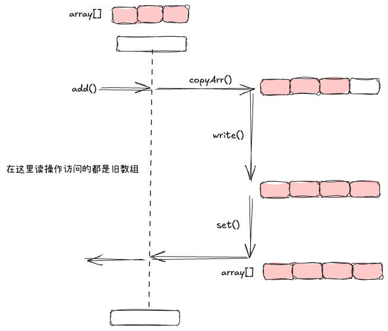

* get()

```java
// get()操作是读操作,不用加锁，直接访问数组既可 - O(1)
public E get(int index) {
    return elementAt(getArray(), index);
}
static <E> E elementAt(Object[] a, int index) {
    return (E) a[index];
}
```

* set()

```java
// set()是一个写操作,需要互斥执行,这个方法是用来将array[index]上的值替换为element
public E set(int index, E element) {
    synchronized (lock) {
        Object[] es = getArray();
        E oldValue = elementAt(es, index); // 获取该位置上旧的值

        if (oldValue != element) { // 如果旧值不等于新值
            es = es.clone(); // 克隆一个新数组,然后设置
            es[index] = element;
        }
        // Ensure volatile write semantics even when oldvalue == element
        // 在这里如果旧值 = 新值，那么其实就可以直接返回了，但是为什么这里还是要重新设置一下数组呢？
        // volatile语义，volatile变量的写操作会保证之前的所有内存操作都对其他线程可见
        setArray(es);
        return oldValue;
    }
}
```

* 迭代器操作

```java
Iterator<String> iterator = copyOnWriteArrayList.iterator();
public Iterator<E> iterator() {
    return new COWIterator<E>(getArray(), 0); // 在这里调用了getArray()获取了数组引用
}

COWIterator(Object[] es, int initialCursor) {
    cursor = initialCursor;
    snapshot = es; // 保存引用,后续迭代的时候操作的是原数组(而写操作是不会修改原数组的,自然也不会抛出并发修改异常)
}
```

总结：

1. CopyOnWriteArrayList集合的使用场景为并发操作，并且&#x662F;**<span style="color: rgb(216,57,49); background-color: inherit">读多写少</span>**

2. 该集合的目的是提高读操作的性能，但是牺牲的是写操作的性能以及内存空间（每次写操作「add()」都需要创建一个内存副本，内存复制操作除了对空间有一点浪费，同时复制操作本身也是会有性能消耗的）

## LinkedList源码解析

> 经常会拿ArrayList和LinkedList来做比较,前者是基于数组实现的，后者是基于双向链表实现的

* 数据结构

```java
public class LinkedList<E>{
    transient int size = 0;
    transient Node<E> first; /* Pointer to first node. */
    transient Node<E> last;  /* Pointer to last node. */
}

// Node是双向链表
private static class Node<E> {
    E item;
    Node<E> next;
    Node<E> prev;

    Node(Node<E> prev, E element, Node<E> next) {
        this.item = element;
        this.next = next;
        this.prev = prev;
    }
}
```

结构如下：

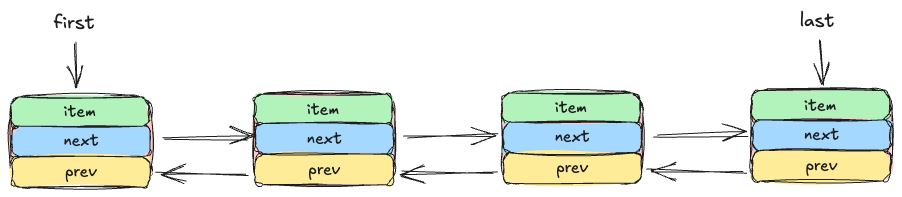

核心方法：add(E),addLast(E),addFirst(E),add(index,E)

```java
// 继续调用linkLast(),linkFirst(),linkBefore()
public boolean add(E e) {
    linkLast(e);
    return true;
}
public void addFirst(E e) {
    linkFirst(e);
}
public void addLast(E e) {
    linkLast(e);
}
public void add(int index, E element) {
    checkPositionIndex(index);
    if (index == size)
        linkLast(element);
    else
        linkBefore(element, node(index));
}

// linkLast(),linkFirst(),linkBefore()就是链表的操作,在这里简单介绍一下
// 插入在第一个位置上 - O(1)
private void linkFirst(E e) {
    final Node<E> f = first;
    final Node<E> newNode = new Node<>(null, e, f);  // new Node
    first = newNode;
    if (f == null)
        last = newNode;
    else
        f.prev = newNode;
    size++;
    modCount++; // fast-fail
}

// 插入在最后 - O(1)
void linkLast(E e) {
    final Node<E> l = last;
    final Node<E> newNode = new Node<>(l, e, null);
    last = newNode;
    if (l == null)
        first = newNode;
    else
        l.next = newNode;
    size++;
    modCount++;
}
```

代码逻辑就不再赘述,这里着重对比一下ArrayList和LinkedList , 从两个角度：数据结构 与 算法(操作的效率/性能)

数据结构：数组与链表的区别

1. 内存布局与访问方式：

   1. 数组：内存中连续的,大小固定的内存区域，支持随机访问(数组基地址 + 偏移)

   2. 链表：每个元素可以独立存在内存中，要访问第i个元素只能从头开始找，顺序访问

2. 缓存性能：

   1. 数组：缓存友好

   2. 链表：缓存不友好

算法：读操作和写操作对比

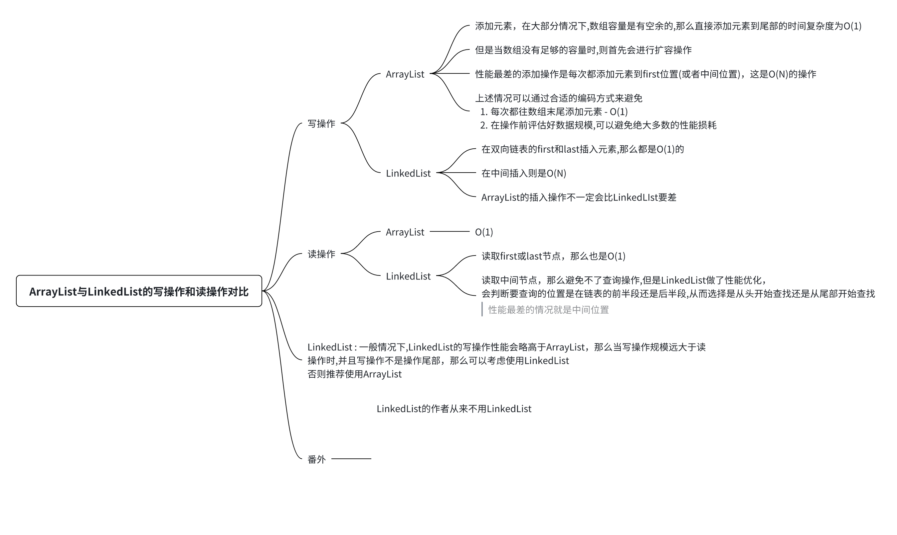


到这里：并发容器就简单介绍到这里了,对于ConcurrentLinkedQueue这个类并没有做分析，因为其实就是链表的CAS操作

